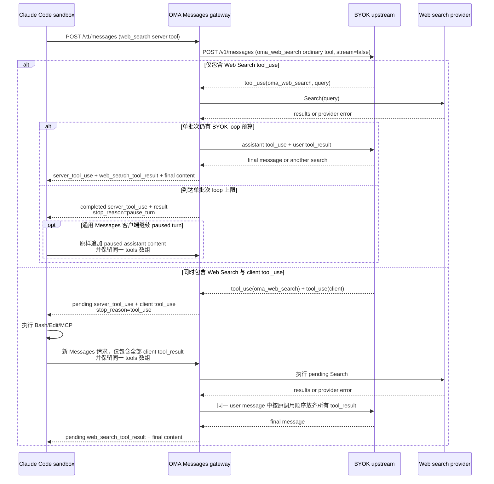
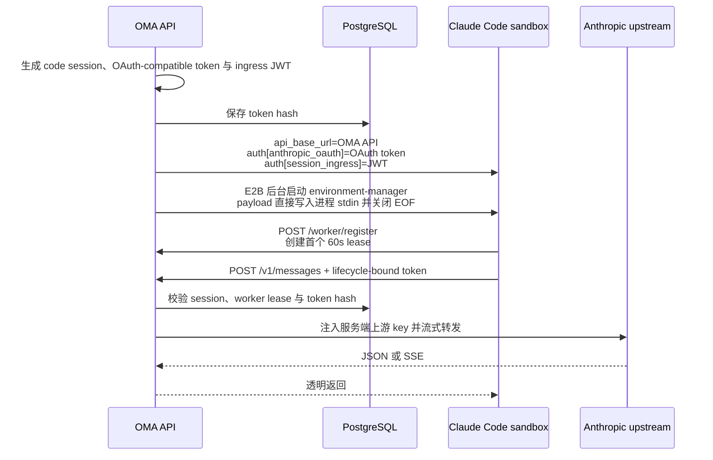

# 统一 Messages 代理与 Claude Code 沙箱凭证

## 目标

服务对外提供 Anthropic 兼容的 `POST /v1/messages`，供普通 SDK/API 调用和 Claude Code 沙箱使用。上游 `anthropic_upstream.api_key` 只存在于服务端配置，不再写入沙箱环境或 `environment-manager` 启动 payload。

Claude Code 仍要求 OAuth 形态的 Anthropic 凭证。environment-manager 通过 `auth[type=anthropic_oauth]` 和 `CLAUDE_CODE_OAUTH_TOKEN_FILE_DESCRIPTOR` 向 Claude 传入 OMA 本地签发的 `sk-ant-oat01-...` lifecycle-bound token，并使用 `startup_context.api_base_url` 作为 `ANTHROPIC_BASE_URL` fallback。该 token 只在 OMA 本地代理生效，不是真实 Anthropic OAuth token；payload 不注入 `ANTHROPIC_API_KEY`、真实上游地址或明文 OAuth 环境变量。

## HTTP 契约

规范入口为：

```text
POST /v1/messages
```

普通 Messages 请求不解析 JSON，直接流式转发请求 body、query 和 Anthropic 合同 header，并执行以下边界处理：

- 删除调用方的 `Authorization`、`X-Api-Key`、`Cookie`、组织/workspace 内部 header 和 hop-by-hop header；
- 由服务端注入 `anthropic_upstream.api_key`；
- 将请求发往 `anthropic_upstream.base_url/v1/messages`；
- 透传上游状态码、响应 body、SSE 数据和限流等响应 header；
- SSE 响应逐块 flush，并关闭代理缓冲；
- 请求 body 上限为 32 MiB。

对于 code-session OAuth-compatible token 的 Claude Code Messages 请求，OMA 会在请求声明受支持的 Anthropic server tool（当前为 `web_search_20250305`、`web_search_20260209` 或 `web_search_20260318`）且本地 provider 已配置时启用 Web Search gateway。入口是否拦截只精确匹配这三个 `tools[].type` 值，不按 `tools[].name` 或 type 前缀识别；例如字面量 `type=web_search` 不进入 gateway。请求被投影到 BYOK 后，BYOK 返回的 ordinary `tool_use` 再按 `name=oma_web_search` 识别为需要由 gateway 执行的搜索调用；对外响应则投影回 `server_tool_use` 且使用协议名 `name=web_search`。这两个 `name` 判断属于调用块投影阶段，不改变入口按 `tools[].type` 的拦截规则。gateway 依赖 provider-neutral 的 `Search` 与 `ValidateOptions` 合同：前者使用结构化的 `SearchRequest`/`SearchResponse`，可保留分页和 provider request ID 等响应元数据，后者在发出首个 BYOK 请求前确认 provider 能执行调用方声明的搜索策略。结果模型区分摘要、正文、highlights 和 summary。当前静态 built-in factory 已支持 Tavily 和 Brave；`web_search.providers.<name>.endpoint` 为空时，各 provider 使用自己的默认 endpoint。provider credential 只在 OMA 服务端使用，不会发送给 BYOK 或写入 sandbox。

只有 BYOK 回合全部为 Web Search 调用时，gateway 才在同一条 Claude Code 外部请求内使用非流式 continuation loop。BYOK 只返回 Bash、Edit、MCP 等 client tool 时，gateway 原样交还 Claude Code 执行；同一回合混合 Web Search 与 client tool 时，gateway 按 Anthropic mixed server/client 协议暂停搜索并跨两条 Claude Code Messages 请求续传：


```mermaid
sequenceDiagram
    participant CC as Claude Code sandbox
    participant OMA as OMA Messages gateway
    participant BYOK as BYOK upstream
    participant Search as Web search provider

    CC->>OMA: POST /v1/messages (web_search server tool)
    OMA->>BYOK: POST /v1/messages (oma_web_search ordinary tool, stream=false)
    alt 仅包含 Web Search tool_use
        BYOK-->>OMA: tool_use(oma_web_search, query)
        OMA->>Search: Search(query)
        Search-->>OMA: results or provider error
        alt 单批次仍有 BYOK loop 预算
            OMA->>BYOK: assistant tool_use + user tool_result
            BYOK-->>OMA: final message or another search
            OMA-->>CC: server_tool_use + web_search_tool_result + final content
        else 到达单批次 loop 上限
            OMA-->>CC: completed server_tool_use + result<br/>stop_reason=pause_turn
            opt 通用 Messages 客户端继续 paused turn
                CC->>OMA: 原样追加 paused assistant content<br/>并保留同一 tools 数组
            end
        end
    else 同时包含 Web Search 与 client tool_use
        BYOK-->>OMA: tool_use(oma_web_search) + tool_use(client)
        OMA-->>CC: pending server_tool_use + client tool_use<br/>stop_reason=tool_use
        CC->>CC: 执行 Bash/Edit/MCP
        CC->>OMA: 新 Messages 请求，仅包含全部 client tool_result<br/>并保留同一 tools 数组
        OMA->>Search: 执行 pending Search
        Search-->>OMA: results or provider error
        OMA->>BYOK: 同一 user message 中按原调用顺序放齐所有 tool_result
        BYOK-->>OMA: final message
        OMA-->>CC: pending web_search_tool_result + final content
    end
```

内部 transcript 与 Claude Code transcript 通过双向投影保持一致。gateway 声明给 BYOK 的是名为 `oma_web_search` 的 ordinary tool：调用方可以合法地声明自己的 `web_search` 工具，因此不能把 Anthropic 的协议名直接复用为 BYOK 工具名，否则 BYOK 返回的 `tool_use` 无法按名称区分归属。投影只在这两个名字之间双向替换；当顶层 `tool_choice` 强制 `web_search` 时，也只在发给 BYOK 的请求里改为 `oma_web_search`。调用方看到的响应、历史和续传请求始终使用协议名 `web_search`；调用方自有的同名工具按普通 client tool 交还调用方，不由 gateway 执行。

BYOK tool ID 映射只有一条路径：所有 provider-owned 的 ordinary tool ID（包括 Anthropic 常见的 `toolu_*`）都按 opaque 字符串使用带版本标记的 URL-safe 编码，铸造 `srvtoolu_oma_encoded_<base64>`。反向解析只接受 gateway 自己铸造的编码形状，其余形状一律拒绝，避免调用方伪造上游 ID 或同一上游 ID 存在多种外部表示、进而在同一条 assistant message 里产生重复 `tool_use` ID。

Claude Code 后续重放完整历史时，gateway 会把 `server_tool_use`/`web_search_tool_result` 展开回 BYOK 的 assistant `tool_use` 与下一条 user `tool_result`。mixed continuation 中 Claude Code 只返回自己拥有的 client results，每个 client `tool_use` 必须恰好对应一个 `tool_result`，该 user message 不得包含 text 或其他 block，并保留声明 pending search 的同一 Web Search tool；缺失、重复或未知 result、混入非 result content，以及缺少 pending search tool时返回 `400 invalid_request_error`，不会把 server block 透传给 BYOK。gateway 执行 pending search 后按原 tool call 顺序合并结果。该排序只为可读性：Anthropic 按 `tool_use_id` 匹配 result 而非按位置，也不区分 server/client tool 的 result 先后。真正的硬约束是配对完整性——每个 `tool_use` 必须恰好有一个 result，缺失会触发 `tool_use ids were found without tool_result blocks immediately after`，因此合并时即使出现重复 ID 也不丢弃任何一条 result。普通 client tool 不由 OMA 伪造 error result。已完成的 search 历史即使后续请求不再声明 Web Search，也仍会反向投影，但不会允许 BYOK 发起新的搜索。

gateway 对 provider-owned ID 不做格式识别；任意非空 ID 都使用同一套编码，回放时无损恢复原始上游 ID。Anthropic 的 `toolu_*` 只是该 opaque ID 合同的一个输入实例，并不进入单独的兼容分支。

对外合成的 `web_search_result` 使用 `type`、`title`、`url` 与可选 `page_age`，不输出 provider 的明文 `content` 扩展，也不伪造 Anthropic 原生 `encrypted_content`。Anthropic 协议要求客户端把原生 provider 返回的 `encrypted_content` 视为 opaque 数据并在后续 turn 原样回放；OMA-managed search 当前不实现该加密恢复合同，历史投影仅把可见的标题、URL 与页面时间交给 BYOK。当前 gateway 也不伪造 Anthropic 原生 citation location；BYOK 可基于结果 URL 生成普通文本引用，但不得把它表述为原生 citation block。

一次入站请求内的多次 BYOK 采样会累加为单个 `usage`：gateway 逐次收集上游 `usage`，把其中的整数 token 计数按字段名求和，`service_tier` 等非数值字段保留最后一次采样的值，避免只回显最后一次采样导致少报前几轮消耗。只发生一次采样且本请求没有搜索时原样透传上游 `usage`。

搜索次数按 Anthropic 合同写入 `usage.server_tool_use.web_search_requests`。BYOK 只看到 ordinary tool，不会上报该字段，因此由 gateway 补齐；上游 `server_tool_use` 里的其他计量字段保留不覆盖。官方规定「每次搜索计一次，与返回结果数无关」且「搜索出错不计费」，因此只统计生成了结果列表的 `web_search_tool_result`，`max_uses_exceeded` 与 provider 失败对应的 `web_search_tool_result_error` 都不计入。gateway 自身的搜索调用不计入 token 计量。

gateway 发往 BYOK 的请求会删除调用方的 `Accept-Encoding`，交由 `http.Transport` 自行协商压缩并透明解压；保留调用方值会关闭透明解压，使 gateway 拿到未解压的响应字节而无法解析上游 JSON。透明转发路径不解析 body，因此保持调用方的内容编码协商不变。

调用方声明的 `max_uses`、`allowed_domains` 与 `blocked_domains` 由 gateway 解析为请求策略。两种 domain list 同时出现会在投影时被拒绝；随后 gateway 在发出首个 BYOK 请求前调用当前 provider 的 `ValidateOptions`。Tavily 支持 domain list；Brave Web Search 没有等价参数，因此任一非空 domain list 会返回 `400 invalid_request_error`，不会让 BYOK 选择工具后才降级为 `unavailable`。`max_uses` 与 Anthropic 官方语义一致，是 per-request 上限（"limits the number of searches performed" per request）：统计每条入站 Messages 请求内实际尝试的搜索次数。同一请求的内部 BYOK continuation 不会重置计数；`pause_turn` 与 mixed continuation 是新的入站请求，按官方语义重新获得完整额度，gateway 不从回放历史里累加已用次数。超限调用不访问 provider，并返回 `web_search_tool_result_error`/`max_uses_exceeded`。`web_search.max_server_tool_iterations` 是独立的 server-side sampling iteration 上限，留空或为 0 时使用与 Anthropic 对齐的每请求 10 次默认值，负值在启动时报错；一次 iteration 对应一次 BYOK Messages 请求并包含初始采样，不等同于一次搜索。最后一次允许的 BYOK 响应若仍要求搜索，gateway 先完成该搜索并生成配对的 `server_tool_use`/`web_search_tool_result`，再以 `stop_reason=pause_turn` 返回，而不是丢弃结果并返回 502。

通用 Messages 客户端可按 Anthropic 合同把 paused content 原样作为 assistant message、保留对应的 Web Search tool 并再次续传；同一逻辑 turn 可以连续返回多次 `pause_turn`。如果 paused content 以尚未完成的 `server_tool_use` 结尾，gateway 会先执行该搜索，把 provider result 作为 BYOK client `tool_result` 恢复内部 transcript，并让下一响应以匹配的 `web_search_tool_result` 开头。如果 paused search 已经带有配对结果，gateway 直接回放完成记录，避免重复搜索。由于 Messages 历史不携带上一请求的完整 tools 定义，stateless gateway 能校验当前请求仍声明对应 Web Search tool，但不能逐字段证明定义与上一请求相同。Claude Code 2.1.120 的内置 WebSearch 已在真实 E2E 中直接接受完成搜索后返回的 `pause_turn` 结果。域名约束直接传给搜索 provider，不交给 BYOK 模型生成或修改。

当前 provider-neutral 合同无法表达 `user_location`，因此请求携带该字段时会在调用 BYOK 前明确报错，而不是静默忽略。BYOK 模型只支持 direct client-tool calling：`web_search_20260209` 与 `web_search_20260318` 默认使用 code execution dynamic filtering，因此必须显式声明 `allowed_callers:["direct"]`；其他不包含 direct 的 caller 配置也会在 BYOK 前被拒绝。`response_inclusion` 仅在 `web_search_20260318` 校验 `full`/`excluded`；官方规定 direct calls 始终返回完整结果，因此不会静默删除结果。provider 失败转为 `web_search_tool_result_error`/`unavailable`，并在 gateway 记录一条含 `request_id` 与 `error_code` 的 `WARN`（不记录 query 等请求内容）；provider panic 不在 gateway 内恢复，由 API 层的 recover 中间件统一处理为 `500` 并记录 stack。gateway 内部的非 request 类错误在 handler 边界记录一次 `ERROR` 后返回 `502`，请求类错误记录 `WARN` 后返回 `400`。最终按原请求的 `stream` 选项返回 JSON 或合成 SSE；合成的 client/server tool input 使用 `content_block_start` 空 input 加 `input_json_delta`。gateway 暂不处理 `web_fetch`、BYOK 原生 web search 和 Batch Messages，也不修改 CCRv2 relay/MITM 协议。

## Web Search 代码职责与依赖边界

Web Search 实现保持在 `internal/messages` 的同一 package 内，以便复用 Anthropic payload 的内部 DTO；文件拆分表达的是职责边界，不是新的跨 package 抽象，也没有通用 server-tool framework。当前只有 Web Search 一个 concrete family，未来 Issue #185 如引入第二个实际受管 family，才在已验证的共性上抽取 catalog/adapter 边界。

| 文件 | 职责 | 不负责的事项 |
| --- | --- | --- |
| `handler.go` | 在 HTTP 边界决定是否交给 gateway，并把 request error 映射为 `400`、其他 gateway error 映射为 `502` | 不解析 Web Search 协议，不执行 provider 搜索 |
| `web_search_request.go` | 解析入站 JSON envelope；精确识别受支持的 `tools[].type`；校验 `allowed_callers`、`response_inclusion`、`max_uses` 等 Web Search 合同；将 server tool 和强制 `tool_choice` 投影为 BYOK 的 `oma_web_search` | 不调用 BYOK 或搜索 provider，不处理历史或响应 |
| `web_search_gateway.go` | 编排一次请求的 BYOK 采样、provider 执行、`max_uses`/iteration 预算与 mixed/pause continuation；持有 HTTP client、provider 和 logger 等运行时依赖 | 不承担历史 block 的逐项投影，也不编码最终 JSON/SSE 响应 |
| `web_search_protocol.go` | 识别、校验和双向投影 Web Search 历史；按 `tool_use_id` 配对 pending server search 与 client result，并构造供 gateway 执行的 pending call | 不持有 `*webSearchGateway`，不触发 BYOK 或 provider I/O，不合成 usage/SSE |
| `web_search_response.go` | 将搜索执行结果映射为上游 `tool_result` 和对外 server-tool block；合成 token/search usage；编码最终 JSON 或 SSE | 不决定是否启用 gateway，不解析或执行历史 continuation |

运行时依赖由 `handler.go` 进入 `webSearchGateway`。gateway 调用 request、protocol 和 response 投影，并通过 `internal/websearch.Provider` 执行搜索；protocol 与 response 只处理数据投影。共享类型仍使用明确的 `webSearch*` 名称，避免把当前特有的 Anthropic Web Search 语义伪装为可复用的通用 server-tool 类型。

协议依据：

- [Anthropic Server tools](https://platform.claude.com/docs/en/agents-and-tools/tool-use/server-tools)：server/client mixed turn、pending server result 与 `pause_turn` continuation。官方规定 mixed turn 里 API「does not run the server tool. It returns immediately so that you can run the client tool first」，随后在下一条请求上「runs the deferred server tool」；因此「client tool 先执行、server tool 后执行」是跨请求的时序约束，不是单条 user message 内部的 block 排序约束。同一文档还规定 `server_tool_use` 与其 result「pair up by `tool_use_id`, not by position」；
- [Anthropic Parallel tool use](https://platform.claude.com/docs/en/agents-and-tools/tool-use/parallel-tool-use)：「The API doesn't prescribe an execution order」，执行策略由实现决定；但所有 `tool_result` 必须「all together in a single user message」，一个 result 一条 tool call；
- [Anthropic Handle tool calls](https://platform.claude.com/docs/en/agents-and-tools/tool-use/handle-tool-calls)：「Tool result blocks must immediately follow their corresponding tool use blocks」，缺失配对会返回 `tool_use ids were found without tool_result blocks immediately after`。因此 result 顺序只影响可读性，配对完整性才是硬约束；
- [Anthropic Stop reasons and fallback](https://platform.claude.com/docs/en/build-with-claude/handling-stop-reasons)：server-side sampling loop 默认每请求 10 iterations；
- [Anthropic Web search tool](https://platform.claude.com/docs/en/agents-and-tools/tool-use/web-search-tool)：`max_uses`「limits the number of searches performed」，官方在 triggering 一节明确它是「for each request」的硬约束，且 `pause_turn` 示例在续传请求里重新声明同一 `max_uses`，因此该额度是 per-request 而非 per-turn 累计；`usage.server_tool_use.web_search_requests` 上报搜索次数，「Each web search counts as one use, regardless of the number of results returned」「If an error occurs during web search, the web search will not be billed」；原生 provider 的 `encrypted_content` 在多轮续传时必须原样回放，OMA-managed search 不合成该字段。

管理后台继续使用原平台路径 `POST /api/organizations/{orgUuid}/proxy/v1/messages`。该路由及其独立代理实现不作为 `/v1/messages` 的兼容别名，也不承载 Claude Code 的 session-scoped token。它在 `anthropic_upstream.model_mappings` 命中请求顶层 `model` 时把该逻辑模型 ID 替换为配置的上游模型 ID。Messages 的已知改写字段通过命名 DTO 解析；只有为保留第三方未知字段而使用的 request envelope 在该 HTTP 边界保留 `json.RawMessage`，不会把动态 JSON 结构传入内部领域模型。Quickstart Builder 返回的 Agent config 在前端的命名配置归一化边界解析模型字段，Agent 写入边界再执行防御性解析。未配置、未命中或请求体无法按 JSON object 解析时，请求体保持不变并交给上游处理。公共 `POST /v1/messages` 不应用该 Console 映射；code-session 请求的当前 tools 声明 Web Search，或 transcript 包含 gateway 生成的 Web Search server block 时进入 gateway，否则继续透明流式转发请求体。

服务端不提供 `/v1/code/sessions/{code_session_id}/bridge`。managed-agent 在创建 code session 时直接获得 OAuth FD、WebSocket FD 和初始 worker epoch；后续 worker 所有权切换统一使用 `/worker/register`。

## 鉴权与权限

| 凭证                                | 可访问 `POST /v1/messages` | 其他 `/v1/*`  | 模型约束   |
| ----------------------------------- | -------------------------- | ------------- | ---------- |
| workspace API key                   | 是                         | 按原 API 权限 | 无额外约束 |
| platform `sessionKey` cookie        | 是                         | 按原平台权限  | 无额外约束 |
| code-session OAuth-compatible token | 是                         | 否            | 无额外约束 |

code-session token 只有在以下条件全部满足时才通过鉴权：

- token SHA-256 hash 命中 `code_sessions.oauth_access_token_hash`；
- public session 未终止、未删除，code session 为 `active` 且未删除；
- CCR v2 `worker_lease_expires_at > now()`；
- 请求方法和路径严格对应 `POST /v1/messages`。

environment-manager 在启动 Claude Code 前调用 `/worker/register`，建立首个 60 秒 lease；Claude 之后每 20 秒调用 `/worker/heartbeat` 续租。Claude 异常退出时不再续租，OAuth-compatible Messages 凭证最多在最后一个 lease TTL 内继续有效。session-ingress JWT 统一只校验签名、固定 claims 和请求路径绑定；register、heartbeat 及其他 ingress 请求不在 JWT 鉴权阶段回查 session 或 lease。worker epoch、heartbeat grace 和 OTLP lease 仍由各自 handler 的状态机判断。

code-session 请求来自受信任的沙箱调用方，handler 不解析或校验 `model`。请求体由上游按照 Anthropic Messages 合同校验；本服务只负责入口鉴权、请求大小限制、header 清洗和流式代理。因此代理不需要为了读取 JSON 字段而将整个 body 放入内存。

## 凭证生命周期与持久化

创建 managed-agent code session 时生成随机 `sk-ant-oat01-...` token。数据库只保存 hash，不保存明文或独立过期时间：

- `oauth_access_token_hash text`；
- 未删除记录的非空 hash 具有唯一索引。

OAuth-compatible token 没有 11 分钟或 8 小时墙钟上限，但每次 `/v1/messages` 鉴权仍复核 active code session、未 terminated 的 public session 和 worker lease。managed-agent 启动时签发的 session-ingress JWT 也不写入独立 `exp`，当前仅验证密码学身份与请求路径，不因 session 终止或 lease 到期而自动撤销；后续如需撤销语义，应单独引入明确的 token version、denylist 或状态复核策略。

进程启动时只创建一份 `SessionCredentials`。启动组合根把它注入 API server，并用它构造 environment runner 所需的 code-session service；Runner 通过 `RunnerDependencies` 接收这个最终 service，不自行读取密钥或生成临时签名器。密钥配置错误和 Runner 缺少依赖都会在 worker 启动前返回错误，保证签发端与验签端使用同一套密钥。

## 启动与调用流程


```mermaid
sequenceDiagram
    participant API as OMA API
    participant DB as PostgreSQL
    participant Sandbox as Claude Code sandbox
    participant Upstream as Anthropic upstream

    API->>API: 生成 code session、OAuth-compatible token 与 ingress JWT
    API->>DB: 保存 token hash
    API->>Sandbox: api_base_url=OMA API<br/>auth[anthropic_oauth]=OAuth token<br/>auth[session_ingress]=JWT
    API->>Sandbox: E2B 后台启动 environment-manager<br/>payload 直接写入进程 stdin 并关闭 EOF
    Sandbox->>API: POST /worker/register<br/>创建首个 60s lease
    Sandbox->>API: POST /v1/messages + lifecycle-bound token
    API->>DB: 校验 session、worker lease 与 token hash
    API->>Upstream: 注入服务端上游 key 并流式转发
    Upstream-->>API: JSON 或 SSE
    API-->>Sandbox: 透明返回
```

`environment-manager` 的 `auth[type=anthropic_oauth]` 使用 lifecycle-bound OAuth-compatible token；`auth[type=session_ingress]` 使用自包含的 `sk-ant-si-<JWT>`。前者只访问 `/v1/messages`，后者供 worker、relay 与 upstream proxy 使用。启动 payload 不再包含 `auth[type=anthropic_api]` 或 `CLAUDE_CODE_SESSION_ACCESS_TOKEN`，避免环境变量遮蔽 WebSocket FD。Runner 创建 Cloud Session Sandbox 后，先等待固定 rclone-filestore 四挂载 ready，并最多重试三次删除临时 Token 配置；其中 `/uploads` namespace 已整体只读挂载到 `/mnt/session/uploads`，不执行逐文件 projection。随后把 sandbox 标记为 `running`、建立首个 environment work heartbeat，才创建 local Code Session 并通过 E2B 后台进程 API 启动 environment-manager、按 PID 直接发送并关闭 stdin。environment-manager 启动失败时 Runner 立即终止该 Code Session；启动成功后才以一个数据库事务把 runtime metadata 发布到 Session 和 Environment Work。environment-manager 在启动 Claude 前 register CCR worker。work heartbeat 只维护 environment 租约，不参与 code-session token 鉴权。payload 不写入沙箱文件系统，发送或关闭失败时终止未完整初始化的进程。

Managed Agent 的 initialize 控制事件把 Agent snapshot 中的 `system` 原样映射为 `systemPrompt`，并通过 `appendSystemPrompt` 追加 OMA 管理的 sandbox 文件合同。追加提示只描述环境，不替代 Agent 角色；它告诉 Claude 使用真实 sandbox 路径访问上传文件、把用户交付物写入输出挂载，并明确禁止根据 `file_id` 猜测或重建文件路径。该合同是所有 Session 共用的静态文本，不拼接资源清单、文件 ID 或其他 Session 数据，以保持稳定的 prompt cache 前缀；它由 OMA 的 Session 启动配置统一注入，不依赖 CCRv2 模式切换。

## 错误语义

- 未配置上游 key：`503 api_error`；
- 上游地址或网络不可用：`502 api_error`；
- 请求超过 32 MiB：`413 request_too_large`；
- token 无效、session 终止、worker lease 过期或用在其他资源：`401 authentication_error`；
- Web Search 参数无效、动态版本未允许 direct caller、mixed continuation 缺少 client result、混入非 result content，或未保留 pending search tool：`400 invalid_request_error`；
- 上游返回的非 2xx 状态和 body：原样透传。

所有本地生成的错误继续通过 `internal/httpapi.WriteError` 返回 Anthropic 兼容结构。

## 验收覆盖

- `tests/messages_api_test.go`：缺少上游 key、跨资源使用、未 register、lease 过期、public session 终止、长时间运行、普通 API key、平台 cookie、header 清洗与响应 header 透传，以及真实 handler/credential/provider 路径下的纯搜索闭环与 mixed tool 两请求续传；
- `internal/messages/web_search_gateway_test.go`：未知/空配置和字面量 `type=web_search` 保持透明转发，调用方自有的 `web_search` 工具不被 gateway 劫持且投影后不与 `oma_web_search` 撞名，`srvtoolu_*`/`toolu_*` 前缀映射双向无碰撞且拒绝外来形状，provider failure 降级为 tool error 并记一条 `WARN`，provider panic 不被 gateway 吞掉而交给 HTTP 边界的 recover 中间件，删除调用方 `Accept-Encoding` 后能解析 gzip 上游响应，多次 BYOK 采样的 `usage` 累加且单次采样原样透传，普通 client tool 透传，多个 search/client tool 交错时跨请求延迟搜索并按原序合并 results，pending tool 缺失拒绝，已完成 server/mixed history 可逆投影，`max_uses` 跨同一请求的内部 continuation 不重置且在新的入站请求上按 per-request 语义重置、`max_uses_exceeded` 精确错误码、`usage.server_tool_use.web_search_requests` 只统计计费搜索且保留上游其他 server tool 计量、result 合并在 ID 重复时不丢弃、JSON/SSE `pause_turn` 与 paused content 续传，unsupported `user_location`、`allowed_callers` 和 `response_inclusion` 在 BYOK 前拒绝，以及 SSE 的 `server_tool_use`、`web_search_tool_result`、`web_search_result` 与 `input_json_delta`；
- `internal/messages/handler_test.go`：gateway 的 502 与 400 分支分别记录 `ERROR` 和 `WARN` 结构化日志；
- `internal/websearch/*_test.go`：静态 Tavily/Brave built-in factory、provider-owned options 解码与校验、credential 不进入 upstream request、超限错误页仍保留 provider 状态码，以及 Brave 不支持域名策略时在 BYOK 前显式报错；
- `internal/config/config_test.go`：`web_search.providers.<name>` 的 endpoint/key/options 解析、未知 provider 字段拒绝、provider 名归一化与大小写重复拒绝、`timeout` 与 `max_server_tool_iterations` 的负值拒绝和零值放行，以及配置参考文件覆盖；
- `tests/platform_proxy_directory_api_test.go`：管理后台原有独立路径的 JSON 与 SSE 转发；
- `internal/environments/environment_manager_test.go`：沙箱 payload 不含上游 key 或 Claude 凭证环境变量，api base URL 和 lifecycle-bound token auth 正确，启动 payload 会被删除；
- `tests/environments_runner_cloud_test.go`：真实 runner 组装出的 runtime payload 使用 session-scoped token，并在 initialize 事件中携带 Agent system prompt 与 OMA append system prompt；
- `tests/environments_full_e2b_bridge_integration_test.go`：真实 E2B 中验证 Files API 上传、只读 uploads 挂载、Agent 生成 outputs、session 文件 Catalog 和 Files API 下载闭环。
