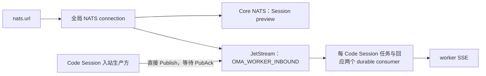

# NATS 消息基础设施

## 运行边界

应用在组装层创建一条全局 NATS 连接，确认目标账号已启用 JetStream，并在退出时 drain。Session SSE
preview 使用 Core NATS Pub/Sub；Code Session worker 入站事件使用同一连接上的 JetStream。handler
和业务 service 不建立独立连接池。



`nats.url` 是部署必填项，可包含逗号分隔的多个种子 URL。全部种子不可连接或 JetStream 不可用时，
HTTP server 不开始监听，也不回退到 Redis。连接关闭 reconnect publish buffer，避免断线期间积累的
过期 preview 在重连后发送。可靠入站发布必须等待 JetStream PubAck。

## 本地与生产拓扑

Docker Compose 使用三个独立 NATS 节点组成 `oma-nats` JetStream 集群。节点分别持有 named volume，
通过 6222 route 互联；客户端端口是 loopback 上的 4222、4223、4224，监控端口是
8222、8223、8224。

本地拓扑不启用认证或 TLS，不得暴露到非受信网络。生产环境必须配置独立账号与凭证、TLS、网络
策略和容量告警。三节点集群只是创建 3 replicas Stream 的前提，不替代生产安全配置。

## Worker 入站 Stream

应用启动时创建或校验共享 Stream `OMA_WORKER_INBOUND`：

- subjects：`oma.worker.inbound.v2.>`；
- retention：`WorkQueuePolicy`；
- storage：file；replicas：3；
- capacity：10 GiB；discard：`DiscardNew`；
- 单消息上限：1 MiB；duplicate window：24 小时；
- `MaxAge=0`。

`MaxAge=0` 避免服务端静默删除未处理消息。30 天逻辑期限由 envelope 的 `expires_at` 和应用 expiry
worker 强制执行。容量满时新 Publish 被拒绝并返回调用方；没有 PostgreSQL outbox 或后台补发。

每条版本 2 envelope 包含 Code Session ID、稳定 transport event ID、可选 payload event ID、事件
类型、`expires_at`，以及内联 payload 或对象存储引用。生产方直接使用稳定 `Nats-Msg-Id` 发布并
等待 PubAck。PubAck 响应丢失时，调用方重试由 duplicate window 去重。

`sequence_num` 在存储 envelope 中为 0，由 consumer 读取 JetStream metadata 后填入 Stream sequence。它是
共享 Stream 的全局序号，单个 Code Session 看到间断是正常的；跨通道的交付序号可以非单调。

## Subject 与 consumer

每个 Code Session 使用任务 subject `oma.worker.inbound.v2.<code-session-id>` 和回应 subject
`oma.worker.inbound.v2.<code-session-id>.reply`，各创建一个稳定 durable pull consumer。精确 filter
互不重叠，满足 `WorkQueuePolicy` 限制。两路均配置为 `DeliverAll`、`AckExplicit`、
`MaxAckPending=1`、无限 `MaxDeliver`，退避 1 分钟、5 分钟、15 分钟，之后保持 15 分钟。
各路内部串行；控制回应可以越过未完成任务及排队输入，解除循环等待。分类及顺序约束见
[Worker 入站投递设计](ccrv2/ccr-v2-worker-events-delivery-backend-design.md#stream-与顺序)。

SSE 断开不删除 consumer。worker 上报 `received` 或 `processing` 时发送 InProgress；只有
`processed` 才 DoubleAck。终止或 30 天过期时删除两个 consumer，并按两个精确 subject 清空消息。

`workerevents.Delivery` 只携带 envelope 和 ACK subject。InProgress、DoubleAck 由 `Broker` 按
ACK subject 执行，不在 delivery 中保存 SDK 方法或函数回调。SSE 或后台扫描发现过期时，必须先
成功提交 PG 终止与凭证撤销，再删除 consumer、purge subject。不能提前 TERM 或 ACK，否则 PG
失败时会丢失重试依据，且可能向同一 worker 放行下一条消息。

后台每分钟按 subject 查找下一条实际存储消息，一轮最多检查 512 条；序号空洞不占预算。坏
envelope 会告警，但不阻塞其他 Session 的扫描。同通道后续消息仍阻塞消费，以可信的 subject
和存储时间加 30 天兜底终止；任何终止或队列清理失败都保留批次游标重试。

## 数据安全与大消息

JetStream envelope 可能包含用户内容，不得写入运行日志。编码后超过 900 KiB 的 payload 存入对象
存储，envelope 只携带租户作用域 key、字节数、SHA-256 和 cleanup job ID；引用 envelope 仍不得
超过 1 MiB。Redis 只保存短期 ACK subject，不保存 payload，也不是消息事实源。

## 其他消息能力的接入约束

其他可靠业务队列接入前必须先定义 subject、schema/version、幂等键、ACK、重试、过期行为和租户
隔离。Core NATS 的 at-most-once 语义不能作为持久队列。Session preview 继续使用 Core NATS，
不得创建捕获 `oma.s.>` 的 Stream。

## 验收

连接层测试覆盖空 URL、JetStream 未启用和成功连接。worker event 测试使用内嵌三节点集群验证
Stream 配置、duplicate window、durable consumer、全局 Stream sequence、各通道串行 ACK 及回应越过排队输入。
过期测试覆盖序号空洞、损坏 envelope 隔离，以及 PG 终止失败保留队列、恢复后重新终止和清理。

```bash
docker compose up -d nats nats-2 nats-3
docker compose ps nats nats-2 nats-3
curl --fail 'http://127.0.0.1:8222/healthz?js-enabled-only=true'
curl --fail 'http://127.0.0.1:8223/healthz?js-enabled-only=true'
curl --fail 'http://127.0.0.1:8224/healthz?js-enabled-only=true'
just generate
go test ./internal/workerevents -count=1
```
