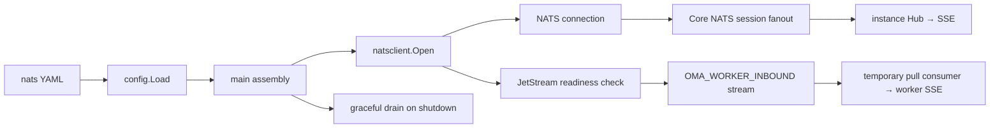

# NATS 消息基础设施

## 当前边界

应用在组装层创建一条全局 NATS 连接，确认目标账号已启用 JetStream，并在进程退出时 drain。Session SSE 的实时 fanout 固定使用这条连接上的 Core NATS Pub/Sub；code-session worker 入站事件使用同一连接上的 JetStream。River job、最终事件和 worker delivery 状态的 PostgreSQL 持久化，以及 Redis 平台登录会话保持不变。后续 producer 和 consumer 应复用这条连接，不得在 handler 或每次请求内重新连接。



`nats.url` 是部署必填项，可使用逗号分隔多个种子 URL；`nats.enabled` 已从配置合同移除。服务采用 fail-closed 启动：所有种子都无法连接或 JetStream 不可用时，HTTP server 不会开始监听，也不会回退到 Redis。默认连接超时为 5 秒，排空超时为 10 秒。

升级部署前应为所有 API 实例提供可用的 NATS URL，并让已有 SSE 客户端在切换后重新连接、通过历史 API 同步最终事件。Redis 仍是其他运行时能力的依赖，但不再承载 Session SSE 事件传输。

NATS 连接关闭 reconnect publish buffer，避免断线期间累积的过期 preview 在重连后发送。Core 发布失败由已有 fanout 边界记录；JetStream producer 等待服务端 publish ACK，并以 PostgreSQL inbound event ID 作为 `Nats-Msg-Id`。fanout 只维护按 subject 的共享 subscription state 和本地 SSE 引用计数；消息排队、异步回调串行化和断线后的 subscription 恢复都由 nats.go 负责。确认首次订阅的 NATS round trip 在 registry 锁外执行，同 subject 的并发订阅共享一次确认。fanout 在连接 drain 前关闭自己的订阅，不关闭其他组件共享的连接。具体事件与故障合同见 [Worker SSE fanout](ccrv2/ccr-v2-worker-sse-fanout.md) 和 [Worker delivery ACK](ccrv2/ccr-v2-worker-events-delivery-backend-design.md)。

## 本地拓扑

Docker Compose 使用 `docker.io/library/nats:2.14.6-alpine` 启动三个 JetStream 节点。节点共用 `oma-nats` cluster name，通过 Compose 内网的 `6222` route 端口互联，并分别使用 `natsdata`、`natsdata2`、`natsdata3` named volume；三个节点不得共用 store directory。客户端和监控端口只绑定宿主机 loopback：

- `127.0.0.1:4222` / `4223` / `4224`：三个 NATS 客户端种子地址。
- `127.0.0.1:8222` / `8223` / `8224`：各节点的监控与 `/healthz?js-enabled-only=true` 健康检查。

当前本地拓扑不启用认证或 TLS，因此不得把上述端口发布到非受信网络。三节点只提供本地故障切换拓扑，不等于生产安全配置。生产部署必须使用独立账号与凭证、TLS、网络策略和资源配额；凭证可由 NATS URL 或后续独立凭证字段承载，但不得写入日志或受跟踪示例。后续创建 JetStream stream 时还必须显式选择合适的 replica 数；集群不会自动把单副本 stream 变成三副本。

## Worker 入站事件 stream

应用启动时创建或校验固定 stream `OMA_WORKER_INBOUND`：subject 为 `oma.worker.inbound.v1.>`，file storage，3 replicas，`LimitsPolicy + DiscardOld`，`MaxAge=1h`，`MaxBytes=1GiB`，duplicate window 为 1 小时。该 subject 不与 Core NATS 的 `oma.s.>` 重叠。无法满足 3 副本时应用 fail closed，单节点和双节点 JetStream 不属于受支持部署。

每条 `event` 消息使用版本 1 的完整 JSON 信封，包含 code session ID、数据库 event ID、payload event ID、sequence、event type/subtype 和完整 payload。信封可能包含用户内容，只允许存留在上述短期 stream 中，不得写入运行日志。NATS Server 的默认 `max_payload` 保持不变；合法 HTTP payload 超过该限制时，PostgreSQL 写入仍成功，JetStream 发布只记录不含 payload 的 Warn。

PostgreSQL 是权威账本。写路径先提交 PostgreSQL，再发布 JetStream；publish 失败不回滚请求，不使用 outbox、后台 republish、DLQ 或周期性数据库扫描。worker 重连时从 PostgreSQL 补历史；健康连接若从后续 JetStream 消息发现 sequence 缺口，也会按 cursor 从 PostgreSQL 顺序补齐。若失败消息之后没有新消息，则等下一次 worker 重连恢复。

每条 worker SSE 连接先创建 `DeliverNew + AckExplicit`、按 code session subject 过滤的临时 pull consumer，再查询 PostgreSQL backlog。这保证补历史期间的新消息被 consumer 缓存。SSE 写出并沿用数据库 `MarkSent*` 后才 ACK JetStream；重复 sequence 直接 ACK。请求结束时删除 consumer，并用一分钟 inactive threshold 兜底清理异常断开的 consumer。JetStream 只承载数据库入站事件；旧 worker stream 通过 15 秒 keepalive 对 PostgreSQL epoch 的校验退出。

## 后续接入约束

其他可靠业务队列接入前必须先定义 subject 命名、消息 schema/version、幂等键、投递与 ack 策略、重试/backoff、dead-letter 流和租户隔离。Core NATS 的 at-most-once 语义不能被误当成持久队列；需要持久化、重试的路径必须使用 JetStream，并为失败和重复投递补充测试。Session SSE preview 仍不落 JetStream；不要创建捕获 `oma.s.>` 的 stream 而意外持久化预览内容。

## 验收

连接层测试以内嵌 NATS Server 分别覆盖空 URL、JetStream 未启用和成功连接。Compose 验收使用：

```bash
docker compose up -d nats nats-2 nats-3
docker compose ps nats nats-2 nats-3
curl --fail 'http://127.0.0.1:8222/healthz?js-enabled-only=true'
curl --fail 'http://127.0.0.1:8223/healthz?js-enabled-only=true'
curl --fail 'http://127.0.0.1:8224/healthz?js-enabled-only=true'
just generate
TEST_NATS_URL=nats://127.0.0.1:4222,nats://127.0.0.1:4223,nats://127.0.0.1:4224 go test ./internal/sessions -run TestNATSFanout -count=1 -v
```
