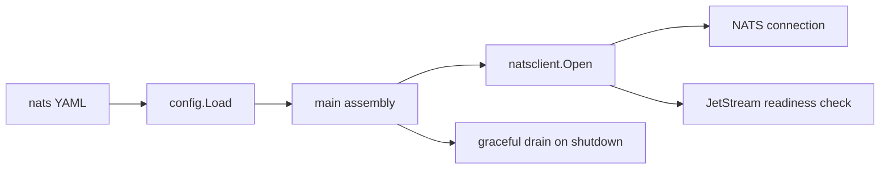

# NATS 消息基础设施

## 当前边界

本阶段只引入进程级 NATS JetStream 基础设施，不迁移现有 Redis fanout、River job 或任何业务事件。应用在组装层创建一条全局 NATS 连接，确认目标账号已启用 JetStream，并在进程退出时 drain；后续 producer 和 consumer 应复用这条连接，不得在 handler 或每次请求内重新连接。



`nats.url` 是 opt-in 边界：设置 URL 时 `enabled` 默认派生为 `true`，显式 `enabled: false` 可保留配置但不建立连接。启用后服务采用 fail-closed 启动；连接失败或 JetStream 不可用时，HTTP server 不会开始监听。默认连接超时为 5 秒，排空超时为 10 秒。

## 本地拓扑

Docker Compose 使用 `docker.io/library/nats:2.14.6-alpine`，通过 `--jetstream --store_dir /data` 启用文件持久化，并将数据保存到 `natsdata` named volume。客户端和监控端口只绑定宿主机 loopback：

- `127.0.0.1:4222`：NATS 客户端连接。
- `127.0.0.1:8222`：监控与 `/healthz?js-enabled-only=true` 健康检查。

当前本地拓扑不启用认证或 TLS，因此不得把这两个端口发布到非受信网络。生产部署必须使用独立账号与凭证、TLS、网络策略、资源配额和高可用集群；凭证可由 NATS URL 或后续独立凭证字段承载，但不得写入日志或受跟踪示例。

## 后续接入约束

业务接入前必须先定义 subject 命名、消息 schema/version、幂等键、投递与 ack 策略、重试/backoff、dead-letter 流和租户隔离。Core NATS 的 at-most-once 语义不能被误当成持久队列；需要队列语义的路径必须使用 JetStream，并为失败和重复投递补充测试。本阶段没有创建 stream 或 consumer，避免在尚未确定领域合同前固化拓扑。

## 验收

连接层测试以内嵌 NATS Server 分别覆盖空 URL、JetStream 未启用和成功连接。Compose 验收使用：

```bash
docker compose up -d nats
docker compose ps nats
curl --fail 'http://127.0.0.1:8222/healthz?js-enabled-only=true'
```
