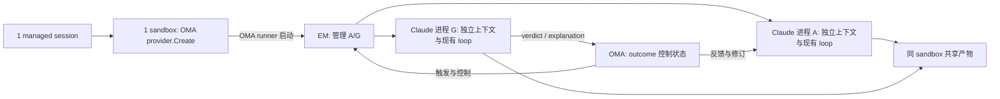

# Outcome grader：完整实现的复用方案与证据链

> 2026-09-16；研究与选型复盘，当前总体方案见 [Managed Agent Outcome Grader 架构设计](./managed-agent-outcome-grader-architecture.md)。本文保留 **官方合同 / 源码事实 / 工程决策 / 未披露内容** 的证据区分。
> 已接受用户约束：使用最新 Claude；目标是完整实现，不再建议 writer + 临时 grader MVP；本轮不写实现、不跑模型/测试。
> 当前总体方案已经确定：先实现 environment-manager-rs 的一个 sandbox/session 内 1:N Claude Code execution，再接 OMA 的 outcome 事件驱动；本文保留研究证据和选项复盘，正式设计见 [Managed Agent Outcome Grader 架构设计](./managed-agent-outcome-grader-architecture.md)。

## 1. 当前结论

**workflow 不是产品合同前提。当前确定目标是一个 managed session 对应一个 sandbox，由 EM 管理工作 agent A 与 grader G，二者各有独立上下文，分别复用现有 Claude agent loop；先实现 EM 的 1:N execution，再接 OMA outcome 事件驱动。当前生产装配尚未实现这一能力。**

OMA 不自写 model/tool agent loop，但仍需持有 outcome 控制状态，负责评分触发、结果校验、反馈回送、轮次和终态推进。两个进程不自动证明历史或权限隔离，也不等于注册两个完整 worker/lease。

保留此前追踪到的两条调用链，作为实现机制研究，而非选型优先级：

1. 显式 forked skill → 独立 `DE` 子执行器：存在同进程确定性启动路径，但有 parent 工具池、schema 与元数据限制。
2. **环境脚本命令 `__remote-workflow` → 原生 workflow `agent({schema})` → `DE` → 已有 query/tool loop**：可重建候选工具池、启用 schema、显式设置 child context。证据见 [运行时证据 R6](/Users/yueqi/Coding/Agent/open-managed-agents/docs/design/be/outcomes-grader-runtime-evidence.md#L132)。这不使 workflow 成为 grader 的必选或优先方案。

该脚本入口不同于每 session 只能有一个 distinct launch 的 `workflow_launch`；若将来选用，也只承担一次评分调用，不另建 outcome 状态机。它是受策略门控的 hidden 发布实现接口，不是 Managed Agents 对外稳定 API；版本与策略约束保留为该机制的风险记录，不作为用户必须先接受的决策。

当前 OMA 的普通 result 会投影 idle，权限仍按 owning session 的主 agent snapshot 解析，私有评分结果、上下文和用量的分流尚未接通；原生 hooks 路径也有未接线项。上述事实不能被双进程或配置透传自动解决。静态研究既不证明目标已跑通，也不证明 Anthropic Managed Agents 内部采用双进程或 hidden workflow。

### 1.1 固定证据版本

| 标签 | 快照 | 用途 |
| --- | --- | --- |
| H | OMA `e43888edc0f7dff91616896f9cc3714a280fa37b` | 当前工作区；本文 OMA 文件链接默认指 H |
| F | OMA `b14c52aad029412d0d8acb5bc544a8b110e49e0f` | 本地跟踪 ref `fork/fix/outcomes-link-and-grader`，只做静态对照 |
| R | Rust EM `544e59ed9e3c7c862d0b8c1a70c58e6c6c18d890` | 当前兄弟仓库 |
| C | Claude Code **2.1.273** Linux x64 发布物 | 查询时的 latest；发布包完整性与源码区间见运行时证据 |

未 fetch、切分支、同步 F、修改 Go/Rust 实现或安装运行该 Claude。H/F 默认版本较旧不再是用户决策项；后续从选定源码基线构建并验收最新固定版本。F 的 reply-lane/遥测能力不能写成 H 已有。固定 SHA 可用 `rtk proxy git show <SHA>:<path>` 复核。

## 2. 官方 Managed Agents 合同

外部文档仅使用 [Overview](https://platform.claude.com/docs/en/managed-agents/overview) 及同 scope 子页面；本轮重新核对 18 页。运行时发布代码是实现证据，不冒充这份产品合同。

| 主题 | 官方明确事实 | 架构约束与边界 |
| --- | --- | --- |
| [Environment](https://platform.claude.com/docs/en/managed-agents/environments) | 多 session 可复用 environment 配置；cloud 每 session 有自己的 sandbox | environment 配置不等于运行中的 sandbox |
| [Multiagent — How it works](https://platform.claude.com/docs/en/managed-agents/multiagent-orchestration#how-it-works) | “All agents share the same sandbox”；各自 session thread、独立历史，能并行和 follow-up | 1 sandbox : N contexts 已确定；N OS 进程未被要求 |
| [Multiagent](https://platform.claude.com/docs/en/managed-agents/multiagent-orchestration) | 独立 model/system/tools/MCP/skills；roster 保存时固定版本；共享 filesystem/vault；只委派一层；最多 20 个 unique roster agents，可多份实例；最多 25 个并发 threads，advisor 明示豁免 | 不是只拆消息历史；session overrides 只影响 coordinator 与 self copies，不能覆盖 ID 引用的 roster |
| [Outcomes](https://platform.claude.com/docs/en/managed-agents/define-outcomes) | harness 自动 provision grader，使用 separate context，按 artifact/rubric 评价；explanation 回给 agent 修订 | 自动评分不应依赖 writer 自愿调用；不要求 workflow、固定 OS 进程数或公开 grader thread，内部拓扑未披露 |
| [Outcome events](https://platform.claude.com/docs/en/managed-agents/define-outcomes#outcome-events) | 每轮 start/ongoing/end，iteration 从 0 开始；grader reasoning opaque | 内部复用 agent 引擎不等于应公开 grader transcript/thread |
| 同页 end/status | satisfied/failed 后 idle；needs_revision 继续；达到上限后最后 acknowledgment 再 idle；首次评分前 interrupt 也可发 end，start ID 空；资源使用 result，完成前可 pending/running/evaluating | 不把 stop、idle、一次评估结束、整个 outcome 终态混同；基础设施失败不自动等于 rubric 不适用的 failed |
| [Tools](https://platform.claude.com/docs/en/managed-agents/tools#multiagent-sessions-outcomes-and-mid-session-updates) | grader 没有 web_search/web_fetch；multiagent 的 web 访问还受自身/调用方/coordinator 联合限制 | 不能继承 writer 全部权限；也不能由禁写工具推出 bash 只读 |
| [Threads](https://platform.claude.com/docs/en/managed-agents/multiagent-orchestration#threads) | 有任何 thread running，session 仍 running；coordinator 委派并向持久 child follow-up | primary end-turn 不代表全部工作结束；官方没有客户端 child-create/child user.message 写入合同 |
| [Budgets](https://platform.claude.com/docs/en/managed-agents/budgets) | 所有 threads 共享预算；在模型请求间检查，最多每 thread 一个在途请求的超额；预算暂停不同于完成；pending ask 优先 | 不用 primary token 总数代替全会话总账；满额时 settle results 可入库，但不能开启新采样 |
| [Webhooks](https://platform.claude.com/docs/en/managed-agents/webhooks#supported-event-types) | evaluation-ended 表示一次迭代的评价完成；投递不保证顺序 | 定义 outcome 时不能提前发送 ended webhook |
| [Self-hosted](https://platform.claude.com/docs/en/managed-agents/self-hosted-sandboxes#environment-worker) | Anthropic 保持 orchestration/control plane；本地 worker 接工具请求并执行 | 官方确有类似环境执行组件；不等于它与 R 是同一组件，也不证明 grader 物理位置 |

三条容易混淆的合同细节：

1. **full multiagent 不要求添加 public spawn API**。官方描述 coordinator 创建、复用 child；工具权限章节还明确客户端不向子线程发消息。应补的是原生执行与已有 public thread 合同，不是凭 thread ID 发明用户写入接口。
2. **budget-paused interrupt 有明确例外**：当全部 threads 在 cap 暂停，官方将 user.interrupt 接受但忽略，不入事件历史。不能无条件套“所有 interrupt 都结束 outcome”。
3. **self-hosted 输出位置不同**：官方专页明确不注入 cloud 的 `/mnt/session/outputs` 提示，产物通常在 working directory。不能把云端固定目录/自动上传直接套到 self-hosted。

## 3. 源码已经证实的基础与缺口

### 3.1 OMA 并非只有 1:1 对象模型

- [mapper.go:569–633](/Users/yueqi/Coding/Agent/open-managed-agents/internal/codesessions/mapper.go#L569) 将 task_started/task_notification 映射成 thread 创建、消息和状态；[identity.go:16–22](/Users/yueqi/Coding/Agent/open-managed-agents/internal/managedagentsevents/identity.go#L16) 用 code-session + task key 派生 thread ID；[event_effects.go:17–54](/Users/yueqi/Coding/Agent/open-managed-agents/internal/sessions/event_effects.go#L17) 真正落库。
- roster 已校验、保存并进入 [agent snapshot](/Users/yueqi/Coding/Agent/open-managed-agents/internal/agentsnapshot/snapshot.go#L18)，但 [managedAgentSessionConfig](/Users/yueqi/Coding/Agent/open-managed-agents/internal/environments/environment_manager.go#L45) 尚未把 roster 编译成运行时 agent 定义。
- [stream preview](/Users/yueqi/Coding/Agent/open-managed-agents/internal/sessions/worker_stream_preview.go#L300) 有 parent-tool 路由，但不能据此宣称最终事件、权限、usage 全部完成 child 分流。现有手写 task JSON 测试不是本轮真实 runtime 证明。

### 3.2 当前单 executor 装配，不是 sandbox 或 context 数量限制

OMA [runner.go:259](/Users/yueqi/Coding/Agent/open-managed-agents/internal/environments/runner.go#L259) 调用 `provider.Create` 创建 sandbox，再于 [330–339](/Users/yueqi/Coding/Agent/open-managed-agents/internal/environments/runner.go#L330) 在其中启动 EM；不是 EM 直接创建 sandbox。以下 Rust 证据均对应 R：

- [manager.rs:455–530](/Users/yueqi/Coding/Agent/environment-manager-rs/src/internal/manager/manager.rs#L455) 一次 factory 创建单个 executor；[751–760](/Users/yueqi/Coding/Agent/environment-manager-rs/src/internal/manager/manager.rs#L751) 在 executor 返回后取消共享 run token。当前生产装配没有一个 session 管理多个独立 Claude 进程的能力；这不是 OS/sandbox 限制，也不能推导只能有一个 context，Claude 原生子上下文可存在。
- [claude_code_executor.rs:408–463](/Users/yueqi/Coding/Agent/environment-manager-rs/src/internal/claude/claude_code_executor.rs#L408) 已透传 CLI 参数；[566–576](/Users/yueqi/Coding/Agent/environment-manager-rs/src/internal/claude/claude_code_executor.rs#L566) 用同一个 `self.session_id` 构建 sdk/resume，[738–745](/Users/yueqi/Coding/Agent/environment-manager-rs/src/internal/claude/claude_code_executor.rs#L738) 的两个 session 环境变量也取同值。复制启动函数不会自动分开 A/G 的历史、resume 与输入路由。
- [固定 token 路径:68](/Users/yueqi/Coding/Agent/environment-manager-rs/src/internal/claude/claude_code_executor.rs#L68) 是 `/home/claude/.claude/remote/.session_ingress_token`；[destroy:1125–1131](/Users/yueqi/Coding/Agent/environment-manager-rs/src/internal/claude/claude_code_executor.rs#L1125) 删除该共享 token。双进程候选需明确凭据/存储所有权、取消与清理边界，不能让一方结束误停另一方，也不应以两个完整 worker/lease 代替两个 agent。
- [stdin 关闭](/Users/yueqi/Coding/Agent/environment-manager-rs/src/internal/claude/claude_code_executor.rs#L900) 不等于无控制通道：生产用远端双向 IO，不应硬接一个无人消费的 stdin。
- [OutcomeField](/Users/yueqi/Coding/Agent/environment-manager-rs/src/internal/config/types.rs#L224) / [V0 parser](/Users/yueqi/Coding/Agent/environment-manager-rs/src/internal/input/v0_parser.rs#L183) 是 Git 结果收集，不是 rubric 引擎；改 enum 不能生成评分能力。

### 3.3 模型认证可复用，权限与账本不能假装已跟上

- [service_auth.go:117–191](/Users/yueqi/Coding/Agent/open-managed-agents/internal/api/service_auth.go#L117) 从活跃 code-session 凭据恢复可信租户；[messages/handler.go:95–123](/Users/yueqi/Coding/Agent/open-managed-agents/internal/messages/handler.go#L95) 按 tenant + 请求 model 解析 provider，并透传原 body。不强制 grader 使用 writer model/system/tools，也不要求第二 worker。
- [tool_permissions.go:88–103](/Users/yueqi/Coding/Agent/open-managed-agents/internal/codesessions/tool_permissions.go#L88) 仍按 session.AgentSnapshot 选权限；[upstream_proxy_policy.go:40–87](/Users/yueqi/Coding/Agent/open-managed-agents/internal/codesessions/upstream_proxy_policy.go#L40) 也绑定 session/environment。新 context ID 或第二个 Claude 进程都不会自动获得各自权限。
- [Messages 响应代理](/Users/yueqi/Coding/Agent/open-managed-agents/internal/messages/handler.go#L129) 目前只流式透传；[result usage 投影](/Users/yueqi/Coding/Agent/open-managed-agents/internal/codesessions/mapper.go#L386) 不等于请求级计费/预算准入。F 的 OTLP 是可观测性，不是 grader 分账或预算执行器。

### 3.4 当前最具体的控制/结果断点

下表保留已定位的断点；agents/hooks/skill 的接线方式取决于执行路径，并非产品合同要求必须采用这些机制。

| 断点 | 源码事实 | 应修复的边界 |
| --- | --- | --- |
| initialize 不全 | [service.go:415–440](/Users/yueqi/Coding/Agent/open-managed-agents/internal/codesessions/service.go#L415) 只提取 system/append prompt | 接入 agents/hooks/所需技能配置，校验实际生效；重复 initialize 可更新受支持的 host hooks，但不是通用热换 agents |
| hook_callback 无消费 | [service.go:336–347](/Users/yueqi/Coding/Agent/open-managed-agents/internal/codesessions/service.go#L336) 除 can_use_tool 外返回 no-op | 在现有控制通道增加明确 callback 合同，不能把 HTTP 200 当已回复 |
| result 一律 idle | [mapper.go:386–447](/Users/yueqi/Coding/Agent/open-managed-agents/internal/codesessions/mapper.go#L386) 无条件生成 session idle；[status.go:27–34](/Users/yueqi/Coding/Agent/open-managed-agents/internal/codesessions/status.go#L27) 合并 requires_action 与 idle | grader 不得未经区分进入普通 result→idle 通道；在 raw 信息尚完整时识别角色、原因、错误，再聚合状态 |
| outcome 动态输入缺失 | [service.go:53–93、591–598](/Users/yueqi/Coding/Agent/open-managed-agents/internal/codesessions/service.go#L53) 不投递 define_outcome | 由 OMA 持久化并调度；不假设 Claude 接受同名公共业务事件 |
| pending 字段/webhook | [service_helpers.go:472–502](/Users/yueqi/Coding/Agent/open-managed-agents/internal/sessions/service_helpers.go#L472) 写 status；[service.go:586–594](/Users/yueqi/Coding/Agent/open-managed-agents/internal/sessions/service.go#L586) 定义变化即发 ended | 修 result 状态机及真正评价完成时的事务/outbox |
| F reply lane 的局部缺口 | F 有控制回复 lane，但 public user.interrupt 未转换成其识别的 native interrupt；H 不具备同一套 lane | 按选定基线接通优先控制，不混用 F/H 能力 |
| recovery 粒度 | 现有 epoch/lease/ACK 以 code-session 为域，恢复 activation 不等于恢复 outcome attempt | 复用 session fence，新增评价 attempt/阶段关联；拒绝过期结果，不能靠重新启动从头猜 |

## 4. 连贯证据链：结论如何得出

### E1：为什么不能把当前装配限制当作目标拓扑限制

官方要求同 sandbox 的独立上下文，不限定 OS 进程数；C 的 `DE` 也证明单进程可有原生子上下文。但 R 当前单 executor、共享 run token/session identity/token 文件的装配，尚不支持一个 session 管理两个独立 Claude 进程。**同 sandbox 的 A/G 双进程是可讨论的候选，需补生命周期与隔离边界；不能把它说成现有能力，也不能用单进程子上下文研究排除它。**

### E2：为什么不是让 writer 自愿调用 grader，也不是 OMA 重写 loop

官方承诺 harness 自动 provision 并反馈 → 不能只靠 prompt 让 writer 自愿调用 grader。**OMA 管 outcome 状态、触发和反馈，A/G 各自的 Claude runtime 管模型/tool loop。**同 sandbox 双进程候选不以 workflow 为前提；forked skill 和 hidden workflow 仅是已研究的其他确定性分派机制。outcome 控制循环与模型/tool loop 是不同层。

### E3：为什么还不能说“只加 agents/workflow 配置就好了”

C 具备 callbacks → H initialize 不注册，hook_callback 被忽略 → C 的本地命令 result 不充分表达 child 成败/usage → H 又无条件映射 idle。**若只加配置，会有评分丢失、错误成功、提前 idle、私有正文泄漏和错误计费风险。**应先修同一个输入/输出边界，而不是在 UI 隐藏 grader 或给每个 caller 打补丁。

### E4：为什么凭据复用不代表权限和用量可直接继承

活跃 session 凭据能发不同 model 的请求 → tenant provider resolver 可复用 → tool/network/MCP 仍按 primary snapshot 解析，可信身份仍是所属 session → native child 元数据/usage 不自动改掉 OMA 归属。**保留 session 租户边界，增加可信运行上下文映射及对应策略/计量，而不是给 grader 另造一份 public session；双进程也不能跳过这层映射。**

### E5：为什么不能用 idle 作为评分触发器

官方 primary end-turn 与 aggregate session idle 不同，permission/budget wait 也不同 → 当前 OMA 丢失部分停止原因 → native slash 外层还可能 success/null-stop-reason → idle 本身没有足够信息。**触发依据应是有效 writer/coordinator 结束、没有阻塞/在途工作、仍有 active outcome 的联合条件；具体产物一致性策略须明确写为 OMA 决策。**

### E6：为什么不必还原 Anthropic 内部进程拓扑才能选型

官方披露独立 grader context、公开事件、环境 worker 职责 → 未披露 grader 模型/进程/worker 归属 → 本地 C/R 已能证明可复用执行机制。**对齐公开行为即可；“官方内部必定这样做”不是本方案成立的前提，也不能作为论据。**

## 5. 候选比较

| 方案 | 复用能力 | 为完整交付仍须补什么 | 判断 |
| --- | --- | --- | --- |
| A1 原生单步 workflow + agent({schema}) | 确定性执行、重建工具池、原生 schema 处理、child identity、已有 query loop | 私有输入/结果/计量与完整状态；如采用需固定 hidden 接口版本、尊重策略开关 | **实现机制记录，非优先或必选**；不要求用户先接受其版本耦合 |
| A2 显式 forked skill + 独立定义 | 同进程新 context、无 writer history、可确定启动 | parent 工具池不足、schema 未传、同步分支 metadata 不全，另需 A1 共有业务工作 | **存在工具池/schema/元数据限制，未选定**；不能为省事放宽 writer 工具面 |
| B agent-type Stop hook 当 grader | 原生 query、文件检查、ok/reason | transcript 输入、轮次/时限、结果种类、usage 差异 | **不作完整引擎**；只借生命周期 callback，不用 Stop block count 替代 outcome iteration |
| **C 同 sandbox 内 EM 管理 A/G 两个独立 Claude 进程** | 各自复用 Claude loop，可分别配置顶层输入/输出 | 多进程生命周期、历史/resume、权限、凭据与清理边界；仍需 outcome 状态、计量、恢复 | **当前明确讨论的候选，未最终选定、未实现**；不以 A1 不可用为前提，不等于第二托管 worker |
| D 第二个托管 code-session/worker | 复用现有调度 | 公共身份、生命周期、租约、计费语义偏移；同 sandbox 不天然成立 | **不推荐**，增加不需要的托管身份 |
| J OMA 自写 grader 模型/tool loop | 完全控制采样 | 重复已有采样/工具/错误/权限/恢复能力 | **排除为本轮推荐**，没有必要性证据 |
| 仅提示 writer 调用 Agent | 配置少 | 无自动触发保证 | **不满足完整交付** |

`side_question`、conversation fork、一次性 `workflow_launch` 的限制见运行时证据 R5；可重复的环境脚本入口见 R6。不能把这些名字相似的入口混同。本轮不建设多后端插件框架，也不批准某一路径；比较表用于说明候选边界，不要求用户先接受 hidden workflow。

## 6. 完整实现的职责与状态合同

以下是同 sandbox 双进程候选的宏观目标，不是当前实现图或最终选型。sandbox 创建和 EM 启动仍属于 OMA runner；EM 在目标中管理 A/G 生命周期。

不是新增一个通用 agent 平台。以下职责是待实现边界，具体接入机制尚未定案：

1. **配置**：roster pinned snapshots → 原生定义；独立 model/system/tools/MCP/skills，保留 session override 与 self 规则。grader 独立定义、无 writer history，不提供 web_search/web_fetch；不把 bash 权限当只读证明。grader 配置缺失/被拒绝必须失败，不允许静默 fallback；A/G 的历史、resume、权限与输入需分别明确，不能以进程分离代替隔离设计。若采用私有脚本，其内容不能由公共用户覆盖。
2. **身份**：保留一个 managed session 的既有 code-session/worker 租约边界，不为两个 agent 注册两个完整 worker/lease；内部区分进程、上下文与私有 evaluation attempt。私有结果、callbacks、工具事件先分类再投影；不发明 public grader thread，也不允许公共文本或伪造 header 获得内部控制权。
3. **调度**：define_outcome 收到即持久化；写作完成只是评价候选点。区分正常 end-turn、权限/custom-tool wait、预算暂停、运行中 children、interrupt 与错误。评分期间新输入和产物变化必须有明确策略，不能悄悄评不同版本。
4. **结果与反馈**：向 G 提供受信的本轮输入，私有接收结构化 verdict/explanation，再由 OMA 回送 A 修订；不能把普通 `success` 当评分通过，也不能未经分流进入普通 result→session idle 通道。拒绝截断/缺失结果，校验 schema 与 epoch/attempt 后事务提交；workflow schema/callback/envelope 仅是已研究的一种接入机制。本地格式修复/网络重试不消耗业务修订轮次；基础设施异常不伪装 rubric 不适用。
5. **状态**：`pending/running/evaluating` 与每轮 start/ongoing/end、`needs_revision/satisfied/failed/max_iterations_reached/interrupted` 分层；上限后必须最后 acknowledgment，不能再评分；旧 outcome 历史保留，新 outcome 可串行开始。
6. **计量**：对齐 per-context 原始请求/响应 usage 与 session 总账，不能复制进程累计 modelUsage，也不能从 wall time 捏造一次模型请求。预算在新模型请求前准入；恢复预算后继续原状态，不另起免费 grader。
7. **取消/恢复**：复用 code-session epoch fence，attempt 关联 outcome、iteration、native context 与派发 ID；旧 epoch/旧 attempt/重复结果不能重复推进。worker ACK 只证明投递，不证明模型只执行一次；对已发模型请求/工具副作用不能承诺跨网络 exactly-once。
8. **投影/持久化**：内部判定成功后再产生 public span/resource/outbox；ended webhook 只随真实评价结束。持久化遵循现有 Yourbatis/事务/goose 边界，不再引入第二套状态存储。
9. **环境**：cloud 和本项目 self-hosted 通道分别接文件/工具与恢复合同；不把云固定输出目录推广到本地。当前 provider 能 exec 不等于已经具备任意远程 worker 或文件快照能力。

grader 私有不等于不计入 session 的“仍在工作”事实；普通孩子 running 时不能发布总体完成。评分涉及共享文件，不论单进程还是多进程都不会自动解决并发写入。

## 7. 上轮 U1–U11 的调查结论

| ID | 本轮收敛结果 | 剩余边界 |
| --- | --- | --- |
| U1 原生确定性子上下文 | **已找到**两个确定性入口，作为实现机制证据保留 | 不推出 workflow 优先；不证明双进程候选已接入；环境门控与完整协议未验收 |
| U2 无第二 worker 的认证 | **源码证实可复用**活跃 code-session token/tenant model resolver | lease/rotation 和 private callback 必须纳入恢复 |
| U3 独立配置 | **原生 workflow 重建工具池并按独立定义执行；OMA roster 未接线** | 安全策略/MCP 继承仍须正确过滤；不靠放宽 writer 配置满足 grader |
| U4 输入与副作用隔离 | **上述原生子调用不传 writer history 已确定**；双进程本身不证明历史或权限隔离 | 双进程的 session/resume/输入需分别设计；共享文件/项目指令不是强隔离，artifact 与副作用策略待定 |
| U5 正确完成边界 | **证明当前 idle/result 不足以判定**；已定位 raw 边界 | outcomes × multiagent 的官方完整竞态状态图未公开；需明示 OMA 策略 |
| U6 verdict/explanation/usage | **workflow agent 的原生 schema 和 child identity 已定位** | workflow 外层 result 不等于 verdict，usage 分账和 OMA 私有消费仍需实现 |
| U7 取消/迟到/恢复 | **原生取消与 session fence 有复用基础；控制路由和 attempt 缺口已定位** | R 的共享 run token/凭据清理尚非双进程生命周期管理；崩溃/断连待验收，不能承诺副作用 exactly-once |
| U8 只剩进程数 | **明确撤回**；A1/A2/B/C 差异已按源码比较 | 不再用猜测工期/成本为多进程或自写 loop 背书 |
| U9 OMA 状态、runtime loop、EM 生命周期 | **有现有依赖/认证/持久化边界支撑的工程建议** | 不是 Anthropic 对组件命名的规定，也不是新增通用编排框架 |
| U10 官方内部拓扑 | **在指定文档范围内未披露** | 无法靠继续重复同一页取得不存在的证据；不影响按公开合同选型 |
| U11 self-hosted | **控制面/工具面和输出差异已确定** | outcomes/multiagent 组合支持与 grader工具桥细节无明确专门保证；既不能宣称不支持，也不能宣称全兼容已验收 |

## 8. 真正仍需区分的未知与决策

### 8.1 官方未披露，不包装成确定事实

- grader 的默认模型、完整工具/prompt、内部进程/EM/thread 拓扑；advisor 明确是 named platform thread，不可借其规则填 grader 空白。
- outcomes × multiagent 的精确触发屏障、并发修改、child interrupt/失败与 outcome 终态的组合；相关对象模型没有互斥声明，但不是明确组合支持证明。
- grader 到 budget cap 的专门事件/恢复细节；通用预算规则已知，不等于子场景时序全公开。
- `max_iterations` 虽有默认 3/最大 20、iteration 从 0 开始，但本次页面没有给“初次评价 + 修订次数”的无歧义计数公式。不能偷偷把 outcome iteration 与 Stop-hook block count 对等。

### 8.2 宏观讨论中的待定边界，不是已批准的决策

1. **候选路径的边界**：当前明确讨论同一 managed session/sandbox 内由 EM 管理 A/G 两个独立 Claude 进程，各自复用现有 loop。需继续明确历史/resume、权限、结果分流、生命周期与恢复，不将候选写成最终选型。hidden workflow 只是已研究的实现机制，其版本/策略约束仅在将来考虑采用时适用，不是用户现在必须先接受的决策。
2. **产物一致性与副作用策略**：建议只在受管 writer/children 无在途工作时开始评分，新用户工作序列化处理；不宣称这能冻结任意 Bash 后台进程。若要求可复评的不可变产物，必须明确快照范围与评分工具能否写临时文件/执行测试，再选择对应隔离能力。
3. **官方空白的兼容策略**：如 iteration 上限计数、grader 默认模型、基础设施失败重试和组合竞态，采用明确写出的 OMA 策略并保留后续合同核验；不能把猜测写成“官方就是这样”。

“使用最新 Claude”“完整交付而非 MVP”“现在不写实现/测试”已经确认，不再重复询问。H 与 F 的整合是实施前源码准备，不应混入功能选型或擅自同步分支。

## 9. 本轮产物与验证边界

- 既有研究已记录：18 页 Managed Agents 官方合同复核；H/F OMA、R EM 与 Claude 发布实现的静态证据链；原生候选比较及上轮未知逐项收敛。本次仅按用户最新澄清与已核对证据修正文档，未重新执行整套研究或验收。
- 未执行：实现、模型调用、服务/镜像启动、单测/E2E、性能/费用测量、分支同步/提交。不存在“已通过真实评分闭环”的声明。
- 补充材料：[运行时证据](/Users/yueqi/Coding/Agent/open-managed-agents/docs/design/be/outcomes-grader-runtime-evidence.md)、[历史更正记录](/Users/yueqi/Coding/Agent/open-managed-agents/docs/design/be/outcomes-grader-options-review.md)、[当前局部链路实现](/Users/yueqi/Coding/Agent/open-managed-agents/docs/design/be/outcomes-link-and-grader.md)。
- 本轮逐条原始调研记录：[官方合同](/tmp/oma-official-full-contract-20260916.md)、[OMA 协议](/tmp/oma-full-protocol-evidence-20260916.md)。`/tmp` 是复核附件，不作为永久仓库依赖；关键结论已归入上述文档。

## 10. 本轮进一步收敛：文件拓扑与事件驱动顺序

本轮新增结论：**同 sandbox 双进程不能仅按 PID 设计，必须同时拆分 Claude runtime 状态目录、执行身份和 outcome 产物视图。** 共享文件系统本身不是上下文共享的证明：官方 multiagent 合同明确区分共享 sandbox/filesystem 与每个 agent 独立的 session thread/history/config；但当前 OMA/EM 的具体文件与 session identity 组合尚未达到该隔离合同。

- OMA 的 `provider.Create` 创建 sandbox，runner 再在 sandbox 中启动 EM；工作目录来自 session resource 的 repository mount，默认 `/home/user`。[runner](/Users/yueqi/Coding/Agent/open-managed-agents/internal/environments/runner.go#L259) [runtime resources](/Users/yueqi/Coding/Agent/open-managed-agents/internal/environments/managed_agent_runtime_resources.go#L28)
- OMA 的 filestore 将 `/outputs` 映射为可写，将 `/uploads`、`/transcripts`、`/tool_results`、`/skills` 映射为只读；这些是 sandbox 级挂载，不是 A/G 私有目录。[rclone mounts](/Users/yueqi/Coding/Agent/open-managed-agents/internal/environments/rclone_filestore.go#L101)
- Rust EM 当前把 Claude settings/hook 放入 HOME 下的 `.claude`，并且还会处理 `/home/claude/.claude`；session ingress token 使用固定 `/home/claude/.claude/remote/.session_ingress_token`。同时 A 形态的执行器用同一 `session_id` 构造 SDK/resume 与两个 session 环境变量。[settings](/Users/yueqi/Coding/Agent/environment-manager-rs/src/internal/envtype/anthropic/anthropic.rs#L719) [identity](/Users/yueqi/Coding/Agent/environment-manager-rs/src/internal/claude/claude_code_executor.rs#L738) [token](/Users/yueqi/Coding/Agent/environment-manager-rs/src/internal/claude/claude_code_executor.rs#L68)

因此应把文件分成三类，而不是追求“两个进程看到完全不同的 sandbox”：

1. **共享产物区**：A 写入，G 读取；评分期间必须有 quiescence/barrier、只读视图或 attempt snapshot，避免 G 评到正在变化的文件。
2. **A/G 私有 runtime 区**：各自的 HOME、`.claude` settings/hooks、transcript/cache/history、临时 token/relay/日志和执行身份；不能继续复用当前固定路径与同一 resume identity。
3. **session 级共享控制区**：租户凭据、worker/lease 和 session 取消边界仍归一个 managed session；不能为了两个 agent 擅自注册两个完整 public worker/code-session。

实现顺序也应修正为“先定合同，再分层落地”，而不是把所有 OMA 工作推迟到 EM 完成之后：

1. 先共同定义 `outcome`、`evaluation_attempt`、`agent_instance(role=A|G)`、artifact barrier/snapshot 以及事件幂等/epoch 合同。
2. 再扩展 EM：session 内 1:N agent supervisor、A/G 独立 runtime/file namespace、独立生命周期与结果通道，但复用现有 Claude loop。
3. 最后接 OMA 事件编排：定义 outcome 事务提交后发出内部调度事件，EM 在 writer 到达可评价边界后启动 G；G 的结构化结果回 OMA，OMA 决定 satisfied/needs_revision 等状态并发反馈给 A。

当前 OMA 已能在 session API 接收并持久化 `user.define_outcome` 与完整 rubric，[send events](/Users/yueqi/Coding/Agent/open-managed-agents/internal/sessions/service.go#L551) [append outcome](/Users/yueqi/Coding/Agent/open-managed-agents/internal/sessions/service_helpers.go#L472)，但 `shouldForwardPublicEventToWorker` 当前只转发 message/interrupt/tool 事件，不转发 `user.define_outcome`；它目前更像 API 存储骨架，不是 grader 调度器。[forward allowlist](/Users/yueqi/Coding/Agent/open-managed-agents/internal/codesessions/service.go#L591)

## 11. 本轮复核：outcome 是 session/control-plane 合同，不是普通 worker 输入

官方 [Define outcomes](https://platform.claude.com/docs/en/managed-agents/define-outcomes) 的公开合同是：客户端向 session events 发送 `user.define_outcome`；该事件被回显并分配 `outcome_id`，之后由 harness 自动 provision grader。公开输出是 `span.outcome_evaluation_start/ongoing/end`，并可通过 session status 读取结果；文档没有要求把 `user.define_outcome` 转发给环境 worker，也没有公开 grader→worker 的内部消息格式。[官方示例与事件合同](/tmp/oma-managed-runtime-evidence-20260916/outcomes.md#L287)

因此，OMA 的 `shouldForwardPublicEventToWorker` 不包含 `user.define_outcome`，目前不能据此认定为缺陷。更稳妥的设计是：保留公开 session event 合同，在 OMA 事务提交后产生内部 outcome/evaluation-attempt 调度记录；如 EM 需要控制命令，使用私有 OMA↔EM 合同，不把新的内部命令伪装成 Anthropic public event。官方 self-hosted 文档只规定 environment worker claim work item、执行工具并回传结果，没有公开 outcome grader 的专用 worker 合同。[self-hosted worker](/tmp/oma-managed-runtime-evidence-20260916/self-hosted-sandboxes.md#L272)

串行评价可以作为第一版正确拓扑：A 到达可评价边界并 quiesce 后，G 读取同一 artifact 视图，G 结束后 OMA 再决定是否给 A 反馈。FUSE/共享目录解决的是数据可见性，不自动提供版本一致性，也不自动把 G 变成只读；当前 `/outputs` 是 sandbox 级读写挂载，不能仅凭“FUSE”声称 G 进程不可写。若不复制 artifact，必须由 EM 提供真正的 G 只读视图/权限隔离和 writer barrier；prompt 约束不算隔离。

不建议新建独立的 `OutcomeOrchestrator` 服务，但不能取消编排逻辑。最小边界是：OMA 现有 session/outcome 状态与事件处理负责 durable 状态、幂等、轮次、公开 span/status 和反馈决策；EM 的 session supervisor 负责 A/G 进程与私有执行命令。A/G 可以通过 EM 或 sandbox 内 IPC 交换受控结果，但“进程能通信”不能替代 OMA 的状态所有权、恢复和公开事件顺序。
