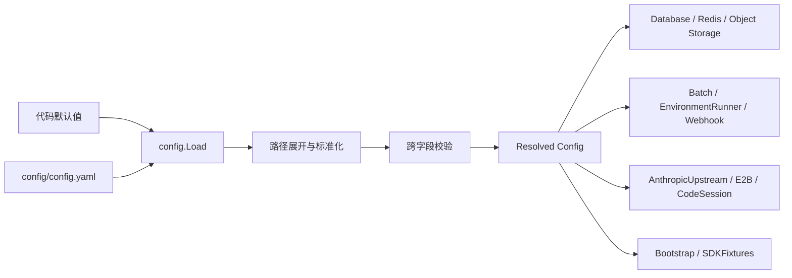

# 运行时配置边界

Open Managed Agents 的进程级配置在启动时由 `internal/config` 解析为强类型 `Config`。业务配置只由代码默认值和 YAML 构成；应用不读取 `.env`，也不允许业务环境变量覆盖 YAML。

## 加载与依赖方向



加载优先级固定为：

```text
可选字段的代码默认值 < config/config.yaml
```

未设置 `CONFIG_FILE` 时，`config.Load` 从当前目录向上查找 `config/config.yaml`，最多查找到 `go.mod` 所在目录。设置 `CONFIG_FILE` 后只读取指定文件；未找到配置文件、路径不存在、不是普通文件或内容无效时都拒绝启动。

`env`、`server.addr`、`database.url`、`redis.url`、`storage.type` 以及 S3 endpoint、bucket、region 和静态凭证属于部署必填项，不提供代码默认值。Batch、Webhook、Environment Runner、超时、容量限制等运行策略继续使用稳定代码默认值，因此正常启动无需在最小 YAML 中逐项配置。

本地 `scripts/restart-server.sh` 在清理监听端口前要求存在 `config/config.yaml`，并显式将该路径作为 `CONFIG_FILE` 传给服务。这样脚本不会在缺少配置时按 `PORT=38080` 清理端口、却启动一个没有有效配置的进程。

YAML 使用严格字段解析，未知字段、显式 `null`、类型错误和多文档输入均视为配置错误。加载器只把 YAML 字节解析成一次节点树：先按私有 YAML 输入类型检查节点树，再从同一棵树解码并与代码默认值合并，最后处理路径和跨字段校验。

需要区分“未配置”和“显式配置为 `false` 或空列表”的字段，在私有 YAML 输入类型中使用 `optional[T]`。输入模型解析完成后再转换为不含指针和 Optional 的运行时 `Config`。这样 presence 是字段类型的一部分，不依赖字符串路径集合；新增派生默认值时必须显式建模，并由 YAML 输入与运行时配置字段合同测试防止两种类型发生字段漂移。

Docker Compose 同样只挂载一份完整 YAML，不再通过 `.env` 插值业务字段，也不做 YAML merge。本地 Compose 从受跟踪的无密钥模板 `deploy/docker-compose/oma-server.yaml` 初始化 gitignored 的 `deploy/docker-compose/oma-server.local.yaml`，并只读挂载后者；密码、API key 和私钥路径只能写入本地文件。生产环境应由容器平台或 Secret Manager 将受权限保护的完整 YAML 只读挂载到同一目标路径。

## 从 `.env` 迁移

从旧版环境变量配置切换到 YAML 是 breaking change。新版本不会读取 `.env`，也不会在 YAML 缺失时回退到业务环境变量；部署升级前必须先准备完整配置文件。建议从 `config/config.example.yaml` 复制最小配置，再根据下表迁移实际覆盖值：

| 旧环境变量 | YAML 字段 | 迁移说明 |
| --- | --- | --- |
| `APP_ENV` | `env` | `development` 改为 `dev`，`production` 改为 `prod` |
| `ADDR` | `server.addr` | 保留原监听地址 |
| `DATABASE_URL` / `DB_AUTO_MIGRATE` | `database.url` / `database.auto_migrate` | `auto_migrate` 未配置时按 `env` 派生 |
| `REDIS_URL` | `redis.url` | 直接迁移 |
| `S3_ENDPOINT` / `S3_BUCKET` / `S3_REGION` | `storage.s3.endpoint` / `bucket` / `region` | 同时设置 `storage.type: s3` |
| `S3_ACCESS_KEY_ID` / `S3_SECRET_ACCESS_KEY` / `S3_FORCE_PATH_STYLE` | `storage.s3.access_key_id` / `secret_access_key` / `force_path_style` | `force_path_style` 省略时默认 `true` |
| `MAX_FILE_BYTES` / `WORKSPACE_STORAGE_LIMIT_BYTES` | `storage.max_file_bytes` / `storage.workspace_limit_bytes` | 迁移非默认容量限制 |
| `ANTHROPIC_UPSTREAM_BASE_URL` / `ANTHROPIC_UPSTREAM_API_KEY` | `anthropic_upstream.base_url` / `api_key` | 密钥只能写入受保护的运行配置 |
| `BATCH_*` | `batch.*` | 后缀转为小写 snake case，例如 `BATCH_UPSTREAM_TIMEOUT` → `batch.upstream_timeout` |
| `E2B_*` | `e2b.*` | 后缀保持小写 snake case；包括连接、debug、template 和 timeout 字段 |
| `ENVIRONMENT_RUNNER_ENABLED` / `ENVIRONMENT_RUNNER_CONCURRENCY` | `environment_runner.enabled` / `concurrency` | 仅在覆盖代码默认值时配置 |
| `ENVIRONMENT_MANAGER_PATH` / `CLAUDE_AGENT_VERSION` / `CLAUDE_PATH` | `environment_runner.manager_path` / `claude_agent_version` / `claude_path` | 路径可使用 YAML 路径展开语法 |
| `CODE_SESSION_SANDBOX_API_BASE_URL` | `code_session.sandbox_api_base_url` | 必须是 sandbox 实际可达地址，不从监听地址推导 |
| `CODE_SESSION_OTLP_*` | `code_session.otlp_*` | 后缀保持小写 snake case |
| `CODE_SESSION_JWT_SIGNING_KEY_FILE` | `code_session.jwt_signing_private_key_file` | 字段改名；生产环境必须指向稳定只读私钥 |
| `CODE_SESSION_UPSTREAM_PROXY_*` | `code_session.upstream_proxy_*` | 迁移 MITM、CA 私钥路径和 SSRF 诊断开关 |
| `WEBHOOK_ENDPOINT_URL` / `ANTHROPIC_WEBHOOK_SIGNING_KEY` | `webhook.endpoint_url` / `webhook.signing_key` | signing key 字段不再使用 Anthropic 环境变量名 |
| `WEBHOOK_EVENT_TYPES` | `webhook.event_types` | 旧 CSV 改为 YAML 字符串列表 |
| 其他 `WEBHOOK_*` | `webhook.*` | 后缀转为小写 snake case |
| `OFFICIAL_SDK_FIXTURE_*` | `sdk_fixtures.*` | 只在兼容测试需要覆盖稳定 fixture 时迁移 |

`POSTGRES_ADMIN_URL`、`PUBLIC_BASE_URL` 和 `CODE_SESSION_API_BASE_URL` 没有 YAML 对应字段。数据库和角色应在部署前准备好；首次启动回退只使用 `database.url` 派生的 maintenance 连接。客户端响应 URL 根据请求地址及受信任反向代理设置的 `X-Forwarded-*` header 构造；sandbox 回调则显式使用 `code_session.sandbox_api_base_url`。

升级步骤：

1. 保留旧 `.env` 的安全备份，不要提交到 Git。
2. 复制 `config/config.example.yaml`，迁移实际覆盖值，并将运行配置权限限制为部署用户可读。
3. 使用 `CONFIG_FILE=/absolute/path/config.yaml go run .` 或等价部署命令验证新版本，再切换流量。
4. 验证完成后从部署系统移除旧业务环境变量，避免形成两份看似有效的配置来源。

需要回滚时，停止新版本，重新部署仍支持 `.env` 的旧二进制或镜像，并恢复升级前的环境变量与启动方式。仅删除 YAML 不能让当前版本回退到 `.env`。

## 示例与完整参考

`config/config.example.yaml` 只包含正常本地开发最常修改的连接、监听和凭证字段，并且可以直接复制为 `config/config.yaml`。具有稳定代码默认值的 Batch、Webhook、Environment Runner、Bootstrap、SDK fixture、容量限制和高级 Code Session 开关不进入最小示例，避免把“支持配置”误解为“启动必须配置”。

`docs/configuration-reference.yaml` 是独立的完整字段参考，列出 `Config` 接受的全部 YAML 字段及安全示例值；它用于查找按需覆盖项，不建议整份复制为部署配置。配置合同测试承担两个方向的防漂移：最小示例必须能经过严格解码和完整校验，且只能包含约定的常用字段；完整参考的字段路径必须与 Go `Config` 的 `yaml` 标签精确一致。

## 路径合同

以下 YAML 字段属于本地路径：

- `environment_runner.manager_path`
- `environment_runner.claude_path`
- `code_session.otlp_log_root`
- `code_session.jwt_signing_private_key_file`
- `code_session.upstream_proxy_ca_key_file`

这些字段支持 `${VAR}`、`$VAR` 和 `~/` 展开。引用不存在的路径展开变量会拒绝启动，避免把错误路径静默解析为空。相对路径（包括代码默认路径）以必需的 YAML 文件所在目录为基准。

## 派生默认值

部分默认值依赖其他字段，因此只在 YAML 未显式设置对应字段时派生：

- `database.auto_migrate`：`env` 为 `prod` 时默认关闭，`dev` 时默认开启。
- `code_session.otlp_file_log_enabled`：`env` 为 `prod` 时默认关闭，`dev` 时默认开启。
- `webhook.worker_enabled`：同时配置 endpoint 和 signing key 时默认开启。
- `bootstrap.seed_api_keys`：未配置时根据 Bootstrap 和 SDK fixture 的 ID/key 生成默认 seed keys；显式空列表表示不 seed API key。

`code_session.sandbox_api_base_url` 不从 `server.addr` 或其他字段推导。空值会保持为空；需要 sandbox 回调 code-session ingress 或 OTLP endpoint 时，部署配置必须显式提供 sandbox 可访问的地址。Docker Compose 的进程监听端口为容器内 `8080`、宿主机发布端口为 `38080`，因此其部署 YAML 显式使用 `http://host.docker.internal:38080`，不能使用容器监听端口代替。

默认 Docker Compose 是显式的本地开发配置：`env: dev`、`database.auto_migrate: true`，并省略 `code_session.jwt_signing_private_key_file`。Code Session 使用进程级临时 Ed25519 密钥，oma-server 重启会轮换信任并使此前签发的 session-ingress JWT 失效。生产部署必须使用 `env: prod`、稳定的只读私钥路径并关闭自动迁移；缺少 JWT 私钥时启动边界会拒绝生产配置。

## 领域配置

| 配置类型 | YAML 节点 | 职责 |
| --- | --- | --- |
| `Config.Env` | `env` | 运行模式，只接受 `dev` 或 `prod` |
| `ServerConfig` | `server` | HTTP 监听地址 |
| `DatabaseConfig` | `database` | PostgreSQL 运行连接和自动迁移开关 |
| `RedisConfig` | `redis` | 平台会话 Redis 连接 |
| `StorageConfig` | `storage` | 对象存储类型选择和文件容量限制 |
| `S3Config` | `storage.s3` | S3 兼容对象存储连接、bucket 和寻址方式 |
| `AnthropicUpstreamConfig` | `anthropic_upstream` | Anthropic 上游地址和服务端凭证 |
| `BatchConfig` | `batch` | Message Batch 限制、worker、lease 和清理策略 |
| `E2BConfig` | `e2b` | E2B provider 连接、模板和超时 |
| `EnvironmentRunnerConfig` | `environment_runner` | Environment runner 并发及 Claude 运行命令 |
| `CodeSessionConfig` | `code_session` | Code session ingress、JWT、OTLP 文件日志和上游代理安全配置 |
| `WebhookConfig` | `webhook` | Webhook endpoint、签名、事件和投递 worker 策略 |
| `BootstrapConfig` | `bootstrap` | 本地默认身份和需要 seed 的 API keys |
| `SDKFixtureConfig` | `sdk_fixtures` | 官方 SDK 兼容测试使用的稳定 fixture 标识 |

### S3 兼容对象存储

`internal/storage` 使用 AWS SDK for Go v2 连接 S3 兼容服务。客户端只读取 `storage.s3` 中显式配置的 endpoint、region 和静态 access key/secret，不启用 AWS 默认凭据链或 AWS 服务发现。无 scheme 的 endpoint 按 HTTP 处理；自定义 endpoint 通过 SDK 的 `BaseEndpoint` 注入，endpoint path 不参与对象路径。`force_path_style` 直接控制 path-style 寻址，默认本地 MinIO 保持开启。

客户端把可选请求 checksum 计算和响应校验限制为 `WhenRequired`，避免依赖部分 S3 兼容服务不支持的 AWS 扩展。HTTP transport 保留 SDK 的连接和 TLS 默认值，并把服务端响应头等待限制为 30 秒；它不设置覆盖整个请求/响应 body 的 client timeout，因此不会因对象较大而中断正常流式传输，完整操作生命周期仍由调用方 context 控制。

上传统一经过 transfer manager：16 MiB 起使用 multipart、分片大小 16 MiB，并支持 batch worker 使用的未知长度 `io.Pipe`。单上传并发固定为 1 是有意的背压与内存边界：每次上传只保留一个在途分片；如需提高吞吐，应先针对目标 S3 服务、网络和 batch 并发做基准测试。失败的 multipart 会在独立的短超时上下文中执行 abort。

启动时先用 `HeadBucket` 检查 bucket；有 HTTP 状态时只有 404 才触发创建，没有 HTTP 状态的 SDK 错误则识别 `NotFound` 或 `NoSuchBucket`。HTTP 403、5xx 和网络错误保持失败关闭。多个实例并发建桶时，`CreateBucket` 的 HTTP 409，或没有 HTTP 状态时的 `BucketAlreadyExists` / `BucketAlreadyOwnedByYou`，不会直接视为成功，而是再次执行 `HeadBucket`，只有当前凭证确实可访问时才继续启动。`GetObject` 响应缺少 `Content-Length` 时，内部对象大小为 `-1`；平台预览不发送错误的零值 `Content-Length`，而是按未知长度流式返回。

新增进程级配置时，应放入拥有该行为的领域配置并定义严格的 YAML 字段。资源 handler 可以依赖根配置，但不得把数据库行、HTTP DTO 或 organization/workspace 业务配置塞入进程配置。需要动态更新、租户 scope、权限或审计的配置应继续通过 API 和数据库管理。

根 `Config` 只在 `main` 和 `internal/api` 等组装边界用于分发依赖。`internal/runtime/e2bruntime` 的 provider 只接收 `E2BConfig`，`internal/webhooks` 的 handler、enqueue 和 worker 只接收 `WebhookConfig`；调用方必须在进入领域包前显式传入 `cfg.E2B` 或 `cfg.Webhook`。E2B SDK 的 `ConnectionOpts` 映射由 `e2bruntime.ConnectionOptsFromConfig` 唯一维护，避免生产与 E2E 调用遗漏同一配置字段。

## 兼容与安全合同

- `CONFIG_FILE` 只选择 YAML 文件；业务环境变量不参与配置合并。
- Workbench 访问 Anthropic 时使用同一份 `anthropic_upstream.base_url` 和 `anthropic_upstream.api_key`，不从 `ANTHROPIC_*` 环境变量回退读取。
- 数据库配置不接受独立的管理员 URL 或管理员凭证；启动回退只能使用 `database.url` 派生的 maintenance DB 连接和当前系统用户候选。
- 上游 API key、Webhook signing key 等秘密只保存在服务端配置边界，不得进入 sandbox payload 或日志。
- JWT 和 CCR MITM 私钥继续通过只读文件路径配置；路径校验仍在相应的 code-session 启动边界执行。
- `config/config.yaml`、`config/secrets/` 和 `deploy/docker-compose/oma-server.local.yaml` 中的真实秘密已加入 `.gitignore`；仓库提交的 `config/config.example.yaml`、`deploy/docker-compose/oma-server.yaml` 和 `docs/configuration-reference.yaml` 只使用无真实凭证的示例值。
- `BootstrapConfig` 与 `SDKFixtureConfig` 只承载本地初始化和兼容测试数据，不能演变为租户级业务配置。

## 验收

S3 兼容性测试是显式启用的真实服务测试，覆盖重复建桶、小对象、超过 16 MiB 的已知长度 multipart、未知长度 `io.Pipe` multipart、下载和删除。至少设置 endpoint；其余变量默认使用本地 MinIO 配置：

```bash
OMA_S3_INTEGRATION_ENDPOINT=http://127.0.0.1:9000 \
OMA_S3_INTEGRATION_BUCKET=claude-files \
OMA_S3_INTEGRATION_REGION=us-east-1 \
OMA_S3_INTEGRATION_ACCESS_KEY_ID=minioadmin \
OMA_S3_INTEGRATION_SECRET_ACCESS_KEY=minioadmin \
  go test ./internal/storage -run '^TestS3CompatibleIntegration$' -count=1 -v
```

发布前应使用实际部署的 S3-compatible 产品版本或镜像运行同一组测试；测试对象会清理，但测试创建的 bucket 默认保留。需要验证真实建桶并自动清理时，应使用以 `oma-storage-test-` 开头的唯一临时 bucket，并设置 `OMA_S3_INTEGRATION_DELETE_BUCKET=1`；测试会在对象删除后删除该 bucket，并拒绝删除不符合临时命名约束的 bucket。

修改 Go 配置类型、加载器或调用方后，至少运行：

```bash
go test ./... -count=1
just lint
just dead-code
just duplicates
just complexity
```
