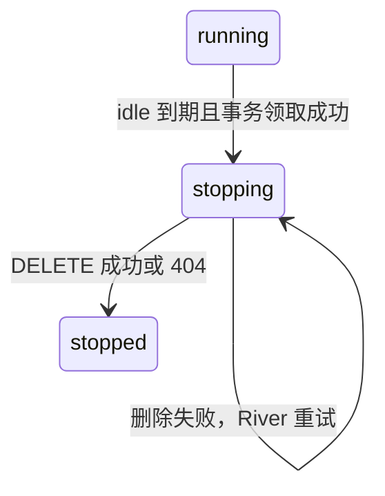

# 托管沙箱的 idle 回收

## 范围与配置

回收长期 idle 的 cloud Session 沙箱，不改变公开 Session、Code Session 的状态或 ID。
短期空闲继续使用原有 E2B pause 策略；running、requires_action、启动中及存在未处理输入的沙箱不回收。
自托管 Environment、Session 终止或删除的清理策略不属于本功能。

允许丢失沙箱本地工作目录、进程状态、临时文件和未上传的写缓存，不做 checkpoint。
数据库事件、transcript 和已经提交的 Filestore 文件继续保留。

```yaml
sandbox_lifecycle:
  enabled: true
  dry_run: true
  idle_timeout: 24h
```

默认 dry-run 只输出候选。设为 `dry_run: false` 后执行真实删除。
`enabled: false` 停止领取新回收操作；已领取的删除仍会重试完成。
修改 YAML 后重启生效，多实例应使用一致配置。新消息所需的重建沿用 Environment Runner。
Worker 会把“是否允许新领取”作为显式条件传给事务；关闭或 dry-run 不再通过特殊时间值影响 SQL。

## 数据与回收协议

只保留两个新增字段，不新增独立的运行时状态机或消息 outbox：

| 表 | 字段 | 语义 |
| --- | --- | --- |
| code_sessions | idle_since | 连续 idle 起点；heartbeat 不刷新，重复 idle 保留，业务输入、非 idle 状态和凭证轮换清空 |
| environment_sandboxes | stop_reason | idle 回收使用 `idle_timeout`，用于识别删除重试及已回收记录 |

复用已有的沙箱状态：



1. 扫描候选，仅作为提示，不授权删除。
2. 按 organization UUID、workspace UUID、sandbox UUID 定位不可变的沙箱记录。
3. 事务按 Session → Code Session → Work / Sandbox 锁定，复查 idle 时间、cloud 类型、
   活跃且未归档的父 Session、Work 状态及未处理入站事件。
4. 条件领取成功后，清空 idle_since、递增 worker epoch、撤销旧 lease 和 OAuth hash，沙箱改为 stopping。
5. 提交后执行 Provider DELETE，不在数据库事务中调用网络。
6. 删除成功或 404 后，在完成事务中标记 stopped。

回收逻辑直接依赖已有的 `E2BProvider`，不另定义删除接口。
Provider 直接调用 SDK 的 `e2b.Kill`，不再自行构造 API client 或 DELETE 请求；不调用 Connect，404 由 SDK 视为已删除。
`SandboxApiOpts.ApiUrl` 允许包级 Kill 直接使用 Provider 的 `e2b.api_url` 配置；配置为空时沿用 SDK 的环境变量及默认值。
API key、domain、超时仍按请求传参；配置的 access token 通过 SDK 的 Headers 传递，不写入进程环境。
Debug 模式仍执行同一个 DELETE，不会在数据库已推进到 stopped 时假装删除成功。
任务每次从数据库读取同一 sandbox UUID 对应的 Provider ID，不删除 replacement。
删除失败保持 stopping，River 重试；任务耗尽重试后，下一轮扫描仍可重新投递。
删除成功但落库前退出时，下次 DELETE 得到 404 并完成记录。关闭回收开关不遗弃已领取的删除。

## 与现有消息流程衔接

接受可转发 public 输入时，在原有事件事务中清空 idle_since；Code Session 入站 sequence 推进也清空它。
这样输入落库后、转交 worker 前不会按旧 idle 时间领取回收。入站队列已有的未处理事件检查继续保留。
不添加消息 outbox、wake 标志、后台消息扫描或新的唤醒接口；原有消息转交失败的重试语义不变。

回收后 Work 保持 active，沙箱为 stopped。没有新输入时不重排、不重建。

- 删除期间收到输入：先进入原有入站队列，不连接 stopping 沙箱。删除完成事务检查待处理输入，
  通过既有 `ScheduleRecoveryForCodeSession` 原子地重排 Work。
- 删除完成后收到输入：正常消息入口找不到 running 沙箱时，调用同一恢复方法。
  空 Provider ID 仅允许匹配 `stopped + idle_timeout` 且有待处理输入的沙箱，不能恢复任意缺失目标。
- 恢复沿用现有路径：旧沙箱记录标为 failed，Work 改为 queued，Runner 复用 Code Session 并创建新沙箱。
  `stop_reason=idle_timeout` 保留原回收原因。旧记录被退役后不能再次重排新 Work。
- 对仍为 running 的沙箱，正常消息入口的 SetTimeout、worker lease 恢复和 Provider not-found 处理保持不变。

正常回收本身不会调用 Provider 唤醒。重建只处理真实待处理输入，已归档或终止的 Session 不重排。

## 迁移

已应用的 `00057_sandbox_lifecycle.sql` 保持不变；`00058_simplify_sandbox_reclamation.sql`
删除试验版的 runtime_state、runtime_wake_requested、runtime_pending 及专属索引，并重建 idle 索引。
存量 idle 起点仍由 00057 从迁移时间开始观察，不使用旧 updated_at 回推。
升级前停止旧版本进程，再迁移并启动新版本；旧版本不能与删除字段后的 schema 混用。
回滚 00058 只能恢复字段默认值，不能还原已删除的 wake 标志。

## River 与模块边界

`internal/backgroundjobs` 负责共享 River client、官方 migrator 和连接池复用。资源 worker 仍由 deployments、
environments 注册；启动组装一次性注册全部 worker 和队列，deployment 的现有 PeriodicJobs 行为不变。

当前使用 `superduck-ai/river v0.46.0-oma-v0.0.1` fork 的 DurablePeriodicJob：

- 固定 schedule ID / kind 为 `sandbox_lifecycle_sweep`，UTC 五字段 cron `* * * * *`。
- 配置一致时启动不重新 upsert，保留数据库 next_run_at；River migrator 管理 river_periodic_job。
- 一个 sweep 按 UUID 游标分批读取，每批 100 条，避免 OFFSET 漂移和固定第一页阻塞后续记录。
- 仅注册 `sandbox_lifecycle_sweep` 和 `sandbox_reclaim`，使用 sandbox_lifecycle 队列，当前并发 4。
- 任务参数只携带稳定 UUID 和租户 scope，不持久化 token、路径、消息 body 或 Provider 返回内容。
- 同参数的未完成任务去重，completed 不参与去重，避免一次 no-op 阻止后续 idle 周期。
- Worker 每次执行重新读取策略和业务状态；周期调度、任务重试都不代表业务只会执行一次。

若此前运行过带后台唤醒的试验版本，升级前停止旧 worker，并通过 River 管理接口取消遗留的
`sandbox_wake` 未完成任务；当前版本不保留该 kind 的兼容 worker。

应用 SQL 全部经 Yourbatis Mapper。River 内部表由 River API 管理，应用不直接执行其 SQL，不创建额外连接池。
River client 使用 `riverdatabasesql.NewWithPgxListener(database.SQLDB(), database.ListenerPool())`，
启用 PostgreSQL LISTEN/NOTIFY，同时保留 River 默认轮询兜底；migrator 不需要监听，继续使用普通 SQL driver。
SQL 和事务仍经现有 `database/sql` 包装层，监听复用同一个 pgxpool 获取连接。River 会 hijack 一条专用监听连接，
它不再计入池的 MaxConns，因此每个运行实例通常比池上限额外占用一条连接。必须先停止 River，再关闭 DB；
仅关闭连接池不会关闭被 hijack 的连接。部署若使用 PgBouncer，当前共享数据库地址必须支持 session pooling
或直连 PostgreSQL，不能使用 transaction pooling 承载 LISTEN。
正常回收输出结构化 Info 日志，dry-run 输出候选；候选在锁定后失效、目标已消失或完成状态已由其他任务推进时输出 Debug 日志。
失败交给 River 重试记录，不输出消息或凭据。

## 验收

- 不安全候选、错误租户、未转交的 public 输入和未处理入站事件拒绝领取。
- 领取后旧 worker 不能续租；Provider 删除失败保留 stopping；完成后重复执行不再删除。
- 删除期间的新输入不会连接旧沙箱，完成后只启动一次 replacement，保留 Code Session 身份。
- 没有输入时不会重排，stopping 或其他原因停止的沙箱不能被空 Provider ID 的恢复调用重排。
- dry-run 不删除；heartbeat 和重复 idle 上报不延长 idle_since。

真实 PostgreSQL 用例位于 `tests/sandbox_lifecycle_test.go`；Mapper 测试检查 SQL 和参数绑定。
`internal/runtime/e2bruntime/lifecycle_test.go` 验证 SDK 显式 API URL、鉴权透传、Debug 模式直接 DELETE、删除失败与 404 幂等。
回收与 River 集成测试也使用真实 `E2BProvider`，通过本地 HTTP 服务模拟 E2B 删除响应。
`tests/sandbox_lifecycle_river_test.go` 验证 durable schedule 的 sweep → reclaim 投递、LISTEN 连接及
重复启动不重置 next_run_at。测试队列轮询设为一小时，并用独立 sweep 队列避免同队列通知限流干扰。
原有 `tests/session_sandbox_recovery_test.go` 验证消息触发的 lease 恢复及缺失沙箱重建没有回归。

本地运行 `just test`、`just lint`、`just dead-code`、`just duplicates`、`just complexity`。
集成测试使用 `CONFIG_FILE` 指向隔离数据库配置，不修改开发数据库。
