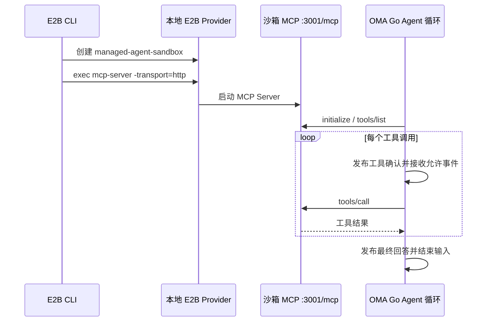

# 本地 E2B 沙箱 MCP demo

OMA 的 Go Agent 循环运行在宿主机。qoder MCP Server 运行在 E2B 沙箱中。文件和命令工具通过 HTTP MCP 执行。



## 镜像构建

以下命令只更新本地 Docker 镜像。`SANDBOX_IMAGE` 由本机设置，私有 registry 地址不写入仓库配置。构建前保存旧镜像，避免新镜像再次成为自身的基础镜像。

```sh
export MCP_SOURCE=/absolute/path/to/qoder-mcp-server
export SANDBOX_IMAGE=your-local-sandbox-image:latest
make -C "$MCP_SOURCE" build-linux-arm64
docker tag "$SANDBOX_IMAGE" oma-managed-agent-sandbox:mcp-base
mkdir -p tmp/mcp-demo-image
cp "$MCP_SOURCE/dist/mcp-server-linux-arm64" tmp/mcp-demo-image/mcp-server
cp deploy/sandbox-mcp/Dockerfile tmp/mcp-demo-image/Dockerfile
docker build --platform linux/arm64 \
  --build-arg BASE_IMAGE=oma-managed-agent-sandbox:mcp-base \
  -t "$SANDBOX_IMAGE" tmp/mcp-demo-image
```

镜像增加 `/usr/local/bin/mcp-server`，并声明端口 3001。原镜像的入口保持不变，由 E2B CLI 启动 MCP 进程。

## 创建沙箱并启动 MCP

本地 E2B Provider 的模板必须指向刚构建的镜像。CLI 使用实际 Provider API，不能设置 `E2B_DEBUG=true`；该 CLI 的 debug 模式返回虚拟沙箱 ID。

```sh
export E2B_API_URL=http://127.0.0.1:3099
export E2B_API_KEY=local
export E2B_DEBUG=false
e2b sandbox create managed-agent-sandbox --detach
```

记录返回的 `SANDBOX_ID`。本地 Docker Provider 为每个沙箱分配宿主机端口。检查这个沙箱的端口映射：

```sh
docker port "e2b-envd-$SANDBOX_ID"
```

将 49983 的宿主机映射地址设为 `E2B_SANDBOX_URL`。将 3001 的宿主机映射地址加上 `/mcp` 设为 `OMA_DEMO_MCP_URL`。不要把某次沙箱的随机宿主机端口当成固定配置。宿主机 OMA 使用 `127.0.0.1`；其他容器或云服务需要使用从自身网络可访问的地址。

```sh
export E2B_SANDBOX_URL=http://127.0.0.1:ENVD_HOST_PORT
export OMA_DEMO_MCP_URL=http://127.0.0.1:MCP_HOST_PORT/mcp
e2b sandbox exec "$SANDBOX_ID" \
  'mkdir -p /tmp/oma-mcp-demo && /usr/local/bin/mcp-server -transport=http -workdir=/tmp/oma-mcp-demo' \
  --background
```

qoder MCP Server 的默认监听地址是 `:3001`，路径是 `/mcp`。不要将其误配为旧 Runner 合同的默认端口 8090。

## Agent 配置

Agent 的 `metadata.agent_runtime_mode` 设置为 `host`。`mcp_servers` 增加 `{ "name": "sandbox", "type": "url", "url": "实际 MCP URL" }`，对应 `mcp_toolset` 的 `mcp_server_name` 设置为 `sandbox`。system prompt 写明地址、工作目录和任务；工具连接由 `mcp_servers` 配置建立。

qoder 的 12 个名称对应六类工具。OMA 的内置沙箱工具名称为 `Write`、`Edit`、`Grep`、`Glob`、`Bash` 和 `Read`。schema 直接取自 MCP `tools/list`。文件工具使用 `file_path`，修改工具使用 `old_string` / `new_string`。demo 使用绝对路径。

上述固定 MCP 地址用于独立连接 demo。Runner 自动启动 host Session 时，基础沙箱工具由 Provider 自动发现，不需要加入 Agent 的 `mcp_servers`。这些字段只配置需由网关代理的外部 MCP 服务；不要把基础服务重复配置为转发目标。

## 公开 Session 的 host 循环

采用 [双运行模式设计](dual-agent-runtime.md) 中的 `sandbox_mcp_command` 示例，以 3001 端口启动 qoder。Agent 使用以下配置；模型必须在所属 workspace 的 Provider 中配置：

本地 E2B 随机端口解析采用以下部署配置。云端 E2B 保留默认的 `local_port_lookup: false`。

```yaml
e2b:
  api_url: http://127.0.0.1:3099
  api_key: local
  debug: false
  local_port_lookup: true
  local_service_host: 127.0.0.1
```

Runner 自动查询刚分配的沙箱端口，不需要在 Agent 中写入随机端口。Agent 定义为：

```json
{
  "name": "Go host Agent",
  "model": {"id": "deepseek-v4-flash"},
  "metadata": {"agent_runtime_mode": "host"},
  "tools": [{
    "type": "agent_toolset_20260401",
    "default_config": {
      "enabled": true,
      "permission_policy": {"type": "always_ask"}
    }
  }]
}
```

通过 `POST /v1/agents?beta=true` 保存 Agent，再用 `POST /v1/sessions?beta=true` 提交 `{"agent":"agent_...","environment_id":"env_..."}`。向 `/v1/sessions/sesn_.../events?beta=true` 提交 `user.message`。Runner 分配沙箱、启动 MCP、注册真实 HostWorker 后，Go Crush/Fantasy 读取输入、调用模型、等待工具确认、执行 MCP 并继续请求模型。用户确认沿用 `user.tool_confirmation`。历史和 SSE 沿用现有 Session 接口。

`just verify-be chat doctor host` 和 `just verify-be chat host` 使用隔离依赖验证这条公开 API 路径。它运行真实 HostWorker、Crush/Fantasy、沙箱 MCP 和 FUSE，检查拒绝/允许 Write、多轮私有历史、SSE 与最终事件一致性，以及沙箱没有 Bun/Claude Agent 进程。上游模型响应固定；Runner 和 Go host Service 位于测试进程，HTTP/模型代理由独立后端提供。它不代表真实模型与云端 E2B 的整链路验收。镜像可通过本地 CLI `--worker-image` 选择。

## 实际沙箱验收

```sh
OMA_DEMO_MCP_URL="$OMA_DEMO_MCP_URL" \
  go test -race ./internal/agentruntime -run '^TestLiveSandboxMCPDemo$' -count=1 -v
```

该测试使用真实 HTTP MCP 和真实 E2B 沙箱，执行缺失文件失败、写入、修改、搜索、列举、命令和读取。它使用生产 Go Agent 循环，验证六次工具确认、六次工具结果、输入结束和最终回答。模型响应固定，Worker 是进程内测试实现。它不验证真实模型、数据库持久化、公开 Session Runner 或 environment-manager。缺少地址时测试 skip，不能报告为沙箱验收通过。

真实模型验收使用 `TestLiveModelSandboxMCPDemo`。从本机安全配置注入 `OMA_DEMO_MODEL_BASE_URL`、`OMA_DEMO_MODEL_ID` 和 `OMA_DEMO_MODEL_API_KEY`，再执行以下命令；不要将密钥写入命令行、日志或仓库文件：

```sh
go test -race ./internal/agentruntime -run '^TestLiveModelSandboxMCPDemo$' -count=1 -v
```

该测试要求真实模型调用全部六类工具，并通过独立的 MCP 读取验证最终文件内容，再检查最终回答包含 `DEMO_OK`。Worker 仍为进程内实现，因此不代表公开 Session 或数据库验收。环境变量缺失时 skip，不能算通过。

本地 MCP Server 当前没有校验 Bearer token。当前 demo 的工具请求限于专用沙箱。生产接入需由 environment-manager 实现鉴权和服务访问边界，再执行真实模型、公开 Session 和恢复验证。

停止 demo 时仅停止本次沙箱：

```sh
e2b sandbox kill "$SANDBOX_ID"
```

沙箱到期或停止后，保存的 Agent 地址失效。新沙箱需要更新 Agent 中的 MCP 地址。
