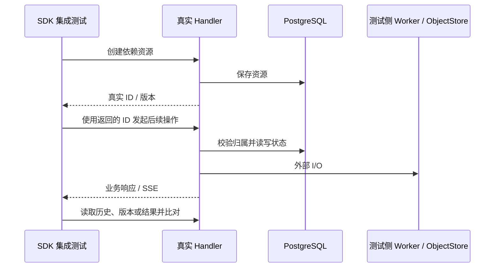

# SDK 契约测试与真实资源生命周期

生产 API 对所有普通 API Key 使用相同的校验、租户鉴权、持久化和状态转换路径。删除 SDK fixture 特例后，Session、Agent、Environment、File、Skill 和 Batch 不再根据某个 Key 身份或固定资源 ID 返回模拟成功。

## 配置与兼容性迁移

- 删除 `sdk_fixtures` 配置节及其 Go 配置类型。旧 YAML 必须移除该节；严格配置解析会拒绝未知字段。
- 默认 Bootstrap 只初始化正常开发 Key。SDK 测试 Key 不再自动创建；已有数据库中的 Key 不会被自动删除，但不再具有任何特殊行为，可通过正常 Key 管理流程撤销。
- 普通认证、显式 `bootstrap.seed_api_keys` 和资源初始化保持支持。测试应在隔离数据库中显式创建所需身份。
- 不存在的固定资源现在返回正常的 not-found 错误；非法上传、分页游标、Agent 引用或 Batch 参数执行真实校验。客户端必须保存创建响应中的 ID 和版本，不能依赖常量 ID。
- `scripts/ant-batches fixture` 和 `ANT_FIXTURE_API_KEY` 已移除；使用 `scripts/ant-batches run` 配合普通 `ANT_API_KEY`，走创建、轮询、结果读取流程。

## 仓库测试

Agent 更新/归档和 Environment 读取测试先通过 API 创建真实资源。Skill multipart 生命周期上传有效 `SKILL.md`，创建两个真实版本，再验证列表、读取、下载与删除。Batch 原先验证“非法参数也模拟成功”的测试改为断言拒绝流式请求；现有 Batch worker 集成测试继续验证实际作业、结果存储和终态。

`tests/sdk_fixture_removal_test.go` 在独立 schema 中显式注册旧 SDK 身份，验证六类固定 ID 都不能读取不存在的资源，向不存在的 Session 发送事件也不会成功。真实 Session 消息测试比较发送响应与持久化历史，并核对 SSE 的相同字段及 primary thread 归属。`TestCodeSessionWorkerDeliveryControlsJetStreamAcknowledgement` 补充重复 processed ACK 必须被忽略的断言；`TestCodeSessionWorkerEventsStreamReceivesQueuedAndLiveUserEvents` 覆盖启动前排队与连接后投递。

仅用于生成假响应的 Session fixture 测试已删除；File Resource 的字段、时间戳及不泄漏 `source` 断言转由真实 `responseFromResource` 测试承担。对象存储和 Worker broker 的替身保留在测试侧。

## 外部官方 SDK 核对

2026-09-23 核对本机 `anthropic-sdk-all` 下 Go、TypeScript、Python 三个官方 SDK checkout（Go `def8bad`、Python `992f11c`、TypeScript `9a0442d`）：

| 测试                                                                 | 已确认依赖                                                      | 迁移方式                                                                                              |
| -------------------------------------------------------------------- | --------------------------------------------------------------- | ----------------------------------------------------------------------------------------------------- |
| Go `betafile_test.go`、`betaagent_test.go` 等生成测试                | `my-anthropic-api-key`、`file_id`、固定 Agent ID，默认端口 4010 | 使用 SDK CONTRIBUTING 指定的测试 mock server；只验证序列化及响应格式                                  |
| TypeScript `tests/api-resources/beta/files.test.ts` 等               | 同一固定 Key/ID，默认端口 4010                                  | 保持 SDK 测试侧 mock；不得直接作为本服务业务 E2E                                                      |
| Python `tests/api_resources/beta/test_files.py`、`tests/conftest.py` | 固定 `file_id`，部分下载测试使用 `respx_mock`                   | 保持 SDK 测试侧 mock；真实生命周期另用普通 Key 创建资源                                               |
| 本仓库 `TestGoSDKFilesE2E`、`tests/e2e/python/files_e2e.py`          | 普通开发 Key，先上传再读取/删除                                 | 无需固定 ID；Go 默认启动真实 Handler/DB 并在测试侧替换对象存储，设置 URL 时和 Python 一样访问外部服务 |

三套 SDK 的 CONTRIBUTING 都明确要求为多数生成测试启动 spec mock server。删除生产 fixture 后，把这些原版生成测试的 `TEST_API_BASE_URL` 指向本服务不再是有效验收方式：默认 Key 会认证失败，显式注册该 Key 后仍会因资源不存在或参数无效而失败。没有修改外部 SDK 仓库，也没有新增生产 mock 开关。

## 与 Session 接纳规则的依赖

Issue #386 提到的“空闲立即接纳、繁忙排队”来自 PR #379；截至本次核对该 PR 仍为 OPEN，当前基线尚未包含该状态机修改。本次删除旁路并验证当前真实消息链路，不引入另一套状态机实现。#379 合并后仍需在真实资源测试中验收立即接纳、繁忙排队、SSE/历史一致性及重复 ACK 的组合行为；不能把当前投递队列测试视为该接纳规则已经通过。

## 本次验证记录

- 通过：Agent、Environment、Session API 集成测试，迁移后的 Skill/Batch 生命周期，旧 SDK 身份回归，Go SDK Files，Worker 排队/实时 SSE 和重复 ACK；全部使用真实 Handler 与 PostgreSQL，外部对象存储和 broker 在测试侧替换。
- 通过：默认 seed key、拒绝旧配置节等配置测试，文档格式、重复代码、Go/TypeScript 复杂度和大文件门禁。
- 通过：在独立 Go 缓存下重跑 `just hooks-run`，完整 hooks 通过，包括 lint、死代码、格式、重复代码、复杂度、命名和大文件检查。
- 全量 `just test` 未通过：现有 `config/config.example.yaml` 的工作区改动与最小配置字段断言不一致；NATS 测试报告 insufficient storage；默认 MinIO 端口 9000 不可连接。全量测试随后在 `TestTranscriptArchiveLargeBatchTransactions` 的数据库调用中长时间阻塞，该轮被停止，不能视为完成全量验收。
- 初次验证中共享 Go 缓存出现标准库和依赖文件读取错误；使用独立 `GOCACHE` 后，相关集成测试与配置测试通过。Go SDK Files 默认测试的对象存储已移到测试侧，因此其最终验证不再依赖本地 MinIO。
- 未运行外部 Python 服务 E2E，也未把三套官方生成 mock 测试改指向生产 Handler。#379 的接纳状态机验收仍待该变更合并后执行。
