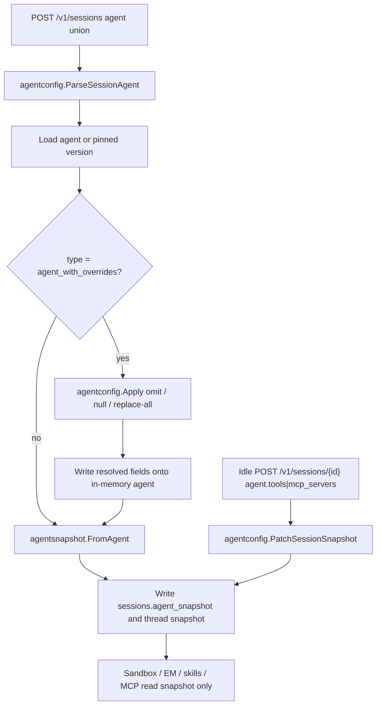

# Session Agent Overrides

Session 创建接受与 Claude Managed Agents 相同的 `agent` 三元联合：智能体 ID 字符串、
固定版本对象（`type: "agent"`），以及覆盖对象（`type: "agent_with_overrides"`）。
覆盖在写入时解析进现有的 `sessions.agent_snapshot` / `session_threads.agent_snapshot`，
不新增表，也不给 Session 增加 overrides 列。运行时继续只读 snapshot。

公开 API 说明已在 `docs/en/sessions.mdx` 与 `docs/zh/sessions.mdx` 中描述。本文记录
OMA 的实现边界。

## 目标

- 单次 Session 可以覆盖 Agent 的 `model`、`system`、`tools`、`mcp_servers`、`skills`，
  而不创建新的 Agent 版本。
- 覆盖是整字段替换，不是 merge。省略继承，`null` / `[]` 清空，有值则整份替换。
- `model` 不可清空。改了 `tools` 或 `skills` 且有效 `skills` 非空时，必须有 enabled 的 `read`。覆盖 `mcp_servers` 后，有效
  `tools` 里的 `mcp_toolset` 必须仍能引用服务器。
- 覆盖只影响当前 Session。Agent 资源本身不变。响应里的 `agent.id` / `agent.version`
  仍指向被覆盖的那一版 Agent。
- Deployment 仍只接受 `type: "agent"`。

## 不变量

Session 的有效配置就是 snapshot。创建时解析一次并冻结；之后 Environment Manager、
skills mount、permission policy 与 MCP proxy 都只读 snapshot，不再回读 Agent 行。

Idle Session 只能再替换 `tools` 与 `mcp_servers`。`model`、`system`、`skills` 以及
Agent 身份字段在创建后冻结。

## 校验归属

Agent 与 Session 共用 `internal/agentconfig`：

- `NormalizeModel` / `NormalizeMCPServers` / `NormalizeSkills` / `NormalizeTools`
  继续承担 Agents 创建与更新的同一套字段校验。
- `ParseSessionAgent` 解析 Session 的三元 union，并拒绝在 `type: "agent"` 上夹带覆盖字段。
- `Apply` 按三态规则把覆盖应用到一份 Config。只校验被改过的字段，以及这些改动引发的耦合：
  - 改了 `mcp_servers` 时，有效 `tools` 里的 `mcp_toolset` 必须仍能引用服务器。
  - 改了 `tools` 或 `skills`，且有效 `skills` 非空时，按 CMA 要求必须有 enabled 的 `read`：存在 `agent_toolset_20260401`。没写 `read`，或写了 `read` 但省略 `enabled`，都跟随 `default_config.enabled`（默认 true）。显式 `read.enabled: false`，或把 default 关掉又没把 `read` 打开，则拒绝。
- 没改 `model` 时不拉工作区模型目录，也不因模型目录不可用而失败。
- `PatchSessionSnapshot` 只接受 `tools` / `mcp_servers`，再走同一套 `Apply`。

未改的 `tools`/`skills` 不重新拒绝 Agent 创建时就已经合法的组合（例如 skills 非空且 tools 为空）。

Session 覆盖 `model` 时会核对当前 workspace 已配置的模型 ID。未传 `speed` 时默认
`standard`，对应 CMA 文档中 “model override 不继承 effort、回落到模型默认” 的语义。
OMA 没有 `effort` 或 `inference_geo` 字段。

## 数据模型

不新增表或列。继续使用：

- `sessions.agent_uuid` / `agent_external_id` / `agent_version`：被覆盖的 Agent 身份
- `sessions.agent_snapshot`：解析后的有效配置
- `session_threads.agent_snapshot`：创建时与 Session 写入同一份 snapshot

覆盖不会改 Agent 行，也不会写入 Session metadata。

## 兼容说明

- 既有字符串 Agent ID 与 `{"type":"agent","id":"...","version":N}` 行为不变。
- 在 `type: "agent"` 上携带 `model` / `system` / `tools` / `mcp_servers` / `skills`
  返回 400。
- Deployment `resolveAgent` 继续要求 `type: "agent"`，拒绝 `agent_with_overrides`。
- Idle 更新仍只写 `sessions.agent_snapshot`。Primary Thread 的 `agent` 在列出和读取时返回这份 Session Agent；子线程继续读自己的 `agent_snapshot`。

## 测试计划

- `internal/agentconfig`：union 解析失败/成功、Apply 拒绝非法覆盖、未改字段不重验 inherited 组合与模型目录、read 按 CMA 默认开启语义、整字段替换、
  idle patch 拒绝身份字段与 model/system/skills、idle 只改 mcp_servers 时不重验 read、WriteAgent 保留身份。
- `tests/session_agent_overrides_test.go`：创建失败场景先于成功场景；成功路径验证
  snapshot 写入、thread 在创建时拷贝同一份、被覆盖的那一版 Agent 未被修改；idle 更新只允许 tools/mcp_servers，且 Primary Thread 的读取结果跟着 Session Agent 走。
