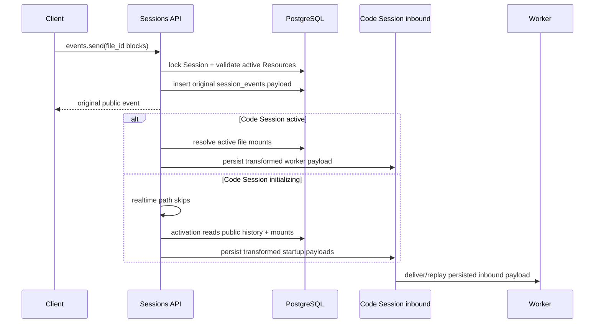

# Session 事件文件引用

## 数据边界

`POST /v1/sessions/{session_id}/events` 与 Session 创建时的 `initial_events`
支持在 `user.message.content` 中引用 Files API 文件：

```json
{
  "type": "document",
  "source": {
    "type": "file",
    "file_id": "file_abc123"
  }
}
```

`image` 使用相同结构。最终数据边界固定为：

```text
session_events.payload
  = 用户可见的原始消息和 file_id

code_session_inbound_events.payload
  = worker 专用消息，包含 @"/mnt/session/uploads/..."
```

Session Event 不保存绝对挂载路径，不增加第二份 payload 字段或数据库 migration。事件列表、SSE、
Webhook、前端展示与审计始终读取公开 `session_events.payload`；Code Session inbound 是唯一保存
worker 转换结果的持久化边界。

## 写入校验

文件必须先通过 Session 创建请求的 `resources` 或 `sessions.resources.add` 挂载到当前
Session。Events API 不隐式创建 Resource、不读取对象内容，也不接受客户端提交的本地绝对路径。

Send Events 在事务中锁定 Session 行并按当前 workspace/session 查询活动 File Resource，然后：

1. 从公开事件中提取 `document/image + source.type=file` 的 `file_id`；
2. 要求每个 `file_id` 都有活动 Session Resource；
3. 校验 `image` 的 MIME 为 `image/jpeg`、`image/png`、`image/gif` 或 `image/webp`；
4. 同一文件重复引用只影响一次 worker 路径注入；
5. 任一引用无效时回滚整批事件及 outcome evaluation 更新；
6. 校验通过后只把原始公开 payload 写入 `session_events`。

资源查询按 `created_at ASC, uuid ASC` 稳定排序；同一个 Files API 对象多次挂载时，worker 转换
选择最早的活动绑定。跨 workspace、跨 Session、已删除或尚未挂载的文件都表现为当前 Session
中无绑定，并返回明确的 400，提示先调用 Session Resources API。

Session 创建请求先规范化本次 `resources`，再用同一规则校验 `initial_events`，最后在一个事务
内写入 Session、Resource、公开初始事件和 Environment Work。初始事件支持 `user.message`、
`user.define_outcome`，以及符合既有顺序约束的末尾 `system.message`。

## Worker 转换

公开事件提交后存在两个 Code Session 转换入口：

- Session 已 active：`QueuePublicSessionEvents` 查询当前活动 File Resource，再生成 realtime inbound；
- Session 尚在启动：activation 持有 Session 行锁，读取完整公开历史和活动 File Resource，按顺序
  生成 inbound 后再把 Code Session 切为 active。

两个入口都把绑定结果传给 `workerPayloadForPublicEvent`。该函数保留原始文本和非 file-source
content block，移除公开的 file-source block，并在消息末尾增加去重后的 Claude Code 原生引用：

```text
用户原始文本

@"/mnt/session/uploads/reference document.pdf"
@"/mnt/session/uploads/chart.png"
```

Filestore `/uploads/...` 通过统一路径合同映射到 Sandbox `/mnt/session/uploads/...`。空格由双引号
保护，反斜杠与双引号按 Claude Code quoted `@` mention 形式转义；路径控制字符仍由 Resource
写入边界拒绝。



## 重试、重连与展示保护

转换后的 worker payload 继续写入既有 Code Session inbound event。投递重试、断线恢复、ACK 与
幂等重放直接使用这条已转换记录，不会重新读取或改写 Session Event，也不会把绝对路径投影回
公开 API。

Session 标题只由 Session 创建或更新接口的 `title` 控制。worker 消息转换不调用标题生成逻辑，
也不修改 Session metadata、公开事件或前端展示内容。

运行中新增文件的顺序固定为：

```text
Files API 上传
→ Session Resources API 挂载
→ events.send(file_id)
→ 服务端解析当前挂载路径
→ Code Session inbound 持久化 @"绝对路径"
```

Resource 成功新增后，现有 Sandbox 最迟在固定 `1s` metadata cache 刷新后看到目录变化；Events
API 不为缓存刷新增加人为延迟。

## 验收

- 普通文本消息的 public/worker 转换保持原行为；
- 单文件、多文件、重复文件、空格、反斜杠和双引号路径正确转换；
- 未挂载、跨租户、已删除、MIME 不匹配与客户端本地路径均被拒绝；
- 对话中 `resources.add` 后发送的文件进入 realtime inbound；
- activation 前的文件事件从公开历史转换并按顺序进入 inbound；
- worker 重连和重试重放既有 inbound，不重复转换；
- API、事件列表、SSE、Webhook、标题与前端展示不出现 `/mnt/session/uploads`。

真实本地服务可使用仓库脚本执行同一链路。脚本会打印可复制的 curl、HTTP 响应头与响应体、
Session SSE、断言结果，以及可选的服务日志：

```bash
CONFIG_FILE=/path/to/config.yaml go run . 2>&1 | tee /tmp/oma-server.log

SERVER_LOG_FILE=/tmp/oma-server.log \
  scripts/test-session-file-events-local.sh
```

默认会等待 worker 回答中出现测试文件内的唯一 marker，以证明文件已挂载并被读取。仅验证 API、
SSE 和公开数据边界时，可设置 `WAIT_FOR_AGENT_SECONDS=0`。请求、响应和 SSE 原始文件保存在脚本
输出的 `ARTIFACT_DIR` 中；默认在结束时清理本次创建的 Session、File、Environment 和 Agent。
