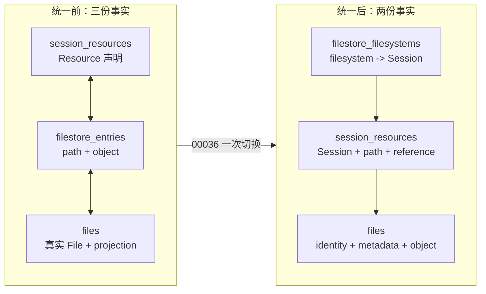
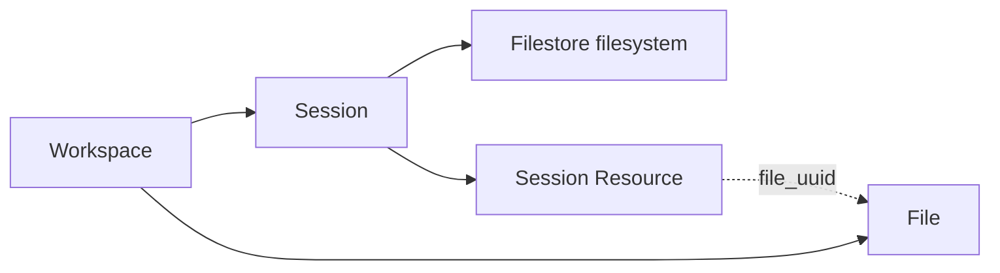
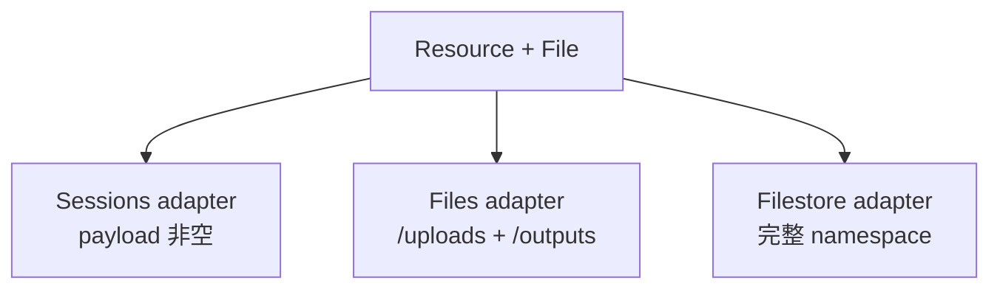
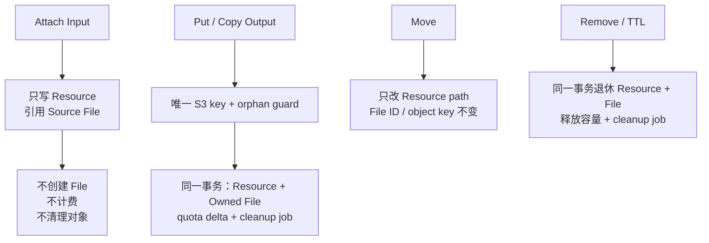
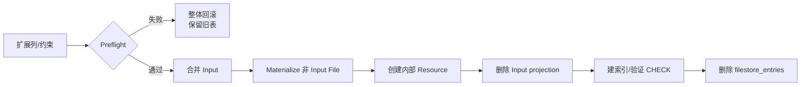

# Session Resource 与 File 统一持久化评审指南

> [Issue #184](https://github.com/superduck-ai/open-managed-agents/issues/184) ·
> [最终决策](https://github.com/superduck-ai/open-managed-agents/issues/184#issuecomment-5104439379) ·
> [PR #190](https://github.com/superduck-ai/open-managed-agents/pull/190) ·
> [Filestore 总体设计](./filestore.md)

本文只提供评审地图、设计裁决和风险索引；实现细节由代码与测试回答。

## 建议评审顺序

| 顺序 | 代码                                                                                                                                                        | 只回答一个问题                                   |
| ---: | ----------------------------------------------------------------------------------------------------------------------------------------------------------- | ------------------------------------------------ |
|    1 | [`migration 00036`](../../../internal/db/migrations/00036_unify_session_resources_and_files.sql)                                                            | 历史数据能否无歧义切换且不丢 identity？          |
|    2 | [`filestore_scan.go`](../../../internal/db/filestore_scan.go)                                                                                               | Resource + File 是否是唯一 namespace 读模型？    |
|    3 | [`files_sqlx.go`](../../../internal/db/files_sqlx.go)                                                                                                       | Input/Output Catalog identity 与可见性是否正确？ |
|    4 | [`session_file_mounts_sqlx.go`](../../../internal/db/session_file_mounts_sqlx.go)                                                                           | Input 是否只借用 Source File？                   |
|    5 | [`session_namespace_helpers.go`](../../../internal/db/session_namespace_helpers.go) / [`mutations.go`](../../../internal/db/session_namespace_mutations.go) | Resource、Owned File、账本与 job 是否原子？      |
|    6 | [`filestore_cleanup.go`](../../../internal/db/filestore_cleanup.go) / [`workspace_storage.go`](../../../internal/db/workspace_storage.go)                   | 对象和容量是否只释放一次？                       |
|    7 | [测试证据](#风险与测试证据)                                                                                                                                 | 关键失败场景是否被覆盖？                         |

## 变化概览

| 事实                                                    | 唯一所有者                                         |
| ------------------------------------------------------- | -------------------------------------------------- |
| Session 归属、Attach identity、namespace path、资源引用 | `session_resources`                                |
| File identity、metadata、S3 定位、计费、对象清理责任    | `files`                                            |
| Filestore identity 与 public Session 的绑定             | `filestore_filesystems`                            |
| 用量                                                    | `workspace_storage_usage` 事务账本；不是文件事实源 |

## 最终裁决

| 议题                 | 最终选择                                             | 有意放弃                                |
| -------------------- | ---------------------------------------------------- | --------------------------------------- |
| Input `file_id`      | 请求/响应复用 Source `file_`                         | 新 session-scoped File/Alias            |
| Attach identity      | 每次 Attach 独立 `sesrsc_`                           | 用 `file_` 区分 Attach                  |
| Namespace membership | `path is not null`                                   | `attached`、`filesystem_uuid` 列        |
| 公开 Resource        | `payload is not null`                                | 单独 public/role 列                     |
| Catalog role         | 活动 Resource 位于 `/uploads` 或 `/outputs`          | `cataloged`、`namespace_role` 列        |
| Source 删除          | 有活动 Resource 引用时拒绝                           | Source identity 删除后由 Attach 保活    |
| FUSE readiness       | 保留现有 filesystem/mount 合同                       | 逐文件 copy/preparation 状态机          |
| 发布                 | migration 一次切换                                   | 双写、双读、view、trigger、feature flag |
| 旧 identity          | 保留 Source `file_`、Input `sesrsc_`、Output `file_` | `fse_` 与 Input projection alias        |

> 兼容性取舍：Input attach 不返回 Anthropic 当前行为中的新 session-scoped `file_id`；
> 本项目用 `sesrsc_` 表达 Attach identity。

## 数据模型

> 下图是应用维护的逻辑引用；数据库不创建 FK。

| Resource        | `payload` | `path`         | 引用                  | identity/metadata 所有者 | 容量/cleanup                       |
| --------------- | --------- | -------------- | --------------------- | ------------------------ | ---------------------------------- |
| Attached Input  | 非 NULL   | `/uploads/...` | Source `file_uuid`    | Source File              | 不重复计费、不清理 Source          |
| Owned Output    | NULL      | `/outputs/...` | Owned `file_uuid`     | Owned File               | `filestore_bytes` + object cleanup |
| 其他 Owned File | NULL      | 其他 namespace | Owned `file_uuid`     | Owned File               | `filestore_bytes` + object cleanup |
| Directory       | NULL      | 非根 path      | 无                    | Resource                 | 无                                 |
| Skill Archive   | NULL      | `/skills/...`  | Snapshot `file_uuid`  | Snapshot File            | 不计费、不清理 catalog object      |
| 根 `/`          | —         | 虚拟           | filesystem            | filesystem               | 无持久化节点                       |

### 必须保持的不变量

|   # | 不变量                                                 | 保护方式                         |
| --: | ------------------------------------------------------ | -------------------------------- |
|   1 | 活动 `(workspace_id, session_id, path)` 唯一           | 部分唯一索引                     |
|   2 | `path` / `parent_path` 同空同有                        | CHECK                            |
|   3 | File、Directory、Skill Archive 引用形状互斥            | CHECK                            |
|   4 | 内部 Resource（`payload=NULL`）不能有 `secret_payload` | CHECK                            |
|   5 | Input 不拥有对象；Owned File 才返回 `OwnedBytes()`     | DTO 映射 + mutation guard        |
|   6 | Source 有活动引用时不能删除                            | workspace lock + reference query |
|   7 | 所有跨表查询显式携带 tenant scope                      | 命名 SQL + 集成测试              |
|   8 | 过期立即不可见，容量在 sweep 提交后释放                | 查询 predicate + TTL transaction |
|   9 | Skill 快照读取不依赖 Catalog Version                   | Resource → Snapshot File         |
|  10 | Skill File 不进入 Files Catalog 或 Owned File 清理     | Resource type + 固定根策略       |

## 三个 adapter，共用一份事实

| Adapter                 | 可见集合           | 返回 identity                                | 关键过滤                                |
| ----------------------- | ------------------ | -------------------------------------------- | --------------------------------------- |
| Sessions Resource       | 公开 Resource      | `sesrsc_`；Input payload 保留 Source `file_` | `payload is not null`                   |
| scoped Files `/uploads` | Input Catalog      | Source `file_`                               | 公开、活动、未过期、按 `file_uuid` 去重 |
| scoped Files `/outputs` | Output Catalog     | Owned `file_`                                | 内部、活动、未过期、路径位于 `/outputs` |
| Filestore               | 根下完整 namespace | node `sesrsc_`                               | filesystem → Session → path             |

| Catalog 行为                               | 结果                                                                |
| ------------------------------------------ | ------------------------------------------------------------------- |
| 同一 Source 多次 Attach                    | Resource API 返回多个 `sesrsc_`；Files Catalog 返回一个 Source File |
| 删除最新 Attach                            | 仍有 Attach 时继续可见，以剩余最新 Resource 排序                    |
| Output move 出 `/outputs`                  | 立即退出 Catalog，File ID 不变                                      |
| Output move 回 `/outputs`                  | 恢复同一个 `file_`                                                  |
| `/transcripts`、`/tool_results`、`/skills` | 不进入 Files Catalog                                                |

## 写入与生命周期

| 操作              | 事务内必须一起发生                               | 失败保护                                |
| ----------------- | ------------------------------------------------ | --------------------------------------- |
| Input attach      | Session 容量、目录、Resource path、Source 引用   | Session/workspace/filesystem/File locks |
| Input delete      | 精确退休一个 Resource                            | 不改 Source File/账本/object job        |
| Output put/copy   | Resource、File、quota、取消 orphan guard         | commit 未知时保留 guard                 |
| Overwrite         | 新 File 事实、旧对象 job、容量差值               | 全部回滚或全部提交                      |
| Move              | path/parent path                                 | File identity 与对象不动                |
| Remove/TTL        | Resource/File 软删、容量释放、对象 job           | `retireSessionResourceFileTx` 集中处理 |
| Session delete    | 退休公开 Resource/filesystem、创建父 cleanup job | worker 每批最多 100 个 Owned File       |
| Skill replacement | 全量替换 `skill_archive` Resource                | 不复制 catalog 对象 metadata            |

### 锁序

| 操作                  | 顺序                                                       |
| --------------------- | ---------------------------------------------------------- |
| Input attach          | Session → workspace → filesystem → Source File `FOR SHARE` |
| Input Resource delete | Session → workspace → filesystem                           |
| Files delete          | workspace → File `FOR UPDATE` → active reference check     |
| Namespace mutation    | workspace → filesystem                                     |
| TTL batch             | workspace ID 升序 → filesystem ID 升序                     |
| Session cleanup       | workspace → filesystem                                     |

## 配额与对象所有权

| 对象                   | `files_bytes` | `filestore_bytes` | 谁删除对象              |
| ---------------------- | ------------: | ----------------: | ----------------------- |
| 普通/Source File       |        计一次 |                 0 | Files cleanup           |
| 任意数量 Input Attach  |             0 |                 0 | 无                      |
| Owned File             |             0 |            计一次 | Filestore cleanup       |
| Skill Archive Resource |             0 |                 0 | 当前保留 catalog object |

| 特殊情况                | 策略                                                       |
| ----------------------- | ---------------------------------------------------------- |
| 正常 mutation           | 只更新一行事务账本，不实时聚合                             |
| Migration 00036         | 不改账本：物理对象和 ownership 未变化                      |
| cleanup 缺失 bucket/key | 退休逻辑节点、继续健康行、重算 workspace 账本、worker 告警 |
| commit 结果未知         | 不立即删对象，由延迟 orphan guard 裁决                     |

## Migration 00036

### Preflight

| 检查                                         | 失败结果                      |
| -------------------------------------------- | ----------------------------- |
| 活动 Entry 无法解析同租户 filesystem/Session | 显式异常，整次 migration 回滚 |
| Input 找不到原 Resource 或 Source File       | 显式异常，整次 migration 回滚 |
| Input 带 TTL                                 | 显式异常，整次 migration 回滚 |
| 重复活动 path                                | 唯一索引创建失败并回滚        |
| Resource shape 非法                          | CHECK validation 失败并回滚   |

### Identity 矩阵

| 旧数据                         | 统一后                                   | 保留/失效                              |
| ------------------------------ | ---------------------------------------- | -------------------------------------- |
| Source File                    | 原 File                                  | UUID、`file_` 保留                     |
| Input Resource                 | 原 Resource 接管 path/Source UUID        | `sesrsc_` 保留                         |
| Input projection File          | 删除                                     | 旧 projection `file_` 失效             |
| Output Entry + projection File | 补全原 File；新建内部 Resource           | Output UUID、`file_` 保留；`fse_` 失效 |
| 普通 File Entry                | Entry UUID 成为 File UUID；新建 Resource | 新 `file_`、`sesrsc_`；`fse_` 失效     |
| Directory/固定根               | Directory Resource                       | 新 `sesrsc_`；`fse_` 失效              |
| Skill Archive                  | Resource + 独立 ZIP File 快照            | 新 `sesrsc_`、新 `file_`               |
| 软删除 Entry 历史              | 不迁移                                   | 历史失效                               |
| 根 `/`                         | filesystem 虚拟节点                      | 无持久化 identity                      |

> `Down` 不可无损实现，仅 `select 1`；部署回退依赖数据库备份，不支持新旧二进制混跑。

## Migration 00037

`00037_snapshot_session_skills.sql` 先验证每条活动 Skill Archive 都能唯一解析到 custom 或
built-in catalog version，再为每条可解析 Resource 创建独立 `files` 行，把 ZIP 的大小、
SHA-256、bucket 与 key 固化为 File 快照，并回填通用 `file_uuid`；无法解析且已经退休的历史
只保留 Resource 身份与路径，不参与读取。回填完成后删除 `skill_version_uuid`。该迁移不可
无损回滚，因为 File 快照不能唯一反推原 catalog version。

## Reviewer checklist 与证据

| ✓   | 检查                                                    | 主要证据                                                                                             |
| --- | ------------------------------------------------------- | ---------------------------------------------------------------------------------------------------- |
| ☐   | Migration 分叉会回滚，identity 符合矩阵                 | [`migrations_postgres_test.go`](../../../internal/db/migrations_postgres_test.go)                    |
| ☐   | 运行时不再依赖 `filestore_entries`                      | `TestSessionNamespaceUsesResourcesAndFiles`                                                          |
| ☐   | Input 复用 Source `file_id`，多 Attach 按真实 File 去重 | `TestSessionFileResourceContract`                                                                    |
| ☐   | Source metadata/download policy 不被复制或改写          | `TestSessionInputResourcePreservesSourcePolicy`                                                      |
| ☐   | Source delete 与 Attach 并发不会留下悬空引用            | `TestSessionFileResourceProtectsSourceFile`、`TestSessionFileResourceBindSerializesWithSourceDelete` |
| ☐   | workspace 间不泄漏 Catalog                              | `TestSessionFileCatalogWorkspaceIsolation`                                                           |
| ☐   | Resource/File/quota/job 原子提交                        | `TestSessionOutputCatalogWriteIsAtomic`                                                              |
| ☐   | Input 不能被通用 Filestore mutation 修改                | `TestSessionInputResourceRejectsGenericFilestoreMutations`                                           |
| ☐   | Output ID、move/remove/TTL 生命周期稳定                 | `TestSessionOutputFileLifecycle`                                                                     |
| ☐   | Session cleanup 有界，毒数据不阻塞健康行                | `TestDeleteSessionQueuesBoundedFilesystemCleanup`                                                    |
| ☐   | 对象容量不重复计费或释放                                | `TestWorkspaceStorageUsageLedger`                                                                    |
| ☐   | Skill Resource 不误清理 catalog 对象                    | `TestFilestoreSkillArchivesUseResources`                                                             |
| ☐   | 历史 ownership 查询可使用匹配索引                       | `TestVisibleFileHistoryPredicateHasMatchingIndex`                                                    |
| ☐   | tenant scope 与 domain error 显式保持                   | [`session_namespace_review_test.go`](../../../internal/db/session_namespace_review_test.go)          |

## 非目标与已知代价

| 项目                                  | 状态                         |
| ------------------------------------- | ---------------------------- |
| rclone/FUSE、Token、五个 mount 重设计 | 非目标                       |
| 逐文件 Sandbox copy preparation       | 非目标                       |
| Output revision/history               | 非目标                       |
| Skill catalog reference-aware GC      | 非目标                       |
| `fse_` / Input projection alias       | 明确不保留                   |
| 软删除 Entry 历史                     | 明确不迁移                   |
| Catalog 跨页数据库快照                | 不保证；当前是实时键集分页   |
| 缺失对象位置后的物理删除              | 无法保证；退休逻辑状态并告警 |
