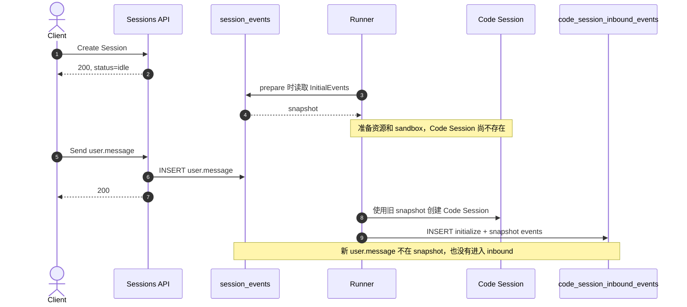
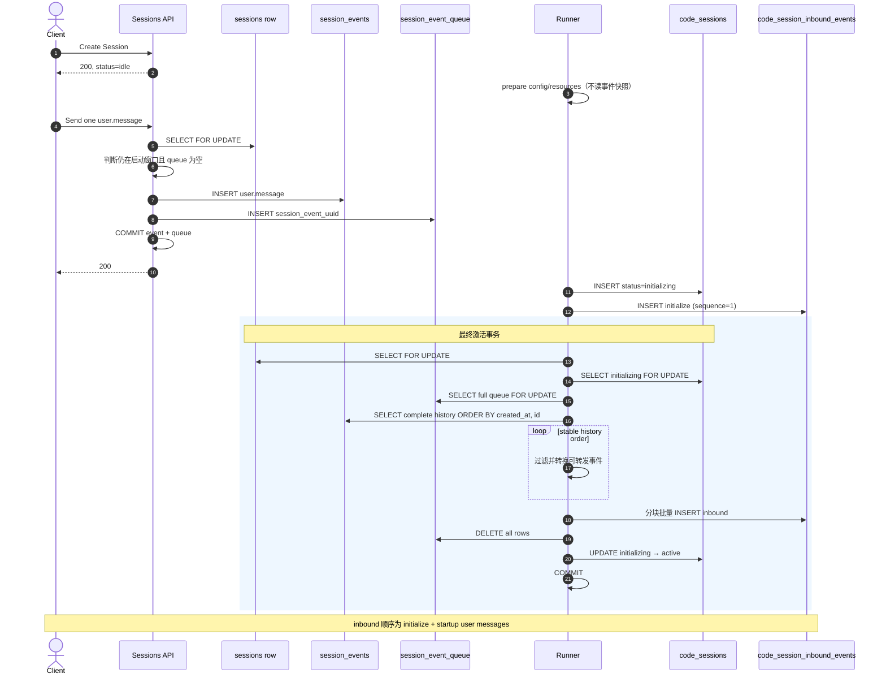
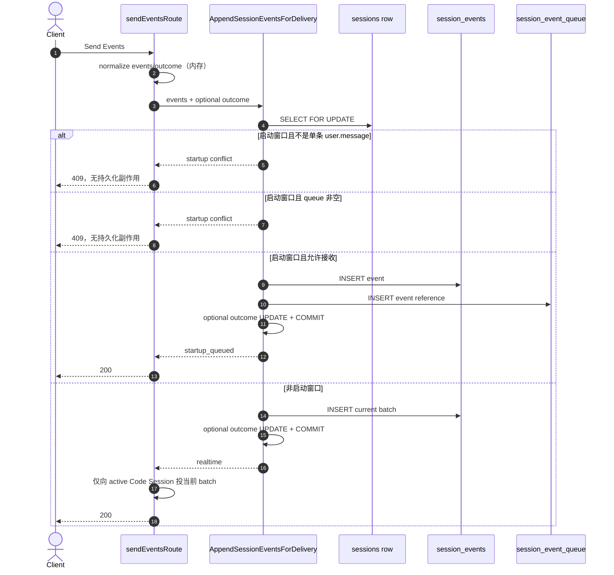

# Session 启动期消息可靠投递

## 一句话结论

Session 对外仍然立即返回 `idle`；在 Code Session 可用前收到的第一条
`user.message`，由 `session_events` 和 `session_event_queue` 在同一事务中接收，随后在
Code Session 激活事务中与 queue 清理一起原子写入 inbound，保证 API 返回成功的消息不会
丢失。

## 目标与边界

### 目标

修复 Issue #189：Runner prepare 之后、Code Session 创建或激活之前发送的消息，API 已经
返回 200，但消息没有进入 Code Session inbound。

必须保证：

1. 启动窗口内成功接收的第一条 `user.message` 最终进入对应 Code Session；
2. 普通 Send Events 在整个启动窗口内最多成功接收一条 `user.message`；
3. queue 交接完成以前 Code Session 不得变成 `active`；
4. queue 交接失败时不删除责任记录，也不留下部分 inbound；
5. active 后保持原有“只实时投递当前 batch”的行为。

### 不改变的行为

- 不增加 `starting` 等公开 Session 状态，客户端仍看到现有 `idle`；
- 不阻止客户端在 Session 创建后调用 Send Events；
- 不在 Send Events 路径扫描或重放历史；历史注入仅发生在 Code Session 激活；
- 不维护跨激活的 watermark / 通用 outbox；
- 不在 worker register 或 heartbeat 中补投；
- 不把 queue 扩展成永久投递历史；
- 不改变 active 路径的事件转换、tool confirmation 和 batch 范围。

## 修改前后差异

| 关注点 | 修改前 | 修改后 |
| --- | --- | --- |
| 启动期增量来源 | Runner prepare 时读取一次含历史的 `InitialEvents` 快照 | Send 启动窗写入 queue；激活时再合并历史 `session_events` |
| prepare 后到达的消息 | 不在旧快照中 | 与 `session_events` 同事务进入 queue |
| Code Session 创建 | 使用 prepare 阶段快照写 inbound | 锁定 Session 后读取完整 queue 与历史并原子激活 |
| 消息责任 | API 200 后没有跨启动流程的持久化责任 | queue row 持有到最终激活事务提交 |
| 激活条件 | 快照处理完成后继续启动 | 锁内读取 history、写 inbound、清空 queue、切 `active` 一次提交 |
| active 后发送 | 实时投递当前 batch | 保持不变 |

变化的核心不是“创建 Code Session 时扫描更多历史”，而是把投递责任前移到接收消息的事务：
只要启动期 Send Events 返回 200，数据库中就同时存在公开事件事实和一条尚未完成的交接
责任。

## 修改前：消息为什么会丢

Runner 在 prepare 阶段读取事件快照。prepare 后还要执行资源准备、依赖安装和 sandbox
启动，此时 Code Session 尚不存在。窗口内的新消息只能写入 `session_events`：它不在旧快照
中，也没有 inbound 目标。



## 修改后：端到端主流程



## 数据模型与职责

| 数据 | 事实含义 | 生命周期 |
| --- | --- | --- |
| `session_events` | Session API 已接受的公开事件 | 按现有 Session 事件生命周期保留 |
| `session_event_queue` | 事件尚未完成启动期 Code Session 交接 | Send 事务创建，激活事务删除 |
| `code_session_inbound_events` | 某个具体 Code Session 可以消费的输入 | 按现有 inbound 生命周期保留 |

`session_event_queue` 是临时责任表，不是 payload 副本。它只保存：

- queue 自身顺序 `id`；
- `organization_uuid`；
- `workspace_uuid`；
- `session_uuid`；
- `session_event_uuid`；
- 创建时间。

表中没有 payload、delivery status、重试次数或 delivered history。事件内容始终从
`session_events` 读取，避免形成第二份事件事实源。`session_event_uuid` 唯一，防止同一公开
事件重复获得两条 queue 责任。organization、workspace、Session 和 event 均使用稳定 UUID
引用，避免租户迁移、部分导入或跨库合并时 identity 重映射导致 queue row 失去归属。

queue 行按 `session_uuid` 归属当前 Session；读取 event 时按 `session_event_uuid`
定位 `session_events`。queue 引用的事件不存在或无法归属时，创建流程直接失败，不得写
inbound、删 queue 或激活 Code Session。写入时仍落 `organization_uuid` /
`workspace_uuid`，作为稳定租户字段，但不作为查询必要条件。

## 启动窗口判定

启动窗口是后端事务内的判断，不是新的公开状态。

`shouldQueueForStartup` 的规则是：

1. 查询该 Session 最新且未删除的 Code Session（按 `session_uuid`）；
2. 如果 Code Session 存在且状态不是 `initializing`，不进入 startup queue；
3. 如果 Code Session 不存在或仍为 `initializing`，检查对应 Environment Work；
4. work 必须落在当前 Session 的 `workspace_uuid` / `environment_uuid` 上，data 指向
   当前 Session，且状态为 `queued`、`starting` 或 `active`；
5. **不按 Environment 类型过滤**（例如不区分 `cloud` / `self_hosted`）。是否入队只取决于
   Code Session 是否尚未 active，以及是否仍有指向该 Session 的在途 environment work；
6. work 已停止或最新 Code Session 是其他状态时，保持既有事件行为。

这个判断必须在 Send 事务锁住 Session 行之后执行，不能在 API 层提前查询。发送和激活只有
使用同一条 Session 行作为串行化边界，才能关闭最后一次 queue 检查与 `active` 切换之间的
竞态。

## 普通 Send Events

### API 层：只做内存计算

`Handler.sendEventsRoute` 先调用 `normalizeInputEvent` 生成 `SessionEvent`。如果 batch 中有
`user.define_outcome`，只更新内存里的 `normalizedSession.OutcomeEvaluations`，不在
normalization 阶段写库。

随后一次性调用 `DB.AppendSessionEventsForDelivery`，传入：

- 标准化后的事件 batch；
- 可选的最终 outcome evaluations。

这样被 409 拒绝的 batch 不会提前修改 outcome。

### DB 层：同一事务接收事实与责任

`AppendSessionEventsForDelivery`：

1. `SELECT ... FOR UPDATE` 锁定 Session；
2. 拒绝 archived Session；
3. batch 包含 `user.message` 时判断启动窗口；
4. 启动窗口只允许 batch 恰好包含一条 `user.message`；
5. queue 已有任何 row 时返回 `ErrSessionStartupMessageConflict`；
6. 写入 `session_events`；
7. 启动窗口内再写入对应 queue row；
8. 有 outcome 变化时在同一事务更新；
9. commit 后返回 `startup_queued` 或 `realtime`。

Send 和最终激活路径的锁查询、窗口判断、queue 读写、历史读取、inbound 批量写入和状态更新，
按主表分别声明在 `SessionMapper`、`SessionThreadMapper`、`SessionEventMapper`、
`SessionEventQueueMapper`、`CodeSessionMapper`、`CodeSessionInboundEventMapper` 和
`EnvironmentWorkMapper` 的 MyBatis XML 中，并由 yourbatis 生成静态 Go builder 与 scanner。
单个 Mapper 不混合多个表的查询；跨表事务由 DB 组装层使用同一个事务 `Executor` 构造所需 Mapper。
DB 组装层从 sqlx 使用的同一个 `*sql.DB` 创建共享 `yourbatis.DB`，不会建立第二个连接池。
Send 和最终激活通过 `yourbatis.DB.Transaction` 开启事务，并用回调提供的事务 `Executor`
构造 Mapper；不再把 `sqlx.Tx` 包装成自定义 yourbatis Executor。Deployment 创建和 Session 删除
仍包含尚未迁移的 sqlx 事务链，其 queue 操作继续使用同一个 sqlx transaction，避免一次业务事务
跨两个句柄。仓库提交生成文件；yourbatis 版本由 `go.mod` 固定，需要重新生成时运行
`go generate ./internal/db`。



由于普通发送与激活都锁 Session：

- 两个并发启动消息会被串行化；
- 第一个看到空 queue 并返回 200；
- 第二个看到仍然保留的 queue row 并返回 409；
- queue row 一直保留到 Code Session `active` 的同一事务，因此整个启动窗口累计只能成功接收
  一条普通 `user.message`，不是“同一时刻只有一条 pending”。

## Code Session 创建与原子激活

`Service.CreateManagedAgentCodeSession` 的顺序为：

1. 创建状态为 `initializing` 的 Code Session；
2. 写入 sequence 1 的 `initialize` inbound；
3. 调用 `CommitManagedAgentCodeSessionActivation`，在最终激活事务内读取 queue 与完整
   `session_events`，按稳定顺序构造 inbound 并激活；
4. 激活成功后才继续签发并返回 runtime 启动信息；
5. 中途失败时，现有 defer cleanup 将未完成的 Code Session terminate。

### 一个事务完成读取、交接与激活

`Service.CommitManagedAgentCodeSessionActivation` 通过
`DB.WithManagedAgentActivationTx` 定义事务边界并固定执行以下顺序；DB 的事务对象只暴露
Session、queue 和 Code Session 各自的 SQL 操作，不编排跨资源业务流程：

```text
锁 Session
→ 锁 initializing Code Session
→ 读取并锁定完整 queue，校验均为 user.message 且属于当前 Session
→ 读取当前 Session 的完整公开历史（created_at asc, id asc）
→ 按该稳定顺序过滤、转换可转发 inbound
→ 批量检查幂等键、分配连续 sequence，并按固定大小分块 INSERT
→ 一次更新 Code Session 的 last inbound sequence
→ 删除当前 Session 的全部 queue rows
→ Code Session initializing → active
→ commit
```

queue 只承担首条启动 `user.message` 的临时投递责任；queue 中的消息已经属于公开历史，
不会再单独追加。激活先取得 Send Events 使用的同一条 Session 行锁，再读取 queue 与历史，
因此不需要事务外快照、UUID match 或重试循环。

`created_at` 保持既有历史时间语义；同一 batch 共用时间戳时，以仅限数据库内部排序的 identity
`id` 保持原始写入顺序。这样 Deployment initial messages、同 batch 消息以及
`user.message → user.interrupt` 都使用同一个稳定顺序来源。

inbound 插入复用现有 idempotency key。事务内先批量加载已存在的幂等键，只为新事件按
history 输入顺序分配连续 sequence；随后每 500 条执行一次批量 INSERT，并在全部写入成功后
只更新一次 Code Session 的 last inbound sequence。这样既保持历史与 Deployment initial
messages 的稳定顺序，也避免持有 Session 锁时逐事件执行查询、插入和 sequence 更新。

## 激活 cutover 的并发语义

发送与激活都先锁同一条 Session 行，只会出现两种提交顺序。

```mermaid
sequenceDiagram
    autonumber
    participant Send as Send transaction
    participant Activate as Activation transaction
    participant Session as sessions row
    participant Events as session_events
    participant Queue as session_event_queue
    participant CS as code_sessions
    participant Inbound as code_session_inbound_events

    alt Send 先获得 Session 锁
        Send->>Session: SELECT FOR UPDATE
        Activate->>Session: 等待
        Send->>Events: INSERT public event
        Send->>Queue: user.message 时 INSERT reference
        Send->>Send: COMMIT
        Activate->>Session: 获得锁
        Activate->>Queue: 读取并锁定当前完整 queue
        Activate->>Events: 读取包含已提交事件的完整历史
        Activate->>Inbound: 按稳定历史顺序交接
        Activate->>Queue: DELETE all
        Activate->>CS: UPDATE active + COMMIT
    else Activate 先获得 Session 锁
        Activate->>Session: SELECT FOR UPDATE
        Send->>Session: 等待
        Activate->>Queue: 读取并锁定完整 queue
        Activate->>Events: 读取当前完整历史
        Activate->>Inbound: INSERT all startup inputs
        Activate->>Queue: DELETE all
        Activate->>CS: UPDATE active + COMMIT
        Send->>Session: 获得锁并看到 active
        Send->>Inbound: realtime current batch
    end
```

因此不存在可观察的“queue 已被删除，但 Code Session 仍是 `initializing`”窗口：删除 queue 和
切换 active 属于同一个事务。

## Deployment initial events

Deployment 创建 Session 时，Session、initial events、queue 和 Deployment Run 已位于同一
事务。该路径：

1. 按输入顺序写入全部 `session_events`；
2. 如果属于启动窗口，把其中所有 `user.message` 按相同顺序写入 queue；
3. 不应用普通 Send Events 的单条限制；
4. 非 `user.message` 保留为公开事件，但不进入这个窄 queue；
5. 任一步失败都回滚整个 Deployment 创建事务。

Code Session 激活事务按稳定历史顺序一次性交接可转发事件，因此 inbound 顺序为：

```text
initialize
→ initial user message 1
→ initial user message 2
→ ...
```

## Active 实时路径

`AppendSessionEventsForDelivery` 返回 `realtime` 后，API 只把本次创建的 events 传给
`Service.QueuePublicSessionEvents`。

该方法重新读取最新 Code Session，并且只有 `status == active` 时才写 inbound。不存在 Code
Session、仍为 `initializing`、已经 `terminated` 或其他非 active 状态时直接返回，不向其写入
实时事件。

实时路径继续复用已有的：

- 可转发事件过滤；
- `user.tool_confirmation` control response；
- worker payload envelope；
- inbound idempotency；
- 当前 batch 范围。

## 失败与重试语义

| 失败位置 | 结果 |
| --- | --- |
| 启动期 batch 不是单条 `user.message` | 返回 409；event、queue、outcome 均不写入 |
| 启动期已有 queue row | 返回 409；请求无持久化副作用 |
| event、queue 或 outcome 写入失败 | Send 事务整体回滚 |
| queue event 不属于当前 Session | 创建失败；不写 inbound、不删 queue、不激活 |
| 事件转换失败 | 创建失败；queue 保留 |
| 任一 inbound 写入或 sequence 更新失败 | 激活事务整体回滚，queue 保留，状态仍为 `initializing` |
| active 更新没有恰好影响一行 | 激活事务回滚 |
| Code Session 创建流程失败 | 现有 cleanup terminate 未完成的 Code Session |
| active 后实时投递失败 | 保持既有行为；公开事件已提交，本设计不增加通用 outbox |

## 代码入口

| 设计步骤 | 代码入口 |
| --- | --- |
| Runner prepare 不再读取事件快照 | `Runner.prepareManagedAgentLaunch` |
| API 标准化事件与 outcome | `Handler.sendEventsRoute`、`normalizeInputEvent` |
| Send 事务和 startup/realtime 分流 | `DB.AppendSessionEventsForDelivery` |
| 启动交接 SQL 声明与生成实现 | 按主表拆分的 `*Mapper`、对应 `*_mapper.xml` |
| 启动窗口判断 | `shouldQueueForStartup`、`shouldQueueForStartupSQLX` |
| queue 写入 | `enqueueSessionEventsTx`、`enqueueSessionEventsSQLXTx` |
| queue 事务内加载及 ownership / type 校验（不决定 inbound 序） | `ManagedAgentActivationTx.ListSessionEventQueueItems` |
| 激活历史的稳定顺序读取 | `ManagedAgentActivationTx.ListSessionEventsForActivation` |
| 激活 inbound 分块批量写入 | `ManagedAgentActivationTx.AppendCodeSessionInboundEvents` |
| queue、history、inbound 与 active 原子交接 | `Service.CommitManagedAgentCodeSessionActivation`、`DB.WithManagedAgentActivationTx` |
| Deployment initial events 入队 | `DB.CreateManualDeploymentRun` |
| active 当前 batch 投递 | `Service.QueuePublicSessionEvents` |

## 验收矩阵

| 场景 | 预期 |
| --- | --- |
| Runner prepare 后、Code Session 创建前发送消息 | API 200；event 与 queue 同事务写入；最终进入 inbound |
| 普通启动消息已在 queue，再发送第二条 | 409；不新增 event、queue 或 outcome |
| 两条普通启动消息并发 | Session 行锁串行化；一个 200，一个 409 |
| 启动期多事件 batch 包含 `user.message` | 整体 409，无部分副作用 |
| 被拒绝 batch 包含 `user.define_outcome` | outcome 不变化 |
| 激活等待 Session 锁时新消息先提交 | 激活取得锁后读取最新 queue 与历史并完整交接 |
| 激活取得 Session 锁后收到 `user.interrupt` | Send 等待激活提交，随后看到 active 并走 realtime |
| 启动期依次收到 `user.message`、`user.interrupt` | inbound 保持 message → interrupt 顺序 |
| queue 引用另一个 Session 的 event | 拒绝激活，queue 保留 |
| 已写一条 inbound 后，后续事件转换失败 | 已写 inbound 回滚，queue 全部保留，Code Session 仍 initializing |
| Deployment 包含多条 initial user messages | `initialize` 后按输入顺序写入全部消息 |
| 激活事务先于 Send 获得 Session 锁 | 激活原子提交，后续消息走 realtime |
| Send 事务先于激活获得 Session 锁 | 消息先提交，激活随后读取最新 queue 与历史 |
| Code Session 已 active | 不写 startup queue，只实时投当前 batch |
| Code Session 非 active | 不实时写 inbound |
| Environment 类型为 self_hosted 等 | 与 cloud 相同：只要 CS 未 active 且存在指向该 Session 的在途 work，即可能进 startup queue；**不**因 environment type 跳过 queue |
