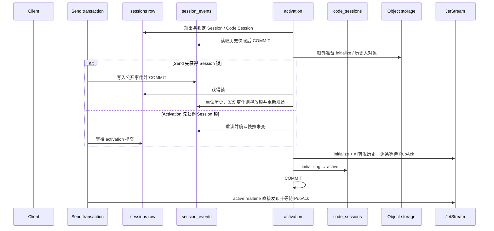

# Session 启动期消息投递

## 目标与边界

Environment Runner 读取 Session 上下文后，到 Code Session 可供 worker 使用前，仍可能收到新的公开
事件。启动交接必须让这些事件进入 activation 历史或 active realtime 路径。

`session_events` 是启动历史事实源。Code Session 入站不再写 PostgreSQL 表或 outbox；JetStream
PubAck 后才拥有待处理消息。`code_sessions.status` 保留为 activation、鉴权和恢复 fence。

## Activation 事务

activation 先用短 Yourbatis 事务锁定 Session 与 `initializing` Code Session，读取完整
`session_events` 快照。释放事务后准备 initialize 与可转发历史，提交 cleanup jobs 并上传大对象。
然后重新按相同顺序加锁，核对 metadata 和历史快照；若改变，退出事务并重新准备，不能漏掉上传期间
到达的输入。快照未变时才按历史顺序直接 Publish，每条消息必须获得 PubAck；全部成功后更新
`status=active` 并提交。整个流程含快照重试最多 1 分钟。这里不等待 worker 消费或 ACK。

PubAck 等待发生在最终事务内，因此发布期间会持有两条行锁；S3 和 cleanup job 准备必须在事务外，
不能持有一条 PG 连接又借第二条连接，以免耗尽连接池。这样做使 activation 与 Send Events 的 Session
写入互斥，并让 active 状态成为明确 cutover。若历史转换失败，尚未发布任何消息；若中途 PubAck
失败或最后 PG commit 失败，已发布的部分消息可能留在 JetStream，但 Code Session 仍是
`initializing`，worker 鉴权不能进入消费路径。

initialize 的 ID、request ID 以及每条历史消息的 `Nats-Msg-Id` 都由稳定输入派生。activation 重试在
24 小时 duplicate window 内不会制造第二条消息；窗口外仍依赖 worker 对稳定 `event_id` 幂等。

## Realtime cutover

Send Events 与 activation 都锁定同一条 Session：

- Send 先提交，activation 的历史读取包含该事件；当时看到 initializing 的 realtime 路径不发布；
- activation 先持锁，Send 等其提交，随后看到 active 并直接发布；
- active 发布额外锁定 Code Session 行，和终止、清理操作串行，获得 PubAck 后才返回成功。

普通 realtime Publish 失败返回 503。系统没有待发布表或后台 publisher，调用方必须用稳定事件 ID
重试。多个 active 请求的发布会被 Code Session 行锁串行，但获得锁的顺序不承诺与并发
`session_events` 的提交顺序一致；consumer 只保证按 JetStream 已接受的顺序逐条处理。

## 验收

- Runner prepare 后、activation 前接受的消息进入启动历史；
- initialize 是该 Code Session 的首类启动消息，历史按查询顺序发布；
- 任一 PubAck 失败时 Code Session 不 active；
- 模糊 PubAck 后重试使用同一 message ID；
- PG 包装层仅允许一条连接时，大对象发布与 activation 仍能成功；
- 上传期间新增历史会触发快照重试，并出现在最终启动队列；
- activation 提交后到达的事件只走 realtime 直接发布；
- realtime PubAck 失败向调用方返回 503，不存在后台补发；
- 不查询 PostgreSQL backlog，也不维护 PG 入站 sequence。
