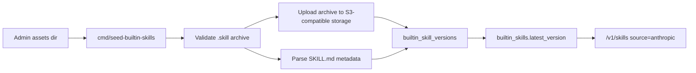

# Builtin Skills Seed And Storage

## 背景

Skills 资源现在分成两类：

- `source: "anthropic"`：全局只读 builtin skill，由管理员导入到数据库 catalog，并把 `.skill` archive 存在对象存储。
- `source: "custom"`：workspace 自定义 skill，继续使用现有 `skills` / `skill_versions` 表和对象存储。

临时 `assets/skills/public` 只作为管理员 seed 工具的输入目录，不是服务运行时依赖，也不进入 git。

## 数据模型

新增 migration `internal/db/migrations/00010_builtin_skills.sql`，创建：

- `builtin_skills`
  - `id bigint generated always as identity`
  - `uuid uuid default gen_random_uuid()`
  - `external_id text`，例如 `xlsx`
  - `display_title text`
  - `latest_version text`
  - `created_at` / `updated_at` / `deleted_at`
- `builtin_skill_versions`
  - `id bigint generated always as identity`
  - `uuid uuid default gen_random_uuid()`
  - `external_id text`
  - `skill_id bigint`
  - `skill_external_id text`
  - `version text`
  - `name text`
  - `description text`
  - `directory text`
  - `s3_bucket text`
  - `s3_key text`
  - `size_bytes bigint`
  - `sha256 text`
  - `created_at` / `deleted_at`

表之间不使用 PostgreSQL foreign key，符合项目 schema 规则；完整性由 seed 事务和 API 查询边界保证。



## Seed 工具

命令：

```bash
go run ./cmd/seed-builtin-skills --dir /path/to/assets/skills/public --versions /path/to/versions.txt
```

参数：

- `--dir` 必填，只扫描目录下的 `*.skill` archive。
- `--versions` 可选，支持 JSON object 或 `skill_id=version` 行格式。生产导入推荐显式指定平台版本号。
- `--prune` 可选，软删除本次目录中缺失的 builtin skill/version；默认只 upsert，不删除旧项。

CLI 会在导入前主动执行 goose migrations，不依赖服务端运行时的 `database.auto_migrate` 配置。这样管理员可以在新环境里先运行 seed 工具完成表结构和 catalog 初始化。

Archive 校验规则：

- 单个 archive 解包后必须只有一个顶层目录。
- 顶层目录必须包含 `SKILL.md`。
- 路径必须是安全相对路径，禁止绝对路径、空路径、`..` 和 NUL。
- 忽略 `__MACOSX`、`.DS_Store`、`._*` 这类系统文件。
- 总大小限制为 8 MiB。

对象存储 key：

```text
builtin-skills/{skill_id}/versions/{version}/{sha256}.skill
```

幂等规则：

- 缺省版本号由 archive 内容 sha 派生；生产导入推荐通过 `--versions` 显式指定平台版本号。
- 同一个 `skill_id + version + sha256` 重跑只刷新 catalog，不产生语义变化，并保留已存在 active version 的 `created_at`，避免版本排序被幂等重跑改变。
- 同一个 `skill_id + version` 但内容 sha 不同会返回冲突错误，管理员需要换新版本号。
- `--prune` 软删除 DB 行，并 best-effort 删除对应对象；对象删除失败会记录日志但不阻塞 DB 软删除。

## API 行为

`/v1/skills` 组合两个来源：

- `source=anthropic`：只查询 builtin 表。
- `source=custom`：只查询 workspace 表。
- 未指定 `source`：返回 builtin catalog 和当前 workspace custom skills 的合并页。

未指定 `source` 的合并分页按逻辑序列 `builtin catalog -> workspace custom skills` 处理，`next_page` cursor 覆盖这个合并序列的 offset。即使当前页刚好在 builtin 尾部结束，只要后面仍存在 custom skill，响应也必须返回 `has_more=true` 和下一页 cursor，避免 custom 资源被隐藏。

Builtin retrieve、versions 和 content/download 都从 DB metadata 定位 S3-compatible archive；服务不再读取 `assets` 目录。

Custom create 是纯创建语义，不会把同名 skill 自动合并成新版本。`display_title` 是当前 workspace 内 custom skill 的业务唯一键：

- migration `00011_unique_skill_display_title.sql` 在 `skills(workspace_id, display_title)` 上创建 active-row partial unique index。
- migration 假设已有 active `display_title` 数据在 workspace 内唯一；若存在重复数据，索引创建会失败并暴露需要人工清理的数据问题。
- migration `00012_require_skill_display_title.sql` 把 `skills.display_title` 改为 `NOT NULL`，避免未来写入路径绕过业务唯一键。
- 唯一索引用 `CREATE UNIQUE INDEX CONCURRENTLY` 创建，降低迁移期间对 `skills` 表写入的锁影响。
- `POST /v1/skills` 若复用未删除 custom skill 的 `display_title`，返回 `400 invalid_request_error`。
- 正确更新路径是 `POST /v1/skills/{skill_id}/versions?beta=true`。
- soft delete 后同一 workspace 可以重新创建相同 `display_title`。

Builtin 写操作保持只读：

- create version
- delete skill
- delete version

以上对 builtin 都返回 read-only error。Custom skill 的 create/update/delete 继续走现有 workspace 表和对象存储。

## 测试

后端覆盖：

- seed 成功导入、幂等重跑、同版本不同 sha 冲突。
- seed archive 失败场景：缺 `SKILL.md`、多顶层目录、路径穿越。
- `--prune` 软删除。
- API 从 DB + S3-compatible storage 返回 builtin list/retrieve/version/content。
- builtin update/delete 只读。
- custom create 复用同 workspace `display_title` 返回 `400 invalid_request_error`，并提示使用 version update。
- custom 单 `.zip` / `.skill` archive 与目录 multipart 上传。
