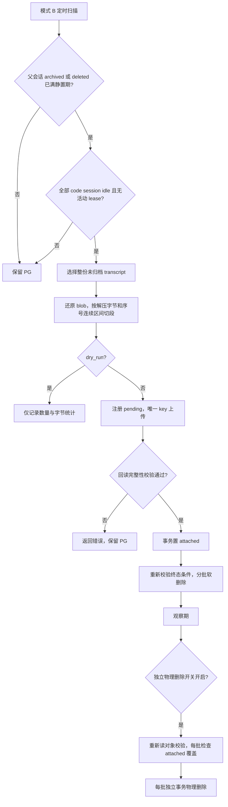
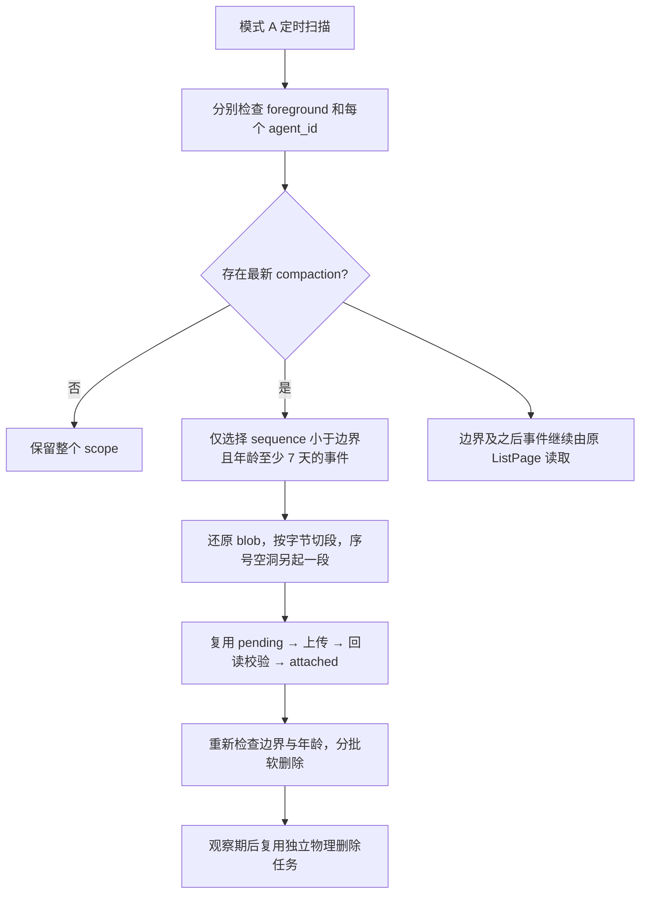

# 私有 transcript 归档

本功能只处理 `code_session_internal_events`。不改变 ListPage、公开事件、SSE、NATS 或 resume 协议。

## 终态归档

独立 River sweep 发现 `archived_at` 或 `deleted_at` 已满 24 小时、全部 code session lease 已过期且 worker idle 的会话。NULL lease 表示没有活动租约；running/requires_action 均不允许归档。归档任务再次通过条件查询校验，软删除的每个批次也重新检查条件。

`DeleteSession` 只级联软删除公开事件等关联资源，没有处理私有 transcript；独立 sweep 覆盖已经删除的存量会话，修复这一无限保留问题。archive/delete API 写路径不挂归档逻辑。

段先注册 pending，再以唯一对象 key 上传，回读验证 size、SHA-256、行数和序号，并与原始行核对，然后 attached，最后分批软删除。每个删除事务最多 500 行，锁定 attached 注册表行并检查每个序号覆盖。不锁 code_sessions。注册段时以 code session UUID 派生的独立 advisory transaction lock 串行化区间冲突检查，不阻塞 worker append。

上传只尝试一次，重跑只读取已有对象，不覆盖同名 key。上传之前进程退出或上传失败留下的 pending 段由 24 小时清理回收后，下一轮使用新 UUID 重建；上传完成但确认丢失时，重跑可直接校验并 attached。对象读取失败返回错误，不删除数据。

默认关闭且 dry-run。段按解压字节切分；超目标大小的单条事件独占段。序号空洞处额外分段，使区间不会覆盖其他 scope 的未归档事件。单任务有总行数上限，重试优先完成已有段的软删除。

## 验证

`TestTranscriptArchiveTerminalSafety` 覆盖非不可逆终态、未过期 lease、运行 worker 和不足静置期；`TestTranscriptArchiveTerminalRetry` 覆盖 dry-run、大 payload 合并和上传后中断恢复。生产统计 T0 经用户明确指示跳过，模式 B 收益和压缩比尚未测量。

## 物理删除

独立 `transcript_archive_delete` job 受 `hard_delete_enabled` 控制，默认关闭。观察期默认 14 天，设为零也仍先软删除，再由物理删除任务处理。每次先检查是否有已过观察期却没有 attached 覆盖的行；发现 deleting/missing 注册表即返回错误。随后逐段重新读取并校验对象，逐行匹配 UUID 与序号，最多每批 500 行、独立事务，事务内再次锁定 attached 段并执行 HasAttachedCovering。对象丢失或损坏均拒绝删除并记录错误。单任务遵守总删除行数预算。

## Compaction 边界增量归档

模式 A 由独立开关启用，默认关闭。每个 foreground / agent_id scope 独立计算最新 compaction，只归档严格小于边界且 created_at 早于 archive_min_age 的行；无边界的 scope 和边界本身保留。边界前移不会使已选历史重新可达。即使不同 scope 序号交错，也在空洞处分段并按对象内逐条序号删除，不能把起止区间当作实际成员列表。

删除行也会删除幂等键。安全论证依赖 worker lease 60 秒、epoch 围栏拒绝旧 worker（409）、当前 worker 仅持有本次新产生 entry，以及默认 7 天 archive_min_age 远大于 worker 生命周期。若未来改到小时级，必须重做该论证；本实现配置校验不允许小于 7 天。

## 导出与还原

先在所有实例禁用归档/删除并等待运行中任务结束，再在受信环境运行以下命令。CLI 复用配置中的现有 bucket，不创建 bucket、不启动 HTTP 服务、不改 resume 路径。

```sh
CONFIG_FILE=/path/to/config.yaml go run ./cmd/transcript-archive -mode export \
  -organization ORGANIZATION_UUID -workspace WORKSPACE_UUID -code-session CODE_SESSION_UUID > history.jsonl
CONFIG_FILE=/path/to/config.yaml go run ./cmd/transcript-archive -mode restore \
  -organization ORGANIZATION_UUID -workspace WORKSPACE_UUID -code-session CODE_SESSION_UUID
```

导出按序合并 attached 段和 PG 中尚未归档的历史。payload 原始 JSON 可以含格式换行，因此文件是按记录分隔的 JSON 文档流；应使用流式 JSON decoder，不能按物理换行 split。还原逐段校验对象，保留原始 UUID、external_id、sequence_num、payload_uuid、幂等键、worker payload_hash 和时间戳。大 payload 经现有 eventpayload 写入新 blob 后再原子关联；即使旧 blob 已被 GC 删除，也能恢复。已存在的活跃行不覆盖，冲突会返回错误；每批最多 500 条，不推进 append 序号水位。

软删除观察期内且旧 blob 尚存时可用 deleted_at=NULL 取消软删除。旧 blob 已被 GC 回收后，必须使用还原工具重建引用，不能只清空 deleted_at。本测试覆盖段→物理删除→旧 blob GC→还原回 PG→ListPage 一致，以及还原幂等和跨 workspace 隔离。

## 配置与组装

`transcript_archive.enabled=false`、`dry_run=true` 是默认值；模式 B 开关默认开启但仍受总开关控制，模式 A 和物理删除默认关闭。`terminal_dwell` 必须大于零，`archive_min_age` 至少 168h，`soft_delete_window` 允许零。段目标为 1 字节至 32 MiB，删除批量为 1..500，单 job 行数为 1..50000。读回解压上限为 64 MiB，阻止不受控分配。

主程序复用现有 ObjectStore 和 River client，注入 component=transcript-archive logger，队列并发为 2。每 5 分钟的 durable sweep 使用 UUID 游标按 100 个 code session 扫描；归档和物理删除是不同 job，已排队任务也读取启动时配置中的开关。配置变更需要重启实例。既有 cleanup worker 每 30 秒认领超过 24 小时的 pending 段，在同一事务中置 deleting 并写 object_cleanup job；attached 不参与回收，对象删除清理全部版本。

## 触发点与不变量

| 信号 | 能否 resume | 能否整份归档 | 判断依据 |
| --- | --- | --- | --- |
| `archived_at IS NOT NULL` | 否 | 满足静置期及 worker 条件后可以 | Archive 单向置位，现有协议没有 unarchive；公开追加路径拒绝 archived 会话 |
| `deleted_at IS NOT NULL` | 否 | 满足静置期及 worker 条件后可以 | SoftDelete 单向置位 |
| `status='terminated'` | 可能 | 不可以 | SetStatus 可被事件更新回 running/idle，不能作为不可逆终态 |
| 沙箱 `stop_reason='idle_timeout'` | 可以 | 不可以 | idle 回收只释放计算资源，后续用户输入会唤醒沙箱，transcript 必须保留 |

archive/delete 并未保证所有私有 worker 已停止；私有 POST 以 epoch 为围栏，不以父 session archived 为围栏。因此本实现保留全部额外条件：同一父 session 下每个 code session 都必须 worker idle、lease 过期或 NULL，终态置位超过 terminal_dwell。候选扫描、事件选择和每个软删除批次均执行相同条件，不能把扫描结果当作长期授权。模式 A 仍只按各 scope 的不可达边界选择历史，与是否回收沙箱无关。

**不锁 code_sessions 的依据**：正常 worker 写路径只追加 `last_internal_sequence_num+1`，不修改既有行。给定读取水位 W，序号不大于 W 的内容不会由 worker 改写；新的 compaction 只会使边界前移。归档只改变这些不可变记录的存放位置。归档之间的区间竞争由独立 UUID advisory transaction lock、重叠检查与唯一索引裁决；删除锁住 attached manifest，均不持有 worker 使用的 code_sessions 行锁。还原属于维护操作，需先停归档任务；不得在生产 worker 任意改写历史的前提下沿用本论证。

**payload_hash 不是读回校验值**：它由 worker 原始 JSON 计算，而 PG JSONB 会改变键序、空白和数字表示。内联 payload 归档的是 PG 读回字节，外置 payload 归档的是 blob 还原字节；保持 payload_hash 仅供审计与幂等。完整性使用压缩对象 SHA-256、大小、解压大小、记录数、序号和原事件 UUID；首次附着还比较 payload 原字节，不重新计算 worker payload_hash。

## 两种归档模式的数据流





## 失败处理与回滚

| 中断或故障 | 数据状态 | 恢复方式 |
| --- | --- | --- |
| 注册后、上传前退出；上传失败 | pending，PG 原行保留 | 重试只读已有 key；若对象未落地，24h 孤儿 GC 后以新 UUID 重建 |
| 上传成功但确认丢失 | pending，对象可能完整 | 重试读回并校验，成功后 attached，不覆盖对象 |
| 对象缺失、截断、SHA-256 或记录数不符 | 停止当前段，不删除其原行 | 修复对象/存储后重试；此前独立段已完成的事务保留 |
| attached 后进程退出 | 有可信对象，可能尚未软删 | 重试补齐软删；每批再次校验资格与 attached 状态 |
| 删除中途失败 | 已提交批次保留，当前批次回滚 | 重试只处理剩余行，单任务仍受总行数预算约束 |
| attached 被误置 deleting 或 registry 丢失 | 物理删除拒绝执行并记录错误 | 停止清理，核对对象后修复 registry；不得绕过覆盖检查 |
| pending 清理任务入队失败 | 同一事务回滚 state 变更 | 下一次 cleanup ticker 重试认领 |
| 两个 Archiver 同时抢段 | 一个注册成功，另一个区间冲突 | 后续重试复用获胜段；不会产生重叠的有效段 |
| 需要撤销软删或物理删除 | attached 对象仍保留 | 停所有实例归档/删除并等任务退出，运行 restore CLI，核对 ListPage 与导出结果 |

migration Down 在存在 attached 段时拒绝执行。恢复数据并不自动销毁段或解除此守卫；撤销 schema 必须另行核对每段均已恢复并保留独立备份，不能直接丢弃注册表。常规回滚应只回滚应用版本、关闭功能并保留 migration 与对象。

软删除并不保证旧 blob 在 14 天观察期内仍存在：现有 GC 看的是活跃引用，registry 超过 24h 且无活跃引用即可认领。因此可靠回滚通路是还原 CLI；直接清空 deleted_at 仅适用于所有关联 blob 仍可读的情况。

## 部署与验收

`transcript-archive/` 前缀**不得配置固定 TTL 生命周期规则**，attached 对象可能是历史的唯一副本。复用 `cfg.Storage.S3.Bucket`，为归档前缀保留读写权限及备份策略，不使用 worker 临时对象的过期规则。应用自动清理只处理超过 24h 的 pending 孤儿，不清理 attached；与既有 blob 策略一样，不承诺补偿首次清理之后才结束的异常迟到上传。

上线从默认关闭切到 dry-run，记录模式 B 的候选数量和字节；确认实际收益后先开放终态软删除，经过观察期与还原演练再开启物理删除，模式 A 最后单独放量。T0 的生产统计门禁已按用户要求跳过，本轮没有生产规模、收益占比或压缩比结论。上线第一周需用实际段日志的 raw_bytes/size_bytes 汇总测得压缩比后回填；不得把规划估算写成实测。

本地验收先生成 Yourbatis 代码，再运行 `just lint`、`just dead-code`、`just duplicates`、`just complexity` 和 `just test`。真实 PG 测试使用独立数据库/schema，可控 ObjectStore 注入上传中断和损坏；不修改生产数据。测试覆盖终态条件、idle 回收后唤醒、epoch 变更与新 compaction 并发写入、前台及 subagent HTTP 响应字节不变、500 页分页与序号空洞、对象故障拒删、pending 清理回滚、旧 blob GC 后还原和 50 万行会话中每批独立事务。Mapper 测试验证 SQL 分支、绑定顺序、返回语义、租户隔离及 PostgreSQL 事务回滚。
