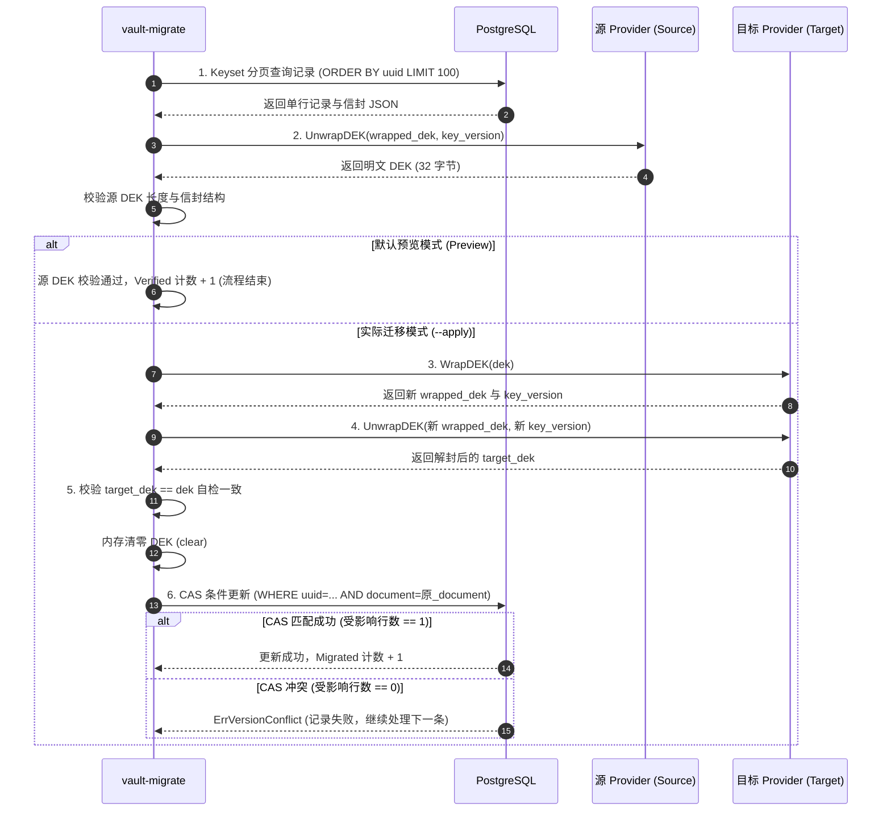
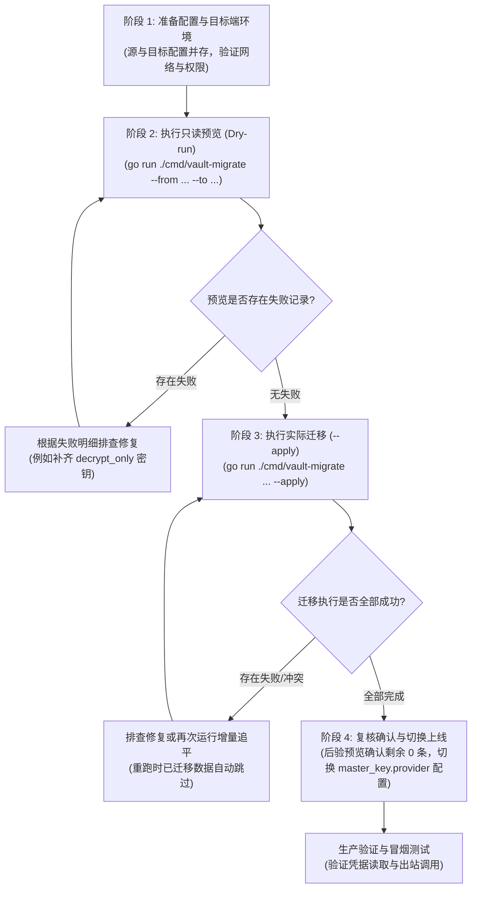
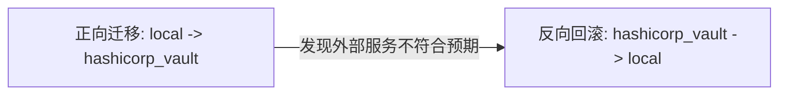

# Vault 主密钥 Provider 迁移指南 (`vault-migrate`)

`vault-migrate` 是用于在不同主密钥 Provider 之间批量重新封装数据加密密钥（DEK, Data Encryption Key）的专用运维 CLI 工具。

支持在 `local`、`aliyun_kms` 和 `hashicorp_vault` 三种 Provider 之间进行任意双向全量迁移。

---

## 1. 概述与核心原理

### 1.1 核心不变量与安全模型

在 Open Managed Agents (OMA) 的信封加密体系中，主密钥（KEK）仅用于封装（Wrap）和解封（Unwrap）随机生成的 DEK，真正的业务明文由 DEK 通过 AES-256-GCM 加密存储。迁移过程严格遵循以下安全不变量：

- **业务密文与认证上下文（AAD）不变**：迁移仅解封旧 DEK 并用新 Provider 重新封装，业务数据的 AES-256-GCM 密文、12 字节 Nonce 以及 AAD（绑定 `organization_uuid`、`workspace_uuid` 等租户标识）完全保持原样，无需解密业务明文。
- **内存即时擦除**：解封出的 32 字节明文 DEK 仅暂存于内存中，使用完毕后立即执行零化擦除（`clear(dek)`），防止敏感密钥残留。
- **闭环双向校验**：写入前必须先用目标 Provider 完成“封装（Wrap） -> 解封（Unwrap） -> 字节比对（Compare）”闭环自检，确保新封装在目标端 100% 可解封，且解出的 DEK 字节与原 DEK 完全一致。
- **只读预检保障（Dry-run）**：默认运行为只读预览模式，仅校验源端 DEK 的解封与结构合法性，绝不调用目标 Provider 加解密接口，绝不修改数据库。
- **文档级乐观并发控制（CAS）**：持久化采用完整文档内容的 CAS（Compare-And-Swap）条件更新，防止在迁移期间因并发写入造成数据覆盖或状态破坏。
- **天然幂等与可断点续跑**：已迁移记录的 `key_provider` 已更新为目标 Provider，重跑时会自动识别并跳过（`Skipped`）。

### 1.2 迁移数据流时序



---

## 2. CLI 命令与参数规格

### 2.1 启动与帮助

从仓库根目录执行，需确保拥有与 `go.mod` 一致的 Go 工具链。首次运行或 Mapper 变动后，先生成 Go Mapper：

```bash
# 生成 Yourbatis Mapper 代码
go generate ./internal/db

# 查看命令帮助
go run ./cmd/vault-migrate --help
```

> [!NOTE]
> 生成步骤会生成或更新本地被 Git 忽略的 `*.sqlmap.gen.go` 文件。已生成且未修改 Mapper XML/Go interface 时，可直接执行 `go run ./cmd/vault-migrate`。

### 2.2 参数说明

| 参数 | 类型 | 默认值 | 必填 | 说明与约束 |
| --- | --- | --- | --- | --- |
| `--from <provider>` | string | 无 | 是 | 源 Provider 名称。仅迁移信封中 `key_provider` 与此相符的记录 |
| `--to <provider>` | string | 无 | 是 | 目标 Provider 名称。必须与 `--from` 不同 |
| `--apply` | bool | `false` | 否 | 实际写入开关。指定后执行封装、验证并写回数据库；省略时仅执行只读预览 |
| `--help` | - | - | 否 | 输出详细使用帮助并以状态码 `0` 退出 |

**合法的 Provider 枚举值**：`local`、`aliyun_kms`、`hashicorp_vault`。

> [!IMPORTANT]
> - 命令不接受任何位置参数，未知参数会导致解析失败退出。
> - 命令不支持租户（Organization / Workspace）、特定资源或时间范围过滤；它会对数据库中的全量对应信封做全局扫描。

### 2.3 配置加载与路径解析机制

`vault-migrate` 复用 OMA 的统一 YAML 配置文件，遵循以下加载机制：

1. **配置文件定位**：
   - 优先读取环境变量 `CONFIG_FILE` 指定的路径。
   - 若未设置，则从当前工作目录（cwd）向上递归查找 `config/config.yaml`，直至包含 `go.mod` 的根目录。
   - 找不到配置文件或配置格式无效时直接报错退出。
2. **路径解析差异**：
   - 环境变量 `CONFIG_FILE` 按**当前终端工作目录（cwd）**解析相对路径。
   - YAML 配置文件内部的密钥文件（`kek_file`）、Token 文件（`token_file`）及 CA 证书（`ca_file`）则**严格相对于配置文件所在目录**解析。
3. **全量配置装配校验**：
   - 命令在启动时会校验整份 OMA 配置，并装配所有已在 YAML 中配置的 Provider 客户端。
   - 即使本次仅在两个 Provider 之间迁移，配置中其他已声明的 Provider 块也必须合法（例如本地密钥文件与证书必须可读）。
   - 数据库必须已存在且已经通过 goose 完成 schema migrations，命令不会自动创建库或执行数据库表结构变更。
4. **运行建议**：
   - 生产环境中建议显式传递绝对路径：
     ```bash
     export CONFIG_FILE=/absolute/path/to/oma-config.yaml
     ```

---

## 3. 覆盖范围与存储模型

### 3.1 涵盖的数据表与信封映射

命令按固定顺序扫描以下 6 张数据存储表：

| 存储名称 (`kind`) | 数据库表名 | 密文存储位置与结构 | 单行信封数量 | CAS 附加行为 |
| --- | --- | --- | --- | --- |
| `vault_credentials` | `vault_credentials` | 平铺列：`wrapped_dek`, `key_provider`, `key_version` 等 | 单信封 | `version = version + 1`, `updated_at = NOW()` |
| `mcp_oauth_flows` | `mcp_oauth_flows` | 平铺列：`wrapped_dek`, `key_provider`, `key_version` 等 | 单信封 | `updated_at = NOW()` |
| `mcp_tunnel_token_versions` | `mcp_tunnel_token_versions` | 平铺列：`wrapped_dek`, `key_provider`, `key_version` 等 | 单信封 | 关联校验 `mcp_tunnels` 租户范围，不更新时间 |
| `llm_providers` | `llm_providers` | 平铺列：`wrapped_dek`, `key_provider`, `key_version` 等 | 单信封 | `updated_at = NOW()` |
| `session_resources` | `session_resources` | JSONB 列 `secret_payload`，格式形如 `{"envelope": {...}}` | 单信封 | `updated_at = NOW()` |
| `deployments` | `deployments` | JSONB 列 `resource_secrets`，格式为 `map[string]GitTokenEnvelope` | 复合信封（多资源） | `updated_at = NOW()` |

> [!NOTE]
> - **Deployment 多信封原子性**：一个 Deployment 记录可能包含多个环境资源的 Git Token 信封。只有当该记录中**所有**匹配 `--from` 的信封都重新封装并通过自检验证后，才会将整行 JSONB 原子写回；在终端统计中，每个 Deployment 无论包含多少个内部信封，均按**一条数据库记录**计算。
> - **Session Resources 历史数据防御**：若 `session_resources.secret_payload` 仍包含历史未加密的明文 `authorization_token`，迁移会显式报错拒绝，提示先通过 OMA 业务接口重新提交加密凭证。

### 3.2 分页与过滤机制

- **游标分页（Keyset Pagination）**：每批最多读取 100 行记录，使用 `WHERE records.uuid > #{after} ORDER BY records.uuid LIMIT 100`，流式处理，不加全表锁。
- **NULL 密文与跳过逻辑**：
  - 秘密字段全为 SQL `NULL` 的记录直接被数据库层过滤，不进入扫描，亦不计入任何统计指标。
  - 扫描到的记录若属于其他 Provider（不匹配 `--from`）或为空 JSON，计入 `Skipped`。
  - 孤立的 Tunnel Token（父 Tunnel 已被物理删除）不会被查出，命令不负责维护脏数据完整性。

---

## 4. 标准操作流程 (SOP)

跨 Provider 迁移推荐遵循以下标准操作流程：



### 阶段 1：准备配置与目标服务

在 OMA 配置文件中，保持原有源 Provider 配置不变，并在同级配置块中增加目标 Provider 的完整连接信息。

#### 示例配置：Local 迁移至 HashiCorp Vault

```yaml
vault:
  master_key:
    # 保持原有应用写入 provider 不变（迁移完成后再切换）
    provider: local
    local:
      kek_file: secrets/vault-kek
      version: 1
      decrypt_only:
        - version: 0
          kek_file: secrets/vault-kek-v0
    hashicorp_vault:
      address: https://vault.example.com:8200
      transit_mount: transit
      key_name: oma-dek
      token_file: /etc/oma/vault-token
      ca_file: /etc/oma/vault-ca.pem
```

#### 示例配置：Local 迁移至阿里云 KMS

```yaml
vault:
  master_key:
    provider: local
    local:
      kek_file: secrets/vault-kek
      version: 1
    aliyun_kms:
      endpoint: kst-example.cryptoservice.kms.aliyuncs.com
      key_id: acs:kms:cn-hangzhou:1234567890123456:key/key-example
```

> [!IMPORTANT]
> 1. **权限核验**：目标 HashiCorp Vault 的 Transit Key 必须具备 `encrypt` 与 `decrypt` 权限；目标阿里云 KMS 的 RAM 策略必须具备 `kms:Encrypt` 与 `kms:Decrypt` 权限。
> 2. **执行机连通性**：迁移命令所在的宿主机/维护机必须能够直接访问目标服务地址（域名、安全组、VPC 路由互通）。

### 阶段 2：执行只读预览（Preview / Dry-run）

在执行实际写入前，先执行只读预览，检查源数据是否有损坏或解封失败的记录：

```bash
CONFIG_FILE=/etc/oma/config.yaml go run ./cmd/vault-migrate \
  --from local \
  --to hashicorp_vault
```

- 预检通过标准：终端退出码为 `0`，`Failed` 计数为 `0`。
- 如果有记录失败：查看终端中的 `Failed records` 明细定位具体原因（如缺少 `decrypt_only` 旧版本密钥）。修复配置后重新预检，直至全部通过。

### 阶段 3：执行实际迁移（Apply）

使用相同的配置文件，带上 `--apply` 开关：

```bash
CONFIG_FILE=/etc/oma/config.yaml go run ./cmd/vault-migrate \
  --from local \
  --to hashicorp_vault \
  --apply
```

命令将逐张表逐条执行：解封旧 DEK -> 封装新 DEK -> 解封新 DEK 自检 -> CAS 写回。

### 阶段 4：复核确认与切换上线

1. **后验预览**：再次执行预览命令，检查是否有遗漏的源记录：
   ```bash
   CONFIG_FILE=/etc/oma/config.yaml go run ./cmd/vault-migrate \
     --from local \
     --to hashicorp_vault
   ```
   **确认标准**：`Total` 行的 `Verified` 和 `Failed` 均为 `0`，终端输出 `Nothing to migrate.`。这证明库内已无任何遗留的待迁移源信封。
2. **切换应用主配置**：修改生产 `config.yaml`：
   ```yaml
   vault:
     master_key:
       provider: hashicorp_vault # 切换写入 Provider 为目标 Provider
       hashicorp_vault:
         # ...
   ```
3. **冒烟测试与旧密钥留存**：
   - 触发一次凭据读取操作（例如包含 OAuth Token / Static Bearer 的 Agent 调用，或获取 LLM Provider 配置），确认运行时解密正常。
   - 触发一次凭据创建操作，确认新凭据采用新 Provider 正确封存。

> [!NOTE]
> 历史数据库备份的恢复依然依赖当时的旧密钥，旧 Provider 的密钥材料在确认历史备份无用前应妥善归档保留。

---

## 5. 终端输出与报告规范

### 5.1 终端输出流向与统计表格

- **stdout**：输出迁移模式、进度统计表格、失败原因汇总、逐条失败明细及操作指引。
- **stderr**：输出 CLI 启动日志、帮助文本及导致程序非正常终止的致命错误。

#### 预览模式（Preview）输出示例

```text
Preview: local -> hashicorp_vault
Read-only: verifies source DEKs; no target calls or database changes.
Counts are database records; each Deployment is processed as one record.

Storage                        Verified    Skipped     Failed
vault_credentials                    42          2          0
mcp_oauth_flows                        3          0          0
mcp_tunnel_token_versions              2          0          0
llm_providers                         4          1          0
session_resources                     5          2          0
deployments                           2          1          0
Total                                58          6          0

Skipped: other providers or empty data.

Source DEKs verified. Target access and business ciphertext were not checked.
Next: back up the database and stop OMA/workers, then use the same CONFIG_FILE:
  go run ./cmd/vault-migrate --from local --to hashicorp_vault --apply
```

#### 实际迁移（Apply）输出示例

```text
Apply: local -> hashicorp_vault
Counts are database records; each Deployment is processed as one record.

Storage                         Migrated    Skipped     Failed
vault_credentials                    42          2          0
mcp_oauth_flows                        3          0          0
mcp_tunnel_token_versions              2          0          0
llm_providers                         4          1          0
session_resources                     5          2          0
deployments                           2          1          0
Total                                58          6          0

Skipped: other providers or empty data.

Migration complete. Keep old keys while database backups still need them.
```

- 若中途遭遇致命错误中断，总计行会显示为 `Total (partial)`，只统计截至中断时已处理的记录，包括成功、跳过和失败。

### 5.2 失败明细与保存输出

命令始终输出统计汇总。有失败记录时，在统计表之后输出按原因分组的计数，以及包含存储类型、UUID 和原因的逐条明细：

```text
Failed records:
FAILED vault_credentials 0192a6c2-0000-7000-8000-000000000001: local: KEK version 2 is not configured; check current and decrypt_only keys
FAILED session_resources 0192a6c2-0000-7000-8000-000000000002: legacy plaintext Git token has no encrypted envelope; resubmit it through OMA before migrating
```

无失败记录时，不显示 `Failed records` 部分。输出不包含业务明文、DEK 或主密钥数据。

需要保存结果时，使用 Shell 重定向或 `tee`，成功和失败的统计都会保存。例如，一边查看终端输出，一边保存本次预览结果：

```bash
set -o pipefail
CONFIG_FILE=/etc/oma/config.yaml go run ./cmd/vault-migrate \
  --from local --to hashicorp_vault 2>&1 | tee migration.log
```

`2>&1` 同时保存运行日志和最终错误；`pipefail` 让命令失败时整个管道仍返回非零退出码。也可用 `> migration.log 2>&1` 仅保存到文件。重定向和 `tee` 默认覆盖同名文件，保留每次执行结果时使用不同文件名。

### 5.3 退出状态码规范

| 退出码 | 判定条件 | 场景举例 |
| --- | --- | --- |
| `0` | 命令成功完成 | 查看 `--help` 成功；扫描完成且 `Failed == 0`；数据库中无可迁移记录（`Nothing to migrate.`） |
| `1` | 存在任意错误 | 参数/配置不合法；数据库无法连接；部分记录迁移失败（`Failed > 0`）；进程被中断（SIGINT/SIGTERM） |

---

## 6. 异常分类、故障排查与断点重跑

### 6.1 错误严重度分类

命令对遇到的错误进行了清晰的分级处理：

| 错误类型 | 代表场景 | 运行时行为 | 影响范围 |
| --- | --- | --- | --- |
| **单行非致命错误 (Non-Fatal)** | 源 DEK 解封失败、单行信封损坏、历史明文 Git token、单行 CAS 并发版本冲突 | 计入该存储的 `Failed` 统计并输出失败明细，**继续扫描并处理后续记录** | 仅受影响记录未修改，其他记录正常迁移 |
| **系统致命错误 (Fatal)** | 目标 Provider 封装失败（`ErrMigrationTarget`）、目标 Provider 解封自检失败、数据库断连/SQL 报错、接收到 SIGINT/SIGTERM | 打印 `Total (partial)` 统计，**立即终止整个命令执行** | 中断点之后的记录未被处理，之前已提交的记录保持新状态 |

### 6.2 常见错误与排查指南

| 错误特征 / 报错信息 | 根因分析 | 解决策略 |
| --- | --- | --- |
| `local: KEK version X is not configured` | 待迁移数据由旧版本 Local KEK 加密，但当前配置缺少对应的 `decrypt_only` 条目 | 在配置的 `local.decrypt_only` 中添加对应版本的 `version` 和 `kek_file` 后重跑 |
| `legacy plaintext Git token has no encrypted envelope...` | 该 Session Resource 仍保存着早期未加密的明文 Git Token | 无法自动迁移；需在 OMA 前端/API 中重新提交一次凭据，生成有效信封 |
| `secrets: target provider failed: ...` | 目标 Provider 权限不足、网络超时、或双向自检不匹配 | 检查目标服务状态（KMS/Vault 端点可达性、Transit 挂载点、RAM 策略），修复后重跑 |
| `ErrVersionConflict` / CAS 冲突 | 在迁移扫描期间该记录被业务并发更新 | 单独复核该记录后再次执行迁移，增量追平即可 |
| `unexpected positional arguments` | 命令行中多传了未带 flag 的参数或拼写错误 | 检查命令行传参，确保没有悬空参数 |

### 6.3 幂等断点续跑

`vault-migrate` 具有严格的**幂等性**：

- 如果迁移因致命错误（如目标 KMS 短暂抖动）中断，已成功落库的数据其 `key_provider` 已经变更为目标 Provider。
- 问题修复后，保持 `--from`、`--to` 和 `--apply` 参数重跑即可。
- 命令扫描到之前已迁移完成的行时，因其 `key_provider == to != from`，会自然识别为 `Skipped`，仅处理此前未迁移或失败的行，绝不会导致数据重复封装或覆盖。

### 6.4 反向迁移与回滚策略

如果需要将数据从新 Provider 迁回原有 Provider（例如从 `hashicorp_vault` 迁回 `local`）：



1. 保留配置文件中双方的 Provider 密钥配置。
2. **交换源与目标参数**，带上 `--apply` 执行：
   ```bash
   CONFIG_FILE=/etc/oma/config.yaml go run ./cmd/vault-migrate \
     --from hashicorp_vault \
     --to local \
     --apply
   ```
3. **回滚本质**：反向迁移是重新用当前的 Local KEK 重新封装 DEK，**并不是恢复历史的字节备份**。
4. **后验确认与配置回滚**：执行预览确认无遗留信封后，将应用配置中的 `vault.master_key.provider` 改回 `local` 并更新应用配置。

### 6.5 不适用的场景说明

以下场景**不**属于 `vault-migrate` 工具的处理范畴：

- **同 Provider 内部轮换**：例如同一个阿里云 KMS 内部轮换 CMK、HashiCorp Vault 轮换 Transit Key 版本、或 Local 轮换内部 KEK 版本。此类操作由 Provider 原生多版本支持和业务写入自然轮换完成，详见 [主密钥与 Provider 装配](./vault-runtime.md#主密钥与-provider-装配)。
- **脏数据清理**：缺少父记录的孤儿凭证、历史明文凭证修复不属于本工具职责。
