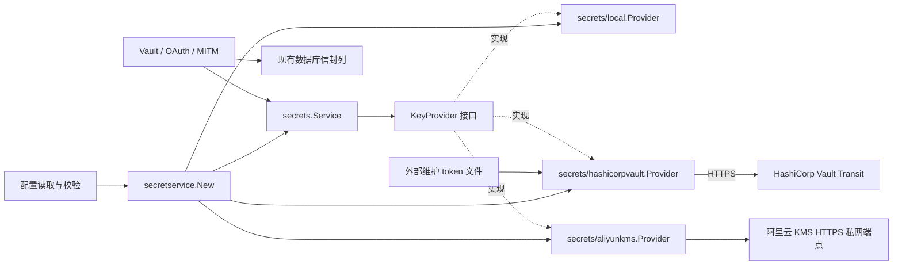
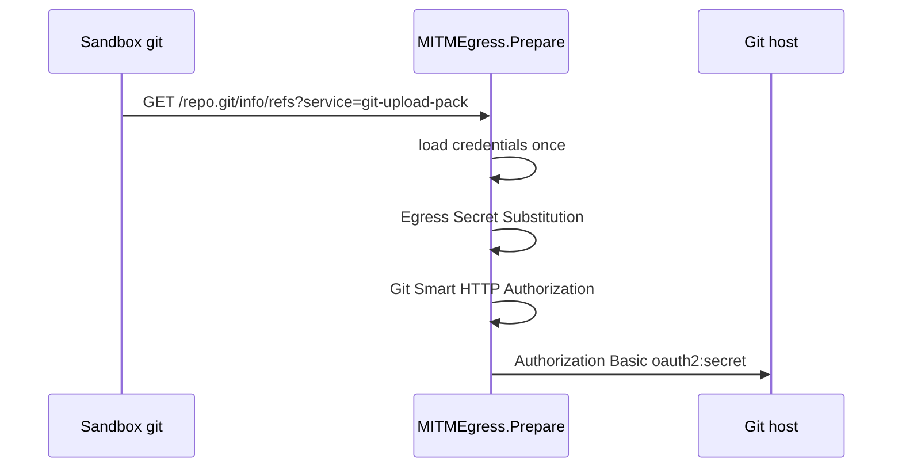

# Vault 存储加密与运行时注入

## 目标

两件事：

1. **存库加密（已完成）**：库被拖走、或只有读库权限的人，都拿不到明文密码。
2. **运行时注入（已完成）**：Managed Agent 出站经 CONNECT MITM 注入 `static_bearer` / `mcp_oauth`，并对 `environment_variable` 做 Egress Secret Substitution；Sandbox 默认看不到真密码。

主密钥支持 `local`、`aliyun_kms` 与 `hashicorp_vault` 三种 Provider（部署级配置，多 workspace 共用）。省略 Provider 保持本地 `kek` / `kek_file` 与 `version` + `decrypt_only` 行为。远程模式的主密钥留在阿里云 KMS 或 HashiCorp Vault Transit，OMA 仅发送待封装的数据密钥。

## 背景

Vault CRUD 和 OAuth 注册已经有了；存库侧已切到信封加密。Managed Agent 的普通 MCP 保留 Agent Snapshot 原始 URL，经 `HTTPS_PROXY` CONNECT；当 `upstream_proxy_mitm_enabled` 开启时，OMA 在 MITM 解密后的 HTTP 边界注入凭证。Session MCP HTTP proxy（`/v2/ccr-sessions/{id}/mcp`）按 #235 作为显式兼容入口保留，Runner 不把普通 MCP 自动改写到该接口；只有 canonical Tunnel 条目会投影到独立的 named Runtime Gateway。

## 威胁模型（加密管到哪）

| 场景 | 加密能否挡住 |
|---|---|
| 数据库被偷（备份/磁盘） | 能 |
| 只有查库权限的人偷看 | 能 |
| 数据库 + `config.yaml` 一起丢 | 本地模式不能；KMS + RAM 工作负载身份模式下配置没有 CMK 或长期云凭证，攻击者仍需取得 KMS 调用权限。显式 AK 模式若 AK 同时泄漏，不能承诺此保护 |
| 打进运行中的 OMA 进程 | 不能。本期不解决 |
| 沙箱里靠 prompt injection 骗 Agent 偷密码 | 加密不管。靠注入设计：沙箱只见占位符 / 原始 MCP URL，真密码只在 MITM 注入瞬态出现 |

沙箱取密由运行时注入边界约束；KMS 保护静态密钥托管，不防止持有 RAM 权限的运行进程被攻陷。硬件保护和合规等级取决于部署所选 KMS 实例及 CMK 保护级别，接入 SDK 本身不是 HSM 合规证明。

## 加密方案：信封加密

每条密码用一次性 DEK 加密，DEK 再用 KEK 包一层一起存。

信封布局预留了“将来只 rewrap DEK、不必重加密业务密文”的空间（AAD 不绑 KEK version）。**本期本地轮换不做 rewrap**：旧行保留原来的 `wrapped_dek` 与 `key_version`；换主密钥后必须把旧 KEK 留在 `decrypt_only`，直到相关凭证被写路径重新 Seal（换新 DEK / 新 `key_version`）。若在仍有旧信封时从 `decrypt_only` 删掉旧钥，Open 会失败，凭证不可用。

细节：

- AES-256-GCM，每次新 nonce，带 auth tag。
- AAD 绑 `organization_uuid` / `workspace_uuid` / `vault_external_id` / `credential_external_id`（长度前缀字符串）；搬走就解不开。四字段均须非空，`Seal`/`Open` 在空或纯空白时直接拒绝，避免封出之后填 ID 就解不开的信封。故意不绑 KEK 版本，以便将来若做 rewrap 时业务密文可不动。
- 密文头带 key version，老数据自带“用几号钥匙锁的”。
- 解不开就报错。不退化明文，不换别的 key 凑合。

## 主密钥与 Provider 装配



`internal/secretservice` 是应用装配边界，由 `main.go` 调用。`internal/secrets` 定义通用 `KeyProvider`（`Name`、`WrapDEK`、`UnwrapDEK`），仅处理本地 AES-GCM 和信封；它不导入云 SDK。`internal/secrets/local`、`internal/secrets/aliyunkms` 与 `internal/secrets/hashicorpvault` 是并列的叶子插件，不导入 `vaults`、MITM 或 `db`。Transit 只使用标准库 HTTP/JSON 调用两个接口，不引入登录或 SDK 生命周期；未知 Provider 直接拒绝。

本地 KEK 读取、版本选择和 DEK 封装集中在 `secrets/local`；公共包只保留信封合同、AAD 和加解密流程。公共信封错误位于 `secrets/errors.go`，厂商错误解析仍在各插件中。根目录 `crypto.go` 保留信封加密辅助函数，local 直接使用标准库完成密钥封装；不增加共享子包。`local.New` 不接受 context，调用方以 `secrets.NewService(provider)` 显式组装。`local/provider_test.go` 内的固定旧版信封常量验证解密兼容性，无额外 testdata 目录。

装配只选择一个 Provider，校验配置并创建客户端，不执行远端加解密探测。远端鉴权、网络、密钥可用性与 TLS 错误在实际封装或解封时返回，不阻止服务装配，也不尝试另一个 Provider。

### 本地模式与兼容性

```yaml
vault:
  master_key:
    provider: local          # 可省略，默认 local
    local:
      kek_file: secrets/vault-kek
      version: 1
```

旧配置中直接位于 `master_key` 下的 `kek`、`kek_file`、`version` 和 `decrypt_only` 仍可读取，YAML 入口会将它们归一到 `LocalKeyConfig`，校验、路径解析与 Provider 装配只使用该结构。新旧写法同时出现会报错，即使旧字段为空也不允许混用。序列化和配置示例只输出新格式。

本地 `local.kek` / `local.kek_file` 必须二选一；没有临时随机主密钥兜底。可用 `just generate-vault-kek config/secrets/vault-kek` 生成。本地轮换与 `decrypt_only` 不变。解析后的临时 KEK 字节在复制到 LocalKeyProvider 后清零。

### 阿里云 KMS 模式

```yaml
vault:
  master_key:
    provider: aliyun_kms
    aliyun_kms:
      endpoint: kst-example.cryptoservice.kms.aliyuncs.com
      key_id: acs:kms:cn-hangzhou:1234567890123456:key/key-example
```

- `endpoint` 必填，接受域名或 `https://域名`，可带端口或末尾 `/`，末尾 `/` 会归一化为主机地址；不接受 HTTP、用户名、非根路径、查询或 fragment。填写 VPC 可达的 KMS 私网域名；客户端不推导公共端点、不跟随重定向，沿用 SDK 提供的 HTTP Transport，TLS 始终验证证书。DNS、路由和安全组由部署方保证。
- `key_id` 必填，接受 CMK ID 或 `acs:kms:<region>:<account>:key/<key-id>` ARN，不接受别名。Encrypt 使用指定值；Encrypt / Decrypt 返回的 CMK ID 必须匹配配置。更换 CMK 不会允许旧 CMK 的密文自动解封。
- 不配置 AK 时优先使用 ACK RRSA：检测 `ALIBABA_CLOUD_OIDC_TOKEN_FILE`、`ALIBABA_CLOUD_OIDC_PROVIDER_ARN`、`ALIBABA_CLOUD_ROLE_ARN`，由官方 Credentials SDK 获取并自动刷新 STS 凭证。部分配置或 OIDC 获取失败直接失败，不改用节点角色。
- 没有 OIDC 配置时使用 ECS 实例 RAM 角色，由 SDK 从 IMDSv2 自动发现角色并刷新；禁止 IMDSv1 回退。可用 `ALIBABA_CLOUD_ECS_METADATA` 指定角色名。不会读取开发机上的 CLI/profile 凭证，也不会以环境 AK 覆盖工作负载身份。
- 显式 `access_key_id` 与 `access_key_secret` 必须同时配置；可附加 `security_token` 使用显式 STS 凭证。显式字段优先，静态配置不会自动替换过期的 STS token；生产优先绑定 RAM 角色。长期 AK 仍是敏感访问凭证，不应随配置入库或提交。
- RAM / CMK policy 最小授权为目标 CMK 的 `kms:Encrypt` 与 `kms:Decrypt`。不需要 DescribeKey 或导出 CMK 权限；实际 Encrypt / Decrypt 失败时请求返回错误。
- ACK 的 STS 换票是独立网络链路。完全私网部署同时设置 `ALIBABA_CLOUD_STS_REGION=cn-hangzhou` 与 `ALIBABA_CLOUD_VPC_ENDPOINT_ENABLED=true`，并保证对应区域 STS VPC 端点可达；只设置 KMS endpoint 不会改变 STS 的路由。
- 远端 Provider 拒绝同时配置 `local` 块。配置参考文件列出各模式字段，激活远端 Provider 前应移除 `local`。旧格式中为空的本地字段及 `version: 0/1` 仍兼容，不能包含实际本地密钥。

### HashiCorp Vault Transit 模式

```yaml
vault:
  master_key:
    provider: hashicorp_vault
    hashicorp_vault:
      address: https://vault.example.com
      transit_mount: transit  # 可省略，默认 transit
      key_name: oma-dek
      token_file: /run/secrets/vault-token
      # token: <vault-token>  # 与 token_file 二选一
      # ca_file: /run/certs/vault-ca.pem  # 可选，私有 CA 的 PEM 文件
```

该域名为部署示例，不是默认地址或已验证的线上端点。如使用反向代理终止 TLS 并路由到 Vault，需保留 `/v1/<transit_mount>/encrypt/<key_name>`、`decrypt/<key_name>` 的路径、请求体与 `X-Vault-Token`；不要把这些请求改写为登录页面、缓存响应或重定向到其他域名。云端使用 HTTPS origin（可带端口）及操作系统/容器的信任库；本地仅对 loopback IP、`localhost` 和 Compose 服务名 `vault` 允许 HTTP，并绕过环境 HTTP 代理；可选的 `ca_file` 在客户端初始化时读取 PEM 证书并追加到该客户端的系统信任根，不修改全局信任库；文件不可读或没有有效证书时装配失败。未配置时只使用系统信任库。证书链和主机名校验始终开启，没有跳过校验选项；CA 文件更新后需重启 OMA。TLS 信任与 OMA 出站 MITM CA 是独立的两条链路。

`address` 和 `key_name` 必填，`token` 与 `token_file` 必须且只能配置一个。`transit_mount` 省略或为空时使用 `transit`，表示 Transit 引擎的 API 挂载路径，支持嵌套 mount（如 `team/transit`）；请求地址为 `/v1/<transit_mount>/encrypt/<key_name>` 或 `decrypt/<key_name>`，`key_name` 是单个路径段。拒绝 traversal、转义路径、查询和 fragment。选择该 Provider 时移除 `local` 配置块；不会回退本地或阿里云密钥。

**初始化和认证属于部署层。** 外部先初始化/解封 Vault、启用 Transit、创建 `aes256-gcm96` key（非 derived、非 convergent）、配置 policy 并签发应用 token。OMA 不调用登录、续租、建 key、rotate、export 或 rewrap。Vault Agent 可作为外部 token 管理方式，但不是 Provider 的依赖。应用 token 的最小策略如下（与实际 mount/key 对齐）：

```hcl
path "transit/encrypt/oma-dek" { capabilities = ["update"] }
path "transit/decrypt/oma-dek" { capabilities = ["update"] }
```

不要授予 encrypt 的 `create` 能力：该能力可在 key 不存在时自动创建 key。缺 key、权限不足、token 无效或 TLS/网络错误在实际 encrypt/decrypt 时返回；启动不发起探测请求。

`token_file` 和 `ca_file` 使用现有相对配置目录、`~` 和环境变量路径展开规则。直接配置的 `token` 在装配时读取，更新需重启 OMA，不由 OMA 自动续租。使用 `token_file` 时，文件保存原始 Vault token，不能使用 response-wrapped/encrypted sink 内容；由外部限制读取权限并在到期前续租或更新。每次加解密重新打开文件，支持原子 rename 与 Kubernetes projected-volume symlink 更新；不保存旧 token 作回退，不修改共享客户端认证状态。挂载可更新的目录/投影卷，避免将被替换的单个 inode 绑定到容器。文件丢失、为空、超限或包含内部空白/控制字符时拒绝请求。拒绝 HTTP 重定向，因此反向代理上游应选择 active Service 或保证 Vault 服务端 forwarding 可用。

封装只上传 32 字节 DEK 的 Base64；固定 `associated_data=Base64("oma-dek-v1")` 用于用途绑定。完整 `vault:vN:...` 字符串作为 `wrapped_dek` 保存；`key_provider=hashicorp_vault`，整数 `key_version=1` 表示 OMA 封装协议，而非 Transit 物理版本 N。业务 `format_version` 与 AAD 保持不变。解封严格检查格式和解码后的 DEK 长度，清零临时可写缓冲区；Go string/加密库内部副本不具备全内存擦除保证。

单次请求继承调用方 context，上限 10 秒，无应用自动重试或明文 DEK 缓存。非 200、缺 data、非法 JSON、超大响应、篡改及错误长度均拒绝。返回安全 `RequestError`（operation、分类 code、HTTP status），保留 context 取消/超时语义；不保留原始网络错误、token 文件内容、Vault/反向代理响应 body 或 URL。服务器完成 encrypt 但响应丢失时，本次 Seal 返回失败，业务不得写入不完整信封。OAuth 换票后无法保存沿用下文的失效清理/重新授权合同；现有刷新租约预算及进程崩溃窗口仍需单独处理。

密钥轮换由外部执行；保留历史版本时旧密文继续可读，新写入使用最新版本。提升 `min_decryption_version` 会拒绝更旧信封，删除/trim 历史密钥可能永久失去解密能力。切换 Provider、替换 key 或重建没有旧 key 的 Vault 都不迁移历史数据。本地 Docker 日常部署应持久化 Vault 存储，并保留解封/恢复能力，不能让数据库持久化而密钥只存在于临时 dev server。

验证入口：

- 默认测试入口：`go test ./internal/secrets/... ./internal/secretservice ./internal/config ./internal/vaults -count=1`，覆盖 HTTPS 验证、路径/输入拒绝、外部 token 更新、故障脱敏、取消/超时、信封篡改与跨 Provider 拒绝。离线服务只用于故障注入，不代替真实 Transit 合同。
- 部署方使用专用 Transit key 和 token 验证真实加解密、密钥轮换、token 撤销与替换，以及封印和重启后的恢复；真实 Vault 不作为默认 CI 的依赖。
- 在目标环境验证 HTTPS 证书、反向代理路径转发（如有）、token 文件挂载更新及真实业务调用。

OMA 连接部署方已有的 Vault；Vault 的部署、初始化、解封、密钥创建和 token 续期由部署方负责，不随 Provider 提供专用部署脚本。

协议参考：[Transit API](https://developer.hashicorp.com/vault/api-docs/secret/transit)、[Vault HTTP API](https://developer.hashicorp.com/vault/api-docs)、[Token 生命周期](https://developer.hashicorp.com/vault/docs/concepts/tokens)。

### 信封、版本与切换

业务明文只交给本地 AES-256-GCM。插件仅接受长度恰为 32 的 DEK，调用 KMS Encrypt / Decrypt，附固定 purpose `oma-dek-v1` 与规范化 CMK ID 的 EncryptionContext。持久化的 `wrapped_dek` 是解码后的 KMS CiphertextBlob；业务 AAD、`format_version` 与表结构不变。

KMS 的物理 `KeyVersionId` 是不透明字符串，已经由 CiphertextBlob 携带。现有整数 `key_version=1` 表示插件封装格式，不冒充云上的密钥版本。CMK 自动轮换由 KMS 解封旧 CiphertextBlob，配置中不递增本地 version；禁用或删除仍被使用的 CMK 会立即导致解密失败。

**切换配置不等于迁移历史信封。** `Service.Open` 仍严格比较 `key_provider`；本地信封在 KMS 模式下被拒绝，KMS 信封在本地模式下同样被拒绝。适合新部署、没有历史秘密的部署或已经完成受控迁移的部署。已有数据必须在停写窗口单独迁移/重新登记，并确认所有使用同一 Service 的凭据（包括 OAuth flow、Tunnel token、Git/LLM 资源）均已处理，再撤销旧 KEK。此切片不提供批量迁移/rewrap 工具，不声称改一个配置即可无停机迁移既有数据。回滚前同样必须处理新 Provider 已产生的信封。

### 故障、内存与日志

每次操作继承调用方 context，并设置 10 秒 KMS 请求上限，不增加应用重试或明文 DEK 缓存。网络超时、身份权限错误、CMK 禁用/不存在、篡改、返回错误 CMK、非 32 字节 DEK 均返回错误；不落明文、不使用本地 KEK 兜底。SDK 的身份刷新遵循其自身有界网络超时。

业务写入发生在 Seal 成功之后；部分 auth 更新先 Open 再 merge/Seal。无秘密变更的元数据读取/更新和归档不要求 KMS 可用；归档仍可清除密文。匹配凭证需要解密而失败时，沿用 MITM 的 fail-closed 错误出口，不转发没有凭据的请求。

`secrets.Service` 在 Seal / Open 成功和失败路径都清零临时可写 DEK，包括 Provider 返回 DEK 同时返回 error 的情况；插件清零无效解码结果。官方 SDK 的 Base64 string 由 Go 管理，插件不缓存它们；Go 的不可变 string、SDK 编解码内部副本及 AES key schedule 无法提供全进程内存擦除保证，此机制不替代进程隔离与内存转储防护。

错误保留标准 context 取消/超时语义；`KMSError` 提供 Code、RequestID、HTTP Status，支持 `errors.As` 和直接传给 `slog` 时的结构化输出。只从 SDK 结构化字段提取元数据，标识符限 ASCII 字母、数字、`_.-` 且不超过 128 字节，异常字段省略；不包装原始 SDK error，不输出 Message、URL 或完整响应。未知网络失败保留 NetworkError 分类。

SDK wire logger 会输出含 DEK 的 URL，凭证 SDK 也可能打印 metadata token 请求头，因此仅当 `DEBUG` 的逗号分隔项精确等于 `dara`、`tea` 或 `credential` 时拒绝 KMS 初始化，匹配区分大小写且不去空格；`DEBUG=1`、`DEBUG=*`、`DEBUG=app` 均允许。不配置 SDK wire logger / tracker。SDK 在包初始化时捕获 DEBUG，应用随后修改环境变量不能关闭已启用的输出，保护检查也保留初始化时的状态。

### 离线验证与消融

- `go test ./internal/secrets/... ./internal/secretservice ./internal/config ./internal/vaults -count=1`：本地兼容、官方 SDK + 本地 HTTPS Fake KMS、配置到信封往返、权限/禁用/错误 Key/篡改/取消/超时、错误脱敏、DEK 清零以及 OAuth 换票后保存失败与重新授权。没有真实云凭证或外部 KMS 依赖。
- `go test ./tests -run '^TestVaultAliyunKMSLifecycle$' -count=1 -v`：沿用项目测试 DB 配置，在 PostgreSQL 上贯穿创建、读取、局部更新、MITM 注入、失败不落库/不转发、归档清秘密及日志检查。Fake KMS 在当前进程运行，通过 `secretservice.WithKMSCA` 将 PEM CA 注入该 SDK 客户端；不使用子进程、全局根证书或 `GODEBUG`，也不关闭 TLS 校验。覆盖实际 SDK 请求构造、HTTPS 通信和响应解析；Fake 不承担云端签名校验。
- `secrets_test.go` 的 `TestServiceWipesDEK` 保留成功路径及 Provider 返回 DEK 同时报错的清零回归，不重复枚举所有参数错误。
- 故障测试按层分工：Provider 覆盖错误码与取消/超时；装配层覆盖配置、无远端探测及 local 兼容；生命周期集成测试选一个权限故障验证不落库、不改旧信封、不转发，并单独覆盖持久化密文篡改。
- 架构消融：`go list -deps ./internal/secrets ./internal/vaults ./internal/db` 不应包含 `internal/secrets/local`、`internal/secrets/aliyunkms`、`internal/secrets/hashicorpvault`、`internal/secretservice` 或阿里云 SDK；核心包可在插件源码不可构建时独立测试。移除插件只需改应用装配和该插件自身测试/依赖，不改领域或持久化代码。
- 全量门禁：`just lint`、`just test`、`just dead-code`、`just duplicates`、`just complexity`。真实云验收是部署方的可选步骤：用专用 CMK / RAM 角色验证私网路由、角色刷新、DisableKey 后拒绝注入；CI 不访问云服务。

### 部署验收

部署前应在目标环境验证 KMS 连通性、权限、凭据创建/更新/读取与出站注入，以及 KMS 不可用时的拒绝行为。VPC 路由和 ECS/ACK 身份轮转需要在对应云环境验证，公网 Endpoint + AccessKey 的结果不能替代这些验证。真实云验收使用部署方准备的本地工具和专属测试资源，不作为仓库自动化测试的前置条件。

## 数据库

当前相关列：

| 列 | 现状 |
|---|---|
| `auth` | jsonb，非秘密（如 `mcp_server_url`）。`static_bearer` 更新时可改 URL，并同步 `credential_key` |
| `secret_payload` | **已删除**。明文秘密不再落库；仅进程内 transient 用于 seal/open/merge |

`auth` 在 Yourbatis Mapper 中仍以 JSONB 原始字节扫描，但不会作为 `json.RawMessage` 扩散到运行时策略或
API 响应。`internal/vaults` 在数据库边界按 `auth.type` 判别并解析为 `mcp_oauth`、`static_bearer` 或
`environment_variable` 的命名 schema；未知类型或具体字段类型不匹配时 fail-closed。HTTP create/update
请求同样先解码为命名 DTO；create 使用普通 Go 字段，PATCH 使用指针表示可选字段。只有 `auth` 类型判别，
以及 `refresh`、`scope`、metadata 等需要区分省略和显式 `null` 的边界保留原始 JSON。PATCH 在命名 schema
上完成合并和校验，再写回规范化的公开 auth JSON；metadata 因键集合由客户端定义而保留为类型化 map。

新增 migration `00049_add_vault_secret_envelope.sql`（Direct cutover：同一次迁移加信封列并丢弃明文列）：

| 列 | 类型 | 说明 |
|---|---|---|
| `ciphertext` | bytea | AES-GCM 密文（含 tag） |
| `nonce` | bytea(12) | nonce |
| `wrapped_dek` | bytea | 被 KEK 包过的 DEK |
| `format_version` | int | 密文/AAD 格式版本 |
| `key_provider` | text | provider 名（`local` / `aliyun_kms` / `hashicorp_vault`） |
| `key_version` | bigint | 本地 KEK 版本；远程 Provider 的 OMA 封装格式版本（当前为 1） |
| `version` | bigint not null default 0 | CAS 乐观锁 |

**Direct envelope cutover**：同一 migration 增加信封列并 `drop column secret_payload`。无 Expand/Backfill/Contract 双读窗口；既有明文随列一起丢弃，不提供 `backfill_secrets` 维护接口。信封完整性与 active/archived 生命周期由应用写路径强制，**不使用 PostgreSQL CHECK**。

**活动凭证必须有信封**：`CreateVaultCredential` / `UpdateVaultCredential` 在落库前强制完整信封（`ciphertext`/`nonce`/`wrapped_dek` + `format_version`/`key_provider`/`key_version`）；缺信封或残缺字段直接拒绝，防止 Seal 漏调把 NULL 信封写入 active 行。`SealCredentialSecret` 对空/`null` payload 也返回错误（不再 no-op）。既有 active 行若已缺信封：update / validate / open-for-merge 且请求未携带完整替换 secret → HTTP 400，提示客户端重新提交 secret；缺信封但带完整替换 secret（如 `static_bearer.token`）→ 跳过 Open，直接 Seal 写回。信封存在但 Open 失败（篡改 / 错误 KEK / AAD 不匹配）→ HTTP 5xx fail-closed。

**`POST /v1/vaults/{vault_id}/credentials/{credential_id}` 更新合同（缺信封 / CAS）**：

| 请求形态 | 信封状态 | HTTP |
|---|---|---|
| 仅改 `display_name` / `metadata`（无 `auth` 或不含完整替换 secret） | 缺信封 | **400**（与 open-for-merge 相同：要求重新提交 secret；metadata-only 不能绕过） |
| 带完整替换 secret 的 `auth` | 缺信封 | **200**，跳过 Open，直接 Seal 写回 |
| 省略 secret 的部分 `auth` 更新 / preserve-on-omit | 有信封 | **200**，Open → merge → reseal |
| 任意成功路径上的并发写 | `version` CAS 未命中 | **409**（`conflict_error`：Credential was modified concurrently; reload and try again） |
| `credential_key` 唯一冲突（如改 `mcp_server_url`） | — | **409**（Credential key already exists） |

**归档要清秘密**：archive 凭证（以及 archive vault 级联归档凭证）时，除了标 `archived_at`，还要把信封列清空——官方要求 archive“清秘密、留元数据”，不能只软删了事。

## 持久化实现（Yourbatis）

`internal/db` 中 vault / vault_credential 读写已整链迁到 Yourbatis，四文件拆分：

| 文件 | 职责 |
|---|---|
| `vaults.go` | `DB` 对上层暴露的 API、CAS/limit/ErrNotFound 编排、`yourbatis.DB.Transaction` |
| `vault_mapper.go` + `vault_mapper.xml` | `VaultMapper` |
| `vault_credential_mapper.go` + `vault_credential_mapper.xml` | `VaultCredentialMapper`（信封列、`sensitive=true`、归档清密文） |
| `*.sqlmap.gen.go` | `sqlmapgen` 生成，不入库 |

`ArchiveVault` / `DeleteVault` / `CreateVaultCredential` 在同一 Yourbatis 事务内分别构造两个 Mapper，不再使用 `sqlx.Tx`。
运行时凭证加载先通过 `VaultMapper` 批量筛选当前 workspace 中未归档的 Vault，再通过 `VaultCredentialMapper` 按 Vault UUID 批量加载活动凭证；Go 层按原始 `vault_ids` 顺序组装结果，最多执行两次查询。
**Credential secret update（preserve-on-omit）**：更新请求省略 secret 时，Open 现有信封 → merge 非秘密字段 → 用新 DEK reseal，并用 `version` CAS（冲突 → HTTP 409）。缺信封时无法 merge：metadata-only 或未带完整替换 secret → HTTP 400；带完整替换 secret → 直接 reseal。mcp_oauth 合并后完整性只要求 `access_token`，以及配置了 refresh 时的 `refresh_token`；**不**因公开 `token_endpoint_auth.type` 为 `client_secret_*` 而强制信封内有 `client_secret`（平台 OAuth 合法地省略；BYO/DCR 的 secret 在 create / patch `token_endpoint_auth` 时校验）。

KEK 版本由 config 管（`version` current + `decrypt_only` 旧列表）。每条凭证用 `key_version` 标明自己用的是哪把。KEK 本身不进库。

`mcp_oauth_flows` 的 `code_verifier` 与 flow-owned `client_secret`（BYO / DCR）写入 Secret envelope（与凭证同一 `secrets.Service`）；`client_credential_source` 为 `platform | sealed`。平台 client secret **不落用户 flow 行，也不写入 `vault_credentials` 的 sealed refresh payload**；token exchange（以及日后 refresh）按 `mcp_server_url` 从 `vault.platform_oauth_clients` 再解析。Complete/Fail 清空信封列。

Provider/KMS 调用放在 DB 事务外。

> 本期实现：Direct cutover（加信封列 + 删 `secret_payload`）+ CAS + 写路径加密（Vaults API 与 platform MCP OAuth callback）。无 backfill API。

## 轮换

| 层 | 策略 |
|---|---|
| DEK | 每次写/改/刷新密码都换新 DEK。v1 的“轮换”就发生在这层，不用定时任务 |
| KEK | 本地支持 **current + decrypt_only**：新 Seal 只用 current；Open 按信封 `key_version` 在 current∪decrypt_only 选钥。**不做 rewrap**；旧信封保持原 `key_version` 仍可解 |

本地 KEK 轮换操作：

1. 生成新 KEK，把旧 current 挪进 `decrypt_only`（带原 `version`）。
2. 配置新 `kek`/`kek_file` 与递增的 `version`。
3. 滚动重启。新写入打新 `key_version`；旧行继续用 decrypt_only 解开。
4. 从 `decrypt_only` 删除旧钥是运维责任：库中若仍有该 `key_version`，Open 会 5xx。本期不提供批量 rewrap / 退役证明。

```yaml
vault:
  master_key:
    local:
      kek: <new-base64-32-bytes>
      version: 2
      decrypt_only:
        - version: 1
          kek: <old-base64-32-bytes>
```

KMS CMK 自动轮换保持同一 Key ID；禁用旧 CMK 将 fail-closed。AAD 不绑 KEK version，以便未来受控 rewrap 不改变业务密文。

KEK 不做强制退役的原因：config.yaml 模式下旧 key 很难干净销毁；本期价值在「换钥后旧数据仍可读」，不靠扫表迁移。

## 运行时注入（CONNECT MITM）

> **状态：已实现。** Managed Agent 经 CONNECT MITM 注入 `static_bearer` / `mcp_oauth`（含 refresh / 401 一轮重试）；`environment_variable` 经同一 MITM 边界做 Egress Secret Substitution。

目标：Sandbox 连需认证的 MCP 时，由 OMA 在 MITM 解密后的出站 HTTP 上注入凭证；沙箱只持有原始 MCP URL，看不到 token。

注入点：CONNECT MITM（`serveUpstreamProxyMITMHTTP` → `vaults.MITMEgress.Prepare`）为普通 Managed Agent MCP 主路径。先环境变量占位符替换，再按 CONNECT authority + origin-form path 拼绝对 URL，经 `Injector.WrapTransport` 做 Credential URL match 与 Bearer 注入。显式调用方可继续走 Session MCP HTTP proxy（`/v2/ccr-sessions/{id}/mcp`），共用同一 `Injector`；Runner 不改写普通 MCP，canonical Tunnel 则使用独立 named Runtime Gateway。

### 运行时注入决策（grilling 已确认）

| 项 | 决定 |
|---|---|
| 凭证类型 | **static_bearer** + **mcp_oauth**（MITM MCP 注入）；**environment_variable**（Opaque Placeholder + Egress Secret Substitution） |
| 注入落点 | Managed Agent 普通 MCP：CONNECT MITM（`MITMEgress` → `Injector` + `EgressSubstitutor`）。显式：Session MCP HTTP proxy（`WithVaultSecrets` → `wrapMCPVaultTransport` → 同一 `Injector`）。Runner **不**自动改写普通 MCP；Tunnel-only named Gateway 不经过 Vault transport。组装契约：启用 vault wrap 时 `Injector.store` / Secret Service 必须就绪；注入与 refresh 直接使用 `store`，不对 nil store 静默空 plan。`WithPlatformOAuthClients` 接入 `vault.platform_oauth_clients`。Env：Session 挂载时经 `startup_context.environment_variables` 灌入 Opaque Placeholder |
| MITM 硬门闩 | Session 挂载时若有活跃 `environment_variable` 且 `upstream_proxy_mitm_enabled=false` → 失败。`static_bearer` / `mcp_oauth` **不**挡启动：MITM 关时 Session 仍可起来，MCP 注入只走显式 `/mcp`；Managed Agent 自动注入仍需 MITM |
| Credential `networking` | MCP 注入仍不按 credential networking 门控。`environment_variable` **要求**显式 `networking`；limited 的 `allowed_hosts` 复用 Environment host 语义，仅约束是否可替换，不授予可达性 |
| host 未覆盖 | MCP：passthrough。Env：未覆盖 host / 关闭的 Injection Location → 占位符原文透传 |
| Snapshot URL | MITM 注入不额外卡 Agent Snapshot 精确 URL（对齐 CMA）；可达性仍由 Environment host allowlist 约束 |
| 客户端 Authorization | 命中可注入凭证时先 Del 再写 Vault Bearer；未命中不改 |
| 出站改写顺序 | 先环境变量替换，再 MCP 注入 |
| 匹配但开票失败 | fail-closed → `ErrInjectionRejected` → 502 |

### Environment Variable Credential（本切片）

| 项 | 决定 |
|---|---|
| 模型 | Opaque Placeholder + Egress Secret Substitution（真值不下发沙箱） |
| MITM | **硬前置（仅 env）**：Session 挂载时若有活跃 env 凭证且 `upstream_proxy_mitm_enabled=false` → 失败（`ErrMITMRequiredForEnvCredentials`）。MCP 凭证不要求 MITM 才能挂载 |
| Placeholder | 创建时随机持久化（`oma_ph_` 前缀）；轮换 `secret_value` 不改 placeholder；缺 placeholder / injection_location 的旧凭证作废（archive 重建，无惰性补齐） |
| Egress 替换 | header / body 各对原始文本单次扫描；密钥若等于另一凭证 placeholder，不再二次替换 |
| Injection Location | API + runtime 支持 header 与 body；省略 → header-only；全关 → 400 |
| Networking | 省略 → 400；limited 至少一 host |
| 平台保留名 | create 400（大小写不敏感）；`secret_name` 须为 POSIX 标识符（`[A-Za-z_][A-Za-z0-9_]*`），两端空白 trim 后持久化；挂载合并时平台键不被覆盖 |
| Vault Attachment Order | `vault_ids` 先到先得（同 `secret_name`） |
| 数据加载 | 每个 MITM HTTP 请求查库一次；不缓存明文 |
| Open 失败 | **拒请求**（`ErrSubstitutionRejected` → 502） |

### Git Smart HTTP Authorization

> 用户执行 `git clone https://host/group/repo.git` 时请求常常没有 Authorization；Git 的 Basic 即使用了 Opaque Placeholder 也是 Base64，Egress Secret Substitution 看不见。

| 项 | 决定 |
|---|---|
| 匹配 | **Git Smart HTTP 协议**，不按 GitLab/GitHub 产品。`GET …/info/refs?service=git-upload-pack\|git-receive-pack`；`POST …/git-upload-pack` 或 `…/git-receive-pack`。错误 method、LFS、dumb HTTP、REST 不匹配 |
| 范围 | Vault/MITM **只**处理已是 HTTPS 的 Smart HTTP；**不**覆盖 Git LFS / dumb HTTP / Git REST，也**不**在 MITM 层改写 `git@` / `ssh://`。SSH→HTTPS：内置 `github.com`，另可通过 `environment_runner.git_ssh_to_https_hosts` 追加（见 [upstream-proxy-and-model-runtime](./ccrv2/upstream-proxy-and-model-runtime.md#git-私有仓库出站)），改写后再走本注入 |
| 写入 | 第一次转发前写 `Authorization: Basic`；用户名固定 `oauth2`；密码为 Environment Variable Credential secret。已有 Authorization 一律覆盖 |
| 选凭据 | Credential Networking 覆盖该 host 且 Injection Location 含 header；Vault Attachment Order 先到先得 |
| 未覆盖 | passthrough |
| Open 失败 | `ErrSubstitutionRejected` → 502 |
| 与 substitution | 同一请求仍做 Egress Secret Substitution；随后把 Authorization 设为这条 Basic（均在 `MITMEgress.Prepare` 内、MCP inject wrap 之前；凭证只加载一次） |



深模块缝：

- `vaults.PrepareEnvCredentialMount` — Session 挂载（env 的 MITM 门闩 + placeholder map；MCP 凭证不挡启动）
- `vaults.MITMEgress.Prepare` — MITM 出站深模块：一次加载凭证 → env 替换 → Git Smart HTTP Authorization → MCP inject wrap
- `vaults.Injector.WrapTransport` — Credential URL match / open / refresh / 401（可与 MCP proxy 共用）
- `networkpolicy.AllowsHost` — Credential Networking host 匹配

### 运行时注入决策（MCP 细节）

| 项 | 决定 |
|---|---|
| token endpoint 错误 | 非 2xx 只上报 HTTP status（`token endpoint status N`），不把 IdP `error` 原文带进 error/日志 |
| `expires_at` | 缺失 → 直接注入；存在且 `now >= expires_at` → refresh → reseal → 注入（**无** near-expiry skew）。refresh 写回：`expires_in > 0` 才更新；否则仅当旧 `expires_at` 仍未过期时保留，否则置空 |
| 401 | 上游 401 且为 `mcp_oauth` → refresh 一次再试上游；仍失败 → 跳过该凭证继续 walk。`excluded` / `forceRefresh` 按 **plan 凭证 ExternalID**（`planCredID`）记账，不依赖 refresh CAS 返回行是否带齐字段 |
| 401 重试 body | **仅当** injection plan 有可注入 URL 匹配时才缓冲请求体（上限 32 MiB）以支持 inject/401 重放；无匹配 → 流式 passthrough，不触发 32 MiB 门闩。超限 **fail closed**（不静默截断重放）。打出的是 clone；snapshot 路径用 `defer closeRequestBody(req)` 关闭原始 body；passthrough 由 base RoundTripper 关闭 |
| Open / refresh 失败 | **跳过该条**继续下一条可注入匹配（多 vault / 近似 URL），跳过路径打 Warn（credential_id / auth_type / 脱敏 error）；全部失败 → 502 |
| 运行时错误合同 | fail-closed 出口统一为 `ErrInjectionRejected`（`errors.go` + `injectionRejected`）；客户端文案经 `InjectionPublicMessage` 选择：需要重新授权时为 `MCP OAuth credentials require reauthorization`，其余保持 `InjectionUnavailablePublicMessage`。MITM ErrorHandler / Prepare 用 `errors.Is` 映射 502，**不**走 Vaults JSON `ErrorAdapter`。skip 路径内部错误同样由 `errors.go` 命名构造，不在 injector/refresh 内散落 `errors.New` |
| 并发 refresh | 同 credential **短租约**串行换票。组装层注入 `OAuthRefreshLease`：测试/无 Redis 默认进程内 **cap-1 channel 信号量**（ctx 取消不泄漏持有者）；生产 `NewRedisOAuthRefreshLease`（`SET NX`，TTL = `maxOAuthRefreshCASAttempts × token超时 + 5s`，尚未随 KMS I/O 延长或续约，nil Redis 拒绝）。持约后重读，读取失败直接返回，不使用旧快照换票。每次 Hold **最多一次** token-endpoint exchange。exchange 成功后必须落盘：`version` CAS 冲突时重读，信封仍是换票前那份或重读 token 不可用则 rebase 再写 R1；重读已有未过期 token 则复用。exchange 失败后重读，仅当信封 token 已变且 access 未过期时复用，否则保留换票错误（改名导致的 version +1 不再触发二次换票）。抢约失败则等待租约（尊重 ctx），不并行打 IdP |
| 换票成功但无法保存 | refresh 的 reseal / DB 保存失败返回 `ErrMCPOAuthReauthorizationRequired`，不返回新 token。用独立的 5 秒清理 context（不受调用方取消影响）清除换票前那份信封；匹配 workspace / vault / credential 与完整旧密文，保留并发改名，不清除其他写者新授权的密文。清理不依赖 KMS。记录仍 active，继续覆盖目标 host；缺信封的 OAuth 凭据不再换票，等待重新授权 |
| 重新授权恢复 | Start 允许相同 URL 的 active、缺信封 OAuth 凭据重新授权；callback 成功后复用其 ID、UUID，CAS 填回新信封。健康 OAuth 或 static bearer 仍拒绝重复授权。callback 换票后封装失败将 flow 标记 failed 并清除 PKCE 密文；再次回调该 flow 不再换票，必须新建授权流程 |
| 平台 client_secret | 不进用户信封。callback 与 refresh 共用 `ResolveMCPOAuthTokenClientSecret`。公开 `auth.client_credential_source` 为 `platform`（或遗留 confidential 且信封无 secret）时按 `mcp_server_url` 再查 registry；`sealed` 用信封值。reseal 仍不把平台 secret 写回信封 |
| 数据加载 | **每个 MCP RoundTrip 查库一次**（`vault_ids` + active credentials）；401 walk / 换凭证不重复加载；不缓存明文 token |
| Redirect | **不自动跟随**跨 origin redirect |
| host 未覆盖（MCP） | **passthrough** |
| 本切片不做 | `mcp_oauth_validate` 真 refresh；`vault_credential.refresh_failed` webhook |

### 每次 MCP 出站流程

1. CONNECT 已鉴权；MITM 解密出站 HTTP；Environment host allowlist 已在 CONNECT 时校验。
2. `MITMEgress.Prepare`：一次加载凭证 → env 占位符替换 → Git Smart HTTP Authorization；再按 CONNECT authority + path/query 拼绝对 HTTPS URL。
3. `Injector` 查 code session → `vault_ids` → 活动凭证（**每个 RoundTrip 一次**）；按绝对 URL 匹配；按 `vault_ids` 顺序 walk **可注入**凭证（`static_bearer` / `mcp_oauth`）。凭证 auth schema 无法解析 → **fail-closed**；同 scheme、host、effective port 无 path 命中 → **fail-closed**；host 不在任何凭证的 `mcp_server_url` 上 → **passthrough**。
4. Open 信封得到 Transient secret payload。`mcp_oauth` 若已过期则 refresh（CAS reseal）后再取 access token。Open/refresh 失败 → **跳过该条**试下一条。
5. 命中时 Del 客户端 `Authorization`，加 `Authorization: Bearer <token>`，转发上游。上游 401 时对当前 `mcp_oauth` 再 refresh 一轮并重试；仍失败则排除该凭证继续 walk。
6. 跨 origin redirect：不自动跟；客户端新请求重新匹配。

`mcp_oauth` 匹配、open、refresh、reseal 统一走 `auth_schema` / `secret_schema`（`decodeCredentialAuth`、`decodeMCPOAuthCredentialSecret`），不另维护平行 `json.RawMessage` 结构；`expires_at` 为可选 `*string`（缺失 → 视为未过期直接注入）。写回信封时用命名 struct marshal，token endpoint 响应才是外部 wire DTO。

匹配规则：凭证与请求 URL 的 scheme、hostname、effective port 必须一致；凭证 `mcp_server_url` 的 path 必须是请求 path 的**按 `/` 分段前缀**。例如 `…/mcp` 命中 `…/mcp`、`…/mcp/sse`，不命中 `…/mcp-admin`。`https://host` 不得匹配 `http://host:443`（避免把 Bearer 注到明文 HTTP）。

后续（非本切片）：

- `mcp_oauth_validate` 真探测；`vault_credential.refresh_failed` webhook

真 token 只在 OMA MITM 注入瞬态出现。日志不记录明文。Runner 生成的 `mcp_config` 保留原始 URL，不携带 session JWT 或上游 token。

## 实施阶段

0. 本文档：威胁模型、接口、失败用例 ✅
1. Secret Service + 加密 + 本地 provider（KEK 来自 config）+ 契约测试 ✅
2. DB Direct cutover：加信封列 + 删 `secret_payload`；无 Expand/Backfill ✅
3. vault API 收口：写走加密，读只返回元信息；缺信封 → 400；Open 失败 → 5xx ✅（含 platform MCP OAuth callback seal）
4. Transport 注入（static_bearer MVP）✅
5. OAuth 刷新 + mcp_oauth 注入（含 401 一轮）✅；environment_variable Opaque Placeholder + Egress Secret Substitution ✅

## 验收（存库加密：已完成）

- DB、日志、trace 不出现明文密码 / DEK；本地主密钥在 `config.yaml` / `kek_file`；KMS CMK 不离开 KMS。dev/prod 均须配置有效 Provider，无 ephemeral 兜底。`mcp_oauth_flows` 敏感字段走 Secret envelope；平台 client secret 不落 flow 表，也不复制进用户 `vault_credentials`。
- 写统一经 Secret Service；读不返回密码；`secret_payload` 列不存在。
- 篡改密文 / nonce / wrapped_dek / AAD 后解密失败；未知格式或 key 不可用 → fail closed（HTTP 5xx）。
- 活动凭证缺信封且未带完整替换 secret 的 update/validate（含仅改 metadata/display_name）→ HTTP 400；带完整替换 secret 的 update → 直接 reseal；`version` CAS 冲突 → HTTP 409。
- 归档凭证时清空信封列（不只标 `archived_at`）。
- `POST /v1/vaults/backfill_secrets` 不再注册。
- 本地 KEK：`version` + `decrypt_only`（无 rewrap）。
- `go test ./internal/secrets/ ./internal/vaults/ ./internal/config/ ./internal/db/ ./internal/api/ -count=1`；相关 E2E / `tests/vaults_encryption_test.go`。

## 验收（运行时注入：已完成）

- Managed Agent MCP 经 CONNECT MITM；vault 注入接在 `MITMEgress` / `Injector`。显式 `/v2/ccr-sessions/{id}/mcp` 保留并共用同一 `Injector`；Runner 不自动改写 MCP URL。
- `static_bearer` / `mcp_oauth`：path 前缀命中后注入 Bearer；沙箱 / `mcp_config` / 日志不见 token。Runner 保留原始 MCP URL。
- Session 挂载：MITM 关且存在活跃 env → 失败；仅挂 MCP 凭证时仍可启动（注入走显式 `/mcp` 或 MITM 开时的 CONNECT）。
- `mcp_oauth`：无 `expires_at` 直接注入；过期则 refresh + CAS reseal；上游 401 再 refresh 一轮。
- Open / refresh / 401 重试失败 → 跳过该凭证继续 walk；全部失败 → 502。
- host 未覆盖 → passthrough；同 host path 不配 → 拒绝（502）。
- 出站顺序：env 占位符替换（含 Git Smart HTTP Authorization）→ MCP Authorization 注入。
- 不自动跟随跨 origin redirect 携带注入头。
- Environment CONNECT 网络策略仍生效；MCP 注入不做 credential `networking`，也不额外卡 Snapshot 精确 URL。

## 验收（environment_variable：本切片）

- create 签发 `oma_ph_` placeholder；响应含 `injection_location`；不回显 `secret_value`。
- Session 挂载：MITM 关且存在活跃 env → 失败；仅 MCP 凭证不挡启动；否则 `startup_context.environment_variables` 灌入 placeholder（先到先得，不覆盖平台保留名）。
- MITM egress：host/location 匹配时替换；未覆盖透传；Open 失败 → 502。
- Git Smart HTTP：`GET` `info/refs?service=…` 与 `POST` `git-upload-pack` / `git-receive-pack` 在第一次转发前写入 `Authorization: Basic oauth2:<secret>`；错误 method / 未覆盖透传；Open 失败 → 502；LFS / dumb HTTP / REST 不注票。SSH→HTTPS（内置 `github.com` + `environment_runner.git_ssh_to_https_hosts`）属 Runner/environment-manager，不在本模块。
- 旧凭证缺 placeholder / injection_location → update/挂载拒绝（archive 重建）。

> KMS 禁用/权限错误的离线验证见主密钥章节；真实云实例验收不由 CI 强制执行。

## Platform OAuth Client（登记）

部署方可在 `vault.platform_oauth_clients` 配置通用 registry（列表），每项绑定精确 `mcp_server_url` + `client_id` + `client_secret`（本地/dev 可内联；勿提交真实 secret）。

`POST .../mcp/vault-auth/start` 解析 client 顺序：

1. 请求带非空 BYO `client_id` → 用 BYO（覆盖 Platform）；`client_credential_source=sealed`，secret 进 flow 信封
2. 否则精确匹配 Platform OAuth Client registry → 只用平台 `client_id`（secret **不**写入 flow / credential）；`client_credential_source=platform`，callback（及日后 refresh）再从配置取 secret
3. 否则走既有 DCR；无 registration endpoint 则失败；DCR secret 进 flow 信封与最终 credential 信封（`sealed`）

`code_verifier` 始终进同一信封。Redirect 仍由前端传入 `{origin}/oauth/vault/success`。控制台 Optional Client 字段保留。用户 access/refresh token 仍进个人 Credential 信封；平台 `client_secret` 不进该信封。

## 不做（本切片外）

- `mcp_oauth_validate` 真 refresh / live MCP probe
- `vault_credential.refresh_failed` webhook 发出
- Git LFS、dumb HTTP、原生 git SSH 隧道；通用任意 `git@`→HTTPS 不在 Vault 切片。内置 github.com + `environment_runner.git_ssh_to_https_hosts` 的 insteadOf 见 CCRv2 upstream-proxy 文档
- GitHub App `x-access-token` Basic 用户名
- Expand/Backfill、`backfill_secrets`
- Shamir 驱动；跨 Provider 的批量迁移/rewrap 工具
- 重做 vault CRUD、管理页、MCP Catalog/Permission/Confirmation
- 防「打进 OMA 进程」（运行时加固，另议）

## 参考

- [阿里云 KMS Encrypt（含私网网关与 Key ARN）](https://www.alibabacloud.com/help/en/kms/key-management-service/developer-reference/api-kms-2016-01-20-encrypt)
- [阿里云 KMS Decrypt](https://www.alibabacloud.com/help/en/kms/key-management-service/developer-reference/api-kms-2016-01-20-decrypt)
- [官方 Go Credentials SDK（ECS RAM / ACK RRSA）](https://github.com/aliyun/credentials-go)

- https://platform.claude.com/docs/en/managed-agents/vaults
- https://www.anthropic.com/engineering/managed-agents
- HashiCorp Vault：`vault/barrier_aes_gcm.go`、`shamir/`
- Related: #65、#52、#121、#137、#142、#256
- Ubiquitous language: `CONTEXT.md`（Secret envelope / Runtime credential injection / Credential URL match / Platform OAuth Client / Git Smart HTTP Authorization）

### OAuth 换票后封装失败的回归验证

- `TestRefreshSealFailureRequiresReauthorization`：token endpoint 成功后仅故障注入 WrapDEK；请求取消仍清除旧信封，KMS 恢复也不再发送旧 refresh token。
- `TestPlatformMCPOAuthReauthorizationPostgres`：真实 PostgreSQL 验证租户/父级隔离、改名后失效、并发新授权不被清除，以及 HTTP callback 换票成功但封装失败、旧 flow 不可重放、新 flow 恢复同一凭据。该测试的 KMS 故障是离线注入，不声称真实云故障。
- 剩余边界：若 KMS 封装与数据库清理同时失败，当前请求仍失败，并保留清理错误，但无法保证旧信封已被持久化清除；需要恢复数据库后处理该凭据并重新授权。进程在换票后、失效清理前崩溃的窗口也仍存在。这里未引入持久化换票意图或分布式事务。
- 50 秒 Redis 刷新租约的续约/超时预算问题独立存在，本轮未修改；慢 KMS 与 CAS 冲突可能使临界区超过 TTL。
