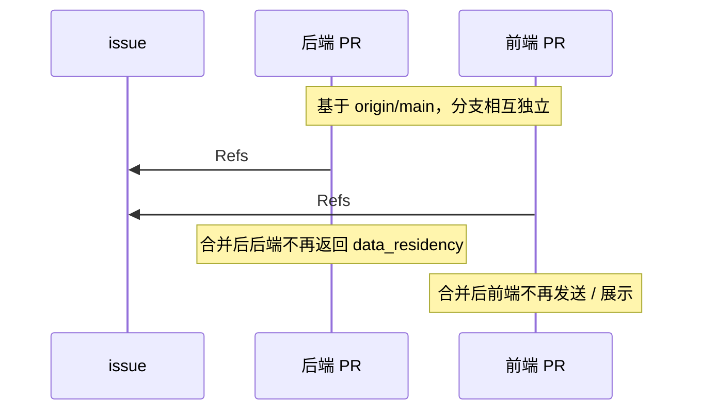

# 工作区 data_residency / geo 字段移除

本文记录移除 workspace `data_residency`（对外即 `workspace_geo`）字段的设计决策、影响范围与兼容取舍。该字段是早期为对齐 Anthropic Console workspace API 形状而引入的遗留字段；本项目不提供多地域推理，保留它只会产生无意义的默认值噪音，故整体移除。

## 背景与动机

- Anthropic workspace API 在创建/返回工作区时携带 `data_residency`（含 `workspace_geo`、`allowed_inference_geos`、`default_inference_geo`），用于约束数据存储与推理地域。
- Open Managed Agents 是单地域自托管部署，没有多地域推理能力；此前为保持 Console 前端与上游形状一致而保留该字段，但实际取值恒为默认（`us` / `unrestricted` / `global`），不产生任何路由或存储效果。
- 维护者决定移除该遗留对齐，减少误导性的"地域"UI 与无意义默认值（参见 issue #93）。

## 影响范围

移除覆盖 admin / console 两条工作区数据路径与前端展示层：

```mermaid
flowchart LR
  subgraph FE[前端 web]
    Dialog[CreateWorkspaceDialog<br/>geo 输入框]
    Table[WorkspacesSettingsPage<br/>Residency 列]
    Types[Workspace / CreateWorkspaceInput<br/>类型]
  end
  subgraph API[HTTP handler]
    ConsoleH[platformapi<br/>console_api_keys]
    AdminH[admin<br/>service / dto]
  end
  subgraph Domain[领域类型]
    Platform[platform.ConsoleWorkspace]
    AdminW[db.AdminWorkspace]
  end
  subgraph DB[(Postgres)]
    Col[workspaces.data_residency<br/>jsonb 列]
  end
  Dialog --> Types
  Table --> Types
  Types --> ConsoleH
  ConsoleH --> Platform
  AdminH --> AdminW
  Platform --> Col
  AdminW --> Col
```

移除后，上图中的 `data_residency` 节点在每一层都被删除：

- **DB**：新增 migration `00018_drop_workspace_data_residency.sql`，`drop column if exists data_residency`（幂等；Down 恢复带默认值的列）。
- **领域类型**：`platform.ConsoleWorkspace`、`db.AdminWorkspace` 移除 `DataResidency` 与 `DataResidencySettings` 字段。
- **HTTP handler**：console（`internal/platformapi/console_api_keys.go`）与 admin（`internal/admin/service.go`、`dto.go`、`domain_workspace.go`）的请求 DTO、响应映射、normalize/encode/decode 辅助函数与类型别名全部移除。
- **前端**：`web/src/shared/workspaces`（`api.ts` 类型、`presentation.ts` 的 `buildCreateWorkspaceInput`、`context.ts` fallback）、`CreateWorkspaceDialog`（geo Field 与 `FieldDescription`）、`WorkspacesSettingsPage`（Residency 列与 `geoLabel`）、i18n（`workspace.geo`、`workspace.geoHelp`、`settings.workspaces.residency`、`settings.workspaces.defaultInference`，en + zh-CN）。

## 数据模型与 migration

- migration `00018` 使用 `drop column if exists`，对已应用旧迁移的库与全新库都安全。
- `internal/db/schema.go` 是 legacy bootstrap 文本 schema（仅 `migrateLegacyTextIDSchema` 使用），按项目规则不修改；其内部仍保留旧列定义，但 `Migrate()` 在 goose migration 之后执行，`00018` 会把列删掉，最终 schema 不含该列。
- 不涉及外键（遵循 no-FK 规则），列删除无引用约束需要处理。

## API 合同与兼容取舍

移除 `data_residency` 会**偏离 Anthropic workspace API 合同**：创建工作区请求与工作区响应都不再携带该字段。这是有意取舍：

- 本项目不做多地域路由，该字段无实际语义。
- 调用方若仍按 Anthropic 形状在请求里发送 `data_residency`，后端 JSON 解码忽略未知字段（不报错），行为与移除前等价。
- 调用方若依赖响应中的 `data_residency`，将得到缺失/`undefined`；前端已在配套 PR 中同步移除读取。

console 与 admin 两条路径一致处理：

| 路径 | 创建请求 | 列表/详情响应 |
| --- | --- | --- |
| console `/api/console/organizations/{org}/workspaces` | 忽略 `data_residency` | 不返回 `data_residency` |
| admin `/v1/organizations/workspaces` | DTO 无该字段 | 响应无该字段 |

## 前后端协调

为避免单 PR 过大且前后端可独立评审，拆为两个 PR，均基于最新 `main`，互不依赖分支：



合并顺序与安全性：

- **后端先合并**：后端忽略请求中的 `data_residency`，前端旧版本仍发送该字段也不会出错（未知字段被忽略）。
- **前端先合并**：前端不再发送 `data_residency`，后端旧版本仍能正常创建（该字段本就是可选输入）。
- 合并顺序不限，任一先合都不会破坏运行中的系统；两者都合并后功能完整移除。

## 测试与验收

后端：

- `go build ./...`
- `golangci-lint run`（仓库 `.golangci.yml`）：0 issues
- `go test ./internal/admin/ ./internal/db/ ./tests/ -count=1`
- `just dead-code` / `just complexity` / `just duplicates`

后端测试调整：

- `tests/admin_api_test.go`：移除"更新工作区传 `data_residency` 应 400（不可变）"的断言——字段已不存在，该约束随之消失，后续 `external_key_id` 冲突断言的首次赋值由 `resp =` 改为 `resp :=`。
- `tests/platform_console_backend_api_test.go`：创建请求不再带 `data_residency`，且不再断言响应中 residency 归一化。
- `tests/platform_email_login_api_test.go`：创建工作区请求 body 去掉 `data_residency`。

前端：

- `bun run format:check`（Prettier）
- `bun test`（`WorkspacesSettingsPage.test.tsx`、`ConsoleLayout.test.tsx`、`DashboardPage.test.tsx`）
- `bun run build`
- `just complexity` / `just duplicates` / `bun run lint:naming`

前端测试调整：移除 `fooWorkspace.data_residency`、`Residency` 列断言、`buildCreateWorkspaceInput` 与创建流程中的 residency 断言。

## 回滚

- migration `00018` 的 Down 段恢复 `data_residency jsonb not null default '{"workspace_geo":"us","allowed_inference_geos":"unrestricted","default_inference_geo":"global"}'::jsonb`，可逆向。
- 代码层回滚需 revert 两个 PR；列恢复后旧默认值自动生效。
