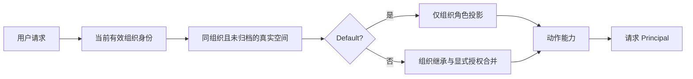

# #339 组织与工作区权限管理

## 授权合同

用户请求依次检查有效组织成员、工作区归属与未归档状态、有效角色、动作权限。每个新请求读取当前数据，Principal 仅承载本次计算结果；长期 session 不保存权限快照。

|组织角色|Default|普通工作区|
|---|---|---|
|admin|workspace_admin|继承 workspace_admin|
|billing|workspace_billing|继承 workspace_billing，允许显式 workspace_admin|
|developer|workspace_developer|需要有效显式成员|
|claude_code_user、user|workspace_user|需要有效显式成员|

未知组织角色不能获得授权。Default 完全忽略历史成员记录。普通空间 Org Admin 始终继承，Org Billing 只允许 Admin 覆盖；其他组织成员按有效显式角色授权。可见性不等于开发或管理权限，Workspace Admin 不获得组织管理权。

## 默认身份与历史数据

迁移 `00060_mark_default_workspaces.sql` 增加 `is_default` 和组织级部分唯一索引。已有默认空间通过旧固定 external ID 或 Default 名称识别；候选不唯一、缺失或归档时，整个迁移失败并报告组织 UUID。迁移保留 UUID、external ID、资源归属及历史成员。

**不清理、不改写历史 Default 成员记录。** Seed、组织创建、组织成员删除都不写这些记录。Default 的成员列表实时投影有效组织用户。#338 接受邀请只建立组织身份，不新增 Default 成员。默认空间的真实 UUID、external ID、Console `default` 别名统一解析后再判断保护。

Default 禁止改名、归档及所有成员变更；普通空间不能以 Default 名称创建。Console 创建已改为纯插入，冲突不能恢复归档空间。Workspace DELETE 继续不支持。

## Billing 提权与成员事务

`workspaceaccess.ChangeMember` 由 API 及后续 #336 页面复用。通过同一 Yourbatis executor，按 UUID 顺序锁定操作者与目标组织成员，再锁定工作区，重新校验权限与状态后写入。

- 普通空间 Billing 更新为 `workspace_admin`：创建或更新显式关系，重复成功。
- 更新为 `workspace_billing`：撤销显式关系，恢复继承，不创建 Billing 成员行；重复成功。
- Billing 不允许其他角色更新或成员 DELETE；未提权 Billing 不能自行提权。
- Org Admin 继承不可修改、删除。组织角色降级后，原显式 Workspace Admin 仍有效，直到显式撤销。
- 普通空间成员合并继承与显式关系并去重。历史 Default 行不参与投影。

业务撤销普通空间授权可以正常软删除；这与禁止历史批量清理不同。

## API 与 Console

官方 List Workspaces 在 SQL 分页前排除 Default，Get 支持真实 ID。Console 列出实际可访问空间，包含真实 Default，增加只读 `is_default`、`effective_role`、`role_source`。前端将真实 Default 映射为展示别名，不再凭空添加或按名称去重，管理入口消费服务器权限。

当前仓库没有独立 Admin Key 类型。Workspace Key 继续仅作为工作区凭据，不根据创建者获得组织权限；组织管理 API 要求当前有效 Org Admin 用户会话，工作区成员接口也允许目标空间的 Workspace Admin。旧版本允许 Workspace Key 调用组织管理接口的行为不再保留，外部响应字段保持原样。增加独立 Admin Key 不属于本任务。

未认证为 401，用户权限不足或归档空间新业务为 403，已授权管理范围内目标缺失为 404，Default 保护及非法角色操作为 400。资源稳定错误集中到 `errors.go`。

## 发布与回退

只发布身份标记迁移与新授权代码，不安排历史成员清理批次。回退必须使用满足本授权合同的兼容版本；历史成员仍在不代表旧授权逻辑可以安全恢复。

## 验证范围

自动化覆盖角色矩阵、Default 历史冲突忽略、真实 ID/别名保护、Billing 提权恢复、组织降级后的显式授权保留及跨组织拒绝。真实 PostgreSQL 验证迁移失败原子性、标记唯一性与成员记录原样保留，以及事务绑定和扫描。迁移测试使用 `TEST_MIGRATION_DATABASE_URL`；跳过不算验收通过。

最终产品对照使用 platform.claude.com 已登录页面。已观察 Default 出现在列表、操作菜单没有改名或归档；Key 页面说明 Workspace Key 在创建者离开后继续有效。Billing 角色切换、实际撤权与归档后的请求必须使用相应测试账号执行，不能以页面文案代替实测。详细执行结果记录在验收记录中。

## 相邻任务

#338 负责邀请接受与组织切换；#336 负责新成员管理 UI、最后一个 Org Admin 保护、个人凭据和长连接撤权；#95/#96 负责归档后的 Key 和任务联动；#335 负责团队生命周期验收。不扩展全局 Account、自定义角色、SSO 或凭据所有权模型。

详细执行结果及未实测范围见 [验收记录](./组织与工作区权限管理验收记录.md)。

### 手测反馈补充：跨工作区导航与成员入口

工作区选择器切换时，资源详情必须回到目标工作区同类资源列表，丢弃旧资源 ID、详情标签与 URL 筛选条件。Console 路由内容以工作区为边界重新挂载，避免复用旧空间的表单、分页及选择状态。同一工作区重复选择保持当前详情。组织设置路由保持稳定。

`/members` 是工作区成员入口：Default 仅显示“默认工作区的成员在组织级别管理”及 `/settings/members` 跳转，不请求或修改成员；普通工作区只读展示后端有效成员投影，按真实工作区 ID 请求并处理分页。`/settings/members` 继续负责组织成员。完整普通空间成员编辑 UI 仍属于 #336。

### 列表查询与单成员查询

- Console 工作区列表复用当前请求已经校验的组织身份及工作区列表事实；非组织管理员通过一次 Yourbatis 查询取得当前用户的普通空间显式角色，组织管理员不查询显式角色。逐空间复用 `Effective` 计算权限，不重复读取同一组织用户和空间。
- 批量查询按组织 UUID、用户 UUID 限定，并排除 Default 历史成员、已删除成员和归档空间。角色数据只用于当前请求，不写入长期缓存。
- 单成员读取先检查操作者对目标空间的管理权限，再通过统一授权服务解析目标用户；不生成全组织成员列表。不存在或无有效空间身份的目标仍返回 404，操作者无权仍返回 403。
- 成员变更直接使用现有 DB 的 Yourbatis 事务入口；锁定与事务内重新授权保持不变。
- 回归覆盖 100 个普通空间下固定的批量查询次数、跨组织过滤、Default 历史授权忽略、Billing 显式提权，以及真实 PostgreSQL 的绑定和扫描。

### 保留名称、报表入口及前端拒绝语义

- 普通工作区创建和重命名均拒绝 `Default` 的任意大小写变体，输入先在资源边界去除首尾空白。
- Admin API 的用量、成本和限流读取统一要求组织 Admin/Billing；工作区限流入口额外校验目标工作区归属和状态。
- 工作区列表加载或失败期间不把空 ID 写入本地偏好；服务端明确返回空权限数组时不回退组织角色，避免恢复已撤销的管理入口。
