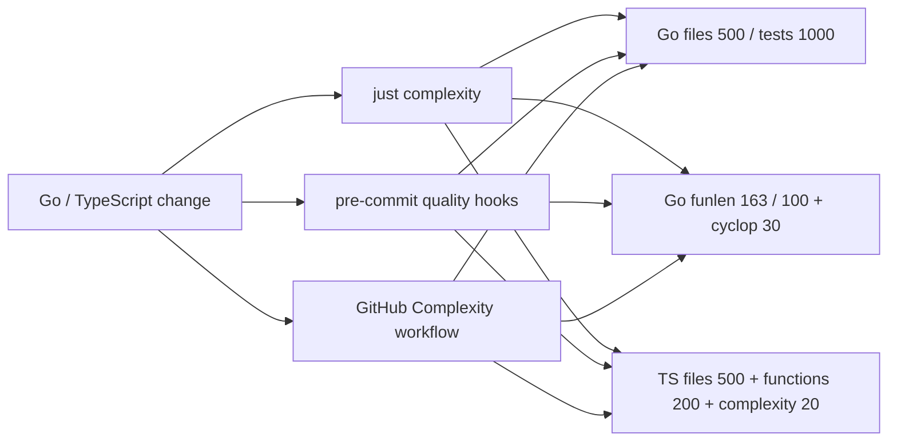

# 代码规模、函数长度与复杂度门禁

## 目标

仓库对 Go 和前端生产代码持续检查文件行数、函数长度与圈复杂度，并在本地提交与 CI 阶段阻止指标超过预算。三项指标分别约束模块职责、局部职责和分支结构，不能相互替代。门禁采用“新代码严格、历史热点只降不升”的策略，使维护债务可见且不能继续增长，同时避免为了首次接入而进行大范围行为重构。

## Go 策略

- `.golangci-complexity.yml` 启用 `cyclop` 和 `funlen`。生产函数圈复杂度上限为 30；函数长度以当前最大值作为全仓 ratchet，上限为 163 行且最多 100 条语句。
- `run.tests: false` 将长场景测试排除在生产函数长度和复杂度指标之外；测试仍由常规 golangci-lint 和 `go test ./...` 覆盖。
- `scripts/check-go-file-lines.sh` 读取工作区中的受跟踪 Go 文件，生产文件默认最多 500 个物理行，测试文件默认最多 1000 行；带标准 `Code generated ... DO NOT EDIT.` 标记的生成代码不参与人工维护指标。本地执行会检查尚未暂存的修改，pre-commit 执行时则由框架暂存非提交内容后检查待提交快照。
- `scripts/go-file-line-budgets.txt` 记录首次接入时已经超限的历史文件及其精确行数。文件增加一行即失败；文件缩短后若未同步收紧预算，也会以 stale budget 失败。
- `scripts/tests/check-go-file-lines_test.sh` 覆盖生产文件超限、测试文件超限、预算未收紧、默认边界、历史预算边界和生成文件排除场景。
- `scripts/go-complexity.sh` 只枚举当前 Go module 的仓库 package，避免本地 `web/node_modules` 中第三方 Go 源码污染结果。
- 本次接入将请求客户端识别和公开 session 事件校验拆成聚焦辅助函数，使原有 41 和 34 的热点降至预算以内，同时保持返回值和错误文案不变。

## TypeScript 与 React 策略

- `web/eslint.complexity.config.js` 使用 ESLint `max-lines`、`max-lines-per-function` 和 `complexity` 的 `modified` 变体。默认生产文件最多 500 个有效行，单函数最多 200 个有效行，圈复杂度上限为 20；空行和纯注释不计入行数。
- `*.test.*`、`*.suite.*` 和 `test-utils.*` 不纳入生产指标；生成文件也不参与手写代码门禁。
- 首次测量已超过默认值的历史文件在配置中分别记录当前文件行数、文件内最大函数长度和最大圈复杂度。这些值是 ratchet：CI 会阻止指标继续增长，新文件不会继承历史预算。
- 本次接入把 tool permission 归一化逻辑从复杂度 51 拆成记录选择、字符串归一化和最终决策函数；其所在文件预算已按重测后的最大值 29 记录。
- 后续拆分热点时应同步下调或删除对应文件预算，禁止扩大文件模式或加入 disable 注释。

## 执行链



## 验收

```bash
just complexity
just test-go-file-lines
just hooks-run
go test ./... -count=1
cd web && bun test && bun run build && bun run format:check
```
