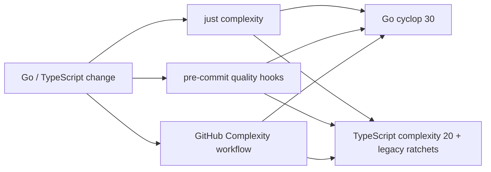

# 圈复杂度门禁

## 目标

仓库对 Go 和前端生产代码持续检查圈复杂度，并在本地提交与 CI 阶段阻止分支结构超过预算。文件总行数和函数行数不再作为自动化门禁；代码职责与可维护性继续通过评审、重复代码检查、静态分析和测试保证。

## Go 策略

- `.golangci-complexity.yml` 仅启用 `cyclop`，生产函数圈复杂度上限为 30。
- `run.tests: false` 将测试文件排除在生产代码复杂度指标之外；测试仍由常规 golangci-lint 和 `go test ./...` 覆盖。
- `scripts/go-complexity.sh` 只枚举当前 Go module 的仓库 package，避免本地 `web/node_modules` 中第三方 Go 源码污染结果。

## TypeScript 与 React 策略

- `web/eslint.complexity.config.js` 使用 ESLint `complexity` 的 `modified` 变体，默认圈复杂度上限为 20。
- `*.test.*`、`*.suite.*` 和 `test-utils.*` 不纳入生产指标；生成文件也不参与手写代码门禁。
- 首次测量已超过默认值的历史文件记录当前最大圈复杂度，作为只能下降的 ratchet；新文件不会继承历史预算。
- 后续拆分热点时应同步下调或删除对应复杂度预算，禁止扩大文件模式或加入 disable 注释。

## 执行链



## 验收

```bash
just complexity
just hooks-run
go test ./... -count=1
cd web && bun test && bun run build && bun run format:check
```
