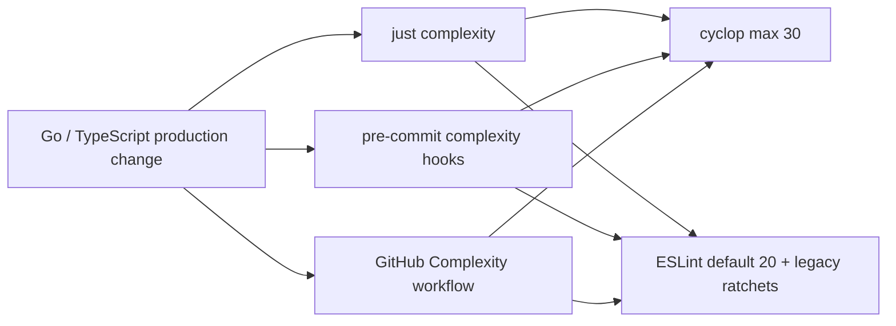

# 圈复杂度门禁

## 目标

仓库对 Go 和前端生产代码持续计算圈复杂度，并在本地提交与 CI 阶段阻止复杂度超过预算。门禁采用“新代码严格、历史热点只降不升”的策略，使复杂度债务可见且不能继续增长，同时避免为了首次接入而进行大范围行为重构。

## Go 策略

- `.golangci-complexity.yml` 单独启用 `cyclop`，生产函数上限为 30。
- `run.tests: false` 将长场景测试排除在生产复杂度指标之外；测试仍由常规 golangci-lint 和 `go test ./...` 覆盖。
- `scripts/go-complexity.sh` 只枚举当前 Go module 的仓库 package，避免本地 `web/node_modules` 中第三方 Go 源码污染结果。
- 本次接入将请求客户端识别和公开 session 事件校验拆成聚焦辅助函数，使原有 41 和 34 的热点降至预算以内，同时保持返回值和错误文案不变。

## TypeScript 与 React 策略

- `web/eslint.complexity.config.js` 使用 ESLint `complexity` 的 `modified` 变体；默认生产函数上限为 20。
- `*.test.*`、`*.suite.*` 和 `test-utils.*` 不纳入生产指标；生成文件也不参与手写代码门禁。
- 首次测量已超过 20 的历史文件在配置中记录其当前文件最大值。该值是 ratchet：CI 会阻止最大函数继续增长，新文件不会继承这些预算。
- 本次接入把 tool permission 归一化逻辑从复杂度 51 拆成记录选择、字符串归一化和最终决策函数；其所在文件预算已按重测后的最大值 29 记录。
- 后续拆分热点时应同步下调或删除对应文件预算，禁止扩大文件模式或加入 disable 注释。

## 执行链



## 验收

```bash
just complexity
just hooks-run
go test ./... -count=1
cd web && bun test && bun run build && bun run format:check
```
