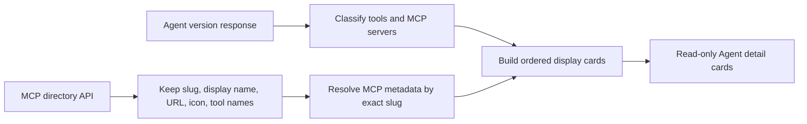

# Agent detail MCP 与工具展示

> 当前实现状态：本文描述已落地的静态 Directory 展示。私有或未知 MCP 在 Directory 没有非空工具名时仍显示 `No tool list available.`，尚未执行实时 `tools/list`。动态发现、持久缓存和刷新状态的 Proposed 设计见 [Agent Detail MCP Tool Catalog 动态发现与缓存设计](../mcp-tool-catalog-discovery.md)。

## 目标与边界

Agent 详情页的 `MCPs and tools` 区域只负责展示当前 agent 版本的工具配置，不在详情态修改权限。数据仍由现有 `/v1/agents/{id}?beta=true` 提供；MCP 工具清单由 Console API 的 MCP 目录补全，不改变 Anthropic 兼容 API 的响应结构。

## 展示模型

页面按以下固定顺序生成可并存的卡片：

1. 第一项 `type` 以 `agent_toolset_` 开头的内置 toolset。
2. 所有 `type=custom` 的工具合并成一张 custom tools 卡片。
3. `mcp_servers` 中的每个 server 各一张卡片，并保留原始顺序。

孤立的 `mcp_toolset` 权限配置不会单独生成 MCP 卡片。三类配置都不存在时，Section 只显示 `No MCPs or tools configured.`，不渲染占位卡片。卡片默认折叠；custom 卡片的折叠行显示 `Tools`，内置/MCP 卡片显示 `Tool permissions`。custom tool 行只显示名称和描述，内置/MCP 工具行额外显示只读权限 badge。

当前后端只接受 `agent_toolset_20260401`。为兼容升级前留下的 legacy Agent 配置，详情页把第一个 `agent_toolset_*` 视为当前内置 toolset，使用 `agent_toolset_20260401` 的定义和 subtitle，同时继续读取 legacy `tool_name` 权限字段；这与编辑配置时的 canonicalization 行为一致。引入下一版内置 toolset 时必须先扩充版本化定义和选择规则，不能继续无条件归一化到旧的 current 常量。

## MCP 元数据

前端请求：

`GET /api/directory/servers?type=remote&visibility=commercial&sort=popular&limit=500`

成功结果在模块内缓存一小时，并仅保留展示需要的字段，避免长期持有完整目录响应。当前后端 embed 路由不处理 query 参数，因此前端归一化时显式排除非 `remote` 和非 commercial 条目。目录 URL 优先读取 `remote.url`，并兼容 `remote.url_options[0].url`；只有 `url_regex` 或租户字段、没有 concrete URL 的 remote 条目仍保留 slug、图标和工具名，因为最终展示 URL 始终来自 Agent 配置。server 元数据按以下优先级解析：

1. `tunnel:` server：显示配置 URL 的 host（解析失败时使用名称后缀），工具清单为空。
2. MCP 目录中 `slug` 与配置 `name` 严格相等的记录；URL 始终使用 agent 当前配置值。
3. GitHub、Slack 内置元数据。
4. 对未知 server 将配置名称 humanize，工具清单为空。

目录请求失败时不阻塞详情页：保留 fallback 元数据；展开未知 MCP 时显示 `No tool list available.`。权限配置中的 `configs[].name` 不会被误当成目录工具清单。

## 权限计算

内置 toolset 与对应 MCP `mcp_toolset` 共用同一套权限计算；逐工具字段匹配略有差异：

- 内置 toolset 优先匹配 `configs[].name`，缺失时兼容旧字段 `tool_name`；MCP `mcp_toolset` 只匹配 schema 中的 `configs[].name`。
- 重复的逐工具配置与运行时一致，使用第一个匹配项。
- 未命中逐工具配置时使用 `default_config`。
- `enabled=false` 显示为 `Always deny`。
- 其余读取 `permission_policy.type`；缺失或无效值按 toolset 类型回退：内置工具为 `Always allow`，MCP 为 `Always ask`。
- 所有已知工具权限相同则显示该权限；混合时聚合 badge 显示 `Custom`；内置 toolset 没有已知工具时显示默认 `Always allow`。
- MCP 没有已知工具时，聚合 badge 显示对应 `default_config`；没有匹配 `mcp_toolset` 时显示运行时默认的 `Always ask`。

`Custom` 只是一种聚合展示态，不写入 agent 配置。详情页不渲染权限选择器、删除按钮或其他编辑控件。

## 代码边界与验证

- `agents/tools/model.ts`：纯展示模型、目录归一化、权限计算和内置 fallback。
- `agents/tools/api.ts`：MCP 目录读取与一小时缓存。
- `agents/tools/AgentToolsSection.tsx`：只读卡片、折叠交互与状态 badge。
- `agents/detail.tsx`：只选择 Section 空态或挂载工具 feature。

验证覆盖孤立 `mcp_toolset`、未知 MCP、无 concrete URL 的 remote metadata、local 过滤、GitHub/Slack fallback、目录失败、MCP 默认 ask、重复配置 first-wins、deny 派生、混合聚合、三类卡片共存、目录 URL 覆盖、图标失败 fallback、custom 无权限 UI、空态无占位卡片以及历史 Agent 版本的工具区切换。目录 API 测试额外覆盖并发去重、成功缓存和失败后重试。
