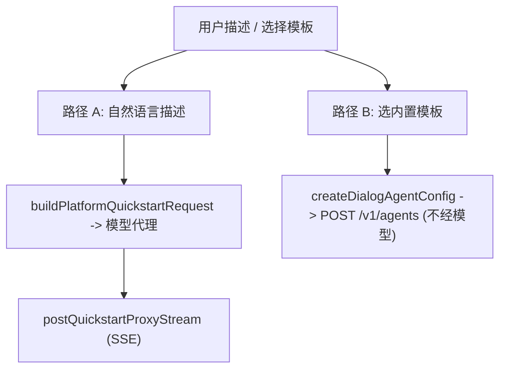
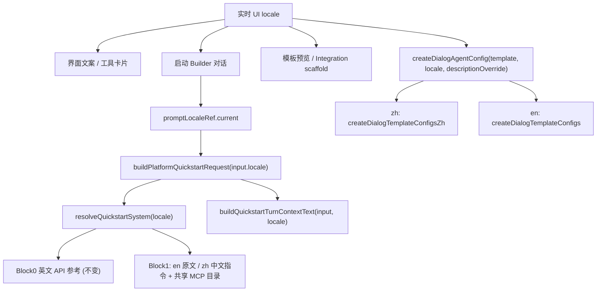
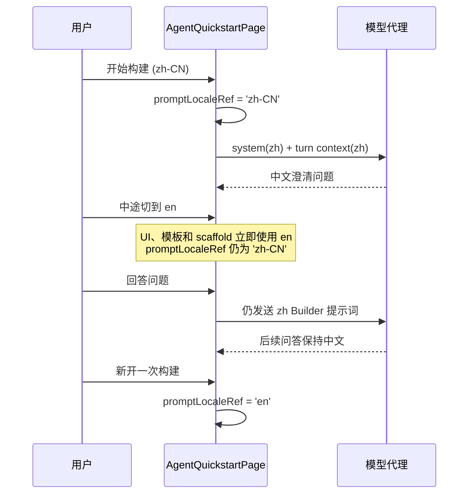

# Quickstart / Agent Builder 提示词 i18n

> 关联 issue：[#12 提示词增加 i18n](https://github.com/superduck-ai/open-managed-agents/issues/12)。当前状态：**已实现**；验证范围见文末。

## 目标与边界

给 Managed Agents 的 Agent 构建流程（Quickstart 与 Create Agent Dialog）增加界面语言驱动的提示词国际化，并明确区分三类语言来源：

- Builder 的交互语言以及 system Block 1、turn context、tool-result 等模型可见流程文本跟随 Builder 启动时的 UI locale；
- 内置模板的展示文本和写入 Agent 的模板配置跟随当前 UI locale；
- 模型生成的 `name` / `description` / `system` 等自然语言内容跟随用户输入语言或用户显式指定的语言，不由 UI locale 强制覆盖。

英文界面保持现有英文行为，中文界面提供对应的 Builder 流程提示和内置模板配置。

范围限定在**前端如何选择与组织提示词/模板**，不改后端、不改 Anthropic 兼容 API 合同、不改 Agent 数据模型。具体覆盖：

- 通过自然语言描述生成 Agent 的对话流（Agent Builder）；
- Quickstart 各阶段与用户交互的提示、澄清问题、tool-result 回传文案；
- Quickstart 右侧全部内置模板的展示与最终写入 Agent 的 `name` / `description` / `system`；
- Create Agent Dialog 的 describe / template 两种模式。
- 删除上游搜索工具偶发输出的 `Search results for query:` 临时 narration；保留真实 tool call、输入和结果。

不在本次范围：Workbench、SDK 测试数据、第三方 MCP 目录内容；后端服务与数据库。

## 关键约束

- **技术标识不翻译**：`model` ID、tool 名、MCP server 名与 URL、step key（`agent` / `environment` / `session` / `deploy` / `integrate`）、JSON 字段、metadata key、协议枚举在中英两套配置中逐字段一致。
- **Block 0 API 参考保持英文**：系统提示词由两个 text block 组成，Block 0（约 127KB）是纯 Managed Agents API 参考文档，用户不可见、且全是技术标识；翻译它成本高、风险大、收益为零，且与"不翻译技术标识"约束冲突，故保留英文。只本地化 Block 1（Agent Builder 行为指令，约 38KB）。
- **Builder 流程语言与生成内容语言分离**：Builder 自身的说明、澄清问题和模型可见流程文本使用 Builder 启动时的 UI locale；最终生成内容不被 UI locale 强制限定，模型根据用户输入语言与显式要求决定 `name` / `description` / `system` 的语言。中文 Builder 指令只负责清楚说明该规则，不追加粗暴的"请用中文输出"。
- **后端零改动**：提示词经 `/api/organizations/{orgUuid}/proxy/v1/messages` 透传给 Anthropic，代理只读 `stream` 字段、不解析 system/messages/tools 内容；模板仍走现有 `/v1/agents` 创建接口。

## 现状梳理

i18n 基建为自研 `react-intl` 薄封装：组件通过 `useI18n()` 拿到 `{ locale, setLocale, msg }`，翻译存 `web/src/shared/i18n/messages/{en,zh-CN}.json`，`I18nProvider.test.tsx` 守卫两边 key 对齐。

Agent 构建有两条路径：

当前缺口：`platformQuickstartOfficialRequest.generated.ts` 的 system prompt、`buildQuickstartTurnContextText` 的 turn context、`AgentQuickstartPage` 里的 tool-result 文案、`createDialogTemplateConfigs` 的模板 `name/description/system` 全为硬编码英文，完全没有 locale 分支。仅模板 `title` / `body`（展示层）已通过 `labels.ts` + `messages/*.json` 中文化。

## 设计方案

### locale 注入策略

纯函数模块（`platformQuickstartRequest.ts`、`agentConfig.ts`）不能用 hook，统一**新增可选 `locale` 参数（默认 `'en'`，向后兼容）**；组件层从 `useI18n()` 读 `locale` 传入。

边界原则：**UI 展示文案**继续走 `messages/*.json`（`msg()`）；**模型可见的提示词文案**（system Block 1、turn context、tool-result）单独放新模块 `quickstartPromptText.ts`，不混入 UI 目录，保持两类文本的关注点分离。

### 对话内固定模型提示词语言，不冻结界面与配置 locale

一次 Quickstart Builder 对话开始时，把当时的 locale 记入 `promptLocaleRef`。只有模型可见的 Builder 提示词模板保持该语言，包括 system Block 1、turn context、tool-result 和用户回复对应的 tool-result；这样同一段模型对话不会因中途切换界面语言而混用两套流程提示。

- UI 文案、工具卡片、模板预览、内置模板配置和 Integration scaffold 始终读取实时 UI locale，不使用 `promptLocaleRef`；
- 中途切换 UI locale 会立即更新这些展示与配置入口，不中断在途 SSE 流、不重置状态，也不改写历史消息或已经生成的配置；
- 之后新开始的 Builder 对话或新选择的模板使用切换后的实时 UI locale。

这里固定的是一次对话所用的**模型提示词模板语言**，不是整个运行时 locale，更不是样式或所有配置的 locale。

### system prompt 组装（`quickstartPromptText.ts`）

- 引入英文 `platformQuickstartSystem`（两个 block），`resolveQuickstartSystem(locale)`：`en` 原样返回；`zh-CN` 返回 `[block0English, block1Zh]`。
- `block1Zh` 中文重写 Block 1 的行为指令（STEP 1~INTEGRATE 流程、`HOW TO ASK QUESTIONS`、`build_agent_config rules`、`TURN CONTEXT`、`LINKS`、`SELECTING A VAULT`），保持同能力 / 同流程 / 同约束，并整合语言指示（与用户用中文对话；生成内容默认跟随用户输入语言；用户显式指定语言时优先）。
- **MCP 目录单源不重复**：从英文 Block 1 用锚点切片（`Known servers (URLs on file):\n` 与 `\n  If the user names a service not in this list`）提取约 330 行目录原样拼接，避免维护两份 URL 列表导致漂移。

### turn context 与 tool-result

- `buildQuickstartTurnContextText(input, locale)`：中文自然语句分支；`[Current quickstart step: "agent"]` 等机器状态行与 step 值保持英文（模型据此对齐 system prompt 的 step key）。英文分支保持现字符串不变。
- tool-result 文案集中到 `quickstartToolResultText(locale)`（返回一组按 locale 分支的字符串 / 构造函数），覆盖 `AgentQuickstartPage` 内全部模型可见的 `content` / `result` 文案（环境、vault、凭据、部署、session、集成、创建 agent 失败提示、`No organization` 等），均保留 id / URL / 端点等技术标识。`integrationScaffoldPrompt(agentId, environmentId, locale)`、`quickstartChatReplyToolResult(call, reply, locale)` 也提供中文版。
- 上游搜索工具偶尔会输出 `Search results for query:` 这类临时 narration。该文字不承载工具结果，且与工具卡片重复，因此前端直接丢弃，不展示也不写入后续 conversation message；真实 tool call、输入和结果保持不变。
- 磁性字符串一致性：`quickstartChatReplyToolResult` 的 `build_agent_config` 分支（en `User sent a message instead: "…"` / zh `用户改为发送了消息："…"`）与 `block1Zh` STEP 3.4 中「session 仍在进行」的判断措辞保持同步。
- `quickstartToolMeta(name, msg?)`：工具卡片标签属于 UI 展示层，改为经 `msg()` 读 `managedAgents.quickstart.toolMeta.*` key（en / zh-CN 两边已对齐）。

### 内置模板中文配置

- `agentTemplateCatalog.ts` 维护模板展示目录与应用标签，`agentConfigTemplateText.ts` 维护中文 `name` / `description` / `system`；`agentConfig.ts` 在配置边界组装 `createDialogTemplateConfigsZh`，并保留原有公共导出。
- 中文模板的 `model` / `mcp_servers` / `tools` / `skills` / `metadata` 与英文表逐字段一致。同时提供 `structuredExtractorSystemZh` 与 blank 的中文配置。
- `createDialogAgentConfig` / `templateSystem` / `generateCreateAgentConfig` / `codeForTemplate` 等增加 `locale`，按语言选表；`generateCreateAgentConfig` 把 locale 透传给 `buildPlatformQuickstartRequest`。右侧展示的模板配置代码块也随语言切换。

## 涉及文件

| 文件 | 改动 |
| --- | --- |
| `web/src/features/managed-agents/quickstart/quickstartPromptText.ts`（新增） | `resolveQuickstartSystem`、`block1Zh` 与中文 tool-result 文案 |
| `web/src/features/managed-agents/quickstart/platformQuickstartRequest.ts` | `QuickstartRequestInput` 加 `locale?`；`buildPlatformQuickstartRequest` 用 `resolveQuickstartSystem`；`buildQuickstartTurnContextText` 加中英分支 |
| `web/src/features/managed-agents/agentTemplateCatalog.ts`（新增） | 承载模板展示目录与应用标签，避免配置编排模块继续膨胀 |
| `web/src/features/managed-agents/agentConfigTemplateText.ts`（新增） | 集中维护中文模板自然语言字段与 `structuredExtractorSystemZh` |
| `web/src/features/managed-agents/agentConfig.ts` | 组装并继续导出中英文模板配置；相关函数加 `locale` 并选表 |
| `web/src/features/managed-agents/quickstart/AgentQuickstartPage.tsx` | 新增 `promptLocaleRef`，仅固定模型可见 Builder 对话语言；UI、模板配置与 Integration scaffold 继续使用实时 locale |
| `web/src/features/managed-agents/agents/create-dialog.tsx` | `createDialogAgentConfig` / `generateCreateAgentConfig` 传 `locale` |
| `web/src/features/managed-agents/agents/create-dialog-config-editor.tsx`（新增） | 承载 Create Agent Dialog 的 YAML/JSON 编辑器展示与格式切换 |
| `web/src/features/managed-agents/quickstart/components.tsx` | `codeForTemplate` 等传 `locale`；残余硬编码英文按 locale 切换；丢弃上游搜索临时 narration |
| `web/src/shared/i18n/messages/{en,zh-CN}.json` | 补齐新增 UI key（两边对齐） |

## 测试与验证

- `agentConfig.test.ts`：守卫中英模板 key 和技术配置逐字段一致；断言中英文自然语言字段不同；覆盖 locale 默认值、新参数顺序和 description override。
- `platformQuickstartRequest.test.ts`：断言 `en` 分支不变；`zh-CN` 分支 system 第二块为中文且技术 token（tool 名、MCP URL、step key、model ID）保留；turn context 与 tool-result 中文分支正确。
- `ManagedAgentsPage.quickstart.suite.tsx`：断言搜索临时 narration 不展示也不写入后续请求；断言中途切换 UI locale 后界面立即更新，而进行中的 Builder 对话仍使用启动时的 prompt locale。
- 运行 `just complexity`、`just web-format-check`、`bun test`、`bun run lint:naming` 与 `bun run build`。

## 不做的事

- 不翻译 Block 0 API 参考；不手改 `platformQuickstartOfficialRequest.generated.ts`（通过新模块派生）。
- 不改后端、不改 `/v1` 与 `/api` 合同、不引入新依赖。
