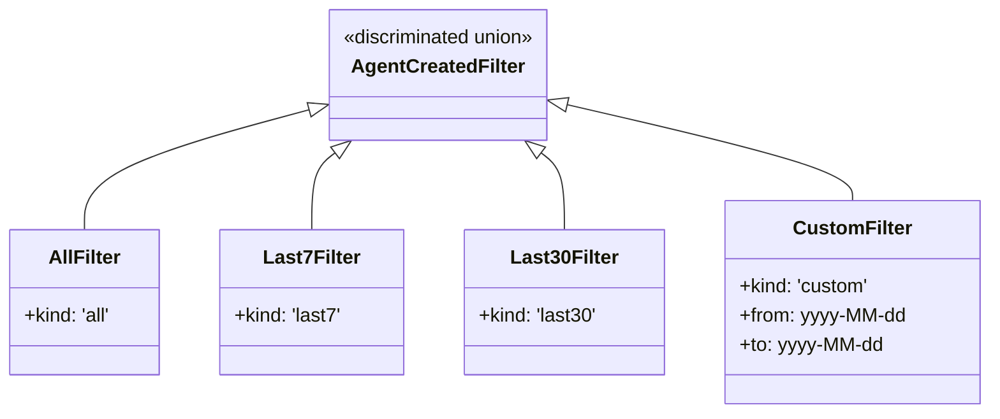
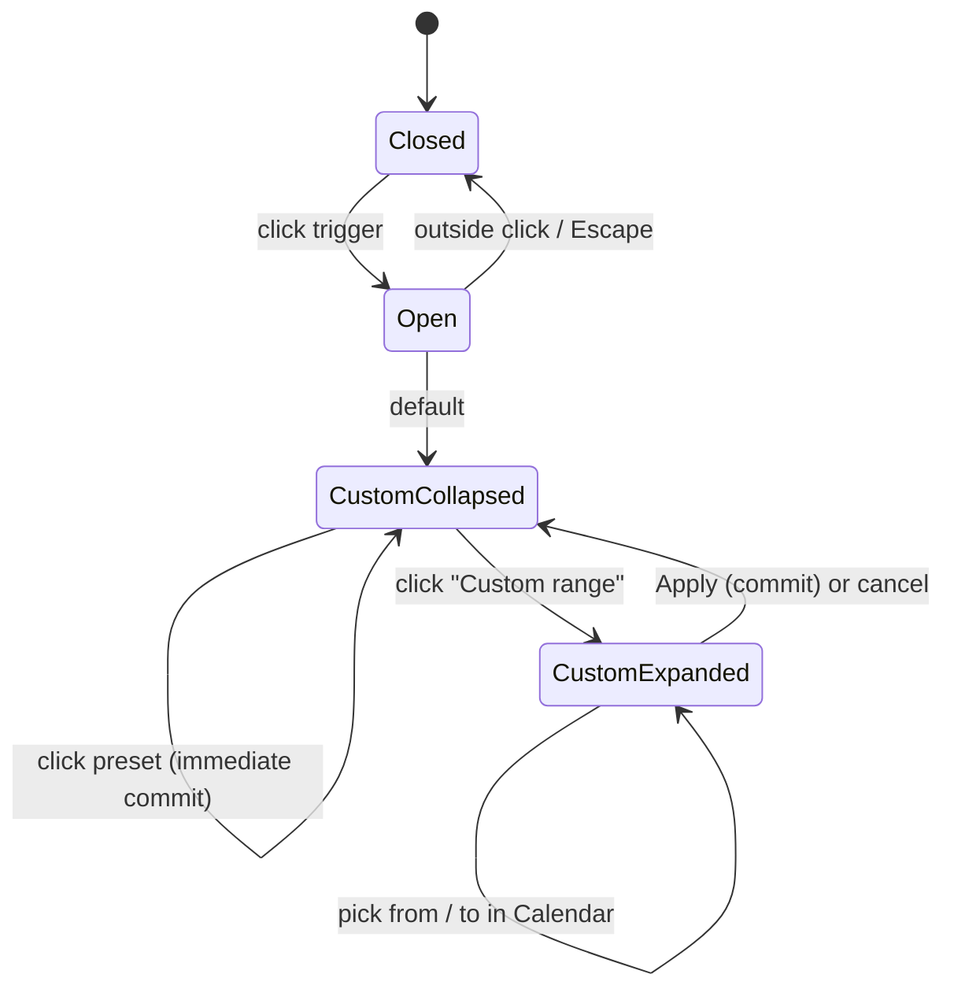

# Agents 列表「Created」过滤器

## 概述

Agents 列表页（`/workspaces/{id}/agents`）的「Created」过滤器支持两种形态：

- **Preset**：All time / Last 7 days / Last 30 days，点击即时生效。
- **Custom Range**：自定义日期区间，展开日历选择 `from → to`，点击 Apply 后提交。

## 类型模型

`AgentCreatedFilter` 为可辨识联合，preset 与 custom 统一表达：

`createdFilterRequestKey` 为每个 filter 生成稳定的字符串身份（custom 含 `from`/`to`），用作请求缓存键；切换任一边界都会失效缓存。

## UI 交互

- Preset 点击即时提交并关闭 popover。
- Custom Range 默认折叠；当当前值已是 custom 时，打开 popover 默认展开，便于直接编辑。
- Custom Range 必须 Apply 才提交；编辑 draft 期间不发列表请求。Apply 要求 `from && to` 都已选。
- 每次打开 popover 都从已提交值重新 seed draft，取消后再打开能恢复上次范围。

## 组件结构

- `CreatedFilterDropdown`：Popover trigger + 内容区。
  - 内容区上半部分是 preset 列表，使用共享 `RadioGroup`（`@base-ui`）获得方向键导航与 roving tabindex；每个选项是整行可点击区域（active 整行高亮），因此直接用 `Radio.Root` 而非带圆圈的 `RadioGroupItem`。
  - 下半部分是 Custom Range 折叠入口 + 展开后的 `Calendar`。
- `Calendar`（shadcn / `react-day-picker` v10 `mode="range"`）：范围选择，单月。

## API 边界

`createdFilterRange` 将 `AgentCreatedFilter` 映射为 `created_at[gte]` / `created_at[lte]`（inclusive，ISO-8601）：

| kind | gte | lte |
| --- | --- | --- |
| `all` | `null` | `null` |
| `last7` | `now − 7d`（UTC ISO） | `null` |
| `last30` | `now − 30d`（UTC ISO） | `null` |
| `custom` | `{from}T00:00:00.000Z` | `{to}T23:59:59.999Z` |

custom 的两个 `yyyy-MM-dd` 映射为 UTC 日始 / 日末，确保选中的整两天都被包含。后端 `internal/agents/handler.go` 已解析 `[gte]` / `[lte]`，无需后端改动。客户端 `agentMatchesClientFilters` 同步支持上下界，保证搜索聚合结果在客户端再裁剪一次。

## 时区与本地化

存储与 API 边界都基于**日历日**，展示层负责本地化：

- **存储**：`from` / `to` 为 `yyyy-MM-dd`（`applyCustomRange` 用 `date-fns` `format` 序列化 Calendar 选中的本地 Date）。
- **解析**：`labels.ts` 用 `date-fns` `parseISO` 把 `yyyy-MM-dd` 解析为**本地**日。早期实现用 `Date.parse`，会把 `yyyy-MM-dd` 当 UTC 午夜，在 UTC− 时区把展示标签前移一天（如 PST 下选 `2026-07-20` 显示成 `Jul 19, 2026`）。
- **展示**：trigger label 与 draft 预览共用 `formatCreatedRange` / `formatCreatedRangeDay`，内部基于 `Intl.DateTimeFormat(locale)`，中文界面输出中文月份（如 `2026年7月20日`），不再固定英文 `MMM d, yyyy`。
- **API 边界**用 UTC 日边界（见上表），与日历日解耦，避免不同时区用户看到不同结果集。

## 键盘可达性

- Preset 列表：`RadioGroup` 提供方向键切换 + roving tabindex；选中即提交。
- Custom Range 折叠入口：普通 button，`aria-expanded` / `aria-controls` 关联展开区。
- Calendar day：`react-day-picker` 内置键盘导航（方向键、`PageUp/Down`、`Home/End`），`CalendarDayButton` 保留本地 ref + `modifiers.focused` effect，对齐上游 `DayButton` 默认实现的聚焦行为。

## 测试计划

- `ManagedAgentsPage.agents.suite.tsx`
  - preset 点击即时生效、popover 样式、`aria-checked`。
  - Custom Range 端到端：展开 → 选 `from`/`to` → Apply 前不发请求 → Apply 后 URL 同时含 `created_at[gte]` 与 `[lte]`，上下界值正确 → trigger label 显示已提交范围。
  - zh-CN locale：preset / Custom range 入口文案本地化。
- `labels.test.ts`（文件级 `TZ=America/Los_Angeles`）
  - UTC− 时区下 custom range 标签不偏移一天（`parseISO` 路径 vs `Date.parse` 的对比回归）。
  - `en` / `zh-CN` 单日与范围格式化、同日折叠、invalid fallback、preset 文案。

## 不在本期范围

Custom Range 的 **URL 序列化与刷新恢复**（`#109` 验证计划中提及）未在本 PR 实现：当前选择范围不持久化到 URL，刷新会回到 All time。作为 `#109` 的后续工作单独跟踪于 #135。
