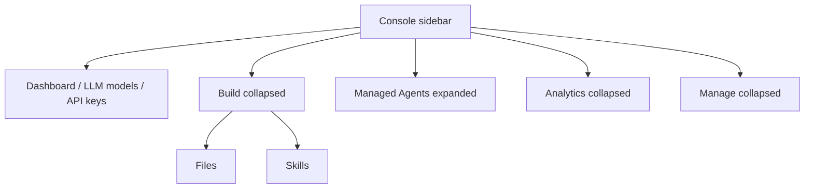

# Console 侧边栏导航

控制台侧边栏只决定入口是否展示，不删除页面、路由或 API。直接打开既有路径仍然进入对应页面。

## 默认展开

进入控制台时，只有 `Managed Agents` 分组默认展开。`Build`、`Analytics`、`Manage` 以及其他分组默认折叠。若当前路径命中某个仍显示在侧边栏中的子项，该分组一并展开，从而能看到当前项。已从侧边栏隐藏的 Workbench、Batches 和 Claude Code 不会因此把所属分组展开。Dashboard、LLM models、API keys 这类顶层链接保持可见。

分组的展开状态保存在当前侧边栏实例中。用户在当前路径上手动收起后保持收起，直到路径变化并再次进入该分组。进入新路由时只展开目标分组，不收起用户已经打开的其他分组。侧边栏 rail 的整体收起另见 [Session 会话 Viewer](sessions/session-conversation-workspace.md)：进入 Session 详情时保持用户原来的 rail 展开状态。

## 暂时隐藏

以下入口暂时不渲染。导航定义仍留在 `consoleNavigation`，并标为 `hidden`，便于以后恢复：

- `Build` 中的 Workbench（`/workbench`）和 Batches（`/batches`）
- 整个 Claude Code 分组（`/claude-code/usage`、`/claude-code/settings`）

展开 `Build` 后仍显示 Files 和 Skills，不显示 Workbench 和 Batches。Claude Code 分组标题也不出现。产品文案表中的对应词条保持不变。

`Managed Agents` 里的 Deployments 不再显示 `New` 标记。仪表盘模型卡仍使用同一文案键。
