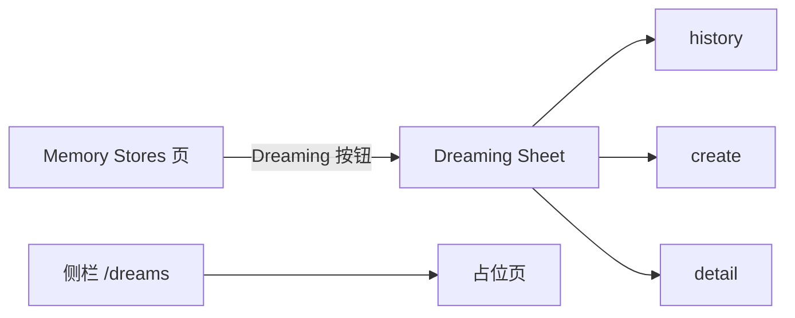

# Dreaming 抽屉

## 目标

控制台从 Memory Stores 页发起、查看、取消和归档 Dream 作业。提交体对齐公开 Dreams API；输入 Store 不可变，结果写入克隆出的新 Store。

后端作业、状态机和沙箱合同见 [memory-dream.md](../be/memory-dream.md)。本文只描述控制台。

## 入口

产品入口是 Memory Stores 列表页标题栏的 **Dreaming** 按钮，打开右侧 Sheet。作业 UI 不放在独立资源页。

侧栏仍有 `/workspaces/{id}/dreams`，当前只渲染占位文案（“正在加载捕获的 Dreaming 资产”），不挂抽屉、不列作业。Sessions 资源页继续展示全部会话，包括 Dream 内部巩固 Session。



## 提交体

`POST /v1/dreams`：

```json
{
  "inputs": [
    { "type": "memory_store", "memory_store_id": "memstore_abc" },
    { "type": "sessions", "session_ids": ["sesn_one", "sesn_two"] }
  ],
  "model": "claude-sonnet-4-6",
  "instructions": "重点关注 Python 项目约定"
}
```

- 所有 Dream 请求同时带 `anthropic-version: 2023-06-01` 与 `anthropic-beta: managed-agents-2026-04-01,dreaming-2026-04-21`。变更请求另带 CSRF。
- `instructions` 为空时省略该字段。输入框 `maxLength` 4096，与后端上限一致。
- 创建成功只展示 `pending`；`session_id` 与输出 Store 要等作业进入 `running` 后才出现。
- 展示层同时兼容官方拆分 inputs（`memory_store` + `sessions`）以及旧的嵌套 `memory_store.session_ids`；`outputs` 兼容数组或单对象。

## 抽屉

三态：`history` / `create` / `detail`。关闭再打开回到 `history`。

### 历史

- `GET /v1/dreams?limit=20`，默认不含已归档；有 `next_page` 时「加载更多」追加，不丢已加载行。
- 行展示 `dream id`、模型、Session 数、输入 Store、公开状态。
- 空列表：「还没有 Dream 记录。」

### 创建

必填：一个未归档 Memory Store、一个模型、1～100 场 Session。缺少任一项时禁用「整理记忆」。

| 字段 | 数据来源 | 规则 |
| --- | --- | --- |
| 记忆存储 | `GET /v1/memory_stores`，`limit=100`、`include_archived=false`，跟完 `next_page` | 每场 Dream 只选一个；文案说明结果写入克隆 Store |
| 模型 | 与 Create Agent 相同的模型列表 | 下拉必选 |
| 重点回顾的 Session | `GET /v1/sessions?limit=100&include_archived=false&exclude_internal_kind=dream` | 前端再用 `isDreamInternalSession` 兜底过滤；当前只使用第一页，不跟 `next_page` |
| 自定义指令 | 可选 textarea | 计数 `length / 4096` |

内部 Session 判定：`metadata.internal_kind === "dream"`，或遗留标题匹配 `^Dream (?:preparation )?drm_`。普通标题里出现 “Dream” 不算内部会话。创建成功后回到历史，新行插到列表顶部。

### 详情

- 进入详情立刻 `GET /v1/dreams/{id}` 刷新。
- `pending`：无产物、不展示用量；说明 Worker 会准备环境、克隆 Store、创建内部会话并启动 skill。操作只有 **取消**。
- `running` 起：输出 Store 与巩固会话做成站内链接（`/memory-stores/{id}`、`/sessions/{id}`）。操作仍是 **取消**。
- `completed` / `failed` / `canceled` 且未归档：展示用量（若有）与 **归档**，不再显示取消。
- `failed` 展示 `error.type` 与 `message`；已知 type 映射为中文标签（如 `input_memory_store_unavailable` → 「输入记忆存储已被归档或删除」）。
- 归档成功后从本地列表移除并回到历史（默认 list 不含已归档）。取消成功留在详情，用返回体替换当前行。

## 内部 Session 与 Inspector

Dream 巩固会话可以出现在 Sessions 列表和详情里，用户要进环境看整理质量。系统 Agent / Environment 列表不可见、不可选、不可改，因此 Inspector 对内部会话：

- Session 与 Threads 页签仍展示 Agent / Environment 的 ID 或名称；
- 不生成详情链接。

判定与创建选择器相同，见 `web/src/features/dreams/internalSession.ts`。普通 Session 在 metadata 请求失败时仍必须保留 ID 链接，这条规则不变。

## 轮询

间隔 3s。仅抽屉打开时轮询：

| 视图 | 条件 | 请求 |
| --- | --- | --- |
| history | 已加载行里存在 `pending` 或 `running` | 刷第一页 list，按 id 合并到现有列表，保留已加载的后续页 |
| detail | 当前 Dream 仍是 `pending` 或 `running` | retrieve 当前 id，并同步替换列表中的同一行 |
| create / 关闭 | — | 不轮询 |

终态停止。轮询失败写入抽屉错误条，不打断当前视图。

## 实现与验收

- `web/src/features/dreams/DreamingDrawer.tsx`：Sheet 三态、创建、详情、取消、归档
- `web/src/features/dreams/api.ts`：list / retrieve / create / cancel / archive、beta header、inputs / outputs 展示归一化
- `web/src/features/dreams/poll.ts`：活跃态与合并策略
- `web/src/features/dreams/internalSession.ts`：内部 Session 判定
- `web/src/features/managed-agents/api.ts`：`listDreamSessionOptions`、`listMemoryStoreOptions`
- `web/src/features/managed-agents/resources/entities.tsx`：Memory Stores 页挂抽屉
- `web/src/features/managed-agents/sessions/SessionInspector.tsx`：内部会话不外链系统 Agent / Environment
- `web/src/features/managed-agents/resources/ManagedResources.tsx`：`/dreams` 占位页

测试覆盖：双 beta header 与 CSRF、官方/嵌套 inputs、选择器过滤内部 Session、pending 取消且无用量、running 展示输出链接、completed 归档、失败错误条、轮询开关、Inspector 内部会话不外链。
