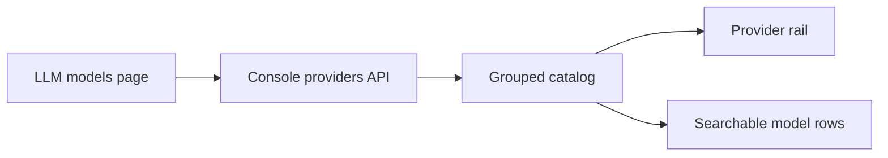

# LLM 模型页

## 页面模型

LLM 模型页是工作区的模型目录，而不是 Provider 卡片墙。

页面只请求 `GET /api/console/organizations/{orgUuid}/workspaces/{workspaceId}/llm_providers`。Provider 配置及其 `model_ids` 是目录的唯一数据源，页面不再额外请求 `/v1/models`，避免同一页面出现两份模型集合和无法归属 Provider 的模型。

填写 Provider 的 Base URL 和 API Key 后，可在表单里点「获取模型列表」，请求 `POST .../llm_providers/preview_models`，用上游 `{base_url}/v1/models` 填入模型 ID。获取结果与表单内已有的非空模型 ID 合并、去重，不覆盖手工输入；上游返回空数组时只提示，不清空表单。编辑 Provider 时，读取接口不会返回旧 Key，因此只有用户输入新 Key 后才显示「获取模型列表」。

保存只提交表单中的模型 ID；点击页面刷新时才请求 `POST .../llm_providers/{id}/models/sync`，把上游列表合并进该 Provider 的 `model_ids`，随后重拉 Provider 列表。同步响应存在 `skipped_model_ids` 时，用 toast 提示有模型因已归属其他 Provider 而跳过。模型 ID 可以为空：Provider 仍保留在轨道和目录中，`/v1/models` 返回空数组，页面显示明确的“尚未配置模型”状态。获取上游列表或刷新失败时，用可关闭、数秒后自动消失的 toast 提示，不挡住目录和表单。

## 布局

- 左侧是 Provider 轨道：`全部 Provider` 加上每个网关。默认看全部模型；点某个网关后显示其详情和编辑/删除。只有当前选中的网关被删除时，才回退到仅剩的那一个或全部。
- 右侧是模型目录：搜索框占位为「添加或搜索模型」；刷新会向每个可见 Provider 同步上游 `/v1/models`，再重拉本地目录。
- 「全部 Provider」和单个 Provider 使用同一套 Provider 标头：弱化背景上展示名称、完整 Base URL、脱敏 Key 和模型数量；单个 Provider 只额外显示编辑/删除操作。全部视图使用 shadcn Accordion（Base UI、`multiple`），可独立展开/收起多个 Provider，搜索时自动展开命中分组；Provider 分组之间仅保留低对比度的语义边框，避免出现继承文字颜色的粗重实线。
- 模型行是嵌套在 Provider 标头下的独立列表项：相对标头向右缩进，使用最小行高、行间分割线、可换行的等宽模型 ID 和复制按钮。Provider 名称和完整 URL 在目录标头中允许换行，左侧轨道继续截断以保持紧凑。右侧目录不设置与内容无关的固定高度，少量或零个模型时随内容自然收拢；主机名仍同时出现在左侧轨道，便于快速区分同名 Provider。

## 交互

- 模型配置只允许当前组织的 `admin` 管理。非管理员不显示侧栏入口；直接访问页面时展示无权限状态，且不请求 Provider API。Workbench、Quickstart 和 Agent 创建页缺少模型时，管理员看到「配置模型」，非管理员只看到「请联系组织管理员配置模型」。前端判断只用于避免无效入口，后端 RBAC 仍是最终权限边界。
- 搜索没有精确模型 ID 命中且已选中 Provider 时，可以把当前输入作为新的真实模型 ID 追加到该 Provider；即使已有模糊匹配也仍显示添加入口。
- 添加模型的请求进行中时禁用添加按钮，防止重复提交。
- 添加、编辑、删除 Provider 仍走原有 Dialog；编辑时留空 API Key 表示保留原密钥，且不会使用不可见的旧 Key 发起模型发现。
- Provider API 的稳定校验错误在前端映射为中英文文案，动态模型 ID 作为插值保留；未知或网络错误使用本地化的通用失败提示，不直接展示后端英文原文。
- 模型 ID 是可选配置；从 Provider 移除全部模型后，Provider 和加密 Key 仍保留，可通过获取列表、搜索添加或再次编辑恢复模型。
- 没有 Provider 时展示精简空状态：隐藏无意义的模型数 `0` 和顶部重复操作，只保留中央的「添加 Provider」入口。

## 不变边界

- 模型 ID 仍是上游真实 ID，页面不映射、不改写。
- 明文 Key 不进入前端存储；读取接口只展示 `api_key_last4`。
- 不新增独立 Model 表；启用集合仍然是 Provider 上的 `model_ids`。
