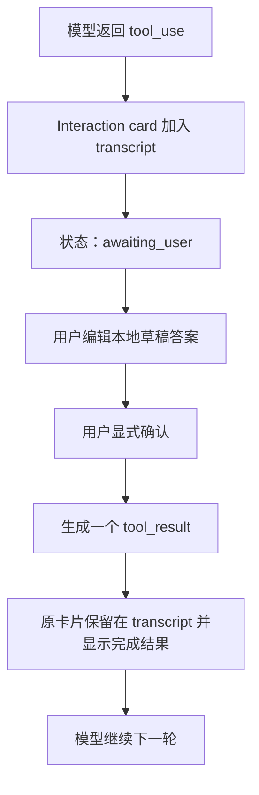
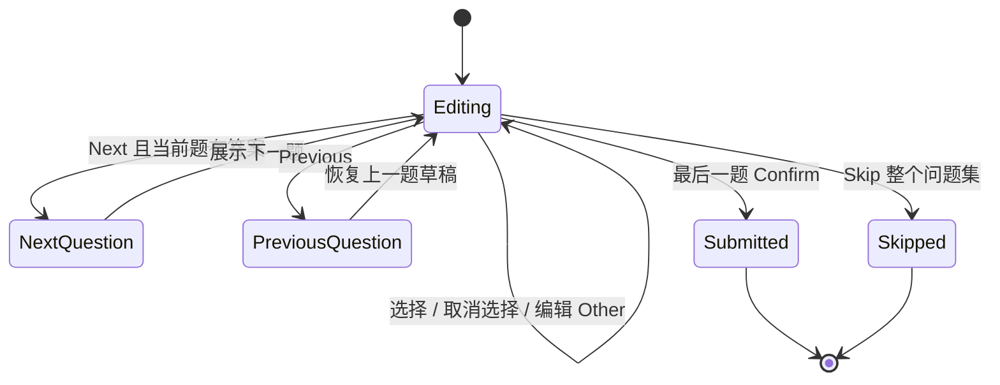
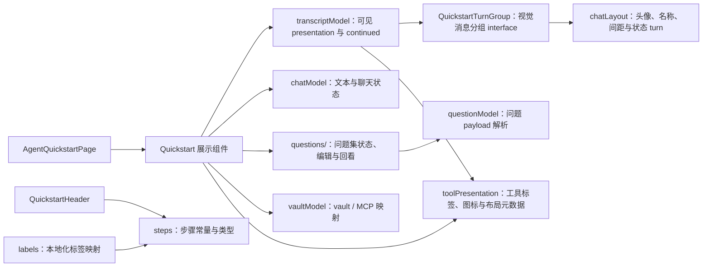

# Managed Agent Quickstart 交互与响应式布局

## 状态

本文记录 `/workspaces/{workspace_id}/agent-quickstart` 的对话呈现、问题确认和顶部进度条契约。键盘发送行为仍由 [Managed Agent Quickstart Composer 键盘交互](./managed-agent-quickstart-composer.md) 定义；模型提示词语言由 [Quickstart / Agent Builder 提示词 i18n](./agent/quickstart-prompt-i18n.md) 定义。

本文中的 `Question set`、`Interaction card` 与 `Explicit confirmation` 采用仓库根目录 [领域词汇表](../../../CONTEXT.md) 的定义。

## 目标

- 把 Quickstart 呈现为连续的对话记录，使用户能够回看每一次说明、工具动作、问题和结果。
- 让一个问题集中的答案在提交前可检查、切换和修改，避免点击单个选项时意外提交。
- 在宽屏展示完整步骤名称，在窄屏保持进度条居中且不产生横向溢出。
- 保持模型会话、API payload、Quickstart step key 和已有资源写入流程不变。

## 对话记录

Quickstart 的文本消息、状态、工具调用、问题集和完成结果都按发生顺序进入同一个 transcript。等待用户输入的 Interaction card 不再从 transcript 中抽出，也不固定在 composer 上方。

这项设计有两个直接结果：

- 用户可以在原始上下文中查看待回答问题，并在完成后继续回看选择结果；
- transcript 是唯一的对话顺序来源，不再同时维护滚动消息和 pinned interaction 两套呈现位置。

连续的同一发言方内容组成一个视觉消息组。消息组的第一项显示头像和发言方名称，后续相邻项复用该视觉上下文；状态行不会改变前后内容的发言方归属。

消息分组由 transcript 层统一决定。每个带发言方的可见项只向 `QuickstartTurnGroup` 声明自己是否延续上一视觉消息组，具体文本、工具卡、流式状态和错误状态从 turn group 上下文读取头像、名称、间距和缩进规则。工具卡不接收也不透传 `hideHeader` 一类消息 chrome 参数。

原始 `chatItems` 不直接参与分组。`transcriptModel` 先把它们归一化为可见 presentation，过滤没有可见文本的消息，并从 `toolPresentation` 读取工具是否占用发言方；随后只在这份可见序列上计算 `continued`。renderer 消费同一份 presentation，不再单独通过返回 `null` 改变可见性。

流式 `Thinking` 和请求错误是临时的 assistant turn，也参与相同的分组规则：如果前一个可归属项已经是 assistant，它们复用该组的头像和名称；如果前一个可归属项是 user，它们开启新的 assistant 组。请求错误只有这一份临时 turn，不再同时写入永久 status item。普通状态行以及 `list_environments`、`list_vaults`、`flag_schedule_intent` 这类紧凑状态工具不占用发言方，也不切断前后的视觉消息组。

## 问题集与显式确认

`ask_user_questions` 的一次 tool call 构成一个 Question set，可以包含一个或多个问题。

### 单个问题

- 单选、多选和 Other 输入都只更新本地草稿；选择选项不会自动提交。
- 只有草稿包含至少一个选项或非空 Other 内容时，Confirm 才可用。
- 点击 Confirm 后一次性生成该问题集的 `tool_result`。
- Skip 保留既有语义：结束整个问题集并把跳过结果返回模型。

### 多个问题

- 卡片一次展示一个问题，并显示当前位置，例如 `1/3`。
- 非最后一个问题使用 Next；当前问题没有答案时 Next 不可用。
- Previous 返回上一题，并保留每一题已经选择的选项和 Other 输入。
- 最后一题使用 Confirm；确认时按原始问题顺序一次性提交整个问题集的答案。
- 在 Confirm 之前，不向模型发送部分答案，也不启动下一轮模型请求。
- 存在等待确认的 Question set 时，底部 Reply composer 保持可编辑但禁止发送；发送按钮、Enter 路径和提交 handler 使用同一阻断条件，不能通过自由文本绕过 Explicit confirmation。
- 如果 `ask_user_questions` 的输入无法解析为可渲染的 Question set，Interaction card 降级为通用工具卡，但不阻断 Reply composer；用户可以通过自由文本完成等待中的工具调用，避免 Quickstart 进入没有可用操作的等待状态。
- 多问题确认完成后，卡片默认收起为完成摘要。用户可以点击 Review answers 展开只读结果；展开时从第一题开始，并可用 Previous/Next 在全部已提交答案之间切换。
- 单问题完成卡继续直接显示结果，不增加可折叠回看交互；多问题专属的折叠与只读导航不会改变单问题行为。

## 顶部进度条

进度条始终位于三列 header 的中间列。左右列使用相同的弹性宽度，因此左侧 Quickstart 操作和右侧 Test run 操作不会改变进度条相对于页面的水平中心。

### 宽屏

- 从 Tailwind `xl` 断点（`1280px`）开始使用宽屏呈现，覆盖 14 寸 MacBook 常见的 `1512px` CSS 视口。
- 显示步骤编号或完成勾、完整的本地化步骤名称以及标准宽度连接线。
- active step 使用 `aria-current="step"`；completed step 使用完成勾。

### 窄屏

- 隐藏步骤名称的可见文本，只保留编号或完成勾。
- 缩短连接线和进度条横向 padding。
- 完整步骤名称仍通过仅供辅助技术读取的文本暴露。
- 不使用横向滚动；紧凑后的进度条仍作为一个整体居中。

宽窄模式只改变呈现密度，不改变当前步骤、完成状态或可访问名称。

## 头像与认证上下文

Quickstart 使用 `boring-avatars` 为助手和当前登录用户生成稳定头像。用户头像 seed 来自认证上下文中的 email 或 account UUID；助手使用固定 seed。Quickstart 位于登录后控制台，必须处于 `AuthProvider` 内：缺少 Provider 属于应用接线错误，不进行静默降级。

头像色板和边框使用 shadcn 语义主题令牌。`boring-avatars` 的颜色从 `--chart-*` 变量取得，边框使用 `border-border` 或其他语义令牌；不在 feature 中硬编码十六进制色板或 `zinc-*` 明暗分支。

测试必须显式提供认证上下文，并验证用户与助手消息仍包含头像的可访问名称。

## 前端模块边界

- `steps` 是步骤名称与类型的事实来源，展示组件和标签映射只单向依赖它。
- 聊天状态、可见 transcript presentation、问题集交互、vault 映射和工具展示元数据分别演进，不放入兜底 `utils` 模块。
- `components.tsx` 保留现有公共导出外观，避免页面入口承担与本次重构无关的导入迁移。
- `transcriptModel` 是原始聊天状态与可见 transcript 之间的 seam。它通过一个纯 interface 返回可见 entries、`continued` 和最后一个发言方，测试不需要进入 renderer 内部。
- `QuickstartTurnGroup` 是可见 transcript 与视觉消息 chrome 之间的 seam。transcript 只提供 `continued`，`chatLayout` 在该 interface 后集中处理所有 turn 的头像、名称、间距和缩进。
- `questions/` 内的状态 hook 保护逐题草稿、导航和一次性提交不变量；编辑态和已提交回看视图不再留在聚合展示文件中。
- `toolPresentation` 同时提供展示布局与 `occupiesSpeaker`，renderer 和 transcript 分组共用同一份工具元数据。

## 工具动作呈现

- 工具调用必须在 transcript 中留下可回看的可见结果，不通过名称白名单把工具动作从视觉记录中删除。
- `flag_schedule_intent` 仍保持即时完成，不改变官方模型工具 schema、请求 payload 或部署状态流；UI 使用现有本地化 tool result 渲染紧凑状态行，避免为内部状态更新展示笨重的通用工具卡。
- `list_environments`、`list_vaults` 和 `flag_schedule_intent` 的紧凑状态行不声明 assistant 发言方，因此不会切断或错误延续相邻的文本消息组。
- 未知工具继续使用既有 fallback：把工具名中的下划线转换为空格，并使用 Terminal 图标。模块抽取不得顺带改变 fallback 文案或图标。

## 验收

- 单问题单选后不会自动发送；点击 Confirm 后只发送一次。
- 多问题可以 Next/Previous，返回上一题时草稿保持不变，最后 Confirm 一次性提交全部答案。
- 多问题完成卡默认收起，可展开并用 Previous/Next 回看全部已提交答案；单问题完成卡仍直接显示结果。
- 待回答与已完成的问题卡都位于 transcript 内，不存在独立 pinned interaction 容器。
- 连续同一发言方的消息只在组首显示头像和名称。
- 流式与错误 turn 遵循同一分组规则，不重复显示连续 assistant 组的头像和名称。
- `flag_schedule_intent` 以紧凑状态行保留在 transcript 中；未知工具保持既有的人类可读 fallback 和 Terminal 图标。
- 窄屏模式隐藏可见步骤名称、缩短连接线、无横向溢出，进度条仍居中且完整名称可被辅助技术读取。
- 缺少 `AuthProvider` 时不静默降级；测试环境显式注入认证上下文。
- 运行 Quickstart 窄范围测试、`bun run build`、格式、命名、复杂度和重复代码门禁。
