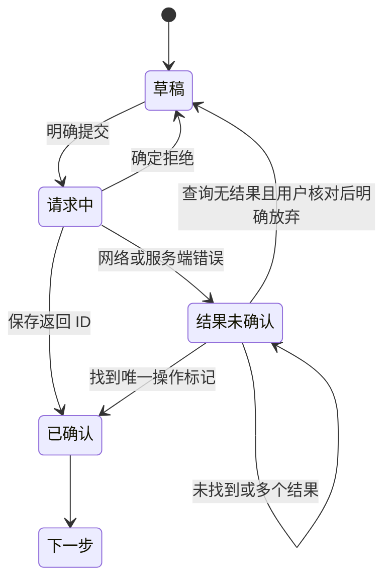

# Managed Agent Quickstart 交互与响应式布局

## 范围与目标

`/workspaces/{workspace_id}/agent-quickstart` 与兼容入口 `/quickstart` 使用四步确定性配置：选择起始点、配置 Agent、配置环境、第一个 API 调用。目标是先完成一轮真实对话，再进入完整资源管理。此前由 Builder 模型编排环境、Vault、部署与集成的流程已移除；Agent 创建对话框中的 Builder 继续使用原有请求与提示词模块。

流程选择与能力边界见 [快速开始设计依据](./managed-agent-quickstart-simplification-research.md)。

## 四步流程

| 步骤            | 用户操作                                                         | 请求与完成条件                                                                |
| --------------- | ---------------------------------------------------------------- | ----------------------------------------------------------------------------- |
| 选择起始点      | 默认 Hello World；可选研究、数据分析、领域追踪、代码评审、自定义 | 卡片只选择草稿；点击开始配置后进入表单；不写入资源                            |
| 配置 Agent      | 名称、可选描述、可用模型、系统提示词                             | 明确新建或选择同名已有 Agent；成功保存或确认复用后推进                        |
| 配置环境        | 选择当前工作区可用环境，或明确新建                               | 优先选择实际存在的 Default；仅一个可用环境时选择它；没有 Default 时不自动创建 |
| 第一个 API 调用 | 准备应用密钥、查看三个请求、在线测试                             | 首次发送才创建 Session；先订阅并同步完整历史，再投递消息                      |

场景说明明确依赖用户提供的数据、主题、来源或代码。模板仅配置系统提示词与核心工具集，不自动授权私有系统，也不承诺创建定时任务。当前模型 API 没有独立的默认模型标记；使用其第一项作为初始模型，与服务端 Workbench 的 `default_prompt_settings.model_name` 规则一致，用户可以在表单中更改。

进入 Agent 配置时，若尚未选择且存在同名候选，默认选中服务端列表中的第一项，展示其名称、描述、模型和提示词，字段只读；点击“使用已有，下一步”才确认并推进，不创建资源。用户可以通过 ID 区分同名候选并切换；明确选择新建后恢复自己的草稿，以 `agentID = new` 保存该选择，同次向导内资源重载不再次自动选回已有 Agent；刷新后重新开始向导。切换场景清除当前 Agent 选择，并按新场景名称重新匹配。空描述不发送；新建时必填字段缺失或模型不在可用列表时不能提交，复用时保留已有空提示词。复用 GET 示例固定到当前选择的 Agent 版本。

新环境复用现有环境表单的标准 cloud 配置与 limited 网络默认值。所有环境页都扫描，包含归档资源以检测名称占用；新建名称去除前后空格后，与可用同名环境匹配则复用，归档同名则禁用提交并提示更名。自托管环境保留选择入口，并提示需要执行服务。

## 草稿、绑定与写入恢复

表单草稿只保留在当前向导的内存中。再次选择同一场景不重置输入；返回起始页、返回配置与切换 API 请求不创建资源。没有未确认请求时，刷新或重新进入页面后回到第一步，清空场景选择、草稿、已确认的资源绑定和测试对话；服务端已创建的 Agent、环境和 Session 继续存在，可从管理页面查看或重新选择复用。sessionStorage 仅在存在未确认创建或发送结果时保存恢复所需的操作标记和上下文，键包含账号和工作区；恢复路径保留核对结果所需的配置步骤或对话，并禁止自动重发；结果确认后删除记录。旧版本保存的普通进度在加载时清除，不继续恢复。存储失败有可见提示。

资源查询与缓存以账号、工作区隔离。切换上下文使原页面卸载；旧请求可以在原工作区完成，但不能更新新工作区的 UI。未确认请求的恢复上下文重新读取可用资源；失效的 Agent 或环境 ID 清理，并退回对应配置步骤。普通刷新不读取之前的资源或会话绑定，也不删除服务端资源、不重发消息。

顶部与底部返回使用同一导航条件：请求中或存在未确认创建结果时禁止切换步骤；返回只切换界面，不写入资源。配置 Agent 可从起始页进入；只有已选择实际存在且模型可用的 Agent，才能进入环境；同时选择可用环境后才能进入最终页。返回前面的步骤不会清除这些资源或让后续入口失效。更换场景、新建 Agent 草稿或选择尚未创建的环境时，后续入口随依赖失效而禁用；顶部跳转不会绕过创建或自动提交。底部继续按钮在新建时明确执行保存，在复用时确认已有选择。第一步没有上一环节，最后一步提供查看 Agent 的结束入口，不添加第五步。

Session 绑定由 Agent ID、版本和环境 ID 组成。绑定相同时保留 Session 与对话；资源组合改变则使用新上下文，直到下一次发送才创建 Session。显式开始新的测试对话也只清除绑定，不立即 POST。运行中、等待工具确认或发送结果不确定时，不能清除当前会话来隐式重试。

Agent、Environment、Session 的创建都带 `metadata.quickstart_operation_id`。发送前记录未确认操作，成功保存真实返回 ID 后才推进。确定的 4xx 失败保留输入并允许显式重试；网络或 5xx 的不确定结果禁止再次创建，提供“检查已保存结果”，扫描当前工作区资源分页并按精确操作标记恢复唯一资源；Session 查询使用已知 Agent ID 过滤，并继续扫描该 Agent 的全部分页。没有结果或发现多个结果时保持阻止状态，提示检查资源。只有成功查询且没有匹配结果时，才显示“我已核对资源，放弃本次请求”；用户明确点击后清除本次未确认标记，保留草稿，不取消服务端请求、不删除资源、不自动重试。查询失败或找到多个结果不提供放弃入口；刷新后必须重新查询，不能复用上一次未匹配判断。该标记用于恢复，不能当作服务端幂等键，也不能解决服务端并发写入本身。

```mermaid
stateDiagram-v2
  [*] --> 草稿
  草稿 --> 请求中: 明确提交
  请求中 --> 已确认: 保存返回 ID
  请求中 --> 草稿: 确定拒绝
  请求中 --> 结果未确认: 网络或服务端错误
  结果未确认 --> 已确认: 找到唯一操作标记
  结果未确认 --> 结果未确认: 未找到或多个结果
  结果未确认 --> 草稿: 查询无结果且用户核对后明确放弃
  已确认 --> 下一步
```

## 在线测试与历史

在线测试使用 Cookie、组织/工作区上下文与现有 SDK 的 CSRF 处理，不要求输入 API 密钥。首次发送先保存 Session，然后复用 `useSessionDetailEventData` 的 SSE、分页历史、按精确事件 ID 合并、断线重连和 idle 校对能力。发送必须等待本次流连接的历史同步完成；单独完成历史回补不能代表当前 SSE 已连通。准备连接等待上限为 30 秒，超时保留消息并允许用户显式重试；卸载时终止等待与订阅。

对话复用 `SessionTranscriptView`、公开 Thinking 渲染和 `SessionRequiresActionCard`，工具批准、拒绝及问题回答通过现有公开事件接口发送。工具确认或自定义工具结果被接受后，仅使用该输入之后的 Session 状态判断运行情况；新的状态到达前继续阻止发送下一条消息，在未确认发送结果的恢复路径中仍从历史事件恢复该保护；普通刷新解绑测试会话，已有会话的执行状态由服务端保留，公开终止或删除状态优先。Stop 发送 `user.interrupt`。返回配置不等于停止后台执行。点击成功投递后，共享 `FollowSentSessionMessage` 恢复跟随末尾；手动阅读历史时继续沿用 MessageScroller 的跟随规则，不设置 User 行 anchor。

消息已接受、Agent 运行和对话完成分别呈现。只有最后一个 User 消息后出现回复，并观察到正常结束的 idle 事件且没有待确认工具，才显示首次对话完成；创建 Session 的初始 idle 不能表示完成。失败终止保留对话与错误，不伪造成功。当前轮存在用户中断时，部分输出加 idle 也不能显示完成；停止后显示“测试已停止”，公开终止状态优先于旧的 idle 历史。Quickstart 不把中断控制事件作为原始 JSON 消息展示，完整事件仍保留在会话详情。

发送前保存未确认消息标记；确定拒绝允许显式重试，网络或服务端错误保持标记，刷新页面也不会自动重发。恢复同一绑定的未确认发送时，输入框还原原消息。用户应先刷新并核对对话，再通过独立按钮解除阻止；解除只清除未确认标记，原消息继续保留在输入框，解除本身不发送消息。请求层关闭自动 POST 重试。工具和停止操作也没有自动重试。资源与 Session 加载错误统一使用已有 `errorMessage` 展示 API 消息。Session 详情不再每两秒轮询；运行与完成状态使用现有 SSE 和历史校对同步，保留手动刷新、停止后的查询及 Query 默认焦点恢复查询。返回配置时保留事件订阅，不追加定时详情查询。

## 应用接入示例

示例使用当前 `anthropicBaseURL()` origin、工作区头、实际 Agent ID/版本和环境 ID。密钥固定为 `YOUR_API_KEY`，文案明确前往当前工作区的「API 密钥」页面创建，第 2–4 步在各自 curl 区域上方共用密钥准备入口，使用 `target=_blank` 和 `rel=noopener noreferrer` 在新标签页打开当前工作区密钥管理，保留向导页面；不读取或保存真实密钥。页面内配置和在线测试使用登录态，只有终端执行示例需要密钥。配置页复用已有资源时展示 GET；新建时展示对应 POST。JSON 使用统一序列化与安全的 shell 单引号转义。

最终页依实际执行顺序展示创建会话、接收回复、发送消息。创建请求不展示 Session ID 输入，并解释响应 `id` 是后续请求的会话标识。只有展开接收回复或发送消息时才提供输入，两个请求共享填写值，用同一个 ID 指定同一次对话。应用示例不自动填入在线测试会话，用户应填写应用创建请求的响应 ID；在线测试单独自动创建 Session。先在终端 A 打开 SSE 并等待 connected，再在终端 B 投递；SSE 是实时流，不承诺 Last-Event-ID 重放。

请求采用 curl 与 Highlight.js 显式 bash 语言。长行自动换行；复制成功有反馈，失败可手动选中。一次只展开一个请求。独立 API origin 的部署仍需使用其可访问的对外地址；开发环境示例指向本地 Vite 代理。

## 布局与验收

顶部四步整体居中，圆形节点由连续引导线连接，完整标签可换行；明暗主题的步骤按钮悬浮时保持透明背景，保留键盘焦点提示。Hello World 独占推荐行，四个应用场景以两列两行排列，自定义入口占满底行；手机场景单列，全部属于同一个单选组。推荐样式只强调 Hello World 的标题、图标和推荐标识；选中边框与背景只跟随当前场景，选择其他场景后 Hello World 使用普通未选中边框。

工作区快速开始与 `/quickstart`（含尾部斜杠）都使用动态视口高度的控制台主区，移动端导航条与页面留白由外壳分配，四步共用同一有界弹性布局。顶部步骤、底部操作栏不收缩，正文使用剩余空间并允许内部滚动；资源错误与恢复提示有独立的有界滚动区。所有步骤的返回与主操作始终留在可用视口内，不受长表单、curl、展开请求或消息长度影响。操作栏位于表单和请求两列之外，返回在左，主操作向右对齐；窄屏可换行。底部提交按钮通过原生 form 关联对应表单，保留校验、Enter 提交和保存成功后推进的行为。

配置页桌面左表单、右请求，各自内部滚动并有垂直分界；窄屏上下排列，在同一正文区滚动并用水平边界分隔。已有 Agent 和模型选择菜单都与触发器等宽、出现在触发器下方，使用相同菜单留白与选项间距；已有 Agent 的名称和等宽字体 ID 分行显示；新建选项与已有资源分隔，长 ID 换行，菜单自身限制高度并保留 Base UI 的键盘导航和选中标记。四步共用按动态视口高度计算的间距与内边距，标题、步骤节点与编辑区使用带可读下限的弹性尺寸。起始页场景卡片由内容决定高度，不再设置固定最小高度；Hello World 保留推荐视觉层级。14 寸笔记本常见视口下六个起点与底部操作应完整可见；更窄或更矮的窗口保留内部滚动。环境选择卡片最小高度随视口在 56–72px 间变化，最大宽度 440px，新建与已有卡片占满容器宽度。新建环境完整请求在请求区滚动，不截断复制内容。

最终页桌面左应用调用、右完整对话，各自使用剩余高度并内部滚动；860px 以下上下排列，在线测试优先，正文滚动而操作栏保持可见。窄屏对话区 380px，桌面对话标题与 composer 固定，消息内部滚动。密钥入口采用有边框、图标和跳转标记的按钮链接。三个 API 请求使用独立边框、圆角和间距，展开后标题与正文有水平分隔，一次展开一个请求。所有页面使用语义主题令牌。

主要回归入口是 `quickstart/AgentQuickstartPage.test.tsx`，覆盖失败恢复、同名选择、同次向导草稿/刷新重置及旧存储清理、环境分页与归档名称、真实请求示例、延迟 Session 创建、订阅先于投递、完成判断、连续对话、不确定发送恢复、工具批准/拒绝后的延迟状态保护与刷新重置、可读加载错误和工具/中断接口。`quickstart/api.test.ts` 验证 Session 恢复的 Agent 过滤、分页和精确操作标记匹配；`ConsoleLayout.test.tsx` 验证两个入口及尾部斜杠共享有界布局。`quickstart/progress.test.ts` 验证旧进度清理、三类未确认创建和消息恢复记录的释放。现有模型权限门控测试保留，Session 数据 hook 与 stream loop 测试继续验证共享历史能力。

UI 验收需重启前端并在浏览器检查宽屏、窄屏、明暗主题、键盘和内部滚动。相关后端链路使用 verify-be 的 chat roundtrip、tools、reliability、public；这些场景使用真实 Worker 和本地依赖、脚本化上游模型，不代表外部云分配、实际模型质量或浏览器通过。
