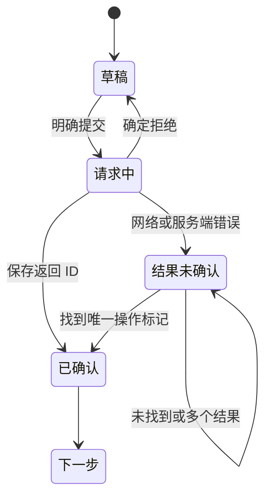

# Managed Agent Quickstart 交互与响应式布局

## 范围与目标

`/workspaces/{workspace_id}/agent-quickstart` 使用四步确定性配置：选择起始点、配置 Agent、配置环境、第一个 API 调用。目标是先完成一轮真实对话，再进入完整资源管理。此前由 Builder 模型编排环境、Vault、部署与集成的流程已移除；Agent 创建对话框中的 Builder 继续使用原有请求与提示词模块。

参考资料来自用户提供的 `oma-quickstart-handoff.zip`。资料中的原型用于流程与视觉参考，不直接迁入其模拟资源、认证或请求脚本。原流程与后端约束分析保存在 [简化研究](./managed-agent-quickstart-simplification-research.md)。

## 四步流程

| 步骤            | 用户操作                                                         | 请求与完成条件                                                                |
| --------------- | ---------------------------------------------------------------- | ----------------------------------------------------------------------------- |
| 选择起始点      | 默认 Hello World；可选研究、数据分析、领域追踪、代码评审、自定义 | 卡片只选择草稿；点击开始配置后进入表单；不写入资源                            |
| 配置 Agent      | 名称、可选描述、可用模型、系统提示词                             | 明确新建或选择同名已有 Agent；成功保存或确认复用后推进                        |
| 配置环境        | 选择当前工作区可用环境，或明确新建                               | 优先选择实际存在的 Default；仅一个可用环境时选择它；没有 Default 时不自动创建 |
| 第一个 API 调用 | 准备应用密钥、查看三个请求、在线测试                             | 首次发送才创建 Session；先订阅并同步完整历史，再投递消息                      |

场景说明明确依赖用户提供的数据、主题、来源或代码。模板仅配置系统提示词与核心工具集，不自动授权私有系统，也不承诺创建定时任务。当前模型 API 没有独立的默认模型标记；使用其第一项作为初始模型，与服务端 Workbench 的 `default_prompt_settings.model_name` 规则一致，用户可以在表单中更改。

同名 Agent 不自动复用。用户选中候选时展示服务端保存的名称、描述、模型和提示词，字段只读；选择新建恢复自己的草稿。同名候选可通过 ID 区分。空描述不发送；新建时必填字段缺失或模型不在可用列表时不能提交，复用时保留已有空提示词。复用 GET 示例固定到当前选择的 Agent 版本。

新环境复用现有环境表单的标准 cloud 配置与 limited 网络默认值。所有环境页都扫描，包含归档资源以检测名称占用；新建名称去除前后空格后，与可用同名环境匹配则复用，归档同名则禁用提交并提示更名。自托管环境保留选择入口，并提示需要执行服务。

## 草稿、绑定与写入恢复

表单草稿按场景保存。再次选择同一场景不重置输入；返回起始页、返回配置与切换 API 请求不创建资源。非凭据草稿、已确认 ID、Session 绑定以及未确认请求标记保存在当前标签页的 sessionStorage，键包含账号和工作区。存储失败有可见提示，服务端资源仍是事实来源。

资源查询与缓存以账号、工作区隔离。切换上下文使原页面卸载；旧请求可以在原工作区完成，但不能更新新工作区的 UI。刷新后重新读取可用资源，失效的 Agent 或环境 ID 清理，并退回对应配置步骤。

顶部与底部返回使用同一导航条件：请求中或存在未确认创建结果时禁止切换步骤；返回只切换界面，不写入资源。配置 Agent 可从起始页进入；只有已选择实际存在且模型可用的 Agent，才能进入环境；同时选择可用环境后才能进入最终页。返回前面的步骤不会清除这些资源或让后续入口失效。更换场景、新建 Agent 草稿或选择尚未创建的环境时，后续入口随依赖失效而禁用；顶部跳转不会绕过创建或自动提交。底部继续按钮在新建时明确执行保存，在复用时确认已有选择。第一步没有上一环节，最后一步提供查看 Agent 的结束入口，不添加第五步。

Session 绑定由 Agent ID、版本和环境 ID 组成。绑定相同时保留 Session 与对话；资源组合改变则使用新上下文，直到下一次发送才创建 Session。显式开始新的测试对话也只清除绑定，不立即 POST。运行中、等待工具确认或发送结果不确定时，不能清除当前会话来隐式重试。

Agent、Environment、Session 的创建都带 `metadata.quickstart_operation_id`。发送前记录未确认操作，成功保存真实返回 ID 后才推进。确定的 4xx 失败保留输入并允许显式重试；网络或 5xx 的不确定结果禁止再次创建，提供“检查已保存结果”，扫描当前工作区全部分页并按精确操作标记恢复唯一资源。没有结果或发现多个结果时保持阻止状态，提示检查资源。该标记用于恢复，不能当作服务端幂等键，也不能解决服务端并发写入本身。

```mermaid
stateDiagram-v2
  [*] --> 草稿
  草稿 --> 请求中: 明确提交
  请求中 --> 已确认: 保存返回 ID
  请求中 --> 草稿: 确定拒绝
  请求中 --> 结果未确认: 网络或服务端错误
  结果未确认 --> 已确认: 找到唯一操作标记
  结果未确认 --> 结果未确认: 未找到或多个结果
  已确认 --> 下一步
```

## 在线测试与历史

在线测试使用 Cookie、组织/工作区上下文与现有 SDK 的 CSRF 处理，不要求输入 API 密钥。首次发送先保存 Session，然后复用 `useSessionDetailEventData` 的 SSE、分页历史、按精确事件 ID 合并、断线重连和 idle 校对能力。发送必须等待本次流连接的历史同步完成；单独完成历史回补不能代表当前 SSE 已连通。准备连接等待上限为 30 秒，超时保留消息并允许用户显式重试；卸载时终止等待与订阅。

对话复用 `SessionTranscriptView`、公开 Thinking 渲染和 `SessionRequiresActionCard`，工具批准、拒绝及问题回答通过现有公开事件接口发送。Stop 发送 `user.interrupt`。返回配置不等于停止后台执行。点击成功投递后，共享 `FollowSentSessionMessage` 恢复跟随末尾；手动阅读历史时继续沿用 MessageScroller 的跟随规则，不设置 User 行 anchor。

消息已接受、Agent 运行和对话完成分别呈现。只有最后一个 User 消息后出现回复，并观察到正常结束的 idle 事件且没有待确认工具，才显示首次对话完成；创建 Session 的初始 idle 不能表示完成。失败终止保留对话与错误，不伪造成功。当前轮存在用户中断时，部分输出加 idle 也不能显示完成；停止后显示“测试已停止”，公开终止状态优先于旧的 idle 历史。Quickstart 不把中断控制事件作为原始 JSON 消息展示，完整事件仍保留在会话详情。

发送前保存未确认消息标记；确定拒绝允许显式重试，网络或服务端错误保持标记，刷新页面也不会自动重发。用户应先刷新并核对对话，再通过独立按钮解除阻止；解除本身不发送消息。请求层关闭自动 POST 重试。工具和停止操作也没有自动重试。

## 应用接入示例

示例使用当前 `anthropicBaseURL()` origin、工作区头、实际 Agent ID/版本和环境 ID。密钥固定为 `YOUR_API_KEY`，文案明确前往当前工作区的「API 密钥」页面创建，链接跳转现有工作区密钥管理，不读取或保存真实密钥。配置页复用已有资源时展示 GET；新建时展示对应 POST。JSON 使用统一序列化与安全的 shell 单引号转义。

最终页依实际执行顺序展示创建会话、接收回复、发送消息。创建请求不展示 Session ID 输入，并解释响应 `id` 是后续请求的会话标识。只有展开接收回复或发送消息时才提供输入，两个请求共享填写值，用同一个 ID 指定同一次对话。应用示例不自动填入在线测试会话，用户应填写应用创建请求的响应 ID；在线测试单独自动创建 Session。先在终端 A 打开 SSE 并等待 connected，再在终端 B 投递；SSE 是实时流，不承诺 Last-Event-ID 重放。

请求采用 curl 与 Highlight.js 显式 bash 语言。长行自动换行；复制成功有反馈，失败可手动选中。一次只展开一个请求。独立 API origin 的部署仍需使用其可访问的对外地址；开发环境示例指向本地 Vite 代理。

## 布局与验收

顶部四步整体居中，圆形节点由连续引导线连接，完整标签可换行；明暗主题的步骤按钮悬浮时保持透明背景，保留键盘焦点提示；当前位置与已具备资源条件的步骤分别展示数字和勾选。Hello World 作为独立推荐入口占满一行，使用更大的标题、图标与首次体验说明；下方四个应用场景以两列两行排列，自定义入口在底部占满一行。手机全部使用单列，六个场景仍属于同一个单选组；选择只修改草稿，开始配置动作保持在底部。配置页左表单、右请求，桌面用独立垂直边界分隔，窄屏用水平边界分隔；环境选择卡片约 72px 高，最大宽度 440px，新建与已有卡片均占满容器宽度。四步共用整页宽度的底部操作栏与分隔线，返回在左，继续或最终查看 Agent 固定对齐页面右边缘。桌面页面至少占满可用视口高度，四步使用相同上下留白，操作栏通过弹性布局落在页面底部，不随较短的环境配置内容上移；内容较长时自然滚动，操作栏保留在正文之后。配置步骤的操作栏位于表单与 API 两列之外，底部提交按钮通过原生 form 关联对应表单，保留校验、Enter 提交与保存成功后推进的行为；起始页不再单独限制宽度。窄屏操作项换行时仍向右对齐。最终页左应用调用、右单一完整对话，860px 以下上下排列并优先显示在线测试；桌面最终页按视口高度分配剩余空间，API 区与对话等高，返回和查看 Agent 在首屏底部可见；API 示例与消息分别在区域内滚动，展开请求不增加整页高度。手机对话区 380px，页面自然滚动；桌面最终页最小高度 640px，极矮窗口保留必要阅读和操作空间并允许整页滚动。对话标题与 composer 固定，消息内部滚动。所有页面使用语义主题令牌。

主要回归入口是 `quickstart/AgentQuickstartPage.test.tsx`，覆盖失败恢复、同名选择、草稿/刷新、环境分页与归档名称、真实请求示例、延迟 Session 创建、订阅先于投递、完成判断、连续对话、不确定发送恢复和工具/中断接口。现有模型权限门控测试保留，Session 数据 hook 与 stream loop 测试继续验证共享历史能力。

UI 验收需重启前端并在浏览器检查宽屏、窄屏、明暗主题、键盘和内部滚动。相关后端链路使用 verify-be 的 chat roundtrip、tools、reliability、public；这些场景使用真实 Worker 和本地依赖、脚本化上游模型，不代表外部云分配、实际模型质量或浏览器通过。
