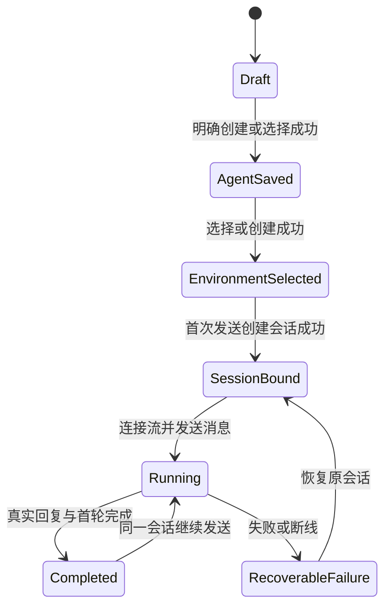

# Managed Agent 快速开始优化研究

日期：2026-10-08。源码基准：`6545d4c212155ebb64410ac31977970cbcd131c2`。

本文是实施前的分析快照；源码链接固定在该基准，文中“当前”指分析时的旧流程。后续四步实现与验收合同见 [Quickstart 交互与响应式布局](./managed-agent-quickstart-interactions.md)。

建议采用交接资料的四步骨架，将主流程收敛为“选择起点、确认 Agent、选择环境、发送第一条消息”。以收到第一条真实回复作为首次体验完成标志，再提供应用接入。名称、模型、提示词可以预填；MCP、凭据库、定时部署和 AI 辅助设计进入后续能力。在线测试使用控制台登录态，应用接入使用工作区 API 密钥。

这份资料改善了流程可预测性，但仍需要修正同名复用、环境默认值、事件流顺序和完成标准。直接迁入原型脚本无法解决这些合同差异。

## 当前复杂度的来源

当前页面的四个步骤是 Create agent、Configure environment、Start session、Integrate。表面上与交接资料接近，实际步骤通过 Builder 模型的文本、问题卡和工具调用推进。自定义描述进入模型对话；环境阶段可以再次启动模型；工具分支包含环境、Vault、凭据、会话、定时意图、部署和接入出口。完成一次交互后还可能发起下一轮模型调用。[S1][S2]

因此，复杂度不主要来自步骤数量，而来自以下负担：

| 负担       | 当前表现                                                     | 对首次使用的影响                                     |
| ---------- | ------------------------------------------------------------ | ---------------------------------------------------- |
| 起点选择   | 描述需求和浏览模板并列；模板涉及多个外部系统                 | 用户还没看到运行结果，就要决定想构建什么和接哪些服务 |
| 流程控制   | 部分配置与下一步动作由模型工具调用产生                       | 用户需要等待模型，无法稳定预期下一次操作             |
| 概念学习   | Agent、Environment、Session、Vault、MCP、Deployment 同处引导 | 首次体验承载了接近完整配置器的知识量                 |
| 双重对话   | 左侧 Builder 对话，右侧试运行会话及配置预览                  | 用户需要区分“设计 Agent 的助手”和“正在运行的 Agent”  |
| 资源副作用 | 使用模板时直接创建 Agent；重置清空页面绑定                   | 浏览、返回和重新进入需要更明确的资源保存语义         |
| 接入正确性 | curl 指向 Anthropic；SDK 没有显式 OMA 地址                   | 页面内成功不能保证复制代码后能连接到同一系统         |

上述表现依据当前源码；其对认知负担的影响属于产品分析判断，尚无用户漏斗数据证明各项损失比例。[S1][S3][S4]

当前已有资产值得保留：登录态请求封装、实际资源 CRUD、环境按 ID 复用、Session transcript、问题集显式确认和真实测试入口。优化应重新组织首次使用路径，避免重写底层协议。[S5][S6][S7]

## 交接资料的价值和待修正部分

参考文件为用户提供的 `oma-quickstart-handoff.zip`，其中交付说明、交互 HTML 和五张截图均用于设计参考。资料中的实施要求是待评估方案，不视为用户授权修改、部署或创建资源。

| 资料设计                    | 建议                           | 原因                                                        |
| --------------------------- | ------------------------------ | ----------------------------------------------------------- |
| Hello World 为推荐入口      | 采用，并默认选中               | 提供低依赖、可预测的第一次运行                              |
| 明确四步和每步主按钮        | 采用                           | 用户能知道当前位置、下一步和提交结果                        |
| 点击卡片仅选择，主按钮推进  | 采用                           | 浏览场景不会立即写入资源                                    |
| 配置和 API 请求对应         | 保留能力，默认按需展开         | 有助开发者理解，但新用户不必先阅读请求头和 JSON             |
| 已有资源优先复用            | 采用，按资源 ID 和配置确认     | 减少重复创建，但名称不能承担资源身份                        |
| 同名自动复用                | 改成候选提示和明确选择         | Agent 可重名；用户输入也可能与旧配置不同                    |
| 优先已有 Default            | 改成可解释的推荐环境           | 名称 Default 本身不能证明权限、类型、可运行性或正式默认身份 |
| 无 Default 时明确选择或新建 | 采用                           | 进入页面不应产生隐式创建副作用                              |
| 最后一步突出三个 API 调用   | 改为在线测试优先，接入按需展开 | 首次价值来自真实回复，应用开发是后续目标                    |
| 配置测试无需 API 密钥       | 采用                           | 控制台现有登录态即可完成                                    |
| 纯 curl、无 jq              | 保留为检查单个请求的方式       | 初学者负担较小，但手动传 ID 和双终端 SSE 仍需说明           |
| 一个完整对话框              | 采用，并复用 Session 能力      | 让测试结果成为唯一的运行反馈                                |

截图体现的黑白灰、居中步骤、紧凑环境卡片和对话内部滚动可保留。移动截图中 API 内容在对话之前，使用户必须滚过大量代码才能测试；移动布局应优先展示测试，再展开接入代码。此判断来自提供的静态截图，不代表正式产品的浏览器测量。

## 建议的四步流程

首版保持四步，便于直接承接交接资料，也让资源创建和失败恢复有明确位置。将前三步压成“一键开始”可以在后续评估；当前缺少充分的默认身份、恢复和就绪保障，过早压缩会隐藏失败原因。

### 选择起点

默认选中 Hello World，主按钮“开始体验”。说明“使用预设配置发送第一条消息”，并明确需要已有可用模型和运行服务。其余场景仍可访问，但视觉优先级降低；自定义入口可进入手动配置或 AI 辅助设计。

默认路径不需要用户描述完整需求。AI 辅助设计适合用户已经理解产品、希望生成复杂配置时使用，不应控制推荐路径的导航、环境选择和资源创建。

场景模板应描述输入和预期产出，而不仅是角色：研究需要主题和可访问来源；数据分析需要样例或上传数据；代码评审需要粘贴 diff、文件或已授权仓库；领域追踪先做一次变化摘要，定时执行在成功后配置。不能仅换系统提示词就承诺模板能读取仓库、私有系统或完成文件分析。第一版先让 Hello World 独立完成验收，其余场景可以连接现有能力或清楚说明输入要求。[S3][S8]

### 确认 Agent

推荐路径展示一份紧凑配置摘要：名称、真实模型、用途。名称预填；描述可选；系统提示词和模型选择保持可编辑，但默认折叠在“调整配置”中。自定义路径直接展开。

按钮按实际意图显示“创建并继续”或“使用这个 Agent”。点击前给出保存到当前工作区的说明；提交成功并拿到 ID 后再推进。模板切换只改本地草稿，不能提前创建资源。

发现同名 Agent 时，展示候选及模型、用途、版本等可识别信息。用户选择复用后，表单/摘要和示例请求必须读取该 Agent 的实际配置，并明确现有资源不会被修改。用户有不同草稿时，允许继续创建新 Agent 或保留草稿另选；不能以提示信息替代明确的冲突处理。

名称只辅助查找。恢复已提交步骤优先使用保存的 ID，并重新检查归属、归档与权限；不要通过重新输入相同名称来猜测上次创建结果。[S9]

当前快速开始直接使用模型列表第一项；模型 API 没有独立的默认标记，服务端 Workbench 也明确使用同一列表的第一项填充 `default_prompt_settings.model_name`。因此可以沿用该初始选择，但不能将它写成管理员指定的默认模型。模型查询成功只说明配置存在，不证明上游凭据、配额或推理可用。[S1][S18][S21]

### 选择环境

有合适环境时，默认预选并显示名称、关键网络策略和宿主类型，提供“更换”。没有环境时展示紧凑创建表单；在用户点击“创建并继续”之前不创建资源。

首版可将当前工作区可见、未归档且适合推荐场景的 Default 作为候选，但应解释推荐依据。不能因为名称是 Default 就认为它能运行；尤其 self_hosted 环境还依赖外部执行端。找不到 Default 时，只有一个适用候选可预选；多个候选需要选择，没有候选则明确新建。正式默认环境合同可以单独设计，避免首版再添加一套全局设置。

当前生产初始化创建 default 工作区和 API key，没有保证创建 Default Environment；Environment 的 `scope=organization` 也不意味着跨工作区共享，当前资源查询和 Session 绑定仍按工作区隔离。资源加载覆盖分页，名称搜索结果要再做候选匹配；查询失败或结果被截断时，不能宣称资源不存在。[S9][S16][S19]

网络策略沿用环境表单的默认值和既有产品策略。当前普通表单默认 limited，而 Quickstart helper 缺省落为 unrestricted；原型也使用 unrestricted。优化时需统一推荐路径行为，不能仅为减少选项而扩大网络权限。[S6][S10]

配置保存成功和环境可执行是不同状态。页面可以展示“环境配置已保存”；真正运行时再反馈“正在准备运行、正在回复、已完成”。没有可证实的 readiness 信号时，不显示“所有检查通过”。管理员部署依赖诊断与普通用户选择环境应分开。

现有 `/readyz` 只检查数据库及 Tunnel NATS/Redis。Environment active 只表示未归档，预构建完成或 Sandbox running 也不证明 Worker 和模型已完成实际调用。首版复用运行状态和错误信息，不为缩短界面新增全能健康检查；确需前置检查时，再定义最小能力合同。[S20]

### 发送第一条消息

默认显示真实测试对话，预填一条简单问题，等待用户显式发送。不提前创建空 Session；首次发送前创建并持有 Session ID，后续消息复用。访问代码、折叠面板和返回配置不应自动创建会话。

默认问题可以是简单回复任务，用来验证模型和会话链路。第二条可选示例再要求工具计算或生成小文件，使用户看到托管执行的价值。两者应分别验收，不能把一句问候当作工具执行已验证。

第一条消息至少经历：准备会话、连接事件流、发送中、正在回复、完成或失败。若有真实工具动作，显示简明状态与结果。需要批准时沿用现有工具确认卡；停止、失败、断线和登录失效要有相应动作。

主流程完成要求是：发送的消息有服务端接受结果、真实回复可见、首轮达到可观察的完成状态。HTTP 创建成功、POST 消息返回成功和出现一段流式文本分别只是阶段成功。失败保留资源和输入，只重试失败阶段。

收到回复后，显示“第一次运行已完成”，提供“接入应用”和“查看 Agent / 会话”。资料中的“返回起始页”可以保留为次要操作；它不应成为成功后的唯一主要出口。

## 应用接入的具体改进

配置页中的 Agent 和 Environment API 请求可以保持实时对应，但默认折叠为“查看对应 API 请求”。最后一步先测试，开发者可立即展开“接入应用”，无需强制等在线测试成功。桌面端可继续左右布局，移动端测试在前。

密钥准备只出现在应用接入区域。控制台测试使用现有登录态、组织/工作区上下文与 CSRF 处理；示例使用 `YOUR_API_KEY`，跳转现有密钥管理。真实密钥不进入页面缓存、示例内容或日志。[S5]

优先修复接入代码的三个问题：

1. **地址必须属于当前 OMA 部署。** 当前 curl 写死 `https://api.anthropic.com`；Python 和 TypeScript 客户端无显式地址。首版以现有 `anthropicBaseURL()` 的 origin 行为为基础，区分开发代理和应用能访问的地址；若部署存在独立 API origin，需要明确配置来源。不要拿 Sandbox 回调地址或 Tunnel URL 替代客户端 API 地址。[S4][S5][S11]
2. **认证必须显式一致。** 当前文档设置 `OMA_API_KEY`，随后 SDK 使用无参数构造，不能依赖 SDK 自动读取这个项目自定义变量。示例应显式传递 OMA key 与 base URL，并固定实际验证的 SDK 版本。仓库 Python E2E 和 Go Quickstart 测试已经显式指定这些值，可以作为本项目实现依据。[S12][S13]
3. **实时订阅必须先于触发执行。** 资料及当前 curl 均是创建、发送、最后订阅。Session SSE 没有历史回放保障，先发送的快回复可能消失在订阅之前。curl 应明确终端 A 先连接事件流、终端 B 再发送；SDK 示例应等待实际建立流。可靠 UI 还需要补历史、按事件 ID 合并和断线重连。[S4][S14]

API 面板可以继续按三个端点讲解，但执行说明必须展示正确顺序。不能为了凑“顺序执行三条命令”而暗示三个调用可在一个终端从上到下阻塞执行。

区分两种上下文：

| 使用目的                     | Session ID 处理                                      |
| ---------------------------- | ---------------------------------------------------- |
| 查看刚才在线测试的请求和事件 | 使用实际测试 Session ID，明确这是已有会话            |
| 在自己的应用启动一次新会话   | 创建后使用新响应 ID，SDK 自动承接，curl 标明手动替换 |

不要让“创建新会话”示例和“发送到旧测试会话”的示例混用。复制按钮同时复制必要说明，并给出成功反馈与手动复制回退。curl 便于检查端点，Python / TypeScript 适合提供完整可运行路径；首版不必同时维护七种语言、CLI 安装和应用脚手架。

## 资源与恢复规则

建议让页面持有明确的草稿、已保存 Agent、已选择 Environment、测试 Session 和请求状态。第几步属于展示状态；服务端返回的 ID 和资源状态决定可执行动作。

刷新恢复可缓存非凭据草稿和已确认 ID，键包含账号与工作区，服务端是最终事实来源。恢复时重新检索资源；切换工作区必须使旧请求结果不能写入新页面状态。退出或关闭页面不意味着删除已保存 Agent/Environment；活动会话也需要明确的后台继续或主动停止语义，不能让“返回”暗中等同于“停止”。

资料要求“响应丢失后不重复创建”，这是比按钮禁用更强的保障。前端禁用提交只覆盖重复点击；同名查找也不等价于幂等，尤其 Agent 可同名。必须区分成功、明确失败、结果未知，未知时先恢复或提示核对，不能自动重发 POST。若要严格保证跨刷新、并发和响应丢失情况下只创建一次，需要为写入定义服务端可仲裁的幂等合同；这会是有限的后端改动，不能作为前端天然已有能力宣传。[S9][S15]

这也适用于发送消息：当前服务端为输入事件重新生成 ID，持久化和广播之后的队列错误仍可能返回失败；Session 创建在事务提交后加载响应失败也可能返回 500。不能仅根据 HTTP 错误判断写入未发生。恢复时可查既有事件，但没有稳定操作标识就不能靠消息相似度证明某次请求是否成功；无法确认时显示结果未知并由用户明确决定是否重发。[S15]

Environment 的归档和重名也要独立处理：当前名称唯一约束包含归档但未删除的资源。找不到活动环境时仍可能因归档同名返回 409，应说明冲突并允许修改名称或在授权范围内管理旧环境，不能重新 POST 或绕过归档筛选。[S16]

已有 Quickstart 预览复用了 transcript 组件，但它独立维护历史拉取和实时流：历史只拉一页并定时更新。正式 Session 页面有较完整的历史同步和重连能力。推荐优先复用会话数据流程与展示边界，避免复制另一套 SSE 状态机；不要求为了这个页面搬迁整个 Session 模块。[S7][S17]

运行启动失败和断线应分开。断线可重连原 Session；初次 Sandbox/manager 启动失败可能已停止 Work 并销毁 Sandbox，当前未发现通用公开 restart API。不能给“重试”按钮绑定到再次发送消息并承诺会重启。应保留配置和诊断，修复前置条件后明确提供新一次测试；若产品要求恢复原运行，再补对应后端合同。[S20]

## 实施顺序和范围

| 阶段           | 交付                                                                                | 验收重点                                                            |
| -------------- | ----------------------------------------------------------------------------------- | ------------------------------------------------------------------- |
| 第一批         | 四步固定流程、Hello World 默认、预填配置、已有环境选择、真实测试、正确接入示例      | 推荐路径不经过 Builder 模型配置对话；资源确认后才推进；真实首轮完成 |
| 同批可靠性底线 | ID 绑定、就地重试、未知结果不自动重建、workspace 隔离、历史与重连、登录态与密钥分离 | 失败不丢草稿，不混会话，不把阶段成功当完成                          |
| 第二批         | 刷新恢复完整验收；如需要严格去重则补有限服务端幂等合同；场景样例与输入引导          | 响应丢失、跨刷新、并发、模板依赖可验收                              |
| 后续优化       | AI 辅助设计作为后续入口、复杂模板、定时部署、更多语言；有证据后再压缩步骤           | 第一轮成功率与接入完成率继续提高                                    |

第一批推荐路径的最低目标必须明确：如果严格“响应丢失后恢复并只创建一次”列为第一批验收，服务端幂等也必须进入第一批。不能把同批底线的“未知时停止自动创建”写成第二批严格去重已经实现。

主要实现入口是 `quickstart/AgentQuickstartPage.tsx`。新流程按职责放在 quickstart 功能切片中：场景与草稿、步骤展示、资源保存/恢复、接入示例。复用现有 API 请求与 Session 能力，不迁入单文件 HTML 的 sessionStorage 资源集合，不增加通用工作流引擎。[S1][S5][S6]

保留现有外部路由和 API 合同。旧 Builder 能力先明确新的入口及调用方，再判断哪些 Quickstart 专属工具、状态和组件可以删除；它的请求生成还有其他 Agent 配置调用，不应根据“新页面不用”直接全部删除。[S8]

实施时同步现有 Quickstart 交互设计文档、必要的会话/接口合同，以及中英快速入门文档。文档将“浏览器体验”“应用开发”“管理员部署”分开组织，避免让每个用户先安装 CLI、SDK，再读大量语言示例。外部 SDK/CLI 的用法、版本和参数须按仓库规则通过 Mintlify 查官方资料，并以针对 OMA 的实际测试确认。[S13]

## 验收和衡量

产品验收以观察到的结果为准：

- 有可用模型和环境的推荐路径，只需选择默认起点、确认配置、确认环境和发送消息，不要求手写提示词、输入 API 密钥或回答 Builder 问题。
- 没有模型、模型加载失败、普通用户无管理权限必须有不同提示。进入步骤页不能把加载失败显示为“未配置”。
- Agent 同名多个候选、配置不同、已归档；Environment 同名冲突、已归档、无 Default、self_hosted 不可执行，各有可操作分支。
- 重复点击、返回、刷新、工作区切换、响应丢失、阶段超时和失败，不能造成静默重复创建或错误复用。
- 流打开之前和之后产生事件、超过一页的历史、流断线与重连、停止、工具确认和连续发送，均能看到准确结果。
- 成功后的真实配置、版本、Agent ID、Environment ID、Session 上下文和复制示例一致。
- 桌面与 390px 窄屏，主按钮、输入区、状态和最新回复可见；API 代码不能推远移动端首次测试入口。
- 对应用接入，使用新的 Session 和用户提供的工作区密钥，在 OMA 部署上跑通示例。控制台成功不能替代此项。

自动化验证沿用窄范围 Quickstart 测试与现有 Session 测试；消息、Runner、SSE 或恢复实现变化按仓库要求使用 verify-be chat doctor 和相关真实场景，并做浏览器可见验收。当前 E2E Quickstart 测试存在真实 Sandbox 配置条件和 skip 分支，报告必须区分未执行、skip 和真实通过。[S12]

建议记录进入、配置确认、资源保存、首次发送、首次文本、首轮完成、接入展开、复制示例等事件。记录步骤、耗时、结果和错误类别，不记录消息、提示词或密钥。按新建/复用资源、模板和模型/环境是否具备分组分析，避免把部署缺依赖算成所有用户的交互耗时。

核心指标分别是：进入到真实首轮完成的转化率、推荐路径需手动做出的决定数、进入到发送的交互耗时、发送到首条回复的运行耗时、各阶段失败率和重复资源率。SDK/API 接入成功率需要测试结果或明确上报，不能用“复制按钮点击数”替代。

尚无现状基线，因此不承诺具体成功率提升或启动秒数。先测当前路径，再用同样的前置条件比较新流程；交互简化和 Sandbox/模型冷启动性能分别衡量。

## 证据与验证范围

本报告核对了用户提供的交付说明、原型脚本、五张截图，以及上述提交的前后端源码和测试定义；未执行真实资源创建、密钥操作、Sandbox、SSE 或浏览器交互验收。内置浏览器禁止访问本地 file URL，因此原型交互未实测。静态阅读能支持流程和合同判断，不能证明完整部署当前可运行。现有测试定义仅作设计依据，不计为本轮通过。

Mintlify 本轮返回了官方 Python/TypeScript 文档和 SDK 源码入口，但相关摘录未完整覆盖地址默认值；本报告的主要问题证据是 OMA 源码中的硬编码地址、无参数客户端构造以及项目实际测试的显式配置，不将不完整检索结果当作真实联调依据。

### 源码索引

- [S1 AgentQuickstartPage](https://github.com/superduck-ai/open-managed-agents/blob/6545d4c212155ebb64410ac31977970cbcd131c2/web/src/features/managed-agents/quickstart/AgentQuickstartPage.tsx)：模型加载、步骤状态、模型对话、工具执行、资源写入与重置。
- [S2 Quickstart 步骤](https://github.com/superduck-ai/open-managed-agents/blob/6545d4c212155ebb64410ac31977970cbcd131c2/web/src/features/managed-agents/quickstart/steps.ts)；[交互合同](./managed-agent-quickstart-interactions.md)。
- [S3 模板目录](https://github.com/superduck-ai/open-managed-agents/blob/6545d4c212155ebb64410ac31977970cbcd131c2/web/src/features/managed-agents/agentTemplateCatalog.ts)。
- [S4 接入示例与接入出口](https://github.com/superduck-ai/open-managed-agents/blob/6545d4c212155ebb64410ac31977970cbcd131c2/web/src/features/managed-agents/quickstart/components.tsx#L1289)：`integrationSnippets`、`integrationScaffoldPrompt`、`IntegrationExitsCard`。
- [S5 登录态 SDK 请求封装](https://github.com/superduck-ai/open-managed-agents/blob/6545d4c212155ebb64410ac31977970cbcd131c2/web/src/shared/api/anthropic.ts#L40)；[consoleApi](https://github.com/superduck-ai/open-managed-agents/blob/6545d4c212155ebb64410ac31977970cbcd131c2/web/src/shared/api/client.ts#L40)。
- [S6 Quickstart 资源 API](https://github.com/superduck-ai/open-managed-agents/blob/6545d4c212155ebb64410ac31977970cbcd131c2/web/src/features/managed-agents/api.ts#L762)：环境创建/复用、网络策略、Session 创建与发送。
- [S7 Quickstart 会话预览](https://github.com/superduck-ai/open-managed-agents/blob/6545d4c212155ebb64410ac31977970cbcd131c2/web/src/features/managed-agents/quickstart/components.tsx#L2005)。
- [S8 Agent 配置和 Builder 复用](https://github.com/superduck-ai/open-managed-agents/blob/6545d4c212155ebb64410ac31977970cbcd131c2/web/src/features/managed-agents/agentConfig.ts#L477)。
- [S9 Agent 持久化](https://github.com/superduck-ai/open-managed-agents/blob/6545d4c212155ebb64410ac31977970cbcd131c2/internal/db/agents.go)；[Mapper](https://github.com/superduck-ai/open-managed-agents/blob/6545d4c212155ebb64410ac31977970cbcd131c2/internal/db/agents_mapper.xml#L184)；[名称与 ID 创建](https://github.com/superduck-ai/open-managed-agents/blob/6545d4c212155ebb64410ac31977970cbcd131c2/internal/agents/handler.go#L146)；[名称搜索分页上限](https://github.com/superduck-ai/open-managed-agents/blob/6545d4c212155ebb64410ac31977970cbcd131c2/web/src/features/managed-agents/api.ts#L135)。
- [S10 环境表单默认值](https://github.com/superduck-ai/open-managed-agents/blob/6545d4c212155ebb64410ac31977970cbcd131c2/web/src/features/managed-agents/environments/model.ts#L17)。
- [S11 运行时地址合同](../be/runtime-configuration.md#领域配置)；[客户端 origin](https://github.com/superduck-ai/open-managed-agents/blob/6545d4c212155ebb64410ac31977970cbcd131c2/web/src/shared/api/anthropic.ts#L40)。
- [S12 Go 真实 Quickstart 测试](https://github.com/superduck-ai/open-managed-agents/blob/6545d4c212155ebb64410ac31977970cbcd131c2/tests/sdk_go_quickstart_demo_test.go#L24)；[Python 显式客户端配置](https://github.com/superduck-ai/open-managed-agents/blob/6545d4c212155ebb64410ac31977970cbcd131c2/tests/e2e/python/files_e2e.py#L23)。
- [S13 中文快速入门](../../zh/quickstart.mdx)；[控制台入门](../../zh/onboarding.mdx)；[英文快速入门](../../en/quickstart.mdx)。
- [S14 Session 流实现](https://github.com/superduck-ai/open-managed-agents/blob/6545d4c212155ebb64410ac31977970cbcd131c2/internal/sessions/stream_hub.go#L237)；[实时订阅测试定义](https://github.com/superduck-ai/open-managed-agents/blob/6545d4c212155ebb64410ac31977970cbcd131c2/internal/sessions/worker_stream_preview_test.go#L465)；[历史分页](https://github.com/superduck-ai/open-managed-agents/blob/6545d4c212155ebb64410ac31977970cbcd131c2/internal/sessions/service.go#L422)。
- [S15 Agent 创建入口](https://github.com/superduck-ai/open-managed-agents/blob/6545d4c212155ebb64410ac31977970cbcd131c2/internal/agents/handler.go#L146)；[环境创建入口](https://github.com/superduck-ai/open-managed-agents/blob/6545d4c212155ebb64410ac31977970cbcd131c2/internal/environments/handler.go#L194)；[Session 创建与提交后响应](https://github.com/superduck-ai/open-managed-agents/blob/6545d4c212155ebb64410ac31977970cbcd131c2/internal/sessions/service.go#L65)；[事件保存后投递](https://github.com/superduck-ai/open-managed-agents/blob/6545d4c212155ebb64410ac31977970cbcd131c2/internal/sessions/service.go#L534)；[输入事件生成 ID](https://github.com/superduck-ai/open-managed-agents/blob/6545d4c212155ebb64410ac31977970cbcd131c2/internal/sessions/service_helpers.go#L252)。
- [S16 环境工作区与名称唯一约束](https://github.com/superduck-ai/open-managed-agents/blob/6545d4c212155ebb64410ac31977970cbcd131c2/internal/db/migrations/00041_use_uuid_resource_references.sql#L384)；[归档和查询](https://github.com/superduck-ai/open-managed-agents/blob/6545d4c212155ebb64410ac31977970cbcd131c2/internal/db/environment_mapper.xml#L125)；[同名冲突](https://github.com/superduck-ai/open-managed-agents/blob/6545d4c212155ebb64410ac31977970cbcd131c2/internal/environments/handler.go#L214)。原始名称唯一，trim 后匹配是拟议 UI 策略，不能据此合并历史中的不同记录。
- [S17 Session 事件数据流程](https://github.com/superduck-ai/open-managed-agents/blob/6545d4c212155ebb64410ac31977970cbcd131c2/web/src/features/managed-agents/sessions/sessionDetailData.ts#L280)。
- [S18 模型列表](https://github.com/superduck-ai/open-managed-agents/blob/6545d4c212155ebb64410ac31977970cbcd131c2/internal/models/handler.go#L46)；[Provider 模型配置](https://github.com/superduck-ai/open-managed-agents/blob/6545d4c212155ebb64410ac31977970cbcd131c2/internal/llmproviders/providers.go#L71)。
- [S19 注册初始化](https://github.com/superduck-ai/open-managed-agents/blob/6545d4c212155ebb64410ac31977970cbcd131c2/internal/platformauth/service.go#L121)；[本地 seed](https://github.com/superduck-ai/open-managed-agents/blob/6545d4c212155ebb64410ac31977970cbcd131c2/internal/db/db.go#L439)；[环境工作区查询](https://github.com/superduck-ai/open-managed-agents/blob/6545d4c212155ebb64410ac31977970cbcd131c2/internal/db/environment_mapper.xml#L61)；[Session 环境归属](https://github.com/superduck-ai/open-managed-agents/blob/6545d4c212155ebb64410ac31977970cbcd131c2/internal/sessions/service_helpers.go#L53)。
- [S20 readiness](https://github.com/superduck-ai/open-managed-agents/blob/6545d4c212155ebb64410ac31977970cbcd131c2/internal/api/server.go#L197)；[Runner 启动顺序](https://github.com/superduck-ai/open-managed-agents/blob/6545d4c212155ebb64410ac31977970cbcd131c2/internal/environments/runner.go#L294)；[启动失败与清理](https://github.com/superduck-ai/open-managed-agents/blob/6545d4c212155ebb64410ac31977970cbcd131c2/internal/environments/runner.go#L419)；[环境公开路由](https://github.com/superduck-ai/open-managed-agents/blob/6545d4c212155ebb64410ac31977970cbcd131c2/internal/environments/handler.go#L130)。
- [S21 Workbench 初始模型规则](https://github.com/superduck-ai/open-managed-agents/blob/6545d4c212155ebb64410ac31977970cbcd131c2/internal/workbench/console_platform_workbench.go#L484)：`ListModelIDs` 第一项填充 `default_prompt_settings.model_name`。
- 交接包：`/Users/it00013153/Documents/Codex/2026-10-08/j/outputs/oma-quickstart-handoff.zip`；包内 `oma-quickstart-handoff.html` 第 1 至 5 节，`oma-quickstart-prototype.html` 的 `existingAgent`、`nextStep`、`callList`、`bindChat`，以及五张 final 截图。
- 官方 SDK 来源入口：[Python SDK](https://platform.claude.com/docs/en/api/sdks/python)、[TypeScript SDK](https://platform.claude.com/docs/en/cli-sdks-libraries/sdks/typescript)、[TypeScript client 源码](https://github.com/anthropics/anthropic-sdk-typescript/blob/main/src/client.ts)、[Python client 源码](https://github.com/anthropics/anthropic-sdk-python/blob/main/src/anthropic/_client.py)。
