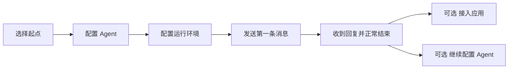

# Managed Agent 快速开始设计依据

快速开始已采用四步向导：选择起点、配置 Agent、配置运行环境、发送第一条消息。交互、状态恢复、请求示例与响应式布局的实现合同见 [Quickstart 交互与响应式布局](./managed-agent-quickstart-interactions.md)。本文说明这些选择的原因与能力边界。

## 让首次运行可预测

首次使用的目标是收到一条真实 Agent 回复。配置阶段通过明确的表单和导航推进，用户不需要等待 Builder 模型决定下一步，也不需要先理解 Vault、MCP 和 Deployment。Agent 创建对话仍保留 AI 辅助设计能力，但它不控制快速开始的资源创建与导航。

Hello World 是默认推荐入口，名称、模型与系统提示词预填。研究、数据分析、追踪和代码评审场景明确需要用户提供主题、数据、来源或代码。模板配置用途与工具，不隐式授权私有系统，也不承诺完成定时部署。

场景卡片只选择草稿；进入配置、返回和切换示例都不创建资源。保留四步使 Agent 和环境的保存、失败与恢复有明确位置。进一步压缩步骤需要可验证的默认资源与恢复合同，不能以隐藏失败原因换取点击数减少。

## 资源身份与默认值

同名 Agent 只是复用候选，名称不能代替 ID。用户明确选择已有 Agent 时，界面和请求示例读取服务端保存的版本、模型和提示词；选择新建时恢复自己的草稿。

模型列表第一项只作为初始选择，与服务端 Workbench 的规则一致。它不是管理员指定的默认模型，也不证明模型服务凭据、配额和推理可用。

环境选择优先推荐当前工作区中实际存在且未归档的 Default；没有 Default 且只有一个可用环境时预选它，否则由用户选择或新建。Default 名称与 active 状态都不等价于运行就绪。新环境使用现有表单的 cloud 配置和 limited 网络默认值，减少界面选项不扩大网络权限。

保存配置成功与实际运行成功分别反馈。Sandbox、执行服务和模型是否能完成调用，通过最终步骤的真实对话观察，不能由资源查询成功推断。

## 草稿与不确定写入

非凭据草稿、已确认资源 ID 和 Session 绑定按账号及工作区保存在当前标签页。服务端资源是事实来源；刷新时重新查询，失效绑定退回配置，不自动创建替代资源。

Agent、Environment 与 Session 创建前记录操作标记，并通过 `metadata.quickstart_operation_id` 恢复未知结果。确定拒绝允许显式重试；网络或服务端错误先核对已保存结果，不自动重发 POST。唯一匹配才恢复绑定；没有匹配或存在多个匹配时继续阻止创建。

操作标记是恢复线索，不是服务端幂等合同，不能宣传为并发写入的 exactly-once 保证。发送结果未知也必须由用户先刷新、核对对话，再明确解除发送保护。

## 对话与事件顺序

在线测试沿用当前控制台登录态，应用接入才使用工作区 API 密钥。首次发送才创建 Session，同一 Agent 版本和环境组合继续复用会话。

SSE 是实时广播，不保证历史重放。界面先连接事件流并同步分页历史，再发送消息；历史与实时事件按精确事件 ID 合并。应用示例也要求先监听、再发送，不能用创建会话成功或发送 HTTP 200 代替收到最终回复。

工具批准、拒绝或自定义工具结果被接受后，会话已进入恢复执行阶段。确认事件之后尚无新的 Session 状态时，继续阻止发送下一条消息；该状态从事件顺序推导，刷新页面后仍然成立。公开终止或删除状态优先，不能被等待恢复的判断覆盖。

正常完成需要最后一条用户消息之后出现可读回复、观察到正常结束的 idle，并且没有待确认工具。Thinking、部分输出、等待工具、错误停止和用户中断不能显示为首次运行完成。

对话复用现有 Session transcript、Thinking、工具确认、中断、滚动和历史处理能力。资源及 Session 加载错误统一提取 API 错误消息，避免将普通错误对象直接转成字符串。

## 应用接入与界面边界

curl 示例使用当前服务 origin、实际 Agent ID/版本、环境 ID 和工作区头。密钥仅保留占位符，提供现有密钥管理入口；Session ID 来自应用创建请求的响应，并由监听和发送请求共享。在线测试会话与应用创建会话分别管理。

四步共用整页宽度的底部操作栏，返回在左、主操作在右。桌面最终步骤为 API 与对话分配剩余视口空间，各自内部滚动，保留输入框与结束入口；窄屏优先展示在线测试并自然滚动。明暗主题使用统一语义令牌。

## 验证边界

页面回归覆盖配置、复用、分页、草稿和刷新恢复、延迟 Session 创建、订阅先于发送、完成判断、未确认发送、工具恢复执行及可读错误展示。布局与浏览器交互需要实际页面验收，不能由静态测试代替。

后端验证入口为 verify-be 的 chat roundtrip、tools、reliability 和 public。其真实 Worker、隔离依赖与脚本化模型覆盖不代表外部云分配、实际模型质量或浏览器界面通过。首次体验成功率、启动时间和资源复用率需要独立埋点及同条件基线，界面简化不等价于冷启动性能改善。

## 实现入口

- [向导与资源恢复](../../../web/src/features/managed-agents/quickstart/useQuickstartWizard.ts)
- [在线对话生命周期](../../../web/src/features/managed-agents/quickstart/useQuickstartConversation.ts)
- [对话状态判断](../../../web/src/features/managed-agents/quickstart/conversationModel.ts)
- [Session 历史与事件流](../../../web/src/features/managed-agents/sessions/sessionDetailData.ts)
- [页面回归](../../../web/src/features/managed-agents/quickstart/AgentQuickstartPage.test.tsx)
