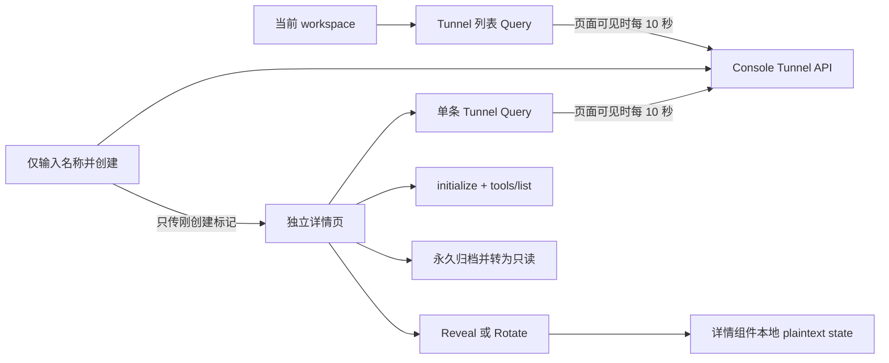

# MCP Tunnel Console 前端设计

## 目标与边界

MCP Tunnel 是 workspace 基础设施，位于 Console 的 `Manage` 导航组并带 `Preview` 标记，不归属于
`Managed Agents`。交互层级参考 Claude Console 的资源列表、独立详情和 Agent MCP 选择流程，但继续复用 OMA
现有的 tunnel-client、Token、Channel、Redis Broker、Probe 与 Runtime Gateway；前端不暴露或模拟
Cloudflare Tunnel、CA、Certificate、WIF、Subdomain、Path 等 OMA 服务端不存在的概念。

canonical 路由为：

- 列表：`/settings/workspaces/{workspaceId}/mcp-tunnels`；
- 详情：`/settings/workspaces/{workspaceId}/mcp-tunnels/{tunnelId}`。

不注册其他 Tunnel 列表入口或重定向路由。从详情切换 workspace 时进入新 workspace 的列表，不复用原 workspace
的 Tunnel ID。

前端只调用 `/api/console/.../mcp_tunnels`，使用现有 cookie Session。所有创建、reveal、rotate、archive 和
probe 请求携带 bootstrap 提供的 `X-CSRF-Token`，不调用需要 `anthropic-beta` 的 `/v1/tunnels` 管理面。

## 页面与数据流

列表 Query 与详情 Query 只保存非敏感 Tunnel DTO 和连接快照。创建成功后，路由 state 只携带
`mcpTunnelCreated: true`；详情组件据此自动请求 reveal，并立刻用 replace 消费该标记。明文 Token 只存在于详情
组件本地 state，不进入 URL、history state、TanStack Query、local storage 或 session storage。

详情使用单条查询：

`GET /api/console/organizations/{orgUuid}/workspaces/{workspaceId}/mcp_tunnels/{tunnelId}`

返回结构与列表元素一致，并带当前 Tunnel 的 connection snapshot。详情不加载全量列表后查找，从而保证直接访问、
查看归档资源和 Tunnel 数量较多时的稳定性。

## 列表交互

- 页面采用资源入口布局，按 ID、Name、Connection、Channels、Created 的顺序显示资源和归档状态；中文导航、页面标题和资源操作文案统一使用“MCP 隧道/隧道”，不混用英文 `Tunnel` 作为界面名词；
- 仅 ID 和 Name 是进入详情的链接，并沿用 Agents 列表的 hover 下划线反馈；整行不可点击。行菜单只提供复制 Tunnel ID、复制主 Channel URL 和 Archive；
- 保留名称包含或精确 ID 搜索、Active/All 筛选、独立 loading/empty/error 状态；
- 页面可见时每 10 秒刷新，后台标签页停止轮询；
- `New tunnel` 只要求名称，创建成功后直接进入详情并自动 reveal Token。

## 详情交互与状态模型

详情固定分为 Header、Overview、Connector setup、Connection 和 Danger zone：

- Header 显示返回入口、名称、Tunnel ID、状态、创建时间及操作菜单；
- Overview 显示 domain、主 Channel canonical MCP URL 和复制操作；
- Connector setup 提供 Token 的 Reveal/Hide/Copy/Rotate、本地 MCP URL 和原版 tunnel-client YAML；YAML 固定
  `url_path: /connector`，Token 始终使用 `env:OMA_TUNNEL_TOKEN` 引用；
- Connection 显示 connector 状态、实例数和实时 Channel 表格；Channel 行展示名称、process affinity、实例数、
  解析后的 MCP URL，并可执行一次性 `initialize + tools/list` Probe；
- Danger zone 永久 Archive。归档后详情仍可访问，但 reveal、rotate、probe 和再次 archive 都禁用。

状态完全由持久化状态和实时 snapshot 派生，不以 Probe 成功作为健康条件：

| 展示状态                 | 派生条件                                    |
| ------------------------ | ------------------------------------------- |
| `Ready`                  | active、`connected` 且至少一个 live Channel |
| `Connected, no channels` | active、`connected` 且没有 live Channel     |
| `Waiting for connector`  | active 且 `disconnected`                    |
| `Status unavailable`     | active 且连接状态为 `unknown`               |
| `Archived`               | `archived_at` 非空，优先于所有实时连接状态  |

Probe 结果只保存在本次详情交互中，展示 channel、protocol、server 和 tools，不持久化，也不参与 Ready 判定。

## Agent MCP Picker

Rendered 创建/编辑表单并行加载当前 workspace 的 active Tunnel 和公共 MCP Directory。Picker 分成
`Private tunnels`、`MCP directory` 两组，Tunnel 固定在前，使用独立图标并显示连接状态。两个来源独立降级：
任一来源可用时 Picker 就保持可操作；另一来源失败不能遮蔽已经加载的选项。

Picker 仍以一个 Tunnel 作为一个候选项，不按 Channel 展开。选择后直接在 MCP 区域生成并滚动到内联配置卡片；
卡片始终把 Tunnel 名称、连接状态和 Channel Combobox 放在工具权限之前，并在 Combobox 下方以弱提示行展示
解析后的 canonical MCP URL；合法 Channel 不显示常驻格式帮助，只有必填、非法或重复时才显示行内信息。URL 不使用独立边框面板，超长时截断显示。卡片不使用独立 Dialog，
也不折叠 Channel 配置。该层级对齐 Claude 的“先选 Server，再在 Server 卡片中确认路由目标”，但不引入 OMA
服务端不存在的 Subdomain 或 Path 字段。

Channel 的上下文确认规则如下：

- 恰好一个实时 Channel 时自动选择实际值并写入 Draft；即使唯一值不是 `main` 也不回退；
- 多个实时 Channel 时保持空值、显示 `Channel required` 并聚焦 Combobox；
- 没有实时 Channel 时同样要求显式输入，`main` 只作为 placeholder 和建议项，不自动写入；
- 允许提前填写还未上线的 Channel，但必须匹配 `^[a-z0-9_-]{1,64}$`；disconnected/unknown 只显示未连接提示，
  不阻止确认和保存；
- 待确认卡片不写入 Agent Draft，并阻止 Create、Save 和切换 Raw；取消不修改 Draft，模板或 Describe 整体替换
  Draft 时清除待确认卡片；
- 同一个 Tunnel 可以多次添加，以便分别配置多个 Channel 和各自的工具权限；同一 Tunnel + Channel 重复时显示
  行内错误并禁止确认。

保存时仍只使用既有 `mcp_servers` 与 `mcp_toolsets` API 字段：

| Channel | `mcp_server.name`               | URL                            |
| ------- | ------------------------------- | ------------------------------ |
| `main`  | `tunnel_<32-hex-id>__main`      | `/v1/mcp/{tunnelId}`           |
| 其他    | `tunnel_<32-hex-id>__{channel}` | `/v1/mcp/{tunnelId}/{channel}` |

每个生成的 `mcp_server.name` 都有同名的 `mcp_toolset.mcp_server_name`。工具卡显示
`Tunnel 名称 · Channel`、最终 URL 和 Tunnel 图标。只有当前 workspace active Tunnel 才参与 Picker 元数据解析；
真正的可调用性由 Session Runtime Gateway 和 Tunnel 归档状态在服务端再次校验。Picker 从不读取 Tunnel Token。

已配置卡片继续使用同一 Channel 配置区。键盘输入先停留在本地编辑缓冲，只有 Apply 或选择有效实时建议后，才原子迁移
`mcp_server.name`、`mcp_server.url` 和对应的 `mcp_toolset.mcp_server_name`；工具权限、配置顺序和其他 Agent 字段保持不变。
成功切换后清除旧 Channel 的临时发现结果，并在 Tunnel 已连接时对新 Channel 重新 Probe。历史 Raw 配置仍按 canonical URL
回显，不改变 `mcp_servers`、`mcp_toolset`、Agent API 或 Tunnel URL 合同。

添加已连接 Tunnel Channel 后，编辑器立即调用既有 Console Tunnel Probe，经 Broker/connector 获取工具名称和描述，
并为当前 `mcp_toolset` 展示逐工具权限；卡片保留 Refresh 按钮用于再次发现。Probe 结果只存在于本次编辑器状态，
不进入 Agent payload 或 Query cache。Probe 失败不会删除已经添加的 server，也不会阻止保存；disconnected/unknown
Tunnel 仍允许提前配置。Agent 保存后，详情页的 MCP Refresh 走 catalog API：同样经 Broker 探测，但成功结果会保存为
last-good catalog 快照。

## 验收

前端单测覆盖 canonical 路由、导航归组、workspace 切换、列表状态、创建后安全 reveal、详情轮询和状态映射、
Channel URL、Probe、Rotate、Archive 只读状态、Picker 分组、单实时 Channel 自动选择、多/零实时 Channel 显式确认、
待确认阻断、Channel 原子迁移、重复校验、多 Channel 保存、添加或切换后自动发现、卡片手动刷新，以及
Directory/Tunnel 数据源独立降级。

构建后需重启本地 server/web，并在浏览器验证列表到详情、Connector setup、真实 Channel Probe、Agent 保存后重新
编辑及 Session 配置。浏览器验收创建的临时 Tunnel 应在验收结束时归档；为验收启动的本地服务应停止。
