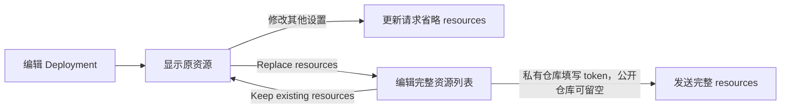

# Session 与 Deployment Resource 表单

## 目标

控制台补齐 Session 输入文件的最短操作路径：

1. 在当前 Workspace 的 Files 页面上传文件；
2. 在 Create Session 对话框添加 File Resource，并从当前 Workspace 的文件列表中查询选择；
3. 提交现有 `POST /v1/sessions` 的 `resources` 字段。

后端的 filesystem、输入引用、只读挂载和 Files API 投影统一由 [Filestore 设计](../be/filestore.md)定义，本文只描述前端接口。

## Git Repository 资源

Create Session、Create Deployment 和 Agent 详情中的 Create Deployment 共用 Resource 字段组件。资源菜单可以添加 File 或 Git repository；Deployment 保留 Memory Store 选择器。Git 资源支持 GitHub 及自托管 HTTPS Git 仓库。

Git repository 的公开请求字段如下；API 类型沿用 `github_repository`，不限制仓库托管平台：

```json
{
  "type": "github_repository",
  "url": "https://git.example.com/group/subgroup/repo.git",
  "authorization_token": "<write-only token>",
  "checkout": {"type": "branch", "name": "main"},
  "mount_path": "/workspace/repo"
}
```

- URL 必须使用 HTTPS 和默认端口 443，包含有效仓库路径；支持自托管域名、嵌套路径、`.git` 后缀和尾斜杠。不得包含内嵌用户名或密码、查询参数或片段。
- Authorization token 可选；公开仓库留空，提交时省略该字段。使用密码输入，不从读取响应回填，不保存到浏览器存储。
- Checkout 为 None、Branch 或 Commit；None 不发送 `checkout`，Branch 发送 `name`，Commit 发送完整的 40 或 64 位十六进制 `sha`，不接受短 SHA。
- Mount path 可省略，默认由服务端按仓库名生成 `/workspace/<repo>`。它与 File 的 `/mnt/session/uploads` 路径规则分开；Git 表单接受 `/workspace` 下的绝对路径。
- 前端检查必填字段、URL、SHA 和基础路径形状；Git ref、跨仓库路径冲突、资源数量与完整安全规则以后端为权威。

### Deployment 编辑

编辑 Deployment 默认展示原资源摘要。只修改名称、环境或触发器等设置时，请求省略 `resources`，避免覆盖通过 API 创建的 Git/File 资源。

点击 Replace resources 后编辑的是完整列表。File 路径与 Memory Store 的 access/instructions 从原配置保留，私有仓库必须重新填写 token，留空表示匿名访问；不能把缺少 token 解释为沿用旧凭证。Keep existing resources 恢复原列表并清空新填的 token，最终更新仍省略 `resources`。



### 已创建 Session

Resources Inspector 展示 Git URL、检出的 branch/commit 和 mount_path，支持使用现有 Update Session Resource API 轮换授权 token。轮换表单只提交 `authorization_token`；留空保存会发送空字符串，清除已有令牌并改用匿名访问。成功或取消后清空密码输入。已归档 Session 禁用轮换。

Git 仓库准备不向会话时间线添加自定义系统消息。

运行中的 Add Resource 仍只添加 File。更换仓库、检出引用或路径需要新建 Session；不提供动态 Git 添加、删除或重新 clone 的界面。

## Files 上传

Files 页面使用现有 Anthropic Files client 上传一个或多个文件：

```text
POST /v1/files?beta=true
multipart/form-data
X-Workspace-ID: <当前 Workspace>
```

所有上传请求结束后分别统计成功与失败结果。只要至少一个文件上传成功，就使用实际成功数量显示成功 toast，清空当前游标并刷新第一页；任一请求失败时同时显示错误 toast。多文件并发上传可能部分成功，当前实现不回滚。

## Create Session 表单

Resources 区域可以添加多张 File 卡片。每张卡片包含 File 选择器、可选 Mount path、`Manage files` 链接和删除按钮。File 选择器通过 `GET /v1/files?beta=true&limit=1000` 查询当前 Workspace 的文件元数据；响应存在 `has_more` 时使用 `last_id` 作为 `after_id` 继续查询，直至加载完整列表。选择器支持按文件名或 File ID 过滤，并以“文件名（可读大小）”展示选项；提交时仍只写入所选文件的 `file_id`，不改变现有 Session API 合同。加载中、加载失败和空列表均在选择器弹层中给出明确状态。

前端、API 与 Sandbox 使用三种路径表示：

```text
表单:     reports/input.csv
API:      /reports/input.csv
Sandbox:  /mnt/session/uploads/reports/input.csv
```

Mount path 输入组固定展示 Sandbox 前缀 `/mnt/session/uploads/`，用户只编辑后面的相对路径，无需输入 `/uploads` 或 Sandbox 前缀。填写自定义路径时，提交前端补上 API 所需的开头 `/`：

```json
{
  "resources": [
    {
      "type": "file",
      "file_id": "file_abc123",
      "mount_path": "/reports/input.csv"
    }
  ]
}
```

Mount path 经 `trim()` 后为空时，前端不发送 `mount_path`；服务端按既有合同默认使用 `/uploads/<filename>`，Sandbox 中对应 `/mnt/session/uploads/<filename>`。输入框错误状态、创建按钮校验和提交转换共用这一判断。

`source` 不由前端发送，后端默认为 `/uploads`。

## 校验

前端只做即时校验：

- 已从当前 Workspace 文件列表中选择 File，且对应 File ID 非空；
- Mount path 经 `trim()` 后可以为空；为空时使用服务端默认文件名；
- 自定义 Mount path 使用相对于 `/uploads` 的路径，不以 `/` 开头或结尾，不包含 `//`、`.` 或 `..` 路径段。

File 是否存在、Workspace 隔离、500 个上限、跨卡片路径冲突、Filestore namespace 冲突和完整路径规则均以后端为权威。

## 实现与验收

主要落点：

- `web/src/features/dashboard/files.tsx`：上传入口与反馈；
- `web/src/features/managed-agents/sessions/SessionFileResourcesField.tsx`：Resource 卡片；
- `web/src/features/managed-agents/sessions/file-resource-path.ts`：路径转换；
- `web/src/features/managed-agents/api.ts`：Create Session 请求体。
- `web/src/features/managed-agents/resources/ManagedResourceFields.tsx`：Session/Deployment 共用资源输入及显式替换；
- `web/src/features/managed-agents/resources/git-resource.ts`：Git 校验、表单映射与请求映射；
- `web/src/features/managed-agents/resources/GitRepositoryFields.tsx`：Git 表单；
- `web/src/features/managed-agents/sessions/SessionGitResources.tsx`：查询展示与 token 轮换。

测试覆盖上传成功/失败与部分成功、上传后返回第一页、Workspace header、文件列表游标分页与完整聚合、查询展示、按文件名过滤和选择、空资源、相对路径转换及非法路径段、非法输入禁用创建、删除草稿卡片、Files 链接和运行时路径预览。

Git 回归覆盖可选 token、匿名请求与密码控件、Checkout 请求形状、可选字段省略、Deployment 未改资源时省略字段、显式替换留空时匿名访问、保留 File/Memory 配置，以及 Session token 轮换的请求范围和成功后清空。

2026-09-05 使用独立本地测试数据库、禁用 Runner 的后端（38183）和前端（5188）完成 Chrome 浏览器验收，仅使用虚拟令牌，未启动 Sandbox。Session 分支创建、URL / 挂载路径错误反馈及令牌轮换成功；Deployment 提交 SHA 校验、Commit 创建、默认挂载路径、仅改名称后保留仓库，以及显式完整替换必须重填令牌均验证通过。取消替换后再次打开表单时令牌为空，验收后已关闭临时服务。
