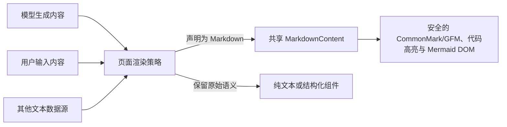

# 网页前端 Markdown 与 Mermaid 统一渲染

## 背景

Markdown 内容会出现在 Managed Agents Quickstart、Session transcript 和 Workbench 等网页前端界面。内容可能来自模型、用户或其他数据源；各功能自行解析 Markdown 会造成语法覆盖、安全策略和流式行为不一致，因此需要统一复用 `shared/ui/markdown-content`，并由消费页面明确决定哪些内容启用富文本渲染。

共享组件只负责把不可信的 Markdown 文本呈现为安全 DOM，不改变 SSE 状态、API payload 或持久化值。功能层始终保存原始文本，渲染层不回写 HTML。

## 能力与消费边界

共享能力不限制内容来源。消费页面根据内容合同决定使用共享渲染器还是保留原始语义；新增消费方不得自行实现另一套 Markdown parser。

本 PR 当前接入 Quickstart assistant 消息、Session transcript 文本与 thinking、Workbench Response Preview 和 Evaluate 模型输出。以下现有内容仍不进入 Markdown 渲染器：

- 用户消息、可编辑 prompt、system prompt 和 Agent 配置；
- 错误、状态、日志、命令和指标；
- Debug JSON、tool input/result 与 API payload；
- Memory/resource 正文及没有声明 Markdown 合同的普通 description。

这些内容分别属于用户输入、可编辑源码、结构化审计数据或普通产品文案。自动解释 Markdown 会改变原始语义，甚至把调试载荷误呈现为交互内容。

## 共享合同

共享渲染器支持 CommonMark、GitHub Flavored Markdown、显式语言代码高亮和 Mermaid。原始 HTML 与远程图片不渲染；链接只允许 HTTP、HTTPS、邮件、站内单斜杠路径和锚点，协议相对 URL 与危险 scheme 降级为纯文本。

代码高亮只注册 JavaScript、JSON、Python、Bash、TypeScript 和 YAML 等项目明确使用的语言。未知语言按纯文本展示，不启用全语言自动检测。

Mermaid 只在出现闭合的 `mermaid` 代码围栏时动态加载。渲染使用严格安全模式、源码长度和 flowchart 边数限制，并按当前主题生成 SVG；非法、超限、加载失败或仍在流式传输的未闭合围栏保留源码，不丢失原始 Markdown 内容。

## Session 迁移

Session transcript 原有手写 parser 只能处理部分标题、无序列表、简单表格、加粗、链接和代码。迁移后删除该 parser、专属 block 类型和重复 URL 白名单，普通 transcript 文本直接进入共享渲染器。JSON、日志、指标、命令与 tool result 仍由 `TranscriptTypedContent` 的结构化分支处理。

## Workbench 迁移

Workbench Preview 在流式增量到达时直接用当前原始文本重新渲染。未闭合 Mermaid 围栏不会启动图表渲染，因此不会因半成品反复产生错误。

Evaluate 的主模型输出和对比模型输出共用 `EvaluateOutputCell`，该单元格只在成功且存在模型输出时使用 Markdown；运行中状态、错误和空状态继续按普通文本展示。代码块自动换行，表格与 Mermaid 在自身容器内滚动，不能扩大 Evaluate 网格列宽。

## 验收

- 四个当前接入的展示面使用同一共享组件，不存在 feature 专属 Markdown parser。
- 标题、强调、列表、引用、表格、代码与 Mermaid 在各消费者中保持一致。
- 用户输入、错误、日志和结构化 payload 不被解释为 Markdown。
- 危险 URL、原始 HTML 与远程图片保持不可执行、不可点击或不展示。
- Session 与 Workbench 的聚焦测试、完整前端测试、构建、格式、命名、复杂度和重复代码门禁通过。
