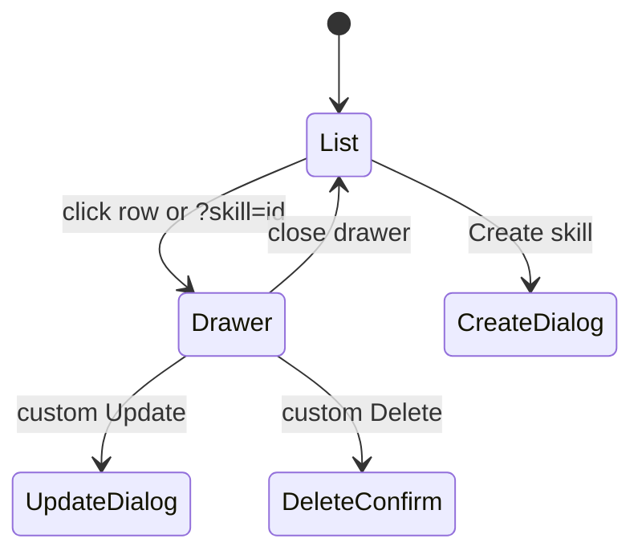

# Skills Page

## 页面模型

Skills 页面是单页管理器：

- 列表展示所有可用 skill。
- 详情通过 query param 打开：`/skills?skill={id}`。
- 创建、更新和删除都在当前页面内用 dialog/sheet 完成。

旧的 `/skills/{id}` 入口仍可进入同一个页面，并会把状态同步为 `?skill={id}`，避免路由调用方承受无关迁移成本。

## 列表

列表使用 shadcn `Table`，列为：

- `ID`
- `Name`
- `Source`
- `Latest version`
- `Updated`
- actions

`source` 行为：

- `anthropic` 显示 `Anthropic` badge，无 update/delete action。
- `custom` 显示 `Custom` badge，显示 update/delete action menu。

分页沿用后端 cursor，当前页 token 保存在页面状态中；切换 workspace 时重置分页。

## Drawer

详情 drawer 使用 shadcn `Sheet`，并由 `?skill=<id>` 驱动：

- header 展示 display title、source badge、updated 时间和短 ID。
- `Description` 来自 latest version metadata。
- `Versions` 展示版本号、创建时间、`Latest` badge。
- custom version 提供删除按钮；builtin version 只读。

关闭 drawer 会移除 query param，并把旧的 `/skills/{id}` 入口归一回 `/skills`；浏览器前进/后退通过 `popstate` 同步 UI 状态。

## Agent detail 展示

Agent detail 的 `Agent` tab 先使用 agent 详情接口返回的 `skills` 数组建立稳定列表，再按 `skill.skill_id` 并行请求 `/v1/skills/{skill_id}?beta=true` 补全元数据。

- `skills` section 与 `MCPs and tools` section 平级展示。
- `skills` 为空或缺失时，保留 `Skills` 标题，并在描述槽显示 `No skills configured.`。
- `skills` 非空时，使用紧凑列表展示；默认行只展示 skill 名称、原始 `skill_id` 和版本信息（agent 引用版本，以及可用时的 latest version）。
- `Skill` 主文案优先使用 Skills API 返回的 `display_title`；若无法获取，则降级为 agent snapshot 中的 `display_title` / `name` / `title` / `skill_id`。
- 每行保留原始 `skill_id`，并提供复制按钮，避免长 ID 作为主视觉但仍可用于调试。
- 每一行是一个折叠面板（Collapsible），默认折叠，只展示最关键的 Skill 名称、原始 `skill_id`、版本 Badge 和 Skill 来源/类型 Badge。
- 点击行内区域或右侧的 Chevron 图标可以展开面板，展开后以精美的两列网格（Grid）展示详细元数据，包括：ID（带复制按钮）、Source、Agent version、Latest version、Created、Updated 和 Metadata 状态。
- `Source` 在外层（折叠行）和展开的详情面板内均会展示，优先使用 Skills API 的 `source`；API 失败时降级到 agent snapshot 的 `source` 或非 `skill` 的 `type`。
- Agent 引用版本使用 agent snapshot 中的 `version`；缺失时显示 `agent latest`。`latest <version>` 和更新时间来自 Skills API。
- System prompt、MCPs and tools、Skills 等核心板块的宽度统一到最大宽度（不再限制为 `760px`），从而在宽屏下展现出更一致、更具空间感和现代感的设计。
- 单个 skill 元数据请求失败不会影响 agent 详情加载；该行继续显示 snapshot 信息，并在展开的详情面板中标记 `Metadata unavailable`。

## 上传流

Create / Update 使用 shadcn `Dialog`，交互遵循 Claude 平台 reverse engineering 文档：

- 没有表单字段，只上传 `.zip`、`.skill` 或目录。
- 8 MiB 总大小限制。
- 支持拖拽目录，读取 WebKit filesystem entries 后保留相对路径。
- 支持点击选择 archive 文件，也支持点击选择目录（使用 `webkitdirectory` / `directory` input 属性）。
- 单 archive 直接作为一个 `files[]` 上传。
- 目录上传要求所有文件在同一个顶层目录下，并包含顶层 `SKILL.md`。
- display title 自动从 archive 文件名或顶层目录推断。
- Create 模式始终是纯创建语义，提交 `POST /v1/skills?beta=true`。如果 `display_title` 与已有 custom skill 冲突，展示后端 400 错误，并提示用户从已有 skill 的 actions menu 使用 Update 上传新版本。

Create 成功后：

- invalidates skills list。
- 关闭 dialog。
- 打开新 skill drawer。

Update 成功后：

- invalidates skill、versions 和 list query。
- 关闭 dialog。
- 保持当前 skill drawer，刷新 version 列表和 latest metadata。

## 删除

删除 skill 使用 shadcn `AlertDialog`：

- title：`Confirm deleting {name}`
- description：说明现有代码引用会立即失效，且操作不可撤销。
- confirm 时调用 `DELETE /v1/skills/{skill_id}?beta=true`；skill 和 versions 的删除由后端在同一删除语义内处理。
- 删除失败时确认框保持打开并展示错误信息。

Builtin skill 和 builtin version 不显示删除入口；后端仍会强制返回 read-only error。

## 验收路径

SuperDuck 手动验收覆盖：

- Skills list：列、source badge、pagination、builtin/custom actions 差异。
- Create empty state：dropzone、8MB 文案、disabled Continue。
- Create file state：archive summary、check icon、remove upload、enabled Continue。
- Create duplicate custom title：发送 `POST /v1/skills?beta=true` 后展示后端冲突错误，不发送 versions endpoint。
- Drawer：query param、description、versions、close。
- Agent detail：`skills` 空态显示 `No skills configured.`；非空态展示紧凑 skills 列表，默认只包含可读名称、原始 `skill_id` 和版本信息；跟随鼠标的 hover 浮窗展示 source、created / updated 时间和 metadata 状态。
- Actions menu：custom Update/Delete，builtin 无 menu。
- Update empty state：说明文案和 dropzone。
- Update success：dialog 关闭，drawer 版本列表刷新。
- Delete confirm：标题、描述、Cancel/Delete。
- Console errors 和 `/v1/skills` network 请求。
