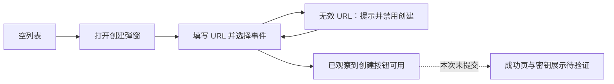

# Webhook 订阅前端参考调研

> 调研快照；后续实现范围与 API 证据修正见 [Webhook 订阅管理设计](../webhook-subscriptions.md)。本文件中的旧 API 可用性结论不覆盖后续发现的官方 AWS IAM 路由证据。

## 调研范围与证据

- 日期：2026-09-18。
- 参考页面：[Claude Console Webhooks](https://platform.claude.com/settings/workspaces/default/webhooks)。
- 方式：在已登录的 Chrome 中查看页面、打开创建弹窗、切换事件选择、填写未提交的示例 URL，并观察截图与可访问性状态。
- 本项目基线：`f41de23`，功能分支 `codex/webhook-subscriptions`。
- 本文是交互调研记录，不代表实现方案已经确认，也不代表本项目已经完成对应能力。
- 当前参考 workspace 没有 webhook endpoint。本次未创建订阅、发送测试通知、修改现有订阅或生成/重置密钥。

官方指南与 SDK 文档可以解释行为合同，但不能代替对具体界面的观察。下文区分已实看内容、本地源码差异和待验证内容。

## 已实看：入口与空列表

Webhooks 位于 Console 左侧 `Manage` 导航分组，页面受当前 workspace 约束。观察到的页面结构为：

1. 左上方标题 `Webhooks`，下面是一行说明：endpoint 接收当前 workspace 的事件通知。
2. 右上方主按钮 `Add webhook endpoint`，旁边有文档入口。
3. 表格上方有 `Find webhook by ID` 搜索输入框。
4. 表格列为 ID、Name、Status、Created、Actions；Name、Status、Created 暴露为按钮，排序实际结果因列表为空尚未验证。
5. 空表仍保留表头；内容区域居中显示图标、空状态说明及第二个 `Add webhook endpoint` 按钮。

没有现成记录，因此本次未验证搜索的匹配规则、排序方向、分页、行点击行为或状态徽标的真实展示。

## 已实看：创建弹窗

点击 `Add webhook endpoint` 打开居中的窄弹窗，背景变暗并模糊。标题为 `Create webhook endpoint`，右上角有关闭按钮。

字段依次为：

| 字段 | 展示与观察 |
| --- | --- |
| Endpoint URL | 单行输入；占位符 `https://example.com/webhooks` |
| Name (optional) | 单行输入；允许留空时创建按钮进入可用状态 |
| Description (optional) | 多行输入；允许留空时创建按钮进入可用状态 |
| Events to subscribe | 全选控件、已选总数、分组事件列表 |

弹窗整体滚动：滚到末尾时，标题和顶部字段已经离开可视区域。创建按钮位于全部事件分组之后的右下方，本次未看到独立的取消按钮。

这与本项目现有的固定标题/底部操作区有所不同。是否完整复刻滚动方式，还是保留现有可用性设计，需要后续明确，不把参考页面布局自动视为已经批准的修改。

## 已实看：事件选择

新打开弹窗时，所有事件均未选中，总数显示 `0 of 38`。

- 顶层 `Select all` 控制全部 38 项。
- 分组标题旁有复选框，右侧显示该组已选数量。
- 单项显示易读名称及等宽协议事件名，例如 `Idled` 与 `session.status_idled`。
- 每个协议事件名都有复制入口；已观察到相应按钮，本次未实际改写剪贴板验证复制反馈。
- 全局和组级复选框都支持未选、全选和部分选中状态。

实际操作证据：

| 操作 | 观察结果 |
| --- | --- |
| 勾选 Session lifecycle 组 | 组计数变成 `4 of 4`，总数 `4 of 38`，全局复选框为半选 |
| 取消其中 Idled | 组计数变成 `3 of 4`，总数 `3 of 38`，组复选框也变为半选 |
| 点击全局 Select all | 总数变成 `38 of 38`，各组和各单项均为选中 |

以下按实际事件协议名整理，共 12 组、38 项；类别中文名用于调研说明，不作为官方逐字 UI 文案：

| 类别 | 数量 | 事件 |
| --- | ---: | --- |
| Session 生命周期 | 4 | `session.status_run_started`、`session.status_rescheduled`、`session.status_idled`、`session.status_terminated` |
| Thread | 3 | `session.thread_created`、`session.thread_idled`、`session.thread_terminated` |
| Outcome | 1 | `session.outcome_evaluation_ended` |
| Budget | 1 | `session.budget_reached` |
| Session 记录 | 2 | `session.updated`、`session.deleted` |
| Vault | 3 | `vault.created`、`vault.archived`、`vault.deleted` |
| Vault Credential | 4 | `vault_credential.created`、`vault_credential.archived`、`vault_credential.deleted`、`vault_credential.refresh_failed` |
| Agent | 4 | `agent.created`、`agent.updated`、`agent.archived`、`agent.deleted` |
| Deployment | 6 | `deployment.created`、`deployment.updated`、`deployment.paused`、`deployment.unpaused`、`deployment.archived`、`deployment.deleted` |
| Deployment Run | 3 | `deployment_run.started`、`deployment_run.succeeded`、`deployment_run.failed` |
| Environment | 4 | `environment.created`、`environment.updated`、`environment.archived`、`environment.deleted` |
| Memory Store | 3 | `memory_store.created`、`memory_store.archived`、`memory_store.deleted` |

## 已实看：表单校验

没有提交任何创建请求，以下仅是客户端表单状态：

| 输入状态 | 观察结果 |
| --- | --- |
| 初始空表单、零事件 | 创建按钮禁用 |
| 选中 4 个事件、URL 为空 | 创建按钮仍禁用 |
| 选中 3 个事件、URL 为 `https://example.com/webhooks`、名称和描述留空 | 创建按钮可用 |
| 将 URL 改为 `not-a-url` | 即时出现 `Must be a valid HTTPS URL`，创建按钮禁用 |
| 恢复上述 HTTPS URL | 错误消失，创建按钮恢复可用 |

URL 的端口、DNS、公网地址等服务端校验，以及网络失败后的错误展示，本次没有通过真实提交验证。

## 与本项目当前源码的差异

源码定位：

- [页面、创建弹窗与事件目录](../../../web/src/features/settings/WorkspaceWebhooksPage.tsx)。
- [前端 API 类型与调用](../../../web/src/features/settings/webhooksApi.ts)。
- [页面测试](../../../web/src/features/settings/WorkspaceWebhooksPage.test.tsx)。
- [后端订阅事件白名单](../../../internal/webhooks/handler.go)。

| 项目 | Claude 实看 | 本项目当前源码 |
| --- | --- | --- |
| 默认选择 | 零事件 | 默认选择当前目录的全部事件 |
| 创建目录 | 12 组、38 项 | 5 组、15 项；详情摘要另外认识部分事件 |
| 顶层全选与总数 | 有 | 当前只有分组选择与分组计数 |
| 单项展示 | 易读名称、协议名、复制入口 | 创建表单主要展示易读名称 |
| URL 即时校验 | 非法格式立即提示并禁用创建 | `canSubmit` 只检查非空 URL、至少一个事件及提交状态 |
| ID 搜索 | 有输入框 | 当前列表无此入口 |
| 排序入口 | Name、Status、Created 是按钮 | 当前表头为静态文案 |
| 空列表 | 图标、说明、创建按钮 | 当前是表格内一行空状态文案 |
| 创建弹窗滚动 | 整体滚动，按钮位于内容末尾 | 固定标题与底部区域，中间表单滚动 |

本项目已有右侧详情面板、编辑、启停、删除确认及一次性密钥弹窗。但这些只属于本项目已有实现，不能据此声称已经与当前 Claude 的相应界面对齐。

## 社区与公开产品参考

### 证据范围

本轮检索了 Claude 相关社区讨论，以及 Svix、Convoy、Stripe 的公开交互资料。在 Chrome 中实际查看了 Svix 的测试和重放示例图、Stripe 的投递详情图，以及 Convoy 的用户门户图。这些是文档中的产品截图，没有登录这些产品测试真实发送、重试或密钥操作。

本轮未找到足够可信、完整展示 Claude 创建后详情、密钥弹窗和删除流程的社区截图或演示。找到的 [Claude Cookbooks issue #539](https://github.com/anthropics/claude-cookbooks/issues/539) 是 2026-04-14 关于找不到 Webhooks 入口的提问，不能据此推断当前入口缺失，也不能用于复刻布局。

Anthropic 自己的[公开参考文件](https://github.com/anthropics/skills/blob/main/skills/claude-api/shared/managed-agents-webhooks.md)明确说明创建时密钥只展示一次，并支持从同一 Console 页面轮换密钥。这补充了行为证据，但仍未验证弹窗样式、确认文案和旧密钥失效时机。

### Svix：测试与投递排查的操作路径

[Testing Events](https://docs.svix.com/receiving/using-app-portal/testing-events) 的示例图把 endpoint URL 和编辑入口放在顶部，下方分为 Overview 与 Testing。测试区先选事件类型，再点击 Send Example；文档说明随后可以进入消息，查看 payload、全部投递尝试和结果。

[Replaying Messages](https://docs.svix.com/receiving/using-app-portal/replaying-messages) 的示例图在投递尝试行旁放置 Resend 菜单；文档另外提供按时间窗口恢复失败消息的入口。[Filtering Logs](https://docs.svix.com/receiving/using-app-portal/filtering-logs) 则说明可以按事件类型和日期缩小查找范围。

可借鉴的是“配置完成 → 测试 → 定位消息 → 查看投递尝试”的连续路径，以及把单条重试与批量恢复分开。截图带有历史示例日期，只作为交互结构参考，不视为已验证的当前线上像素规格。

有一处行为不能直接沿用：Svix 的[创建说明](https://docs.svix.com/receiving/using-app-portal/adding-endpoints)把不指定事件类型解释为接收全部事件；Claude 实看则从零选择开始。本项目应按 Claude 的订阅选择语义设计。

### Stripe：列表与详情并排、明确区分事件和投递尝试

[Workbench 文档](https://docs.stripe.com/workbench/event-destinations)提供了可直接查看的[投递详情截图](https://b.stripecdn.com/docs-statics-srv/assets/view-event-deliveries.375483a863ab143a0e92f01fa01c14b0.png)：左侧选 endpoint，中间保留事件列表，右侧展示选中事件的状态、元数据、Delivery attempts 和 JSON 内容；重发按钮放在投递尝试旁。文档还说明详情可以查看 HTTP 状态及后续计划投递时间。

这适合参考“点开一条记录后仍保留列表上下文”的布局。若本项目后续增加投递记录，可以在详情区域划分配置和投递记录，再打开单条事件详情，具体使用抽屉还是独立页应结合内容宽度决定。图中日期为历史示例，不代表本次访问了 Stripe 的真实账号页面。

Stripe 的[密钥轮换说明](https://docs.stripe.com/webhooks#roll-endpoint-secrets)允许选择立即失效或最长 24 小时的旧密钥宽限期。可借鉴其明确交代旧密钥影响的做法；宽限期需要后端多密钥支持，目前不能作为 Claude 对齐项或仅靠前端添加的选项。

### Convoy：投递筛选与可解释的失败状态

[Convoy](https://github.com/frain-dev/convoy) 的 [Portal Links 文档](https://www.getconvoy.io/docs/product-manual/portal-links)包含用户门户截图：顶部保留 endpoint 名称、状态和 URL，下面是独立的 Event Deliveries 区域，提供日期、状态、批量重试入口及清晰的空状态。

其[投递文档](https://www.getconvoy.io/docs/product-manual/events-and-event-deliveries)区分正在自动重试与最终失败，并用时间线展示每次尝试、HTTP 状态、错误及请求/响应信息。可借鉴的是让用户看懂“当前结果”和“经历过哪些尝试”，避免仅显示一个 Failed 标签。门户分享链接和批量重试本身不是本轮必需范围。

### 对本项目的建议，待讨论确认

| 优先级 | 建议 | 依据与范围 |
| --- | --- | --- |
| 先对齐 | 列表入口、空状态、创建弹窗、零默认选择、分组与全局计数、协议名展示、URL 校验 | 以已实看的 Claude 为主；事件选项必须与后端实际支持和发出能力一致 |
| 继续确认 | 创建成功后的密钥保存提示、详情、编辑、启停、删除、重置密钥 | Claude 的未验证部分继续保留证据缺口，社区资料仅辅助设计 |
| 可选增强 | 测试通知、投递列表、状态/时间筛选、单条尝试详情与重发 | 借鉴 Svix、Stripe、Convoy，需先确认后端查询和操作合同，不纳入默认复刻范围 |
| 暂不展开 | 批量重放、外部用户门户、复杂事件路由、多密钥轮换宽限期 | 涉及额外产品和后端能力，另行讨论 |

建议先讨论“列表 → 创建 → 保存密钥 → 查看和修改订阅”这条主流程。视觉和基础控件继续遵守本项目的 shadcn/ui 规范，把 Claude 的信息组织和操作语义落到现有设计中。

## 待继续验证

需要可查看的既有 endpoint，或另行明确的测试 endpoint 创建安排，才能实看以下部分：

1. 有数据的列表、行点击与详情展开方式。
2. 编辑表单字段，尤其是 URL 是否可编辑、修改事件后的保存行为。
3. 启停和删除的确认文案、状态反馈与失败表现。
4. 创建成功后的密钥展示、复制和关闭提示。
5. 重置密钥的确认流程、旧密钥提示和成功状态。
6. 自动禁用原因如何展示，恢复启用是否有额外提示。

本次只增加调研记录，没有修改产品实现，没有运行前端测试、构建或 E2E。
