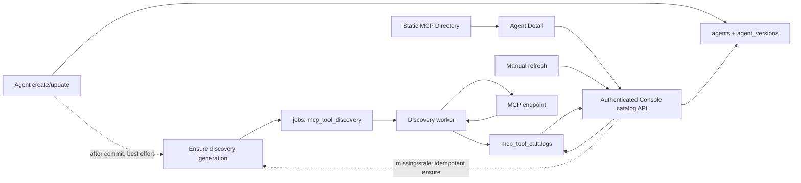
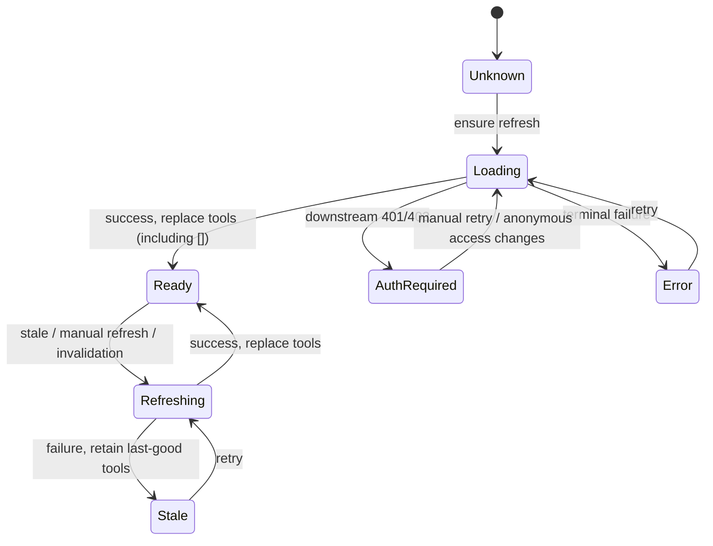

# Agent Detail MCP Tool Catalog 动态发现与缓存设计

> 状态：Implemented（匿名 URL / Streamable HTTP MVP）
>
> 适用范围：Agent 创建/更新后的 MCP 预热、Agent Detail 工具清单展示、Console API、发现 worker 与持久缓存
>
> 当前展示基线：[Agent detail MCP 与工具展示](./fe/agent-detail-mcp-tools.md)

当前已实现 migration、全局匿名 catalog、generation 去重、异步 worker、Agent create/update best-effort 预热、Detail lazy ensure、Console GET/refresh API，以及前端状态展示与手动刷新。带凭据发现、runtime observation、`tools/list_changed`、legacy SSE、按 endpoint 的速率限制和网络级地址策略仍属于后续范围；当前 probe 不检查 DNS/IP 是否指向本机、私网或特殊地址，不能把本 MVP 的 anonymous catalog 当作受限网络执行环境或运行时完整能力清单。

## 1. 摘要与决策

Agent Detail 中的 MCP 工具清单不能只依赖静态 MCP Directory，也不应在创建 Agent 时固化到 `agents` 或 `agent_versions`。MCP 的 `tools/list` 是外部服务在特定时间和网络环境下返回的可变观测结果，不属于 Agent 不可变配置。

本设计采用混合策略：

1. Agent 创建或产生新版本后，对新增或 endpoint 发生变化的 MCP 做 **best-effort 异步预热**；预热入队或探测失败不回滚 Agent 写入，也不延迟写接口响应。
2. Agent Detail 只读取后端持久化 catalog；当数据缺失或过期时，后端幂等调度异步刷新，页面使用 stale-while-revalidate 展示最后一次成功结果。
3. 用户可以在详情页手动刷新。手动刷新绕过 freshness TTL，但不会为同一 endpoint 创建并行重复任务。
4. 当前 catalog 只表示不携带凭据的匿名探测结果，并按规范化 endpoint 全局复用。未来带凭据的 `tools/list` 需要单独设计有作用域的存储，不能写入或覆盖这个全局匿名 catalog。
5. 浏览器不直接连接 MCP endpoint；所有网络访问均由后端 worker 或运行环境执行。

因此，“创建时缓存”和“每次显示动态加载”不是二选一：创建/更新负责降低首次打开延迟，详情页按需刷新负责自愈和时效性，持久 catalog 负责稳定展示与限流。

### 1.1 方案比较

| 方案 | 优点 | 不采用为唯一方案的原因 |
| --- | --- | --- |
| 创建 Agent 时同步拉取并固化 | 首次详情可直接展示 | 外部超时会拖慢或阻断写入；清单会过期；创建时没有 Session 凭据上下文；污染不可变 Agent 版本 |
| 每次打开详情时同步访问 MCP | 理论上更接近实时 | 页面延迟和可用性受外部服务控制；重复外联放大 SSRF 与限流风险；服务不可达时无 last-good 数据 |
| 浏览器直接调用 MCP | 后端实现较少 | CORS、凭据泄露和网络边界不可控，无法形成统一审计与限流 |
| **异步预热 + 持久 cache + 按需刷新** | Agent 写入可靠；首次延迟较低；支持 stale 展示、自愈、去重和统一超时 | 需要 catalog、job 和状态机；本设计选择此方案 |

## 2. 背景

当前 Agent Detail 的 `MCPs and tools` 区域从 Agent 版本读取 `mcp_servers` 和权限配置，再使用商业 MCP Directory 补全名称、图标和已知工具名。私有 MCP 不在 Directory 中时，前端只能得到空的 `toolNames`，因此会显示 `Tool permissions 0` 和 `No tool list available.`。

这里的空值表示“尚未发现”，并不等价于 MCP 服务真实返回了零个工具。把两者都显示为 `0` 会产生错误结论。

用于本设计验收的 endpoint 为：

`http://arthurs-MacBook-Pro-2.local:39090/mcp`

已验证该 endpoint 可由当前服务端和测试沙箱访问，并具有以下行为：

- `initialize` 成功，协议版本为 `2025-03-26`；
- server info 为 `weather-mcp` `1.0.0`；
- 声明 `capabilities.tools.listChanged=true`；
- `tools/list` 返回 `get_weather`，描述为 `Get weather for a city or place name.`；
- 客户端可以正常关闭 session。

这说明原页面空态的直接原因是缺少动态发现链路，而不是 Weather MCP 没有工具。现在该 endpoint 会由后端异步发现并进入持久 catalog。之前使用 `host.docker.internal` 时存在网络可达性差异；新 `.local` 地址已解决当前开发环境的连通性。当前 probe 不做目标地址 allow/deny 校验，`.local`、loopback、私网和公网 endpoint 使用相同连接路径。

## 3. 术语

| 术语 | 含义 | 是否属于 Agent 版本 |
| --- | --- | --- |
| Directory metadata | 静态目录中的标题、图标、说明和可选工具名 | 否 |
| MCP server config | Agent 中的 server `name`、`type`、`url` | 是 |
| Permission config | `mcp_toolset` 的默认权限与逐工具 override | 是 |
| Discovered catalog | 某 endpoint 最近一次成功的匿名 `tools/list` 结果 | 否 |
| Runtime observation | Session/Environment 在具体运行上下文中观测到的工具清单；当前未写入全局 catalog | 否 |

## 4. 目标与非目标

### 4.1 目标

- 私有或未知 MCP 能在 Agent Detail 中显示真实工具清单。
- 严格区分“未知”“正在发现”“真实空列表”“陈旧结果”和“发现失败”。
- Agent 写入不依赖外部 MCP 的可用性或响应时间。
- 不同 Agent、workspace 和 organization 可以复用同一匿名 endpoint 的全局 catalog。
- URL 或 Agent 版本切换后不会短暂展示另一个 endpoint 的工具。
- 失败刷新保留最后一次成功结果，成功刷新使用 replace 语义。
- 保持 Anthropic 兼容 `/v1/agents` API、Agent 版本和权限语义不变。
- 对用户提供可解释的状态、时间戳、重试入口和无障碍反馈。

### 4.2 非目标

- 不在 Agent create/update 请求内同步验证 MCP。
- 不把 catalog 写入 `agents`、`agent_versions` 或 `sameAgentConfig` 比较。
- 不保证历史 Agent 版本显示的是该版本创建时刻的工具快照。
- 不由浏览器直接连接 MCP，也不向浏览器下发 MCP 鉴权 header/token。
- 不根据 Agent Detail 自动选择 vault，也不把任何带凭据结果写入全局匿名 catalog。
- 不改变现有卡片顺序、只读权限计算或 `/v1/agents` 返回结构。
- MVP 不持久化完整 `inputSchema`、output schema 或其他大体积工具定义。

## 5. 核心不变量

1. Agent 版本冻结的是 MCP 配置和权限策略，不是外部服务的实时 inventory。
2. `tools = NULL` 表示从未成功发现；`tools = []` 表示 MCP 成功报告零个工具。
3. 动态 catalog 成功后整体替换旧清单，不能与旧清单或 Directory 做 union。
4. `configs[].name` 只参与权限 override，永远不能被当作工具 inventory。
5. 刷新失败不能把最后一次成功的 `tools` 改成空数组。
6. 全局匿名 catalog 只以 `transport_type + normalized endpoint_url` 标识；organization/workspace 只用于确认调用方有权读取目标 Agent/version，不能进入 catalog 唯一键。
7. 全局 catalog 不能接收凭据或带凭据的运行时观测，也不能代表带凭据运行时的完整能力。
8. catalog 刷新不会修改 Agent 的 `updated_at`、`current_version`，也不会创建新 `agent_versions` 行。

## 6. 总体架构



同步请求只读取 Agent 配置和 catalog。真正的 MCP 网络访问发生在异步 worker 或运行环境中，不占用 Agent create/update 和 Agent Detail GET 的响应预算。

### 6.1 数据获取优先级

卡片 metadata 与工具 inventory 分开解析：

- 标题、图标和补充说明继续优先来自 Directory；配置 URL 始终来自当前 Agent 版本。
- inventory 优先级为：成功发现的 catalog（包括真实空数组） > 可用的 stale catalog > Directory 中非空工具名 > unknown。
- catalog 的 error/auth 状态是 overlay；当仍有可用 stale inventory 时，错误不会抹掉列表。
- Directory 的空数组或缺失字段表示 unknown，不表示 MCP 成功返回零工具。
- 选定 inventory 后，再应用当前 Agent 版本的 `mcp_toolset` 默认权限与逐工具 override。

## 7. Agent 版本与身份语义

Agent 创建会写当前 `agents` 行及 `agent_versions` v1；配置变化时 update 才递增 `current_version` 并插入不可变快照，无变化 update 不产生新版本。Catalog 是独立的 derived observation，不能参与版本变化判断。

Catalog 主键不包含 Agent ID、Agent version 或租户标识，而是 endpoint 的自然身份：

`(transport_type, normalized endpoint_url)`

Agent Detail 请求中的 Agent/version 只用于：

1. 使用 organization/workspace principal 鉴权，并在对应 workspace 内读取该版本的 `mcp_servers`；
2. 规范化每个 server 的 transport 和 URL；
3. 按规范化 endpoint 找到全局可复用的匿名 catalog；
4. 使用该版本的权限配置生成展示结果。

因此，切换到历史版本时，页面显示的是该版本 endpoint 的最近观测值，并带来源和发现时间；它不是版本创建时刻的快照。若未来需要审计级复现，应在 Session 启动或运行时另存 observation，而不是把实时 catalog 塞进 Agent 版本。

server 仅改名但 transport 和 URL 不变时可以复用 catalog；URL 或 transport 改变会映射到另一条 catalog，旧任务和旧结果不得覆盖新 endpoint。

## 8. 持久化模型

实现使用 goose migration：

- `internal/db/migrations/00013_add_mcp_tool_catalogs.sql`：初始租户级 catalog；
- `internal/db/migrations/00014_globalize_mcp_tool_catalogs.sql`：切换为全局 endpoint identity。

`00014` 会删除现有 `mcp_tool_discovery` jobs 并重建 catalog 表。catalog 属于可重建派生缓存，迁移不尝试合并不同 workspace 的 active generation 或 last-good 快照；部署后由 Agent 预热或 Detail lazy ensure 重新发现。所有迁移均不修改已应用 migration 或 `internal/db/schema.go`，也不创建 PostgreSQL foreign key。

### 8.1 `mcp_tool_catalogs`

| 字段 | 类型/约束 | 说明 |
| --- | --- | --- |
| `id` | `bigint generated always as identity` PK | DB 内部主键 |
| `uuid` | `uuid default gen_random_uuid()` unique | 稳定业务 UUID |
| `external_id` | `text` unique | 例如 `mcpc_...` |
| `transport_type` | `text not null` | 当前为 URL transport；为以后 transport 扩展保留 |
| `endpoint_url` | `text not null` | 不含凭据的规范化完整 URL，最多 2048 bytes；直接参与全局唯一约束，不返回 catalog API，不写入普通日志 |
| `tools` | `jsonb null` | `NULL`=从未成功，`[]`=真实空列表 |
| `source` | `text null` | 当前仅为 `anonymous_probe` |
| `last_result_status` | `text null` | 最近终态：`success`、`auth_required` 或 `error` |
| `protocol_version` | `text null` | 最近成功协商的 MCP 版本 |
| `server_info` | `jsonb null` | 仅保存脱敏后的 name/version 等小体积信息 |
| `catalog_hash` | `text null` | 规范化工具清单 hash，用于跳过无意义写放大 |
| `discovered_at` | `timestamptz null` | 最近成功时间 |
| `expires_at` | `timestamptz null` | freshness 截止时间 |
| `last_attempt_at` | `timestamptz null` | 最近一次尝试时间 |
| `last_error_code` | `text null` | 稳定、可展示映射的错误码 |
| `last_error_message` | `text null` | 长度受限且脱敏，不保存响应体和 secret |
| `last_error_at` | `timestamptz null` | 最近终态错误时间 |
| `retry_after` | `timestamptz null` | 负缓存/退避截止时间 |
| `requested_generation` | `bigint not null default 0` | 已请求的最新刷新代数 |
| `settled_generation` | `bigint not null default 0` | 已写入终态的刷新代数 |
| `last_referenced_at` | `timestamptz not null` | create/update 预热或 Detail 映射最近引用时间 |
| `created_at` | `timestamptz not null` | 创建时间 |
| `updated_at` | `timestamptz not null` | 更新时间 |

约束与索引：

- unique `(transport_type, endpoint_url)`；
- check `octet_length(endpoint_url) BETWEEN 1 AND 2048`，与应用层规范化限制一致；
- index `(expires_at)`；
- index `(last_referenced_at)`，供全局 retention 扫描；
- generation 必须非负且 `settled_generation <= requested_generation`；
- `tools` 非空时必须是 JSON array；
- status/source 使用 check constraint 限制已知值；
- 不增加 `agent_id`、`agent_version` foreign key。

`endpoint_url` 与 Agent 配置处于同一数据库安全边界，既是 worker 的请求目标，也是 catalog 的自然键。规范化统一 scheme/host 大小写、尾部点、默认端口和 path 形状，使语义相同的 endpoint 命中同一行。anonymous MVP 拒绝 query、userinfo 和 fragment，不会静默剥离后再探测，因为这样会改变 endpoint 语义或引入凭据。

当前表不保存授权上下文，也不接收 token、header、cookie、vault reference 或其他 secret。未来 authenticated discovery 必须另行设计有作用域的身份、存储与授权规则，不能扩展当前全局匿名行来承载带凭据结果。

### 8.2 工具记录形状

MVP 的 `tools` 只保存展示需要的信息：

```json
[
  {
    "name": "get_weather",
    "title": null,
    "description": "Get weather for a city or place name."
  }
]
```

工具名必须非空且在单次结果中唯一。名称、title 和 description 都应有长度上限；不保存任意 annotations、schema 或服务端扩展字段。前端仍按普通文本转义显示。

### 8.3 Retention 与删除生命周期

Catalog 是可重建的 derived observation，不做无限期归档。初始策略固定如下，后续只能通过服务端配置缩短，不能在没有迁移和安全评审时延长：

- `last_error_message` 最多保留 7 天，之后清空自由文本；稳定的 `last_error_code` 和时间戳可保留到 catalog 行删除。
- last-good inventory 自 `discovered_at` 起最多保留 30 天。达到 hard-stale 截止时间且没有更新成功时，原子清空 `tools`、`server_info`、`catalog_hash`、`source`、`discovered_at` 和 `expires_at`；不能写成 `[]`，下一次读取回到 unknown/error 并重新发现。
- `last_referenced_at` 超过 30 天且没有 active generation 的 catalog 整行删除，同时删除只引用该 catalog 的终态 discovery jobs。任意 Agent create/update 预热或 Detail 映射都可以刷新该字段；因此 endpoint churn 和长期未访问的历史版本会自然回收，之后访问仍可按 Agent 配置重建。
- workspace 或 organization 删除不删除 catalog：catalog 不拥有租户数据，并且可能仍被其他租户的 Agent 引用。未被任何 Agent 间接引用的 endpoint 由上述全局 retention 自然回收。

后台 retention job 每日至少运行一次，全局小批量删除并复用 generation/lease 保护，不能删除 active job 正在写入的行。测试必须覆盖 hard-stale 清空不是空数组、endpoint churn 回收、active generation 保护，以及删除 workspace/organization 不误删共享 catalog。

## 9. Catalog 状态模型

Catalog 可用性与 job 执行状态必须正交。`jobs.status` 继续表示 `pending/retry/running/completed/failed`；API 展示状态由 `tools`、generation、终态和时间戳派生，不再维护一个容易失真的“stale”数据库枚举。

| API 状态 | 派生条件 | 展示语义 |
| --- | --- | --- |
| `unknown` | `tools IS NULL`，无 active generation，也无终态错误 | 尚未发现，count 显示 `—` |
| `loading` | `tools IS NULL` 且 `requested > settled` | 首次发现中 |
| `ready` | `tools IS NOT NULL`，最近成功且未过 `expires_at` | 可用；`[]` 是真实 0 |
| `refreshing` | 有 last-good tools 且 `requested > settled` | 保留列表并显示刷新中 |
| `stale` | 有 last-good tools，但已过期或最近刷新失败 | 保留列表、时间戳和错误提示 |
| `auth_required` | 无 last-good tools，匿名探测最近收到下游 401/403 | endpoint 需要认证，匿名 catalog 不可用 |
| `error` | 无 last-good tools，最近终态为其他错误 | 显示可重试错误 |

下游 MCP 返回的 401/403 是 catalog 的 `auth_required`；Console API 自身返回的 401/403 仍表示用户登录或 workspace 权限错误，两者不能混淆。



当前动态结果 fresh TTL 为 10 分钟，Directory metadata TTL 为 1 小时。过期的 last-good catalog 在 30 天 hard-stale 截止时间前继续以 stale 状态展示；它不会参与运行时授权或工具执行。hard-stale 清理按 8.3 执行，不能通过把 `tools` 改成 `[]` 来表示过期。TTL jitter 属于后续容量优化。

## 10. 调度、幂等与 worker

### 10.1 触发条件

| 触发点 | 行为 |
| --- | --- |
| Agent create | 对每个 URL MCP 在事务提交后 best-effort ensure |
| Agent update | 只 ensure 新增或 transport/URL 变化的 endpoint；no-op update 不调度 |
| Agent Detail GET | 对 missing/stale 且不在 backoff、没有 active generation 的 catalog 幂等 ensure |
| Manual refresh | 绕过 freshness TTL；已有 active generation 时复用，不并行创建 |
| Backfill | 对现有 Agent 分批入队；migration 本身绝不访问外部网络 |

Agent create/update 的预热沿用异步预热模式：Agent 事务成功后启动脱离 request cancellation、但受 3 秒 timeout 限制的后台 ensure；写接口不等待 catalog DB 调度完成。调度失败只记录脱敏日志，不改变已经成功的 Agent 响应。Agent Detail 的 ensure 是漏单后的自愈路径；除非实现引入真正的 outbox，否则不得声称 Agent 写入和预热任务原子提交。

### 10.2 job 约定

复用现有 `jobs` 表，新增 type：

`mcp_tool_discovery`

payload 只保存：

```json
{
  "schema_version": 1,
  "catalog_external_id": "mcpc_...",
  "generation": 3,
  "trigger": "manual_refresh",
  "workspace_external_id": "workspace_default"
}
```

MCP 业务链只传递稳定、可读的 `workspace_external_id`，Console 日志和 job payload 也使用该值，便于直接排障。只有真正创建 job 时，DB 才在调度事务内按 `workspaces.external_id` 解析内部 bigint，并写入通用 `jobs.workspace_id`；该 bigint 和 external ID 都只是任务来源，不参与全局 catalog identity。路由别名 `default`、workspace UUID 和可修改名称不能代替真实 external ID。

payload 不保存 token、header、vault secret、响应体或授权上下文，也不复制 URL。`trigger` 允许 `agent_create`、`agent_update`、`detail_read`、`manual_refresh` 和 `backfill`。

调度事务必须：

1. 锁定或条件更新 catalog；
2. 若已有 `requested_generation > settled_generation`，复用 active generation；
3. 否则把 `requested_generation` 增加 1；
4. 在同一个调度事务中插入 job。

job external ID 直接由 catalog 与 generation 组成：

`job_mcpt_<catalog ID 去掉 mcpc_ 前缀>_<generation>`

插入使用 `ON CONFLICT (external_id) DO NOTHING`。同一 generation 的 transient failure 只把同一 job 从 `running` 转为 `retry`，不创建新 generation。

worker lease、`FOR UPDATE SKIP LOCKED`、`locked_by/locked_until`、owner 校验和 retry 语义沿用现有 skill prewarm job。lease 取“当前配置的 probe timeout + 30 秒收尾余量”，并保留 30 秒最小值，避免合法的长探测在仍执行时被第二个 worker 重新领取。写结果时使用 generation CAS：只有 job generation 仍等于 catalog 的 `requested_generation` 才能更新；过期 job 完成但不写结果，防止旧请求覆盖新 endpoint 或新刷新。

- 成功：原子替换 tools、清除错误、更新 hash/timestamps，并 settle generation；真实空数组同样是成功。
- 下游 401/403、策略阻止和明确不支持的 transport：写入 terminal observation，job 标记 completed，不做无意义自动重试。
- timeout、临时网络错误和 5xx：指数退避加 jitter；超过最大尝试次数后 settle 为 error。
- 任意失败：保留 last-good tools；错误文本先脱敏、截断后才能持久化。

### 10.3 singleflight 与限流

- 同一 `(transport_type, endpoint_url)` 同时最多一个 active generation。
- 全局和 endpoint 分别设置并发/速率限制。
- 一次 Agent 最多 20 个 MCP，worker 侧初始并发建议为 2–3 个 endpoint。
- `retry_after` 内的详情 GET 只返回 cache，不反复入队。
- 手动刷新按钮在 active generation 期间禁用；重复请求返回同一 generation。

## 11. MCP 探测协议

实现复用仓库已有 `github.com/modelcontextprotocol/go-sdk`，不手写 MCP JSON-RPC 状态机。一次匿名 probe 的流程为：

1. 根据受支持 transport 创建客户端；MVP 的 URL MCP 使用 Streamable HTTP，legacy SSE 尚未接入。
2. 发送 `initialize`，记录协商后的 protocol version 和脱敏 server info。
3. 调用 `tools/list` 并遍历 cursor，直到结束或达到限制。
4. 规范化、校验并按服务端返回顺序保存工具；同名重复项视为 invalid response。
5. 关闭 client session，即使发现失败也执行清理。

默认保护参数：

- connect timeout 5 秒，单次 probe 总预算 10 秒；
- 最多 20 页、512 个工具、1 MiB 累计响应；
- name/title/description 分别设长度上限；
- 禁止 SDK 内部无限重试和无限 redirect；
- catalog 只保留 name/title/description，不保存 schema；
- error response body 不进入数据库或日志。

短生命周期匿名 probe 不依赖 `notifications/tools/list_changed`。未来若匿名长连接收到该通知，可以使匹配的全局 endpoint 过期并调度刷新；带凭据的运行时通知不能写入全局匿名 catalog。

## 12. Console API

Catalog 是 Console 展示能力，不属于 Anthropic 兼容 API。已新增受 `platformAuthMiddleware` 保护的路由：

```text
GET  /api/console/organizations/{orgUuid}/workspaces/{workspaceId}/agents/{agentId}/mcp_tool_catalogs?version={N}
POST /api/console/organizations/{orgUuid}/workspaces/{workspaceId}/agents/{agentId}/mcp_tool_catalogs/refresh?version={N}
```

路由由 `internal/mcpcatalogs.Handler` 注册，并由 `internal/api/server.go` 在现有 `/api/console/organizations/{orgUuid}` 鉴权 group 中挂载。`internal/api` 只做组装；查询校验、状态映射和调度编排放在 MCP catalog 资源包中；SQL 仅放 `internal/db`。

`version` 省略时使用当前版本；非正整数返回 400。handler 必须同时：

- 使用 `visibleOrgUUID` 校验 route organization；
- 校验 path workspace 与当前 platform principal 一致；
- DB 查询 Agent 时使用 principal 的内部 workspace ID，而不是只相信 path 或 `agentId`；route organization 已由前两步独立校验；
- 在该 workspace 内读取 Agent/version，缺失返回 404；鉴权完成后才按该版本的规范化 URL 访问全局 catalog；
- 从 Agent 版本服务端解析 MCP URL，刷新 API 不接受调用方提供任意 URL、header 或 token。

organization/workspace 只保护“调用方能否看到这个 Agent 及其 MCP 配置”，不参与 catalog 唯一键。调用方不能枚举全局 endpoint，也不能绕过 Agent 配置直接读取或刷新任意 URL。

### 12.1 GET catalog

GET 立即返回 cache，不等待外部 MCP。对于 missing/stale catalog，可以在响应过程中做幂等 ensure，但网络 probe 始终异步执行。`loading`/`refreshing` 等可复用状态走只读 fast path；`last_referenced_at` 最多每 5 分钟 touch 一次，因此前端每秒轮询不会转化为每秒数据库写入。

```json
{
  "version": 2,
  "data": [
    {
      "server_name": "weather_service",
      "status": "ready",
      "source": "anonymous_probe",
      "tools": [
        {
          "name": "get_weather",
          "title": null,
          "description": "Get weather for a city or place name."
        }
      ],
      "discovered_at": "2026-07-10T10:00:00Z",
      "expires_at": "2026-07-10T10:10:00Z",
      "last_error": null,
      "generation": 2
    }
  ]
}
```

`status` 是 freshness/error 展示语义的唯一权威字段；响应不额外返回可与其冲突的 `stale` boolean。`generation` 供刷新请求和调试确认使用；是否 active 已编码为 `loading`/`refreshing`。

从未成功时 `tools` 必须为 `null`，不能返回 `[]`。error shape 只包含稳定 code 和安全的本地化映射参数，不返回 endpoint、响应体、堆栈或凭据。建议错误码：

- `auth_required`
- `unreachable`
- `timeout`
- `invalid_response`
- `response_too_large`
- `upstream_unavailable`
- `internal_error`

外部 MCP 的领域失败可随 200 catalog 响应返回；Console 身份验证、workspace 越权、非法 version 和 Agent 不存在仍使用正常 HTTP 4xx。

### 12.2 POST refresh

请求体可选指定 server；空列表表示刷新该 Agent 版本的全部 MCP：

```json
{
  "server_names": ["weather_service"]
}
```

返回 202：

```json
{
  "data": [
    {
      "server_name": "weather_service",
      "generation": 3,
      "queued": true
    }
  ]
}
```

已有 active generation 时返回相同 generation 和 `queued:false`。手动 `force` 可以绕过 freshness TTL 和自动刷新使用的短期负缓存，以便用户主动重试；它不能绕过 active generation 或认证策略。路由遵循现有平台 session 的 CSRF/同源防护约定。

## 13. 前端设计

### 13.1 数据查询

使用 TanStack Query 管理服务端 catalog，而不是 `useEffect`、模块级动态缓存或 `localStorage`：

```text
Directory key:
['mcp-directory-servers']

Catalog key:
['agent-mcp-tool-catalogs', orgUuid, workspaceId, agent.id, version]
```

query key 不包含 raw URL。虽然后端 catalog 按 endpoint 全局复用，`orgUuid` 和 `workspaceId` 仍不能从前端 query key 省略：它们决定当前 Agent 请求的授权上下文，而且不同 organization 都可能存在 `default` workspace。Agent/version 改变时进入新 key，不使用跨 key 的 `keepPreviousData`，避免旧版本工具短暂闪现。

当前参数：

- Directory：模块内成功响应缓存 1 小时，Query `staleTime=1h`、`retry=false`；
- Catalog：首次查询失败重试 1 次；`loading`/`refreshing` 时每秒轮询 cache-only GET，并在标签页进入后台后继续轮询；window focus/reconnect 不额外触发刷新；
- 把 `AbortSignal` 传给 fetch，版本切换和卸载时可取消；
- Query cache 只作为内存展示缓存，不持久化；登出、账号/org 切换时清理 catalog queries。

当 GET 返回 `loading` 或 `refreshing` 时，前端只以固定 1 秒间隔轮询 cache-only GET，不发起重复 refresh；标签页重新可见时不会停留在旧的 loading 状态。服务端 generation/singleflight 仍是 StrictMode 和多标签页下的最终去重边界。

手动 Refresh 使用 mutation 调用 POST，成功后 invalidates 同一个 catalog query；失败不能用错误响应覆盖现有工具，并通过可见的 error toast 展示安全的 API 错误信息。按钮 busy 时 disabled，重复点击不会新增 generation。

### 13.2 展示状态

| 状态 | count | 内容 |
| --- | --- | --- |
| unknown | `—` | `Tool list has not been discovered.` + Refresh |
| loading | `—` | skeleton/spinner；无伪造空态 |
| ready 且非空 | 实际数量 | 工具名、描述和权限 badge |
| ready 且 `[]` | `0` | `This server reported no tools.` |
| refreshing | 旧数量 | 保留旧列表，显示刷新中 |
| stale | 旧数量 | 保留列表、`Last checked`、失败/过期提示和 Retry |
| auth_required | `—` | endpoint 需要认证，匿名探测不可用；不得暗示 Agent 无工具 |
| error | `—` | 稳定错误文案和 Retry |

如果没有动态 last-good inventory，Directory 的非空工具名仍可立即作为 fallback 展示，并标注来源；动态成功即使返回空数组，也必须替换 Directory fallback。刷新失败时保留之前选中的 inventory，并叠加 stale/error 状态。

### 13.3 权限计算

动态工具名进入现有只读权限计算：

- 逐工具匹配 `mcp_toolset.configs[].name`；
- 未匹配使用 `default_config`；
- 聚合权限 badge 仍按现有 `Always allow`、`Always deny`、`Ask every time`、`Custom` 规则；
- 动态出现的新工具自动继承 default；已移除工具在成功 replace 后不再展示；
- orphan override 可以在未来作为配置告警展示，但不能伪造一行工具。

### 13.4 无障碍契约

- Collapsible trigger 的 accessible name 包含 server title、`Tool permissions` 和已知 count；unknown 使用 screen-reader 文案 `Tool count unknown`，不能只朗读破折号。
- 保留 primitive 的 `aria-expanded`；初次加载和刷新区域使用 `aria-busy`。
- 完成/失败使用克制的 `role=status`/`aria-live=polite` 单次播报；用户主动刷新失败可使用 alert。
- Refresh/Retry 是独立 Button，不能嵌套在 Collapsible trigger 中；accessible name 包含 server 名称。
- spinner 为装饰性；busy 时按钮有可读状态并 disabled；完成后不抢焦点。
- stale/error/auth 状态使用图标和可见文本，不能只靠颜色；时间使用 `<time dateTime>`。
- 截断的名称和描述仍在 DOM 或 accessible name 中保留全文。

## 14. 网络行为与当前边界

MCP URL 是用户可控的出站目标。按当前产品决策，anonymous discovery probe **不执行目标地址级 SSRF 校验**：不预解析或过滤 DNS 结果，不区分公网、本机、私网、link-local 或特殊地址，也没有应用层地址 allowlist/denylist。worker 能访问的目标完全由其运行环境的实际网络连通性决定；如部署需要限制出站范围，应在基础设施网络层单独配置。

当前仍保留与地址策略无关的请求约束：

- 只允许明确支持的 `http`/`https` scheme，拒绝 URL userinfo、fragment、query 和非法端口；
- 最多跟随三次同源 redirect，拒绝跨 origin redirect；
- 出站请求不继承 Console 用户 cookie、平台 header 或环境代理凭据；
- 使用统一连接、TLS、响应头和完整 probe timeout，并限制响应页数、字节数和字段长度；
- 日志仅记录 catalog external ID、generation、duration 和稳定 error code；
- 原始 URL、token、Authorization、vault ID 组合、响应体和堆栈不得进入可见日志或 API。

当前验收域名 `arthurs-MacBook-Pro-2.local:39090` 无需额外应用配置，与其他 endpoint 使用相同连接路径。

Agent Detail 没有 Session vault context，因此 MVP 只自动读取/刷新全局匿名 catalog。若匿名 probe 返回 401/403，显示 `auth_required`。未来带凭据发现必须由已授权的 Session/Deployment/Environment context 触发，并使用与全局匿名 catalog 分离的数据模型和访问接口；当前 catalog 不保存 credential reference 或 secret，也不能被带凭据结果覆盖。

## 15. 失败恢复

| 场景 | 处理 |
| --- | --- |
| create 后预热入队失败 | Agent 创建成功；脱敏日志；Detail GET 后续 ensure |
| MCP timeout/5xx | 同 generation 有界重试；last-good 继续 stale 展示 |
| MCP 401/403 | anonymous probe 写 `auth_required`；不自动猜 vault |
| response/schema 无效 | 写 `invalid_response`；保留 last-good |
| worker lease 丢失 | 由现有 lease recovery 重领；CAS 防止旧 worker 覆盖 |
| URL 在刷新期间改变 | 映射到另一条全局 catalog；旧 job 只更新原 endpoint，不会覆盖新 endpoint |
| MCP 成功返回空数组 | 原子替换旧 tools 为 `[]`，显示真实 0 |

## 16. 可观测性

建议指标：

- discovery attempts、success、auth_required、timeout、invalid_response；
- probe latency、tools count、response bytes；
- cache hit、fresh hit、stale hit、unknown；
- enqueue dedupe、job retry、lease recovery、CAS no-op；
- global active jobs、按 endpoint 的并发与 backlog age；
- manual refresh rate 和 rate-limit count。

结构化日志使用 catalog/job 标识串联 create trigger、detail ensure、worker attempt 和结果。任何 metric label 都不能使用 raw URL、tool description 或高基数 secret-derived 值。

## 17. 代码边界

已实现职责划分：

- `internal/api/server.go`：只挂载受保护的 Console 子路由和装配依赖。
- `internal/mcpcatalogs/`：请求校验、Agent version 到 endpoint 的映射、状态派生、ensure 编排、probe/worker。
- `internal/db/mcp_tool_catalogs.go`：全局匿名 catalog CRUD、generation CAS、retention 与 job lease/transition。
- `internal/db/migrations/00013_add_mcp_tool_catalogs.sql`：初始表结构；`00014_globalize_mcp_tool_catalogs.sql`：全局 endpoint 唯一键与缓存重建，不创建 FK。
- `web/src/features/managed-agents/agents/tools/`：Directory API、catalog API/query hook、inventory 合并和展示组件分责。
- `agents/detail.tsx`：继续只选择 Agent/version 上下文并挂载工具 feature，不承载发现状态机。

若实际落地需要不同文件名，可以按现有 feature slice 调整，但依赖方向保持：DB 不依赖 API/resource，shared 不反向依赖 managed-agents feature。

## 18. 分阶段落地

1. 已完成 migration、全局匿名 DB catalog CRUD、generation、retention 和 job 数据访问。
2. 已完成匿名 URL probe、worker lease/retry/CAS；未实现目标地址级 SSRF/egress policy。
3. 已在 Agent create/update 成功后加入 best-effort ensure。
4. 已新增受保护 Console GET/refresh API，保持 `/v1` 不变。
5. 已完成前端 TanStack Query、状态机、manual refresh 和 a11y 文案。
6. 现有 Agent 依赖 Detail GET lazy ensure；migration 不做网络 backfill。
7. `MCP_DISCOVERY_ENABLED` 控制发现功能；生产默认关闭，开发默认开启。catalog identity 不需要额外密钥。
8. 后续增加 runtime authenticated observation、`tools/list_changed`、legacy SSE、精细限流和更完整的网络策略。

## 19. 测试与验收

### 19.1 后端单元与集成测试

失败场景先于成功场景覆盖：

- redirect 越界、URL 脱敏，以及 loopback/private MCP 可在无地址策略开关时正常发现；
- timeout、连接失败、401/403、5xx、malformed JSON-RPC、重复工具名、超页数/工具数/字节数；
- retry/backoff、lease 过期重领、worker owner 校验、generation CAS 和 job external ID 去重；
- 相同 transport/规范化 URL 跨 Agent、workspace 和 organization 共享，Console API 仍严格执行 Agent 级租户鉴权；
- URL/transport 改变产生新 cache；server rename 复用；no-op Agent update 不 enqueue；
- 探测或预热失败不影响 Agent create/update；
- 刷新失败保留 tools；成功空数组原子清除旧列表；
- Streamable HTTP、受支持 legacy SSE、pagination、session close；
- error/job payload/日志不包含 token、带凭据 URL 或响应体；
- anonymous URL 校验、hard-stale/endpoint churn 清理，以及 workspace/organization 删除不误删共享 catalog；
- Agent/version 历史查询只映射配置，不改变版本或 Agent 时间戳。

### 19.2 前端测试

- unknown/private MCP：`unknown -> loading -> ready`，并显示发现的工具；
- Directory fallback 即时展示，live/snapshot 优先，动态成功使用 replace 而非 union；
- 只有成功 `tools=[]` 才显示 0；Directory 空字段和请求失败不能显示真实 0；
- initial timeout/auth 文案；有旧数据时刷新失败保留列表并进入 stale；
- refresh 成功空列表清除旧行；双击 refresh 只复用一个 generation；
- `configs[].name` 不生成工具，动态工具重新应用权限 override/default；
- org/workspace/agent/version query key 隔离，版本切换无旧列表闪现；
- staleTime 内不重复 GET，focus/reconnect 不触发调度，logout 清 cache；
- polling 可取消且有上限；StrictMode 不产生重复 refresh；
- 键盘展开/刷新、`aria-expanded`、`aria-busy`、live region、焦点保持、无 nested button；
- 0/1/20+ 工具、长名称、窄屏、明暗主题和中英文文案。

### 19.3 E2E 验收

使用以下 Agent Detail 路由，端口以 `just restart-web` 实际输出为准：

`http://localhost:<vite-port>/workspaces/default/agents/agent_PN9kQ4b1ZFgWrOu8X9Wz01KE`

Weather MCP 验收标准：

1. 首次打开未知 catalog 时显示 loading/unknown，而不是 0。
2. 异步发现完成后显示 `get_weather` 和正确描述。
3. TTL 内再次打开不重复访问 MCP。
4. MCP 暂时不可达时保留 stale `get_weather`，显示最后检查时间和错误。
5. 服务成功返回空数组时才显示 0 和 `This server reported no tools.`。
6. 手动刷新不并行重复调度，完成后页面更新且焦点不跳。
7. `tools/list_changed` 在实现匿名长连接 observation 后能使对应全局 endpoint 失效；带凭据 observation 使用未来的独立模型。

实现阶段至少运行：

```bash
go test ./... -count=1
cd web && bun run build
```

并按仓库约定重启 server/web 后用浏览器完成上述 E2E 和视觉/无障碍检查。

## 20. 待后续决策

- authenticated discovery 首先从 Session runtime observation 还是受控 environment worker 接入；
- 是否在 Session 级保存审计 observation，以支持严格历史复现；
- `tools/list_changed` 的长连接所有权与跨实例 invalidation 机制；
- 是否对 orphan permission override 提供独立配置告警。

这些问题不阻塞 anonymous MCP catalog 的 MVP，也不改变“异步预热 + 持久 cache + Detail 按需刷新”的核心决策。
