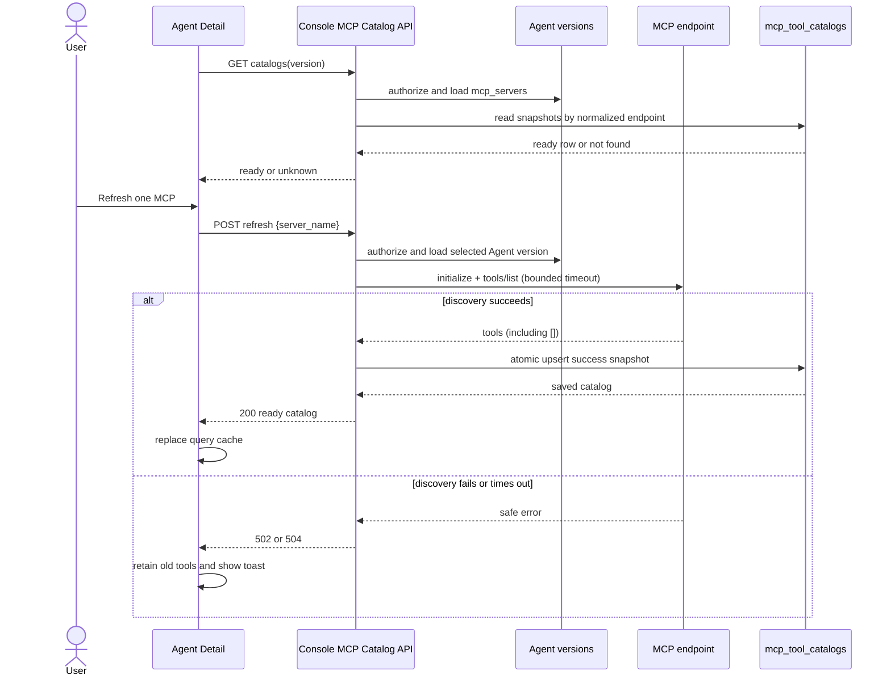

# Agent Detail MCP 工具目录手动刷新设计

> 状态：Implemented（匿名 URL / Streamable HTTP）
>
> 适用范围：Agent Detail 的 `MCPs and tools` 展示、Console catalog API、匿名 MCP `tools/list` 快照
>
> 展示基线：[Agent detail MCP 与工具展示](./fe/agent-detail-mcp-tools.md)

## 1. 摘要与决策

Agent Detail 需要展示私有 MCP 的真实工具列表，但工具列表是外部服务的可变观测结果，不属于不可变的 Agent 配置。当前实现采用最小的手动同步刷新模型：

1. Agent Detail GET 只读取数据库中最近一次成功快照，不连接 MCP、不创建任务。
2. 每张 MCP 卡片提供 Refresh 按钮；按钮调用后端同步刷新接口。
3. 后端从已鉴权的 Agent 版本读取 endpoint，在有界超时内调用匿名 `tools/list`。
4. 只有探测成功才原子 UPSERT catalog；探测失败完全不修改数据库。
5. 前端在刷新期间保留旧列表，成功后立即替换 Query cache，失败只显示 toast。
6. catalog 按规范化 `(transport_type, endpoint_url)` 全局复用，不属于 organization、workspace、Agent 或 Agent version。

该方案刻意不使用持久化 job、worker、generation、lease、自动重试、TTL 或轮询。当前需求是用户在详情页主动刷新单个 MCP，约 10 秒的同步等待比异步状态机更直接，也更容易解释和维护。

## 2. 背景

Agent Detail 原先从 Agent 版本读取 `mcp_servers` 和权限配置，并通过静态 MCP Directory 补全名称、图标和已知工具名。私有 MCP 不在 Directory 中时没有工具元数据，页面只能显示 `No tool list available.`。

Directory 缺少工具名只代表“未知”，不代表 MCP 确认返回零工具。动态 catalog 必须区分：

- 没有数据库记录：从未成功刷新；
- `tools = []`：刷新成功，MCP 确认没有工具；
- `tools = [...]`：最近一次成功工具快照。

开发验收 endpoint：

```text
http://arthurs-MacBook-Pro-2.local:39090/mcp
```

该 endpoint 可被服务端访问，并通过 `tools/list` 返回 `get_weather`。此前页面空态的原因是缺少动态发现链路，而不是 MCP 没有工具。

## 3. 目标与非目标

### 3.1 目标

- 私有或 Directory 未收录的 MCP 可以通过人工刷新获得真实工具清单。
- 失败刷新不覆盖最后一次成功结果。
- 成功空列表与未知状态在数据库和 API 中保持不同语义。
- Agent create/update 和 Detail GET 不受外部 MCP 延迟影响。
- 不同租户和 Agent 可以复用同一匿名 endpoint 的成功快照。
- 保持 Anthropic 兼容 `/v1/agents` API、Agent 版本与权限配置语义不变。

### 3.2 非目标

- 不在 Agent create/update 时自动探测或预热 MCP。
- 不定时刷新、自动重试或保证 catalog 新鲜度。
- 不把工具列表写入 `agents`、`agent_versions` 或 `mcp_servers`。
- 不由浏览器直接访问 MCP endpoint。
- 不使用 vault、cookie、Authorization header 或其他凭据执行发现。
- 不保存完整 input/output schema、annotations 或任意服务端扩展字段。
- 不保证历史 Agent 版本显示的是该版本创建时刻的工具列表。

## 4. 核心不变量

1. Agent 版本冻结 MCP 配置和权限，不冻结外部服务 inventory。
2. catalog 表只包含成功快照；没有行就是从未成功刷新。
3. 非 nil `tools = []` 表示 MCP 成功报告零个工具，不能与 unknown 合并。
4. 成功刷新整体替换旧工具列表，不能与旧列表或 Directory 做 union。
5. 失败、超时或请求取消不能创建或更新 catalog。
6. `configs[].name` 只参与权限 override，不能被当成工具 inventory。
7. catalog identity 只包含 transport 和规范化 endpoint；租户字段只用于 Agent/API 鉴权。
8. catalog 刷新不能修改 Agent 的 `updated_at`、`current_version` 或版本行。

## 5. 总体架构



浏览器始终只访问 Console API。MCP 网络请求和持久化都发生在后端，且网络探测不放在数据库事务内。

## 6. Agent 版本与 catalog identity

Catalog 的唯一身份是：

```text
(transport_type, normalized endpoint_url)
```

organization、workspace、Agent ID 和 Agent version 不进入唯一键。它们只用于：

1. 验证 Console principal 能访问 path 中的 organization/workspace；
2. 在 principal 的内部 workspace 范围读取指定 Agent/version；
3. 从该不可变版本的 `mcp_servers` 找到 `server_name` 对应 URL；
4. 使用规范化 endpoint 读取或更新全局匿名 catalog。

因此，同一个 endpoint 被多个 Agent 或租户引用时共享一行；endpoint 改变后自然映射到另一行。server 只改名但 URL 不变时仍复用同一快照。历史版本显示的是其 endpoint 的最近成功快照，不是历史时点快照。

## 7. 持久化模型

Goose migration：

```text
internal/db/migrations/00014_globalize_mcp_tool_catalogs.sql
```

该 migration 直接创建最终全局表，不依赖已删除的租户级 `00013`，也不创建 PostgreSQL foreign key。

### 7.1 `mcp_tool_catalogs`

| 字段 | 类型/约束 | 说明 |
| --- | --- | --- |
| `id` | `bigint generated always as identity` PK | DB 内部主键 |
| `uuid` | `uuid default gen_random_uuid()` unique | 稳定业务 UUID |
| `external_id` | `text` unique | `mcpc_...` |
| `transport_type` | `text not null` | 当前只允许 `url` |
| `endpoint_url` | `text not null` | 规范化完整 URL，1–2048 bytes |
| `tools` | `jsonb not null` | 最近一次成功 `tools/list`，必须是 array |
| `created_at` | `timestamptz not null` | 首次成功时间 |
| `updated_at` | `timestamptz not null` | 最近一次成功刷新时间 |

约束：

- unique `(transport_type, endpoint_url)`；
- check `transport_type = 'url'`；
- check `octet_length(endpoint_url) BETWEEN 1 AND 2048`；
- check `jsonb_typeof(tools) = 'array'`。

写入使用一条 `INSERT ... ON CONFLICT ... DO UPDATE`，刷新已有 endpoint 时保留稳定 ID 和 `created_at`，只替换 `tools` 并推进 `updated_at`。DB API 拒绝 nil tools，确保成功空列表只能以 JSON `[]` 保存。

当前不做自动 retention。表是体积受限的派生快照，先接受 endpoint 配置变更产生的旧行长期保留；如果实际规模需要回收，应增加独立、简单的管理清理策略，不为此恢复 discovery worker 状态机。

### 7.2 工具 schema

数据库、probe 和 Console API 共用类型化 schema：

```json
[
  {
    "name": "get_weather",
    "title": "Get weather",
    "description": "Get weather for a city or place name."
  }
]
```

`name` 必须非空且在单次结果中唯一；name、title、description 都有长度上限。工具输入 schema 不进入展示快照。

## 8. MCP endpoint 规范化与探测

`NormalizeEndpoint` 负责生成数据库唯一键和实际请求 URL：

- 只接受 `http`/`https`；
- 要求明确 host 和合法端口；
- 拒绝 userinfo 和 fragment；query 作为合法服务端路由参数保留并参与 catalog identity；
- 统一 scheme/hostname 大小写、尾部根域点和默认端口；
- 空 path 规范化为 `/`；
- 最终 URL 最多 2048 bytes。

一次匿名 probe：

1. 使用 MCP Go SDK 建立 Streamable HTTP 会话；
2. 执行 initialize；
3. 分页执行 `tools/list`；
4. 校验名称、去重并截断展示字段；
5. 返回非 nil 工具切片，包括成功的空切片；
6. 关闭 session。

请求限制：

- 默认完整 probe 超时 10 秒，可用 `MCP_DISCOVERY_PROBE_TIMEOUT` 配置；
- connect 和 TLS handshake 各有有界超时；
- 最多 20 页、512 个工具、单响应体最多 1 MiB；
- 最多三次同源 redirect，不接受跨 origin redirect；
- SDK 不执行自动重试；用户可以再次点击 Refresh；
- 不保存或返回上游响应体。

请求 context 继承浏览器连接。客户端断开会取消 probe，并且不会执行数据库写入。

## 9. Console API

路由位于既有 `platformAuthMiddleware` 保护的 Console group：

```text
GET  /api/console/organizations/{orgUuid}/workspaces/{workspaceId}/agents/{agentId}/mcp_tool_catalogs?version={N}
POST /api/console/organizations/{orgUuid}/workspaces/{workspaceId}/agents/{agentId}/mcp_tool_catalogs/refresh?version={N}
```

`version` 省略时使用当前版本；非法或小于 1 返回 400。跨 organization、跨 workspace 和资源不存在统一返回 404。handler 查询 Agent 时使用 principal 的内部 workspace ID，不能只信任 path 或全局 Agent ID。

### 9.1 GET：纯读取

GET 不访问 MCP，不创建占位 catalog，也不修改任何时间戳。

```json
{
  "version": 2,
  "data": [
    {
      "server_name": "weather",
      "status": "ready",
      "tools": [
        {
          "name": "get_weather",
          "description": "Get weather for a city or place name."
        }
      ]
    },
    {
      "server_name": "private_unknown",
      "status": "unknown",
      "tools": null
    }
  ]
}
```

状态只有：

- `unknown`：endpoint 合法但数据库没有成功快照；
- `ready`：存在成功快照，包括 `tools: []`；
- `error`：Agent 保存的 endpoint 本身无法规范化。

响应不暴露 endpoint、catalog ID 或内部数据库字段。

### 9.2 POST：同步刷新一个 server

请求体：

```json
{
  "server_name": "weather"
}
```

接口只接受一个非空 `server_name`，拒绝未知字段和额外 JSON 值。实际 endpoint 必须来自已保存的指定 Agent 版本；接口不接受客户端 URL、header 或凭据。

成功时数据库已提交，并返回 200：

```json
{
  "version": 2,
  "data": {
    "server_name": "weather",
    "status": "ready",
    "tools": [
      {
        "name": "get_weather",
        "description": "Get weather for a city or place name."
      }
    ]
  }
}
```

失败映射：

| 场景 | HTTP | 数据库语义 |
| --- | --- | --- |
| 请求、version、server name 或 endpoint 非法 | 400 | 不写入 |
| Agent/租户不可见 | 404 | 不写入 |
| discovery 功能关闭 | 503 | 不写入 |
| MCP 鉴权、网络或协议失败 | 502 | 保留 last-good |
| probe 超时 | 504 | 保留 last-good |
| 数据库保存失败 | 500 | 旧快照不变 |

下游 MCP 401/403 映射成 502，而不是 Console 401/403，避免与当前用户的登录/授权错误混淆。错误消息来自本地稳定映射，不透传上游响应体。

## 10. 前端设计

### 10.1 查询与刷新

TanStack Query key：

```text
['agent-mcp-tool-catalogs', orgUuid, workspaceId, agent.id, version]
```

- 初次 GET 只加载数据库快照；不设置 `refetchInterval`。
- Directory query 继续缓存静态名称、图标和 fallback 工具名。
- Refresh mutation 同步等待 POST 结果。
- mutation pending 时禁用页面内所有 MCP Refresh 按钮，仅当前按钮旋转，避免并发状态歧义。
- mutation variables 固化请求发起时的 organization/workspace/Agent/version/query key；等待期间切换 Agent 版本时，旧 endpoint 响应只能更新旧 scope。
- 成功后使用响应替换 query cache 中对应 server。已有完整 GET 基线时无需第二次 GET；初次 GET 失败而 cache 无数据时，先展示本次成功结果，再对仍 active 的同一 query 回源 GET 完整 collection。
- 失败只显示 error toast，Query cache 与当前列表保持不变。

### 10.2 inventory 优先级

工具 inventory：

```text
成功 catalog（包括 []） > Directory 非空工具名 > unknown
```

动态 catalog 使用 replace 语义，不能和 Directory union。否则 MCP 已删除的工具会长期残留。选择 inventory 后，再应用当前 Agent 版本 `mcp_toolset` 的 default permission 和逐工具 override。

### 10.3 展示状态

| 状态 | count | 展示 |
| --- | --- | --- |
| unknown + Directory fallback | Directory 数量 | 工具列表 + `Tool list not refreshed` |
| unknown 且无 fallback | `—` | `No tool list available.` + Refresh |
| ready 且非空 | 实际数量 | `Saved tool list` + 工具与权限 |
| ready 且 `[]` | `0` | `This server reported no tools.` |
| mutation pending | 保持当前数量 | 保留旧列表，按钮 busy |
| mutation failure | 保持当前数量 | 保留旧列表，显示 toast |

刷新结果是持久化快照，不使用 `Live tool list` 文案，也不显示虚构的 TTL/stale 状态。

### 10.4 无障碍

- Refresh 是独立按钮，不嵌套在 Collapsible trigger 内。
- 查询和 mutation pending 通过 `aria-busy` 表达。
- Catalog 与 Directory 状态合并到 `role=status` 播报，两条链路的完成/失败互不屏蔽；refresh 失败由 toast 播报，均不抢焦点。
- 每个 Refresh 按钮的 accessible name 包含 MCP 展示名，多卡片时仍可明确区分。
- Collapsible accessible name 包含标题、工具数量、权限和 catalog 状态。
- spinner 为装饰性，按钮文字和 accessible name 保持可读。

## 11. 网络边界

按当前产品决策，MCP anonymous probe **不执行目标地址级 SSRF allowlist/denylist 检查**：不预解析或过滤 DNS/IP，不区分公网、本机、私网、link-local 或特殊地址。可访问范围由部署环境的实际网络策略决定。

仍保留与地址策略无关的协议和资源边界：支持的 scheme、URL 结构规范化、请求超时、同源 redirect、响应大小、页数、工具数量与字段长度限制。出站请求不携带 Console cookie、用户 header、环境代理凭据或 vault secret。

## 12. 并发与一致性

- 页面一次只允许一个 Refresh mutation。
- 多标签页或多实例可以同时刷新同一 endpoint；数据库唯一键保证始终只有一行。
- 多个成功请求采用 last-completion-wins。catalog 是可重建的展示快照，不为严格顺序重新引入 generation。
- 网络探测完成后才执行单语句 UPSERT，不在数据库事务中持有外部网络等待。
- 失败请求没有数据库状态转换，因此不需要 lease、CAS、retry 或 recovery worker。

## 13. 配置与代码边界

配置：

- `MCP_DISCOVERY_ENABLED`：控制 POST refresh；关闭时 GET 仍可读取已有快照。
- `MCP_DISCOVERY_PROBE_TIMEOUT`：同步 probe 总预算，默认 10 秒。

职责：

- `internal/api/server.go`：挂载受保护 Console 路由。
- `internal/mcpcatalogs/handler.go`：鉴权、Agent/version 映射、GET 与同步 refresh 编排。
- `internal/mcpcatalogs/endpoint.go`：endpoint 规范化。
- `internal/mcpcatalogs/probe.go`：匿名 MCP 协议访问和响应限制。
- `internal/db/mcp_tool_catalogs.go`：类型化 Get 与成功快照 Upsert。
- `internal/db/migrations/00014_globalize_mcp_tool_catalogs.sql`：最终全局表。
- `web/src/features/managed-agents/agents/tools/`：Directory、catalog API/query、展示模型与卡片。

MCP catalog 不再依赖 `jobs` 表，`main.go` 不启动 discovery worker，Agent handler 不注入 Enqueuer，也不在 create/update 后预热。

## 14. 测试与验收

测试按失败场景在前、成功场景在后组织。

### 14.1 后端

- 跨 organization/workspace、Agent/version 不存在、未知 server 和客户端 URL 字段被拒绝；
- GET missing 返回 `unknown/tools:null`，且不创建 catalog；
- timeout 返回 504，网络/鉴权/协议错误返回 502；
- 首次失败不创建行，last-good 后失败不覆盖旧 tools；
- 成功工具列表与成功空列表完成同步写入并由 GET 读回；
- 同一 endpoint 重复写入保持一行和稳定 external ID；
- nil tools 被 DB API 拒绝，JSON `[]` 往返后仍为非 nil 空切片；
- URL 规范化、同源 redirect、响应上限、重复工具名和错误脱敏；
- private/loopback MCP 在无地址策略检查时可以正常发现。

### 14.2 前端

- GET 不轮询；
- 同步成功立即替换对应 catalog；
- pending 期间 Agent 版本/endpoint 变化不会把旧响应写入新 query key；
- 初次 GET 失败后成功刷新单个 MCP 会回源完整 collection，其他已保存快照不丢失；
- 失败保留旧列表并显示 toast；
- pending 时所有 Refresh disabled，仅当前按钮旋转；
- 成功 `[]` 覆盖 Directory fallback 并显示真实 0；
- Directory fallback、权限 default/override、版本 query key、Catalog/Directory 状态播报和多卡片 accessible name 保持正确。

### 14.3 本地 E2E

按仓库约定启动：

```bash
just restart-server
just restart-web
```

打开：

```text
http://localhost:<vite-port>/workspaces/default/agents/agent_PN9kQ4b1ZFgWrOu8X9Wz01KE
```

验收：

1. 未刷新时显示 `Tool list not refreshed`，不能把 unknown 当成真实 0。
2. 点击 Weather MCP 的 Refresh，按钮进入 busy，页面保留当前列表。
3. 请求完成后显示 `get_weather`，刷新页面后仍从数据库读到同一结果。
4. MCP 不可达时显示失败 toast，之前成功保存的 `get_weather` 仍存在。
5. MCP 成功返回空数组时显示 0 和 `This server reported no tools.`。

实现验证至少运行：

```bash
go test ./... -count=1
cd web && bun test
cd web && bun run build
```

## 15. 后续扩展条件

只有出现以下需求时，才重新评估异步任务模型：

- Agent 创建后必须自动预热；
- 大批量 endpoint backfill；
- 周期性 freshness SLA；
- 服务端自动重试或 webhook/`tools/list_changed` 驱动刷新；
- 需要跨实例严格顺序或长时间探测。

带凭据 discovery、Session runtime observation 和历史审计快照必须使用独立的作用域与授权设计，不能写入当前全局匿名 catalog。
