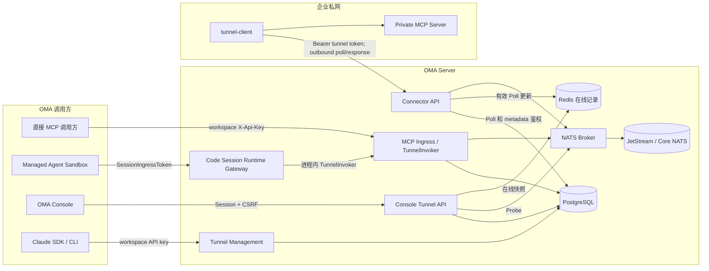
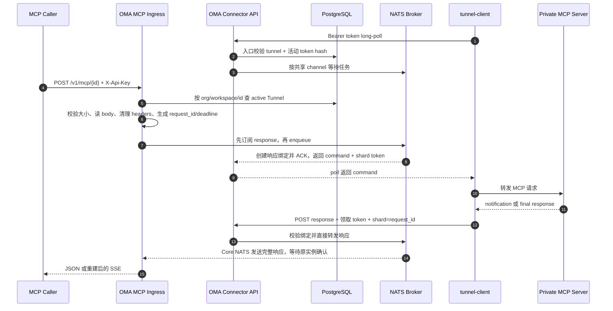
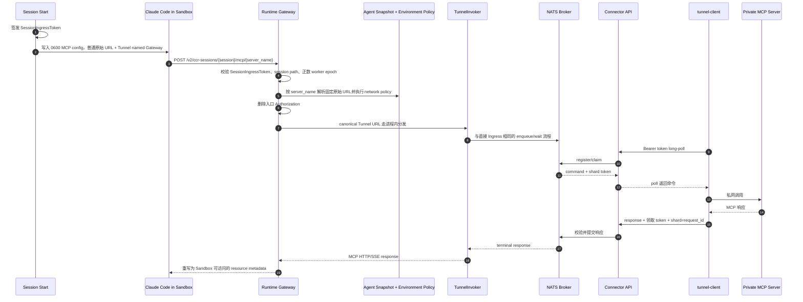

# MCP Tunnel 实现与端到端流程

本文面向 OMA 开发者，解释 MCP Tunnel 为什么存在、各组件如何协作、每一层如何鉴权，以及 OMA 如何与原版
OpenAI `tunnel-client` 整合。

如果只需要查某个模块的约束，可继续阅读：

- [MCP Tunnel 后端设计](be/mcp-tunnels.md)：持久化、Broker 原子性、Header、超时和协议合同；
- [MCP Tunnel Console 前端设计](fe/mcp-tunnels.md)：Console 页面、Secret 展示和 Agent 选择器；
- [MCP Tunnel 手动验收](../zh/mcp-tunnel-manual-acceptance.md)：可复制的本地端到端验收步骤。

## 1. 一句话理解 MCP Tunnel

MCP Tunnel 把一个只能在企业私网中访问的 MCP Server，投影成 OMA 可访问的稳定 MCP URL：

```text
https://<oma-public-origin>/v1/mcp/tunnel_<32位小写十六进制>
```

私网不需要向 OMA 开放入站端口。运行在私网中的 `tunnel-client` 主动向 OMA 发起 HTTPS 长轮询，领取
MCP 请求，在本地调用私有 MCP Server，再把响应提交回 OMA。

它不是网络层 VPN，也不是透明 TCP 隧道。它转发的是受约束的 MCP HTTP/JSON-RPC 命令、协议 Header、
通知和最终响应。

## 2. 整体架构



组件职责如下：

| 组件               | 主要职责                                                                            |
| ------------------ | ----------------------------------------------------------------------------------- |
| Tunnel Management  | 创建、查询、分页、reveal token、rotate token、archive；采用 Claude Tunnels API 合同 |
| Console Tunnel API | 复用平台 Session/CSRF，向 Web 提供管理、连接快照和 MCP probe                        |
| MCP Ingress        | 接收直接 MCP 请求，完成租户授权、Header 清理、请求入队和响应重建                    |
| Connector API      | 校验 Tunnel token，处理 metadata、poll 和 response wire                             |
| Runtime Gateway    | 只允许 Sandbox 访问当前 Code Session Snapshot 中按名称配置的 MCP Server             |
| TunnelInvoker      | 识别 canonical Tunnel URL，在 OMA 进程内直接进入 Broker，避免 HTTP 回环             |
| NATS Broker        | 排队、原子 claim、响应状态、通知、超时和全局存储预算                    |
| Redis 在线记录 | 仅保存近期 Poll 的实例/channel 声明，字段 TTL 独立过期 |
| PostgreSQL         | 保存 Tunnel、租户归属、归档状态和加密的 token version                               |
| `tunnel-client`    | 出站长轮询、并发与背压、本地 MCP 转发、通知与终态响应回传                           |
| Private MCP Server | 真正执行 `initialize`、`tools/list`、`tools/call` 等 MCP 请求                       |

## 3. 标识符与稳定 URL

### 3.1 Tunnel ID

所有边界统一使用：

```text
tunnel_<32 位小写十六进制>
```

ID 由 16 字节密码学随机数生成。管理 API、Console、数据库、Agent Snapshot、MCP URL 和 `tunnel-client`
配置都直接使用同一个值，不做 `tnl_...` 或其他前缀转换。

canonical URL 识别边界会再次校验 ID 必须严格匹配 `^tunnel_[0-9a-f]{32}$`，channel 必须匹配
`[a-z0-9_-]{1,64}`。URL 已指向受控 public origin 或 hostname suffix、但 ID/channel 不合法时仍被视为
“声明为本系统 Tunnel 的畸形 URL”并 fail-closed，不会降级成普通 remote MCP。

数据库内部另有 `uuid`。NATS subject 和 KV key 使用内部 UUID 的摘要；公开 Tunnel ID 不作为租户隔离依据。
Token 状态由 PostgreSQL 管理；Request KV 仅保存交付前创建的响应绑定；Redis 字段 TTL 只用于在线展示。

### 3.2 MCP URL

推荐且稳定的入口是：

```text
POST   /v1/mcp/{tunnel_id}             # main channel
POST   /v1/mcp/{tunnel_id}/{channel}   # 指定 channel
DELETE /v1/mcp/{tunnel_id}[/{channel}] # 终止 MCP session
```

生产环境必须配置 `tunnel.public_base_url`，使 Agent Snapshot 和 Console 生成调用方真正可达的 HTTPS URL。
开发环境未配置时，Console 可以基于当前请求 origin 回退，但该回退不是生产部署合同。

Tunnel 还拥有一个创建后永不复用的 hostname alias，后缀由 `tunnel.domain_suffix` 决定，默认
`tunnel.invalid`。canonical path 是默认入口；只有部署侧另行提供 wildcard DNS/TLS 时，真实 hostname
入口才有意义。

### 3.3 API 路由图

| 方法与路由                                                                       | 用途                              |
| -------------------------------------------------------------------------------- | --------------------------------- |
| `POST /v1/tunnels`                                                               | 创建 Tunnel                       |
| `GET /v1/tunnels`                                                                | 分页列出当前 workspace 的 Tunnel  |
| `GET /v1/tunnels/{id}`                                                           | 获取单个 Tunnel                   |
| `POST /v1/tunnels/{id}/reveal_token`                                             | 解密并返回当前 active token       |
| `POST /v1/tunnels/{id}/rotate_token`                                             | 轮换 token version                |
| `POST /v1/tunnels/{id}/archive`                                                  | 归档 Tunnel                       |
| `POST /v1/tunnels/{id}/certificates`                                             | 保存 CA Certificate               |
| `GET /v1/tunnels/{id}/certificates`                                              | 分页列出 Certificate              |
| `GET /v1/tunnels/{id}/certificates/{certificate_id}`                             | 获取单个 Certificate              |
| `POST /v1/tunnels/{id}/certificates/{certificate_id}/archive`                    | 归档 Certificate                  |
| `GET /connector/v1/tunnels/{id}`                                                 | `tunnel-client` 启动 metadata     |
| `GET /connector/v1/tunnels/{id}/poll`                                            | Connector 长轮询领取命令          |
| `POST /connector/v1/tunnels/{id}/response`                                       | Connector 提交通知或终态响应      |
| `POST/DELETE /v1/mcp/{id}[/{channel}]`                                           | 直接 MCP 数据面                   |
| `GET /.well-known/oauth-protected-resource/v1/mcp/{id}[/{channel}]`              | 直接调用方的 RFC 9728 discovery   |
| `POST/DELETE /v2/ccr-sessions/{session}/mcp/{name}`                              | Managed Agent Runtime Gateway     |
| `GET /.well-known/oauth-protected-resource/v2/ccr-sessions/{session}/mcp/{name}` | Sandbox 可达的 RFC 9728 discovery |

Console 路由统一位于
`/api/console/organizations/{orgUuid}/workspaces/{workspaceId}/mcp_tunnels`。集合路由提供列表和创建；
`GET .../mcp_tunnels/{tunnelId}` 返回单条 Tunnel 及其实时 connection snapshot；资源子路由提供 reveal、
rotate、archive 和 probe。它与 `/v1/tunnels` 共享 Service/DB，但使用不同的鉴权和错误响应合同。

## 4. HTTP 边界与鉴权

MCP Tunnel 有多套凭据，因为每套凭据保护的是不同的信任边界。它们不能互相替代。

| 边界                    | 路由                                                                           | 凭据                                                               | 绑定范围                                           |
| ----------------------- | ------------------------------------------------------------------------------ | ------------------------------------------------------------------ | -------------------------------------------------- |
| Tunnel 管理面           | `/v1/tunnels...`                                                               | workspace API key，支持 `X-Api-Key` 或 Bearer 入口                 | organization + workspace                           |
| Console 管理面          | `/api/console/organizations/{orgUuid}/workspaces/{workspaceId}/mcp_tunnels...` | 平台 cookie Session；非安全方法再校验 `X-CSRF-Token`               | 当前可见 organization + workspace                  |
| 直接 MCP Ingress        | `/v1/mcp/{tunnel_id}[/{channel}]`                                              | 必须显式提供 workspace `X-Api-Key`                                 | organization + workspace + Tunnel                  |
| Connector metadata/poll | `/connector/v1/tunnels/{tunnel_id}...`                                         | `Authorization: Bearer <tunnel token>`                             | 精确 Tunnel + active token version                 |
| Connector response      | `/connector/v1/tunnels/{tunnel_id}/response`                                   | Bearer tunnel token；允许已 retired 的领取版本完成在途请求         | 精确 Tunnel + claim 绑定                           |
| Agent Runtime Gateway   | `/v2/ccr-sessions/{code_session_id}/mcp/{server_name}`                         | `sk-ant-si-` 前缀的 session-scoped Ed25519 JWT                     | Code Session + worker epoch + Snapshot server name |
| Private MCP Server      | `tunnel-client` 配置的私网 URL/stdio                                           | 下游 `Authorization`、client 本地静态 Header、mTLS 或 MCP 自身方案 | Private MCP Server 自己的权限模型                  |

### 4.1 Workspace API key

管理面要求 `anthropic-beta: mcp-tunnels-2026-06-22`。API key 解析成 `Principal` 后，所有 Tunnel PostgreSQL 查询都同时绑定
`organization_uuid`、`workspace_uuid` 和 Tunnel 标识；跨 workspace 的资源按不可见处理。

直接 MCP Ingress 只把 `X-Api-Key` 当作 OMA 凭据。它不会接受 Tunnel token，也不会把 workspace key
转发到私网。

### 4.2 Console Session 与 CSRF

Console 不调用 `/v1/tunnels`，而是调用 `/api/console/.../mcp_tunnels`。读请求依赖平台 cookie Session；
create、reveal、rotate、archive、probe 等非安全方法还必须通过 session-bound CSRF 校验。CSRF 中间件只
挂载在 MCP Tunnel Console 子路由，不改变其他既有 Console API 的行为。

列表不返回明文 token。只有 reveal 和 rotate 响应返回明文，并带 `Cache-Control: no-store`；前端只把它
保存在 Secret 弹窗组件的内存状态，不写 URL、local storage、session storage 或 Query cache。

### 4.3 Tunnel token

Tunnel token 只用于 `tunnel-client` 到 Connector API 的控制面认证：

1. 创建或轮换时生成 32 字节随机值，并编码为 URL-safe base64；
2. PostgreSQL 保存 SHA-256 hash，用于 Poll/metadata 入口的精确校验，不查询加密 envelope；
3. active token 的明文通过 `internal/secrets` envelope encryption 保存，支持受控 reveal；
4. token version 单调递增；一个 Tunnel 同时只能有一个 active version；
5. rotate 后旧 token 不能继续 metadata 或 poll；旧 envelope 字段立即清空；
6. Poll 入口通过后，本次长轮询继续有效，不在交付前复核；交付前一次性创建 token SHA-256 绑定；
7. Response 只核对 Request KV 的 Tunnel、领取 token 哈希、channel、类型；原 OMA 校验 deadline；轮换或归档不影响已授权请求完成。

Tunnel token 不是 workspace key，不是 SessionIngressToken，也不是 Private MCP Server 的凭据。

### 4.4 Managed Agent Session 凭据

Session 创建或恢复时，OMA 签发 `sk-ant-si-` Ed25519 JWT，使用 issuer `session-ingress`、audience
`anthropic-api` 和 role `worker`，绑定 Code Session、organization、workspace、Agent version 和 worker epoch。
同一个 SessionIngressToken 用于 worker/relay 与命名 MCP Gateway；各入口保留自己的授权检查。
整个 Managed Agent 运行环境是同一个 Session 执行主体，MCP 配置中的 Token 也拥有该 Session 的 ingress
身份权限，配置文件必须按运行凭据保护，不能写回 Agent Snapshot 或进入日志。

命名 Gateway 及其 discovery 入口要求正数 worker epoch，并回查活动 Session 的当前 epoch；缺失或过期的
worker epoch 均被拒绝。Gateway 精确匹配路径中的 Code Session ID，再根据 server name 查找 Session 固定
的 Agent Snapshot，执行租户、exact URL 和 Environment network policy 授权。请求不能通过 query 指定目标。

转发前删除入口 `Authorization`，避免 SessionIngressToken 泄漏到 Broker、`tunnel-client` 或 Private MCP Server。

### 4.5 Private MCP 凭据边界

这里需要区分两条调用链：

- 直接调用 `/v1/mcp/...` 时，OMA 会删除 `X-Api-Key`、Cookie、hop-by-hop 和 Tunnel 内部 Header，但允许
  下游 `Authorization` 进入队列；`tunnel-client` 最终把它用于 Private MCP HTTP 请求。
- Managed Agent 调用时，Runtime Gateway 会先删除自己的 SessionIngressToken。当前 TunnelInvoker 分支直接进入
  NATS Broker，不经过普通 remote MCP 使用的 OMA Vault HTTP transport。因此 Tunnel 私网凭据应在
  `tunnel-client` 侧通过本地静态额外 Header、mTLS 或 Private MCP 自身支持的方式提供。

也就是说，不能把 OMA workspace key、Tunnel token 或 SessionIngressToken 当作下游 MCP token。任何允许穿越
Tunnel 的下游 `Authorization` 都会经过 OMA 请求处理和 JetStream 队列；若凭据要求严格只留在私网，应使用
`tunnel-client` 的本地凭据注入能力，而不是从调用方转发。

原版 `tunnel-client` 的本地静态 Header 只适用于 HTTP MCP，并按目标 origin 限定；stdio 没有 HTTP Header
注入。若一个直接调用请求同时携带同名转发 Header，客户端当前以后应用的转发值为准，因此它可能覆盖本地
静态 `Authorization`。Managed Agent 路径不会转发 SessionIngressToken，所以不会发生 Session Token 覆盖本地凭据。

## 5. Tunnel 生命周期与 `tunnel-client` 启动

### 5.1 创建

Tunnel 可以通过 Console 或 Tunnel 管理面创建。创建事务同时写入：

- `mcp_tunnels`：公开 ID、内部 UUID、organization/workspace、名称、domain 和时间；
- `mcp_tunnel_token_versions`：version 1、token hash 和加密 envelope。

创建响应不返回明文 token。Console 创建成功后进入独立详情页，路由 state 只传递“刚创建”标记；详情页再调用
reveal，并只把明文保存在组件内存中。Token 不进入 URL、history state、Query cache 或 storage。

### 5.2 Certificate API-only 生命周期

Claude SDK 的 Certificate 子资源支持 Create、Get、List 和 Archive。OMA 保存完整 CA PEM，并从唯一的
X.509 CA block 计算 DER SHA-256 fingerprint 和 `expires_at`。这些数据目前只供管理 API 往返；不会被
Connector、Broker、Ingress、Agent Picker 或 MCP Runtime Gateway 消费。

Certificate 路径中的 Tunnel ID 只用来确认资源归属和 workspace 范围。归档 Tunnel 不改变它的
Certificate 记录；只有 Certificate Archive API 会设置它自身的 `archived_at`。

### 5.3 配置原版 `tunnel-client`

OpenAI `tunnel-client` 通过 metadata/poll/response HTTP 协议连接 OMA。
客户端将 OMA 的 Connector 路由前缀配置为 `/connector`：

```yaml
config_version: 1
control_plane:
  base_url: https://oma.example.com
  url_path: /connector
  tunnel_id: tunnel_0123456789abcdef0123456789abcdef
  api_key: env:OMA_TUNNEL_TOKEN
mcp:
  server_urls:
    - channel: main
      url: http://private-mcp.internal:39091/mcp
```

客户端最终访问：

```text
GET  https://oma.example.com/connector/v1/tunnels/{tunnel_id}
GET  https://oma.example.com/connector/v1/tunnels/{tunnel_id}/poll
POST https://oma.example.com/connector/v1/tunnels/{tunnel_id}/response
```

`control_plane.api_key` 必须引用 Tunnel token。不要把 token 固化进受版本控制的 YAML。

OMA 当前实现的是原版客户端所需的 metadata、poll、response 子集，不实现
`/cloudflare/runtime`。管理面的 Certificate create、retrieve、list、archive API 会独立持久化 CA 证书及其元数据，
但不会把证书注入 Connector、Broker、Ingress 或 MCP 请求链路。启用原版客户端的其他托管服务能力前，
应先确认 OMA 是否实现对应 Connector endpoint；不能把 Certificate API 的 2xx 响应理解为运行时证书认证已启用。

### 5.4 启动与 presence

客户端启动后先读取 metadata 做配置诊断，然后持续 long-poll。每次 poll 携带：

- Bearer Tunnel token；
- 稳定的 `X-Tunnel-Client-Instance-Id`；
- `X-Tunnel-MCP-Server-Info`，声明 1 到 32 个 channel 及其 `proc_affinity`；
- `limit` 和 `timeout_ms`。

鉴权和格式正确的 Poll 将完整 channel 名称列表写入 Redis Hash，以 instance ID 为字段，用 Redis 8 HSETEX 刷新独立字段 TTL（默认 60 秒）。
Console 按已知 Tunnel UUID 批量读取并聚合；读失败显示 unknown，写失败不阻止 Poll，读写各自最多 500ms。
它只表示近期活动，不用于鉴权或路由；轮换后自然收敛，归档直接显示离线。

## 6. OMA 与 `tunnel-client` 的 wire 整合

### 6.1 长轮询

典型请求：

```http
GET /connector/v1/tunnels/{tunnel_id}/poll?limit=25&timeout_ms=30000
Authorization: Bearer <tunnel-token>
X-Tunnel-Client-Instance-Id: <stable-instance-id>
X-Tunnel-MCP-Server-Info: {"version":1,"channels":[{"name":"main"}]}
```

无任务时 OMA 返回 `204 No Content`。有任务时返回：

```json
{
  "commands": [
    {
      "request_id": "req_<opaque>",
      "shard_token": "req_<opaque>",
      "command_type": "jsonrpc",
      "channel": "main",
      "created_at": "2026-08-25T00:00:00Z",
      "headers": {
        "Accept": ["application/json, text/event-stream"],
        "Content-Type": ["application/json"]
      },
      "response_timeout": "119000ms",
      "jsonrpc": {
        "jsonrpc": "2.0",
        "id": "1",
        "method": "tools/list",
        "params": {}
      }
    }
  ]
}
```

`response_timeout` 是 OMA 统一 deadline 的剩余时间，不是客户端可以重新开始的一段完整超时。

### 6.2 客户端调度

原版客户端内部把职责分成：

1. control-plane poller 根据本地 prefetch queue 剩余容量计算 `limit`，最大 25；
2. bounded queue 提供背压，满队列时暂停继续 poll；
3. dispatcher 按 `mcp.max-concurrent-requests` 控制真正访问 MCP Server 的并发；
4. MCP client 根据 channel 把命令路由到 Streamable HTTP、stdio 或内存实现；
5. JSON-RPC notification 作为非终态响应立即回传；
6. 最终 JSON-RPC、OAuth discovery 或 session termination 响应结束命令。

OMA 不需要了解 Private MCP URL、stdio command 或本地证书路径。这些都留在 `tunnel-client` 配置中。

### 6.3 响应提交

客户端把 poll 返回的 shard token 放在 Header，而不是响应 JSON 中：

```http
POST /connector/v1/tunnels/{tunnel_id}/response
Authorization: Bearer <tunnel-token>
X-Tunnel-Client-Instance-Id: <optional-display-instance-id>
X-Tunnel-Shard-Token: <shard-token-from-command>
Content-Type: application/json
```

```json
{
  "request_id": "req_<opaque>",
  "channel": "main",
  "resp_json": {
    "jsonrpc": "2.0",
    "id": "1",
    "result": { "tools": [] }
  },
  "resp_headers": {
    "Content-Type": ["application/json"]
  },
  "resp_code": 200,
  "resp_type": "jsonrpc_response"
}
```

Response 按 request ID 定位后校验 Tunnel ID、领取 token 哈希、channel、command type；原等待实例检查 deadline；
Header 必须满足 shard=request_id，不校验 instance ID 或 token version，也不读取数据库。绑定不匹配、等待者已消失、过期未完成或未知请求按不可见请求处理。

`tunnel-client` 会对适合重试的 response POST 做有限重试。因为 response 是潜在的重复写入，OMA 通过
原 OMA 的短期本地完成标记让正确绑定的重复响应幂等成功；标记不保存正文，重启后不恢复。

## 7. 一次直接 MCP 调用的完整流程



几个关键顺序不能交换：

- Ingress 先建立 response subscription，再 enqueue，避免极快 Connector 的首条通知丢失；
- enqueue 不读取在线状态，无 Connector 时也可排队，统一 deadline 前上线可领取；
- 交付前创建不可覆盖的 token 绑定，再发普通 ACK；没有第二次凭据查询或 Control KV；
- 通知和最终响应均经 Core NATS request-reply 到达原等待实例，原实例确认接纳后 Response 才成功；
- 不持久化最终响应，不定时读取 KV 恢复。原实例不可达返回 503，由调用方决定是否重试；
- MCP 调用方断开只释放本地等待者，不取消队列中的请求，不保证远端操作停止。

## 8. Managed Agent 调用的额外流程

Managed Agent 不直接拿 workspace API key 调 `/v1/mcp/...`。它多一层 Runtime Gateway：



Agent Snapshot 与 Code Session metadata 保存原始 MCP 源声明。Session 启动或恢复取得当前身份后，
构建器先识别目标类型，再分别构建普通 MCP 和 Tunnel MCP。Tunnel 条目固定使用 `type: "http"`，地址为：

```text
{code_session.sandbox_api_base_url}/v2/ccr-sessions/{code_session_id}/mcp/{server_name}
```

并只在该 Tunnel 条目中放入当前 SessionIngressToken。Channel 名为 `sse` 或 `stdio` 也不会改变该 HTTP 传输类型。
普通 Directory/自定义 MCP 使用自己的传输规则，URL、Header 和工具配置保持
原样，通过 Sandbox HTTP(S) Proxy/MITM 与 Vault 注入；启动 payload 顶层 `mcp_servers` 也完整保留。
最终文档用于生成权限为 `0600` 的配置文件和启动参数。`session_context` 通过鉴权后使用同一构建器和当前
Session 凭据返回文档，并禁止缓存；持久化源声明不包含运行时 Gateway 地址或 Token。

Console Agent Picker 允许同一个 Tunnel 绑定多个 Channel，但不扩展 Agent API。所有 Channel 统一使用
`tunnel_<32hex>.<channel>` 作为 server name，因此 main 为 `tunnel_<32hex>.main`。URL 分别保存为
`/v1/mcp/{tunnelId}` 和 `/v1/mcp/{tunnelId}/{channel}`；名称后缀中的 `_` 转为 `.` 以避免保留分隔符 `__`，URL 中的 Channel 保持原值。每个 server name 都有同名
`mcp_toolset.mcp_server_name`。Runtime Gateway 按 Snapshot 中的 name 找到原始 URL，因此多个 Channel 可以各自
配置工具权限。

Gateway 只在 URL origin 与 `tunnel.public_base_url` 精确一致且 path 是 canonical Tunnel path，或 hostname
匹配受控 domain suffix 时，才交给 TunnelInvoker。named Gateway 解析到普通 remote MCP 时返回 404，不提供
普通 MCP outbound 路径。带 `mcp_url` 参数的显式 Session MCP proxy 优先识别 Tunnel，普通 MCP 使用 outbound 路径。
TunnelInvoker 在进程内调用 Broker；受控 origin 和 suffix 校验防止第三方 host 被误认为 Tunnel。

`server_name` 使用 Snapshot 中的原值做精确索引，不接受首尾空白。畸形 URL、非规范名称或重复名称都会让
Snapshot policy 编译失败；运行时构建非空 MCP URL 时也不会吞掉 URL 解析错误。上述失败都不会回退成
unrestricted、普通 MCP 或部分放行。

## 9. 命令类型与 MCP 传输语义

OMA 与客户端当前使用三类 command：

| command type          | 来源                                  | 客户端动作                               | terminal response type         |
| --------------------- | ------------------------------------- | ---------------------------------------- | ------------------------------ |
| `jsonrpc`             | MCP POST                              | 调用 MCP Server；可产生多条 notification | `jsonrpc_response`             |
| `oauth_discovery`     | RFC 9728 protected-resource discovery | 从私网侧读取 metadata                    | `oauth_discovery_response`     |
| `session_termination` | MCP DELETE                            | 终止对应 MCP session                     | `session_termination_response` |

`jsonrpc_notify` 是非终态响应。它通过 Core NATS request/reply 到达正在等待的 Ingress；接收方先确认有界缓冲接纳，并被编码成标准
`event: message` / `data: ...` SSE frame。最终 JSON 值关闭这次 HTTP 响应。

Connector wire 中只传规范化后的 `resp_json`，不保留 Private MCP 的原始 SSE framing。Ingress 根据最终
`Content-Type` 恢复 JSON 或 SSE 语义。独立的 `GET /v1/mcp/...` SSE 连接不受支持，明确返回 405。

OAuth discovery 的 `resource` 和 MCP 401 `WWW-Authenticate` 中的 `resource_metadata` 会被重写成调用方
实际可达的 canonical URL 或 Runtime Gateway URL。成功和失败状态都执行相同改写，不能因为 Connector
返回 4xx 而把 Private MCP 地址原样暴露给调用方。

## 10. NATS Broker 单次投递

```mermaid
flowchart LR
    Ingress[注册本地等待者] --> Queue[Commands 入队]
    Queue -->|MaxDeliver=1| Poll[有限拉取]
    Poll --> Binding[Request KV 一次性绑定]
    Binding --> ACK[普通 ACK]
    ACK --> Connector[Poll HTTP 交付]
    Connector --> Result[Response 校验绑定]
    Result -->|Core NATS 正文| Origin[原 OMA 等待者]
    Origin --> Receipt[仅本地完成标记]
```



- 同 Tunnel/channel 共享 consumer，队列只尝试投递一次。绑定和 ACK 后到 Poll 返回前仍存在丢失窗口；不承诺外部工具 exactly-once，也不自动补投。
- Request KV 按 requestId 摘要定位，只存 Tunnel ID、领取 token 哈希、channel、命令类型、deadline、Origin 和清理所需租户 UUID。交付前不可覆盖地创建，不保存请求状态或结果，不进行领取/取消/完成 CAS。
- 通知和最终响应使用相同的 Core NATS request-reply 路由。原实例接纳才返回成功；通知仍有每请求 16 条 / 2 MiB、全进程 64 MiB 背压。最终响应有独立槽位，计入全局预算，接受的通知先于最终结果交付。
- 原实例本地完成标记保留到 deadline 加 tombstone TTL，合法重复返回 200，不重复交付。标记不持久化，实例重启导致旧 Origin 不可达时返回 503；实例可达但没有等待者或完成标记返回 404。
- Commands 和 Request KV 分别由全局 `max_stored_requests` 限制条数，默认 256。绑定每条最多 4 KiB，保留 request timeout 加 tombstone TTL，读取不续期。
- Poll 尊重客户端的正整数 limit，省略默认 25，取消服务端额外 25 条限制及 Poll 累计字节截断。先对 channel 做一轮非阻塞读取，有有效命令即返回；没有才进入每轮最多 100ms 的有限等待。
- 每轮最多选 min(limit, channel 数量) 个 channel，各申请一条；本轮收束后一起返回，不凑满，空轮轮换 channel。`timeout_ms=0` 只读现有命令。SDK 单次分配同时受全局存储条数上限约束。
- 正常返回前收束本轮全部拉取；connector HTTP 断开后停止新拉取，并终止晚到且无法交付的消息，不 NAK、不留后台预取。consumer 无活动超过 request timeout 加一分钟才回收，运维不得在有效命令仍存在时重建。
- MCP 调用方取消只结束本地等待，已入队命令仍可在 deadline 前执行；没有共享 canceled 状态。超过 NATS 2 MiB 的完整消息使用临时对象正文引用，Poll 批次策略不变。

### 10.1 Channel 共享领取

channel 名匹配 `[a-z0-9_-]{1,64}`。server-info v1/v2 接受 `proc_affinity`、`stateless`，但内部仅保留名称，
不同 Connector 的这些标记不产生冲突。所有同 Tunnel/channel 的请求使用共享 consumer。
instance ID 只用于展示统计，保留格式检查及缺省 `legacy`。

不再创建代理会话、映射 Session ID、固定 owner 或实例 subject。普通 MCP Header、初始化和 DELETE 保持透传，
不升级 MCP 协议；调用方应使用无状态 Server，不承诺支持依赖某个 Connector 进程的会话。
`shard_token` 固定等于 requestId，Response Header 必须原样回传；它不是独立随机凭据或路由标识。

## 11. rotate 与 archive

### 11.1 Token rotation

只执行 PostgreSQL 事务：锁定 Tunnel 与活动 token，以 expected version 检测并发冲突，retire 旧 token、
清空旧 envelope，创建 version + 1。事务失败回滚，不需要 NATS 补偿或 token 激活/恢复。
新 Poll 仅接受新 token；已通过入口鉴权的长轮询仍可领取，Response 使用领取时 token 哈希验证。
在线记录不主动改写，旧实例在停止成功 Poll 后按 60 秒字段 TTL 自然过期。

### 11.2 Archive

同一 PostgreSQL 事务归档 Tunnel 和所有 token；Certificate 保持独立。没有 River 清理任务或 NATS 状态同步。
归档后拒绝新 metadata/Poll、Ingress 和 Runtime Gateway 调用，Console 直接显示离线。
已授权 Poll 仍可交付请求，已领取请求可在原 deadline 内用旧 token 回传；Response 不查数据库凭据；只有超限正文暂存会登记数据库清理任务。

## 12. Header、安全与数据边界

Ingress 请求 denylist 至少包括：

- hop-by-hop Header 和 `Connection` 指定的扩展 Header；
- Cookie、`X-Api-Key`、proxy credentials；
- shard token、client instance、server info 等 Tunnel 内部 Header；
- `Content-Length` 等需要由新传输重新计算的字段。

允许的 MCP 协议 Header 和调用方下游 `Authorization` 可以转发。Connector 响应只接受显式白名单，例如
`Content-Type`、`Mcp-Session-Id`、`Mcp-Protocol-Version`、`WWW-Authenticate`；`Content-Length` 和 `Date`
会被删除，因为 body 已经被 wire 规范化。

默认限制：

| 项目                                      | 默认值 |
| ----------------------------------------- | ------ |
| 请求及单条 Response（包括 SSE）的 MCP JSON body | 16 MiB |
| Connector response 外层协议包 | 正文上限 + 6 × Header 上限 + 16 KiB |
| Header 总量                               | 32 KiB |
| 单个 Header value                         | 8 KiB  |
| poll timeout                              | 30 秒  |
| MCP 总 deadline                           | 2 分钟 |
| presence TTL                              | 60 秒  |
| terminal tombstone                        | 5 分钟 |

`max_stored_requests` 默认 256，允许配置为 `1..65536`。默认每节点 Tunnel 命令预算 513 MiB、绑定预算 2 MiB，三副本合计约 1.51 GiB；不改变 Worker Stream 的 10 GiB 预算。显式配置仍优先，16 MiB 正文上限不进入 NATS 容量公式。

完整 NATS 消息只有超出 2 MiB 才外置正文，命令计入 NATS 去重 header。复用对象存储与定时清理，原 deadline 后 5 分钟开始删除所有版本。引用只在 OMA 内部传递，出口校验长度和 SHA-256 并恢复完整正文；SSE 保持原有交付顺序，不改客户端协议。详见 [正文暂存设计](be/mcp-tunnels.md#超过-nats-消息上限的正文)。

Tunnel OAuth protected-resource discovery 走 Connector 的
`oauth_discovery` command，并受 Tunnel 请求总 deadline 约束；named Gateway 不为普通 MCP 发起 metadata 请求。

运行日志禁止记录 workspace key、Tunnel token、下游 Authorization、Cookie、shard token 和原始 body。
MCP payload、tool argument、response 及被转发的 Authorization 会经过 OMA 和 NATS；超限正文还会临时进入对象存储；“无需私网入站端口”
不等于“业务数据不经过 OMA”。

## 13. 错误与故障语义

| 现象                                                         | 对外状态             | 含义                                  |
| ------------------------------------------------------------ | -------------------- | ------------------------------------- |
| workspace、Console、SessionIngressToken 或 Tunnel token 无效 | 401/403              | 对应信任边界鉴权失败                  |
| Tunnel 不属于 scope、已归档或 response 绑定不匹配            | 404 或资源不可见语义 | 防止跨租户和内部状态泄漏              |
| GET MCP SSE                                                  | 405                  | Tunnel 只支持同请求内 SSE             |
| body/Header 超限 | Ingress 413；Connector Response 400 | 保留现有边界错误合同 |
| 全局存储或通知预算超限                              | 429                  | Broker 背压                           |
| 没有在线 Connector | 等待至 deadline，超时 504 | Connector 可在期限内上线领取 |
| NATS / JetStream 不可用                                      | 503                  | 不回退到进程内队列                    |
| 统一 deadline 到期                                           | 504                  | 请求已被 cancel/expired，迟到响应无效 |

`/healthz` 只表示 OMA 进程存活；`/readyz` 同时检查 PostgreSQL 和 Tunnel NATS（`tunnel_nats`）；Console presence 只说明近期
有 poll。要证明 Tunnel 可用，应至少执行 Console probe 或真实 `initialize` + `tools/list`。要证明 Managed
Agent 链路可用，必须执行真实 Sandbox Session 工具调用。

`tunnel-client` 自己的 `/readyz` 可能在旧 token 被 rotate 后仍为 200，因此排障时应以 Connector metadata、
poll 和实际 MCP 请求为准。

## 14. 开发定位图

OMA 主要代码：

| 路径                                                                                           | 内容                                                    |
| ---------------------------------------------------------------------------------------------- | ------------------------------------------------------- |
| `internal/tunnels/management_handler.go`                                                       | Tunnel 管理 API 与 beta gate                            |
| `internal/tunnels/management_service.go`                                                       | create/reveal/rotate/archive 编排                       |
| `internal/tunnels/certificate_handler.go`                                                      | Certificate Create/Get/List/Archive HTTP 合同           |
| `internal/tunnels/certificate_service.go`                                                      | X.509 校验、fingerprint 和独立持久化编排                |
| `internal/tunnels/connector_handler.go`                                                        | Tunnel token、metadata、poll、response                  |
| `internal/tunnels/ingress_handler.go`                                                          | direct ingress、TunnelInvoker、SSE 和 OAuth rewrite     |
| `internal/tunnels/broker_nats.go`、`broker_poll.go` | NATS 单次投递与响应绑定；`presence.go` 独立实现 Redis 在线记录            |
| `internal/tunnels/protocol.go`                                                                 | command、response 和 channel wire 类型                  |
| `internal/tunnels/probe.go`                                                                    | Console/catalog initialize/tools/list Broker 探测       |
| `internal/mcpcatalogs/handler.go`                                                              | Agent 工具 catalog、Tunnel scope 校验与 last-good 保存  |
| `internal/db/mcp_tunnels.go` 及 Mapper/XML                                                     | Tunnel 与 token version 持久化                          |
| `internal/db/mcp_tunnel_certificates.go` 及 Mapper/XML                                         | API-only Certificate 持久化                             |
| `internal/db/migrations/00060_rebuild_mcp_tunnels.sql`                                         | 当前 Tunnel schema                                      |
| `internal/codesessions/mcp_proxy.go`                                                           | Runtime Gateway、Snapshot URL 解析和 TunnelInvoker 分支 |
| `internal/codesessions/session_credentials.go`                                                 | SessionIngressToken 的签发与身份校验                    |
| `internal/codesessions/mcp_runtime_config.go`                                                  | 目标识别、普通 MCP 与 Tunnel MCP 独立构建               |
| `internal/codesessions/mcp_runtime_tools.go`                                                   | MCP 工具权限映射                                        |
| `internal/environments/managed_agent_mcp_config.go`                                            | MCP 配置文件与启动字段封装                              |
| `internal/environments/environment_manager.go`                                                 | environment-manager 启动 payload 与命令封装             |
| `web/src/features/mcp-tunnels/`                                                                | Console 列表、详情、共享动作与 canonical 路由 UI        |

独立 `tunnel-client` 仓库主要代码：

| 路径                                                 | 内容                                            |
| ---------------------------------------------------- | ----------------------------------------------- |
| `pkg/controlplane/internal/tunnel_service_client.go` | URL 拼接、metadata、poll、response 和重试       |
| `pkg/controlplane/internal/poller.go`                | 长轮询与 prefetch queue 背压                    |
| `pkg/controlplane/wiretypes/`                        | 与 OMA 对接的 JSON wire                         |
| `pkg/dispatcher/internal/`                           | command 调度、并发和响应提交                    |
| `pkg/mcpclient/`                                     | HTTP/stdio MCP 调用、Header 与 notification     |
| `pkg/runtimeconfig/`                                 | `base_url`、`url_path`、Tunnel ID 和 token 配置 |

## 15. 修改时必须保持的关键不变量

开发者修改 Tunnel 时，应优先确认以下不变量没有被破坏：

1. 所有资源读写都同时绑定 organization、workspace 和 Tunnel；
2. workspace key、Tunnel token、SessionIngressToken、Private MCP 凭据不可互换；
3. response subscription 必须先于 enqueue；
4. Poll 只在入口鉴权一次，terminal/cancel 必须竞争同一请求 revision；
5. dispatched 请求不能自动重投；
6. Response 按 requestId 找记录，核对 Tunnel ID、token 哈希、shard=requestId、channel、类型；原 OMA 校验 deadline；
7. rotate 拒绝旧 token 发起新 Poll，已经授权的 Poll 和已领取请求继续按原期限执行；
8. archive 拒绝新的数据面调用，保留已授权 Poll/Response 的原 deadline；
9. Runtime Gateway 只能按 Snapshot 中无首尾空白的精确 server name 选择目标，不能接受 Sandbox 自选 URL；
10. SessionIngressToken、workspace key、Tunnel token、Cookie 和私网 secret 不能进入日志；
11. SSE `Content-Type` 与实际 framing 必须一致；
12. Connector wire 必须满足 OpenAI `tunnel-client` 协议合同，并通过契约测试。

## 16. 验证层次

从低到高建议按以下顺序验证：

1. `internal/tunnels` 单测：鉴权、Header、wire、Broker 状态与错误映射；
2. NATS 集成测试：并发单次投递、绑定校验、响应背压、本地取消、原实例丢失及三副本故障；
3. 管理面与 Console handler 测试：tenant scope、CSRF、secret no-store，以及官方 Go SDK Certificate
   Create/Get/List/Archive 生命周期；
4. `tunnel-client` `go test -race ./...`：poller、dispatcher、MCP transport 和 response retry；
5. 本地原版客户端 smoke：metadata、initialize、tools/list、tools/call、DELETE；
6. Console probe：验证 Console → Broker → client → Private MCP；
7. Agent Picker/Detail catalog：验证添加 Channel 后自动发现、卡片 Refresh，以及 catalog Refresh 通过 Broker 保存工具；
8. 真实 Managed Agent Session：验证 Sandbox → Runtime Gateway → TunnelInvoker → Broker → client → Private MCP。

最后一级不可由 `/readyz`、presence 或 Console probe 替代。完整手动步骤见
[MCP Tunnel 手动验收](../zh/mcp-tunnel-manual-acceptance.md)。

原版 tunnel-client 测试入口：

```bash
TEST_TUNNEL_CLIENT_BINARY=/absolute/path/to/tunnel-client go test ./internal/tunnels -run '^TestOfficialTunnelClientIntegration$' -count=1 -v
```

该测试启动隔离 NATS 和 HTTP/stdio MCP fixture，使用替身 DB 授权；它不代替实际 Claude Agent SDK、Claude Code CLI 或 Managed Agent Sandbox 验收。

### 工作区授权、Token 轮换与分页验收

Console 的 Tunnel 操作必须获得 URL 目标工作区的权限。验证时应使用同一组织内只有 A 工作区权限的普通成员，
确认即使 Header 指定 A，也不能读取 B 的 Tunnel、查看 Token 或执行轮换/归档。

Token 轮换和归档只依赖 PostgreSQL 事务。验证错误和退休 token 的新 Poll 被拒绝、已授权 Poll 不二次查询、
旧 token 在原 deadline 内回传、内联 Response 在数据库故障时仍正常；需要暂存的新大 Response 因清理任务登记失败返回 503，不回退直接发送超限 NATS 消息。Redis 8 验证独立字段过期和故障仅影响展示。

工具目录探测完整读取分页（最多 20 页、512 个工具），不保存部分成功结果。可以用带空中间页的分页 MCP 验证游标传递，
再用重复游标、超额结果和后续页错误验证整体失败与会话清理。
