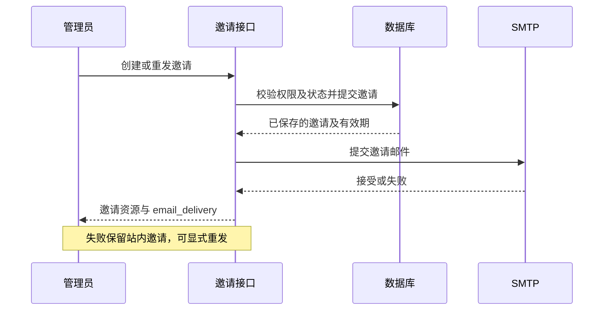

# 组织邀请邮件

创建及重发邀请在数据库操作成功后同步发送邮件，复用登录验证码的 SMTP TLS、认证、15 秒超时和截止时间。Console 创建、重发及 Admin API 创建均接入；终态邀请仍不能重发，邮件操作不改变成员资格。没有引入新的队列或自动重试。

## 配置与内容

复用 `auth.smtp`，新增 `auth.console_url`，例如 `https://oma.example.com`。该地址必须为 HTTPS origin，不允许用户信息、子路径、查询或片段；不读取请求 Host 或转发头生成邮件链接。两项未完整启用时仍可创建站内邀请，但明确返回邮件未配置。

参考 CMA 截图的居中布局、品牌、信封、标题和主按钮，使用 OMA 品牌。正文包含实际组织名、当前操作人的邮箱以及数据库邀请有效期（UTC）；API Key 没有对应用户身份时显示“组织管理员”，不伪造邀请人。HTML 模板自动转义动态内容，邮件不包含验证码、会话凭据或自动加入令牌。

按钮打开 `/invites`。用户必须用收件邮箱登录，再显式接受；邮件转发不授予他人权限。此次不改变既有首次注册自己的组织和不自动接受邀请的行为。

## 发送结果

创建、重发响应新增 `email_delivery`：`sent` 表示 SMTP 已接受，不能保证最终进入收件箱；`failed` 表示提交失败；`not_configured` 表示发送配置未启用。邀请已保存但发送失败仍返回成功的邀请资源，界面显示警告、允许重发，避免客户端误以为邀请没有创建而重复提交。列表不声称提供历史投递状态。

创建及重发的投递提示复用现有 i18n `msg` 与中英文词条；未确认发送数量使用参数化文案，英文区分单复数。缺失投递状态同样显示警告，不默认视为成功。测试分别验证中英文的未配置、失败、缺失状态与 SMTP 接受提示。

同步发送存在数据库提交后进程退出导致漏发的窗口，也可能出现 SMTP 已接受但响应丢失后重发造成重复邮件；本期不承诺恰好一次投递。后续确需自动可靠投递时再引入事务 outbox。失败日志不记录收件人、邮件内容或可能携带地址的 SMTP 原始错误。

验证覆盖未配置、SMTP 失败/成功/重试、组织名 HTML 转义、组织/邀请人/有效期/按钮内容，以及公开地址校验；真实邮箱投递需在部署配置 SMTP 和公开地址后单独验收，不能把模板测试当成投递成功。

2026-09-10 验证：使用隔离 PostgreSQL 和 MinIO 配置执行 `just test` 全量 Go 测试通过；成员管理与邮件提示前端定向测试 9 项通过，生产构建、格式、命名、lint、死代码、复杂度、重复代码及全仓 hook 检查通过。全量 Bun 测试在 ConsoleShell 套件退出 133，未计为通过。测试邮件发送器为替身，未向真实收件箱发送；验证结束停止临时数据库和对象存储。
