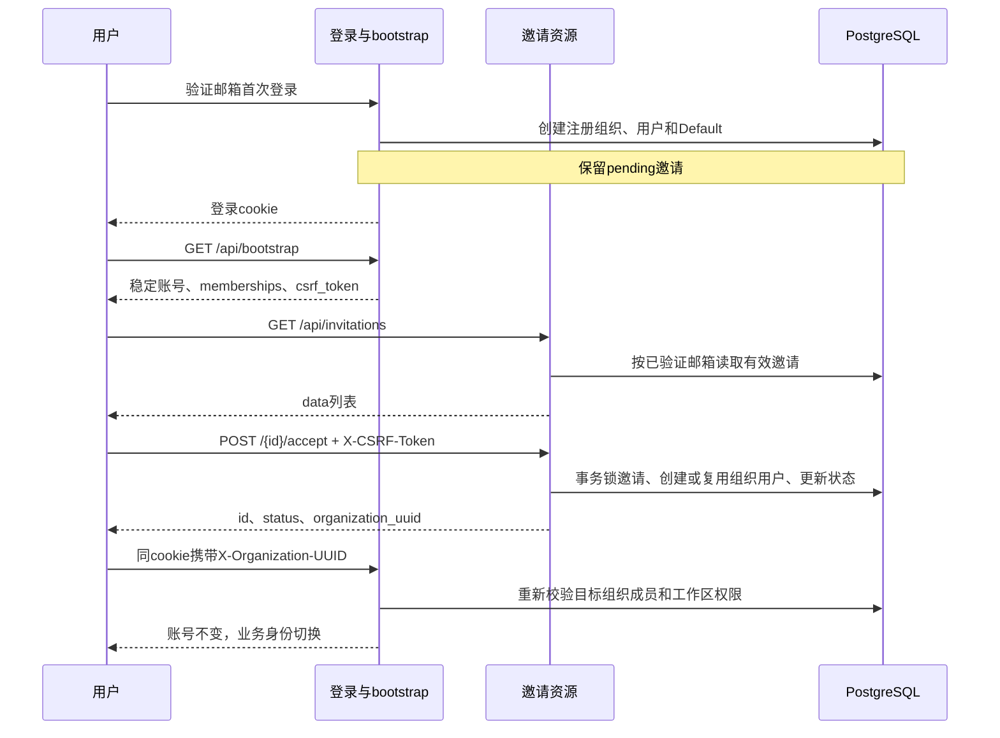
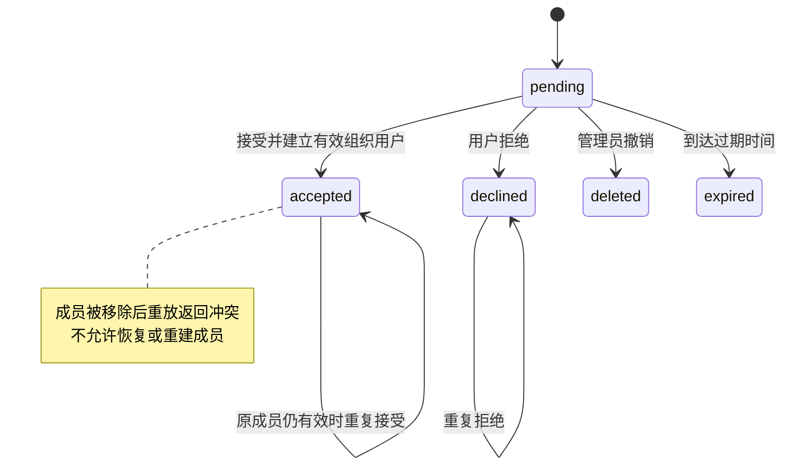
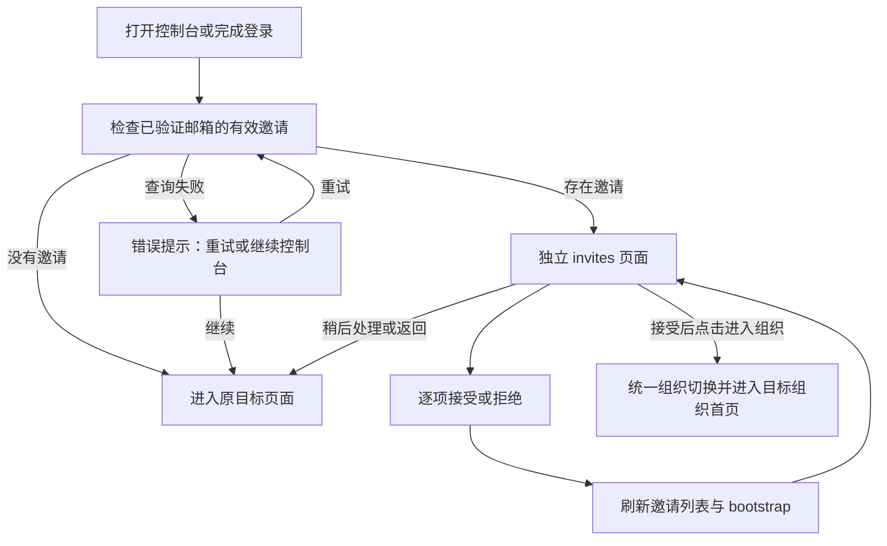
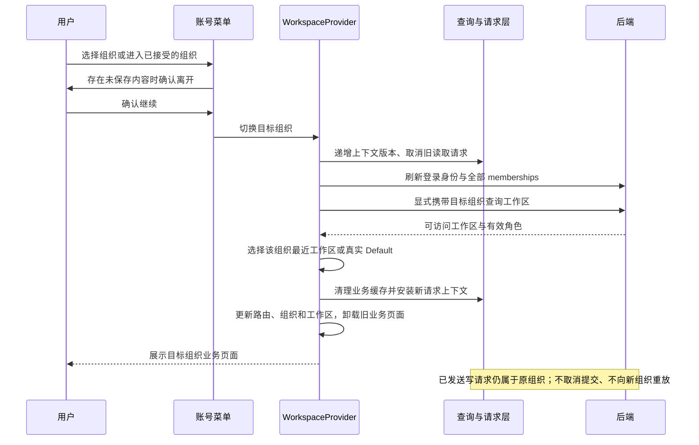

# #338 组织邀请与账号切换

## 前置与兼容边界

本功能依赖 #339 / PR #346 的组织与工作区权限规则、真实 Default 工作区标记和按请求计算的用户 Principal。发布前必须先包含该前置实现；邀请接受不补建 Default 成员关系，不创建 API key，不把加入组织等同于获得普通工作区权限。具体角色规则见 [组织与工作区权限管理](be/组织与工作区权限管理实现计划.md)。

既有 Anthropic `/v1/*` 资源合同和显式 API key 的身份语义保持不变。组织邀请操作新增在 `/api/invitations`，使用用户 cookie 会话。邀请只授予组织角色；developer 在 Default 投影为 workspace_developer，普通工作区仍需要显式授权。

## 首次登录与账号身份

邮箱在认证输入边界规范化，邀请匹配只使用服务端已验证的登录邮箱，不接受请求 body/query 中声明的邮箱作为身份。新邮箱首次登录即使存在 pending 邀请，也创建自己的注册组织和真实 Default 工作区，不消费邀请。用户随后明确接受或拒绝。

登录账号 UUID 与组织成员 UUID 分离。同一个账号可以对应多个组织中的 user；切换组织时 `account.uuid` 保持注册身份，业务 Principal 必须使用目标组织内有效的 `user_uuid` / `user_id`。会话和资源不得借用目标组织的管理员、seed 用户或 API key。

`GET /api/bootstrap` 的 `account.memberships` 包含组织对象、角色和组织内 `user_uuid` / `user_id`；`account.default_organization_uuid` 优先指向实际注册组织。注册身份应由持久标记确定，不能简单选取最早出现的同邮箱邀请成员。历史账号使用兼容回退，不能因切换组织改写账号身份。



## 邀请合同与事务

| 请求 | 成功响应 |
| --- | --- |
| `GET /api/invitations` | `{data:[{id,organization_uuid,organization_name,role,invited_at,expires_at}]}` |
| `POST /api/invitations/{id}/accept` | `{id,status:"accepted",organization_uuid}` |
| `POST /api/invitations/{id}/decline` | `{id,status:"declined",organization_uuid}` |

列表仅返回当前邮箱可处理的 pending 邀请，空列表保持 `data:[]`。时间使用 RFC 3339。响应可以提供组织成员信息作为附加字段，客户端不能把它当作全局账号身份。



Yourbatis 事务在同一 executor 内锁定邀请，校验邮箱、状态和过期时间，复用或创建目标组织有效用户，然后更新邀请状态。并发重复接受依赖邀请行锁和组织邮箱唯一性约束；已经存在的成员不能被邀请角色覆盖。过期、撤销、相反终态及已接受但成员被移除均拒绝变更。

未登录返回 401，跨邮箱或不存在的邀请返回 404，过期及状态冲突返回 409。失败不得建立成员关系。内部保存 `declined`；既有 Admin/Console 邀请兼容接口将其映射为 `deleted`，避免向旧客户端扩散新枚举。新邀请接口返回用户动作的真实 `declined` 状态。

同为 409 的可展示原因分别为 `Invitation has expired`（过期）、`Invitation has been revoked`（撤销）和 `Invitation can no longer be processed`（其他终态冲突），前端映射为对应中文提示。404 不区分不存在与接收邮箱不匹配，避免泄露邀请归属。

## CSRF、授权与缓存

邀请 POST 必须携带从当前登录 `GET /api/bootstrap.csrf_token` 获取的 `X-CSRF-Token`，缺失、错误或来自其他会话的 token 返回 403。CSRF 校验与邮箱身份均来自服务端会话，不使用邀请 ID 充当凭据。

同一 cookie 会话通过 `X-Organization-UUID` 选择组织，通过 `X-Workspace-ID` 选择工作区。每个业务请求重新解析有效成员和当前权限；长期会话不缓存授权快照。成员撤销立即影响后续请求。权限不足为 403，并保留登录 cookie；会话失效才进入 401/退出流程。

bootstrap 是恢复账号上下文的入口，过期或无权的组织/工作区选择不能阻断它。目标组织被移除后，bootstrap 仍返回账号与剩余有效 memberships，客户端回到注册组织或剩余可访问组织。

前端接受/拒绝后刷新邀请列表和 bootstrap；切换组织时先取消旧请求与业务查询，安装新上下文前清除业务缓存，再更新工作区与请求上下文。切换序号防止旧请求的延迟响应覆盖新组织状态；选择偏好按账号及组织保存。403 应展示权限错误或触发上下文恢复，不清除登录态；移除目标成员后刷新 memberships 并恢复自己的组织。

## 用户操作与组织切换

### 进入控制台时主动呈现邀请

根据用户提供的 Claude Console `/invites` 截图补充独立邀请页：顶部保留 OMA 品牌，中央展示受邀组织、角色和有效期，接受为主按钮，拒绝为链接式次操作。截图仅证明该页面的布局与接受/拒绝入口；以下多邀请、稍后处理与跳转规则是本项目选择，不作为官方行为的断言。

登录成功或重新打开/刷新应用时，根路由的 `InvitationEntryGate` 按稳定账号 UUID 查询有效 pending 邀请。查询完成前不渲染业务页面；有邀请跳到 `/invites`，没有邀请继续原目标路由。该检查每次打开、每个登录身份只执行一次，不订阅新邀请后强制打断正在编辑的页面。菜单入口继续显示待处理邀请并支持手动处理。

独立页面属于登录身份层，不放在组织/Workspace 权限守卫下。未登录直达先跳登录，已登录但旧组织或工作区失效仍可处理邀请。新邮箱注册流程不变：先创建自己的组织和 Default，邀请仍待用户显式处理。



接受不会自动切换；点击“进入组织”复用已有切换流程，并进入控制台首页，避免携带旧组织资源 ID。多份邀请逐项处理，拒绝最后一份后显示空态。提供“稍后处理，返回控制台”，保留原组织和原目标页面；同次打开不反复重定向，刷新时重新检查。返回地址仅接受站内路径，排除 `/invites` 自循环和外部 URL。请求失败可重试，不产生自动循环。

菜单对话框与独立页共用 `InvitationList`、错误映射、CSRF 和接口，不另建邀请状态机或 API。已处理邀请先取消在途旧查询并移出缓存，再刷新服务端列表与 bootstrap。

### 账号菜单与切换流程

左下角账号菜单提供组织列表、当前组织与角色，以及带待处理数量的“组织邀请”入口。接受邀请只建立成员身份，不自动离开当前页面；接受成功后点击“进入组织”，或从账号菜单选择组织，才执行切换。拒绝后邀请从待处理列表移除，重新加入需管理员发送新邀请。

组织选择保存在当前标签页的 `sessionStorage`；最近工作区按账号 UUID 和组织 UUID 分别保存在 `localStorage`，其他标签页不会因此立即切换。服务端返回的真实 `is_default` 是回退依据，不能按名称猜测或在客户端补造默认工作区。



初始化已有详情链接时保留路由；显式跨组织/工作区切换时，详情与编辑页回到对应列表，不能携带旧资源 ID。切换期间暂停业务界面；迟到的读取或写入响应不能更新新上下文。取消未保存内容提示不会改变当前组织。

切换接口仅在有效组织和工作区提交完成后返回 `true`；失败、被后续切换取代或没有可用工作区时返回 `false`。独立邀请页只在成功时进入首页，失败留在邀请页提示再次进入。403 恢复统一使用空闲、检查中、失败三种状态：检查中合并并发错误，普通权限不足检查完成回到空闲，恢复失败后仅显式重试或选择组织/工作区才能重新开始，不再通过每个成功读取响应广播重置。

业务请求返回 403 后，先刷新身份与可访问工作区区分普通权限不足和成员关系失效：组织失效优先回注册组织，其次其他有效组织；仅工作区失效则在当前组织回退。恢复失败提供重试与退出登录入口，不创建组织或恢复已移除成员。所有按钮和身份展示仅供交互使用，服务端仍对每次请求独立授权。

## PostgreSQL 验收

`tests/organization_joining_test.go` 使用现有 `newTestAppWithStore`、测试邮箱验证码 HTTP 登录、真实 PostgreSQL 和 fake object store。不能调用 `platformLoginCookies`，因为该辅助函数预写 seed 组织用户，不能证明首次登录注册组织行为。

测试复用 `tests/config_test_main_test.go` 的配置入口：显式 `CONFIG_FILE` 优先，否则使用 `config/config.example.yaml`。运行前必须将配置指向隔离测试数据库；不再按配置文件名跳过，配置或依赖不可用时测试失败。fixture 使用随机邮箱和独立注册组织，不操作当前 Demo 用户。数据库 fixture 写入通过现有 DB/Yourbatis API，SQL 读取仅用于验证当前测试组织中的持久化结果。

覆盖未登录、跨邮箱伪造、缺失/错误/跨 session CSRF、过期/撤销、首次登录、邀请列表字段、接受/拒绝幂等、移除后重放、账号 UUID 稳定、重复登录、stale header/cookie 上下文、403 不清 cookie，以及 files、skills、vault、memory、agent、environment、session 创建。会话记录必须使用目标组织 user UUID，资源创建者不得伪装成 API key。Default 成员保持零条；`api_keys` 与 `console_api_keys` 对照接受前的基线，区分既有注册流程创建的 key 与接受邀请产生的副作用。模型配置为无效域名占位，仅创建资源和未执行的会话，不提交消息、不启动 worker、不调用真实 LLM。

主代理统一完成生成后运行：

```sh
CONFIG_FILE=/path/to/isolated-test-config.yaml go test ./tests -run '^TestOrganizationJoining' -count=1 -v
```

生成、`just lint`、`just dead-code` 及全套测试由主代理集中串行执行，避免多代理同时清空生成文件。迁移验收使用隔离 `TEST_MIGRATION_DATABASE_URL`，不得连接业务库。测试通过状态以实际运行结果为准，本设计说明不代替验收日志。

2026-09-08 在指定隔离配置下执行上述命令，三个 `TestOrganizationJoining*` 测试全部通过，包含四组失败子场景。直接运行 `golangci-lint run --config .golangci.yml ./tests/...` 返回 `0 issues`。本记录只确认该测试文件覆盖的 HTTP/PostgreSQL 验收，前端缓存交互、全套门禁与迁移专项结果由主代理汇总。

## 实现验收记录（2026-09-08）

2026-09-09 PR 审查修正：切换结果、邀请页失败保留与 403 单一恢复状态的前端定向测试共 37 项通过，生产构建通过；使用 `/tmp/oma338-review-config.yaml` 和新建隔离 PostgreSQL 实例执行三个 `TestOrganizationJoining*` 全部通过，确认无需原临时文件名。Go lint、死代码、重复代码、复杂度、前端格式和大文件检查通过。全量 Bun 测试仍在 ConsoleShell 套件退出 133，不计为全量验收通过。

正式改动保存在 `codex/338-organization-joining`，基于 #339 的 `ad9b3e4`；原工作区未提交 Demo 不属于正式交付，也未被回退。数据库新增 00061（declined）与 00062（注册来源标记）迁移，历史已应用迁移未修改。

- 真实 PostgreSQL：邀请失败、事务回滚、重复处理、同邮箱并发接受、接受/拒绝竞态、移除后禁止重放、首次登录不接受邀请和多组织身份测试通过。HTTP 集成覆盖七类资源的创建与租户隔离；使用 fake object store，不调用真实模型。
- 前端定向回归：76 项通过、0 失败，覆盖邀请交互、登录重复导航修复、组织选择、请求隔离、权限投影等。生产 build、格式、命名、复杂度和重复代码门禁通过。
- 静态门禁：`just hooks-run`、`just lint`、`just dead-code`、`just duplicates`、`just complexity`、`just web-format-check`、`just large-files` 均实际执行通过。
- 真实浏览器：使用独立虚构账号验证“已有 pending 邀请 → 首次注册自己的组织 → 接受但不自动切换 → 进入新组织 → 七类资源列表可访问 → 被移除后同会话恢复注册组织 → 新邀请重新加入”。另验证普通工作区创建、刷新恢复及跨组织返回时恢复最近工作区。账号菜单截图已在任务中展示。

全量验收仍有明确限制，不能据此宣称全部测试通过：本机 Bun 1.2.12 执行全量前端测试时以 133 异常退出，逐文件运行也有崩溃与超时。未改动的 `ad9b3e4` 临时基线复跑 `ConsoleLayout.test.tsx` 同样在相同位置以 133 退出。没有通过调整测试超时、放宽质量预算或跳过失败项伪造全绿；其余全量失败仍需在满足资源条件的环境中复跑。

Go 全量 `just test` 中，`internal/workerevents` 的四个 JetStream 用例仍受本机空闲存储波动影响，报 `insufficient storage`；存储充足的一轮曾全部通过。浏览器服务同时运行时另有两个 worker 用例超时，停止本次浏览器后端后，两个用例的定向重跑通过。运行共享数据库的 worker 验收时必须先停止手工启动的后端，避免其他进程消费测试任务。

浏览器服务使用隔离配置。因 18080 已被其他工作区占用，实际后端使用 `127.0.0.1:18081`，前端使用 15138；未停止或修改占用 18080 的服务。测试结束后停止本次服务及隔离容器。未执行真实 LLM 推理、远端 worker 或生产账号操作，浏览器列表可用不能替代这些链路的专项验收。

### 独立邀请页增量验收

新增 `InvitationsPage.test.tsx` 的 8 项路由/页面回归，覆盖查询失败重试与继续、未登录直达、无组织权限仍可处理、多份邀请、无邀请直通、稍后处理不循环、重新打开再次提示、接受后显式进入、拒绝后空态和不安全返回地址。连同既有邀请、登录、切换、请求作用域等定向测试共 84 项通过。

本次浏览器使用新的虚构邮箱，在首次注册前建立邀请；实际验证首次登录直接看到独立邀请页、稍后处理返回自己的组织、刷新再次出现邀请、接受后仍停留邀请页且提供进入组织。页面截图已在任务中展示。生产构建、格式、命名、重复代码和复杂度检查通过；全量 Bun 仍在既有 `ConsoleLayout` 用例处以 133 退出，本次未修改运行器或放宽门禁。#338 正文已通过 `gh` 同步入口规则和新增验收项。
