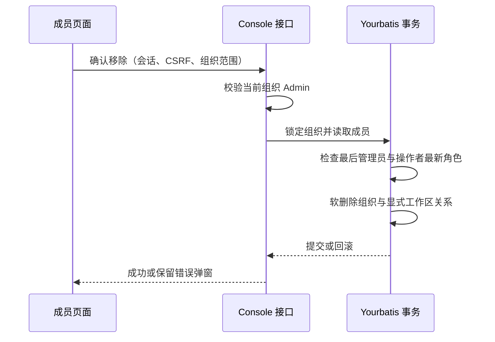

# 组织与工作区成员管理（#336）

本功能依赖 #339（PR #346）的统一权限计算及成员事务、#338（PR #347）的组织加入与切换上下文。#336 在两者交付的 `workspaceaccess` 服务、Default 标记与 Console 路由骨架上补齐差异。

## 产品与权限边界

组织成员是加入组织的人；工作区成员表示这些人在某个空间的有效访问权限。Console API 是网页使用的会话认证接口，不是一种成员身份。对外 Admin API 与 Console API 应共享领域规则。

组织 Admin 管理组织邀请、角色和移除操作。前端只根据当前组织的角色显示入口，其他组织的 Admin 身份不能提供权限。后端重新查询操作者的有效组织成员关系；成员修改事务内再次校验角色，不能仅依赖会话中的历史角色。

组织必须保留至少一名有效 Admin。Console 和 Admin API 的删除、降级共用组织行锁和管理员计数，最后一名管理员变更返回 409。移除组织成员时，在同一事务中软删除组织关系和该组织下的显式工作区关系；其他组织关系、工作区团队资源和 Key 保留。重复移除返回 404。

普通工作区按 #339 的最新合同执行：组织 Admin 继承 Workspace Admin，不能编辑或移除；Billing 继承 Workspace Billing，可提升为 Workspace Admin，再选择 Workspace Billing 撤销显式授权，不允许删除继承访问。其他组织成员通过显式工作区角色加入。Default 的权限全部来自组织角色，历史显式关系不参与计算，不提供独立成员管理操作。

## 工作区 Console 合同

路径前缀为 `/api/console/organizations/{organizationUuid}/workspaces/{workspaceId}`。

| 方法与路径 | 合同 |
| --- | --- |
| GET `/members` | 返回 `workspace_id`、`is_default`、`can_manage_members`、`members` |
| GET `/member-candidates` | 返回同组织内尚可添加的成员，字段为 `user_id`、`name`、`email` |
| POST `/members` | 以 `user_id`、`workspace_role` 添加显式成员 |
| POST `/members/{userId}` | 更新 `workspace_role`，包括 Billing 提权和恢复继承 |
| DELETE `/members/{userId}` | 移除显式成员 |

每个成员返回身份、姓名、邮箱、组织角色、有效工作区角色、角色来源及 `can_edit`、`can_remove`。界面消费服务端权限，不自行复制继承算法。目录与候选查询复用 `ListWorkspaceMemberFacts`；添加、改角色和移除统一走 `workspaceaccess.ChangeMember`（组织成员行锁 → 工作区锁 → 操作者授权 → Default 保护 → Billing 规则）。组织 Admin 的继承访问不可编辑或移除；Billing 可编辑以提权或恢复继承，但始终不可移除；候选列表只返回可显式添加的组织成员（排除 Admin/Billing 与已有显式成员）。

## 组织成员 Console 合同

组织成员写路径（改角色、移除）挂 `requireConsoleOrganizationAdmin` 中间件，任何登录成员包括其他组织管理员都不可操作。DB 层 `withOrganizationMemberChange` 在组织行锁事务内校验操作者最新角色与最后管理员计数；Admin API 的 `UpdateAdminUserRole`/`DeleteAdminUser` 与 Console 共用同一保护。移除最后管理员返回 409 `last_organization_admin`，重复移除返回 404，非管理员返回 403。

## 页面与 CMA 对照

组织和普通工作区成员页提供成员计数、说明、搜索、角色筛选、姓名/邮箱/角色排序、行内角色选择和更多操作菜单。组织右上入口为 Invite，工作区为 Add to Workspace。移除使用确认弹窗，提交期间禁用操作，后端失败保留弹窗和原因。切换组织或工作区后重置弹窗状态。

已观察 `platform.claude.com` 组织成员和普通工作区成员页的布局、权限说明与操作入口。真实 CMA 的移除操作未执行；添加弹窗因无可添加成员未能观察。本地验收需要逐项对照布局、筛选、表格、角色变更、添加和移除流程，不能将页面观察视为写操作验收。

## 验证状态

- 组织角色授权、跨组织拒绝、最后管理员删除/降级、并发管理员变更、级联移除和重复移除由独立 PostgreSQL 事务测试覆盖（`TestOrganizationMemberChangesPostgreSQL`）。
- Console 组织管理员中间件与错误合同由 `internal/platformapi/console_member_authorization_test.go` 覆盖。
- 组织移除取消、CSRF、后端 409 保持弹窗由前端组织成员页测试覆盖；工作区只读、Default 提示、继承角色、搜索和空候选状态由工作区成员页测试覆盖。
- `TestConsoleMembersAPI` 覆盖组织成员列表、改角色、移除；工作区成员 Console 合同由真实 HTTP 验收补充覆盖（见 PR 验收评论）。
- 全量测试在独立 PostgreSQL + Redis + 三节点 NATS 环境执行；仅 Official SDK fixture（401）与内嵌 JetStream 集群 placement 为基线环境限制，与本功能无关。
- 本阶段不处理长连接撤权、运行中任务迁移或凭据归属模型变更。

成员资料与权限事实由一次带组织和工作区范围的查询返回，不再拼接截断为 1000 人的组织资料列表；候选成员复用同一查询。工作区页面只保留路由实际使用的 `settings/WorkspaceMembersPage.tsx`。

审查回归覆盖：Billing 继承与提权状态下的编辑/移除能力、Admin API 最后管理员冲突映射、1002 人目录的真实 PostgreSQL 资料扫描与跨组织拒绝。
