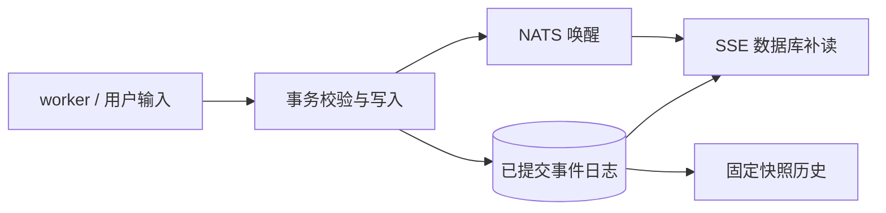

# Session 事件一致性

目标：同一 Session 在相同已提交进度下，实时消费与刷新重建得到相同的完整事件内容、顺序和状态。

## 提交与读取

- 复用 Session → Code Session 行锁及 Yourbatis 事务。原始记录、公共事件、线程/Session 状态、权限 metadata 与自动回复一起提交；失败整体回滚，提交后通知。
- 用户输入与 active worker 入队一起提交；initializing worker 仍通过同一锁完成启动交接。
- 同 ID 同内容重试保留原记录和时间，不重新推进状态；异内容、不同归属冲突回滚整批。事务内复验 worker epoch，拒绝接管后的旧 worker。
- migration 00059 新增 `sessions.last_event_at`。每条新事件使用 `GREATEST(clock_timestamp(), last_event_at + 1 microsecond)`，批次保持输入顺序，源时钟回拨不改变公开顺序。
- 历史默认按 `processed_at` 升序，同时间旧记录以 event ID 稳定排序；分页游标固定快照水位，绑定租户、线程、方向和过滤条件。
- SSE 初连仍为 live-only。NATS 只唤醒完整事件的数据库补读，每秒兜底补读覆盖丢通知；DB 失败断开后恢复，查询和写入有独立超时。
- 历史与 SSE 采用同一完整事件序列化。thinking 仅公开进度身份和时间，保留私有存储内容用于恢复/幂等比较。
- 子线程 raw、线程映射及公共事件在事务内转换；历史 GET 只读，迟到映射在写入路径补齐，不再由刷新推进状态。

## 工具归属

工具调用和结果在写入事务内确定所属线程；已有归属优先，拒绝冲突副本。历史和 SSE 直接读取已保存的归属，不再因后续出现子线程副本而动态隐藏旧事件。已有历史不重写。

## 升级与边界

排空旧 writer 后执行迁移并切换服务，避免旧实例不推进处理时钟。旧记录保留原时间；旧游标失效时重新读取。回滚前先停写并评估新增状态，不直接启用旧 writer。

本层只收敛提交和读取基础。原版请求关联及前端缓存恢复由后续改动处理；preview 仍为 best-effort，完整事件才是恢复依据。

已确认 worker 瞬态 idle 可能被当作 `end_turn`，同一工具回合因此提前宣布结束。这需要明确的完成事实仲裁，排序与事务不解决该语义问题。

完整 Claude 对齐仍包括 pending 输入应用、同 epoch 旧 turn 仲裁、响应前失败的请求边界、失败/中断收尾和真实累计 usage。尚不能声明完整生命周期对齐。

## 验证

测试与行为一起维护：事务失败/重试/epoch、时钟回拨、固定快照、丢失或乱序通知、SSE/history 完整 JSON 相等、权限/子线程状态与迟到映射。正式验收还需真实模型的实时、刷新、重连对照；协议 fixture 不能替代它。
