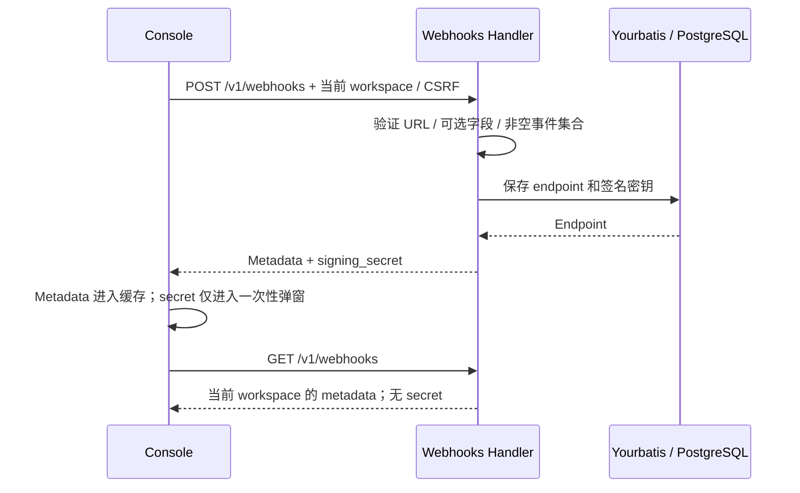
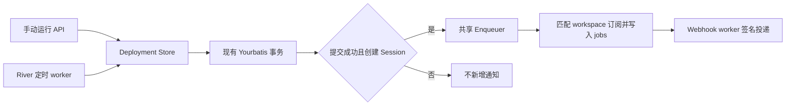
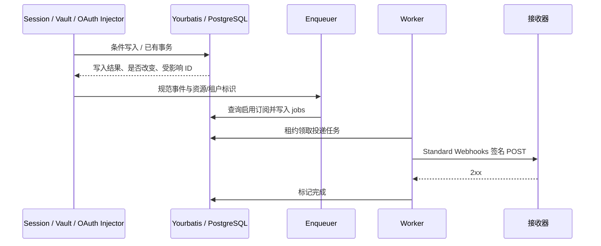

# Webhook 订阅管理与事件投递

## 本次范围

2026-09-20 分步实施：第一阶段订阅管理已提交为 `85ff33a`；第二阶段补齐当前目录的 17 项事件触发与真实投递。其他资源事件和投递策略差异留待后续。旧占位 Webhook 数据没有上线，不增加兼容迁移或旧事件别名支持。

保留现有 `internal/webhooks` resource、Yourbatis Mapper、endpoint/job 表、Enqueuer、Worker 和鉴权路径。前端继续使用现有 Console 路由、TanStack Query、shadcn Dialog/Sheet；只拆出事件目录、反馈、复用的事件选择和表单模块，不引入新的事件总线、服务或数据库表。

## Claude 合同与证据

截至 2026-09-20：

- [Claude Webhooks API Reference](https://platform.claude.com/docs/en/api/beta/webhooks)主要给出事件模型及 SDK 验签能力，没有找到完整的订阅管理请求/响应 schema。
- [Claude Platform on AWS 的 IAM 映射](https://platform.claude.com/docs/en/api/claude-platform-on-aws-iam-actions)明确列出下述管理路由，并明确 GET 不返回签名密钥。这是 AWS 平台的公开路由证据，不证明所有直连 API 账号的可用性或字段级合同。
- [官方订阅指南](https://platform.claude.com/docs/en/managed-agents/webhooks)是事件通知与投递合同来源；[前端调研](fe/webhook-subscription-reference-study.md)记录了已登录 Chrome 中观察到的 Console 行为及未验证项。

| 操作 | 官方 IAM 路由；本项目沿用相同路径 |
| --- | --- |
| 创建 / 列表 | `POST /v1/webhooks` / `GET /v1/webhooks` |
| 获取 / 更新 / 删除 | `GET` / `POST` / `DELETE /v1/webhooks/{id}` |
| 重置密钥 | `POST /v1/webhooks/{id}/regenerate_signing_secret` |

`enabled_events`、`status`、分页结构、错误文案和 `webhooks-2026-03-01` beta header 继续保留本项目现有合同；未找到完整官方 schema，不将这些细节标为已验证的 Claude 字段级兼容。更新仍用 POST。

## 订阅管理行为

- URL 必填。前端即时校验 HTTPS URL，后端继续权威校验 HTTPS、443、凭据和私有 IP 字面值等规则；本地 `allow_insecure` 是部署级开关，不由普通前端放宽。
- Name 和 Description 可省略或为空字符串，显式 `null` 和非字符串被拒绝；不再把空名称自动改为域名。沿用既有字节长度限制：名称 255，描述/URL 2048。
- 创建时零事件选择；至少选择一项才可提交。创建与编辑共用事件目录、全局全选、分组半选/计数和事件协议名复制。
- API 白名单和前端目录统一为 6 组 17 项规范事件。移除 `session.error`、`session.thread_status_*` 的对外订阅，以及前端未知事件和 `session.record_*` 兼容分支；内部会话流名称保持不变，在 Webhook 边界转换。
- 本轮不把尚未接入的 Agent、Deployment、Environment、Memory Store、budget 等事件添加为可订阅选项。当前 17 项覆盖真实 API 或现有 worker 事件入口到本地接收器的验签测试，不代表真实模型已自动产生全部事件。
- 列表增加 ID 搜索、名称/状态/创建时间排序和空列表创建入口。搜索/排序作用于现有 API 返回集合，不增加未经官方确认的查询参数。
- 编辑复用现有更新 API，增加 URL 输入，支持清空可选字段；详情显示描述和禁用原因。
- 创建和重置后的 secret 仅放在一次性弹窗状态，不放入列表缓存或 mutation 返回数据。关闭/切换 workspace 后清除展示状态；复制失败时提示重试，不能显示虚假的复制成功。
- 编辑、启停、重置和删除失败时保留操作界面与服务端错误。切换 workspace 后，不延续前一 workspace 的详情、草稿或密钥弹窗。

## Deployment 创建 Session 的通知

手动运行与定时运行共用 `Deployment Store` 中的创建通知。启动层构造共享 Enqueuer，在 River worker 启动前注入 Store，并经 `ServerDeps` 供 HTTP 资源复用。通知按已创建 Session 的 workspace 查询租户标识，不依赖 HTTP Principal。

- 数据库订阅创建阶段发送 `session.status_idled`。`session.created`、`session.pending` 仅保留在既有全局配置路径，不加入 Console 目录。
- 主线程创建不发送子线程通知；初始 `user.define_outcome` 不发送评估结束通知，后者由 `span.outcome_evaluation_end` 事件入口触发。
- 失败运行、事务回滚、过期任务、归档分支，以及同一定时执行时刻的重复处理不新增通知。两次独立手动运行各自创建 Session、分别通知。
- 通知准备和入队失败只记录错误，不将已提交的运行报告为失败；业务提交和入队尚未原子化。不增加 `deployment.*` 或 `deployment_run.*` 订阅。

## 保留的投递边界

沿用现有按事件发生时的 workspace 订阅选择、持久化 delivery jobs 和 Standard Webhooks 签名。此轮不改投递重试和自动禁用阈值，不引入事务 outbox，不增加测试通知、投递日志 UI、手动/批量重放或多密钥宽限期。

`webhook.worker_enabled` 默认 `true`，显式 `false` 仍关闭当前实例 worker；数据库订阅无需全局 endpoint/key。复用主进程中的后台协程和 PostgreSQL jobs，不按订阅数动态启动进程。没有匹配的启用订阅时不创建 endpoint 投递任务。既有全局配置投递路径保留，只有 workspace 没有订阅记录时才可能使用。

尚待后续解决的投递差异包括 DNS 解析后的公网地址约束、Claude 的重试节奏与基于时间的持续失败禁用，以及资源写入和 webhook 入队的事务可靠性；当前 URL 的字面值检查不能表述为完整 SSRF 防护。

## 验证

- 前端：空事件/非法 URL 禁止提交，分组/全局半选，搜索与排序，创建失败后保留表单，编辑 URL/清空名称，规范事件选择，一次性密钥不进入共享缓存，workspace 切换清理。
- HTTP + PostgreSQL：拒绝非法可选字段与 URL；省略/清空名称；完整 CRUD；列表/查询/更新不泄露 secret；其他 workspace 不能读取或修改 endpoint。
- 沿用真实本地接收器的投递测试，使用官方 Go SDK `Unwrap` 检验签名；与真实 Claude Console 管理 API 的对打验证分开报告。
- 按仓库要求执行格式、构建、测试、lint、重复代码、复杂度和 dead-code 检查；浏览器验证前重启前端。不得把定向通过等同于全部检查通过。

## 第一阶段验证记录（2026-09-20）

- 提交前已在 `ee05a25` 基线上重新运行 Go 全量测试、前端组件测试/构建和质量门禁。以下 Chrome 记录来自第一阶段交互检查，不属于这次命令复跑。
- `CONFIG_FILE=/tmp/oma-webhooks-test-config.yaml just test`：通过；配置连接独立 PostgreSQL、Redis、NATS 与对象存储，不使用开发数据库。
- `go test ./internal/webhooks ./tests -run TestWebhook -count=1`：通过，包含 HTTP 管理、跨 workspace 拒绝访问，以及本地接收器 + 官方 Go SDK 验签。测试显式启用 worker；不代表当前开发服务已开启投递。
- `bun test src/features/settings/WorkspaceWebhooksPage.test.tsx`：14 项通过，包含可选字段、URL、分组/全选、编辑、筛选/排序、失败保留、密钥复制失败/缓存隔离和 workspace 切换。
- `just lint`、`just dead-code`、`just complexity`、`just duplicates`、`just web-format-check`、`bun run lint:naming`、`bun run build`：通过。构建仍提示现有大 chunk 与 SDK Node 模块浏览器 externalization 警告。
- 前端全量 `bun test`：未通过验收。两次运行均在既有 `ConsoleLayout` 测试附近以退出码 133 中断；单独运行该未修改文件也能复现。未为绕过此问题修改或跳过共享测试。
- Chrome：隔离服务登录、真实空列表、ID 搜索框、排序表头与两个创建入口已可见。工具检测到用户正在切换 Chrome 页面，后续弹窗操作未完成浏览器验收；不将组件测试代替完整浏览器验收。

手动验收顺序：进入 workspace 的 Webhooks → 创建（URL、可选名称、零选到至少一项事件）→ 保存一次性密钥并关闭 → 列表按 ID 搜索 → 详情编辑 URL/清空名称 → 禁用/启用 → 重置密钥 → 删除。无权限、非法 URL 或提交失败时，检查错误提示与输入保留。真实投递另用自己控制的接收器、确认 worker 未被显式关闭，并使用 SDK 验签；不要把订阅 CRUD 成功视为事件全集或投递策略兼容完成。

## 第二阶段事件合同

资源写入与 webhook 入队仍是两个步骤；崩溃或入队错误可能丢失通知，本轮不宣称事务级可靠投递。重试复用事件 ID，接收方需要去重。

| 事件 | 真实触发或已有入口 |
| --- | --- |
| `session.status_run_started` | worker `session.status_running` 等现有状态事件 |
| `session.status_rescheduled` | worker 重调度事件 |
| `session.status_idled` | 会话初始 idle / worker `session.status_idle` |
| `session.status_terminated` | worker 终止事件或首次成功归档会话 |
| `session.thread_created` | worker 创建子线程事件；不包括主线程 |
| `session.thread_idled` | worker 子线程 idle 事件；不包括主线程 |
| `session.thread_terminated` | worker 子线程终止或首次成功归档子线程 |
| `session.outcome_evaluation_ended` | worker `span.outcome_evaluation_end`；定义 outcome 不触发 |
| `session.updated` | Session API 实际改变 title、metadata 或 agent snapshot |
| `session.deleted` | Session API 删除成功 |
| `vault.created` | Vault API 创建成功 |
| `vault.archived` | Vault API 首次归档成功 |
| `vault.deleted` | Vault API 删除成功 |
| `vault_credential.created` | Credential API 创建成功 |
| `vault_credential.archived` | 首次直接归档或 Vault 级联实际归档 |
| `vault_credential.deleted` | 直接删除或 Vault 级联删除 |
| `vault_credential.refresh_failed` | OAuth Injector 确认不可恢复的刷新失败 |

Session 条件更新在 SQL 写入处比较属性，JSON 使用 JSONB 语义比较并保留服务器内部 metadata。重复归档通过写入条件只认领一次改变；DB API 返回是否改变。Vault 级联更新/删除在原有 Yourbatis 事务内通过 `RETURNING external_id` 获取受影响凭据，无单页 1,000 条截断，也不读取凭据密文。归档仅返回此次由 active 变为 archived 的凭据。

刷新失败通知只覆盖需要刷新但缺失 refresh token，或 token endpoint 的不可恢复 4xx（排除 408、429）。原有凭据锁、一次 exchange 和 CAS 重试保持；失败后重读并成功复用其他刷新结果时不通知，重读/解密/持久化故障也不归类为 OAuth 拒绝。网络错误、408/429/5xx、取消不通知；每次实际失败的刷新流程最多产生一个事件，不新增持久化去重状态。通知仅包含 credential、vault 和租户标识。

## 第二阶段验证与人工 review

- `tests/webhook_events_test.go` 的矩阵通过真实资源操作/worker 入口覆盖全部 17 项，再由接收器接收并使用官方 Go SDK `Unwrap` 验签；OAuth 场景走现有 Injector + 独立 token endpoint，不依赖外部供应商。
- 反例覆盖非法更新、无变化更新、重复 ingress、重复归档、主线程不发子线程事件、定义 outcome 不报完成、禁用/未订阅/其他 workspace、不补发历史事件。真实 PostgreSQL 验证 1,001 条已归档凭据删除时生成完整通知。
- `internal/vaults/oauth_webhooks_test.go` 验证永久拒绝/无刷新令牌、408/429/5xx、数据库失败、并发成功复用和 CAS 耗尽。`internal/config/webhook_config_test.go` 与 worker 启动测试验证默认开启及显式关闭。
- `internal/db/webhook_mutation_mapper_test.go` 覆盖变更 SQL、UUID 范围和参数绑定；生成文件继续忽略，不提交 schema migration，因为没有表结构变化。

2026-09-20 第二阶段历史验证记录（合并 upstream 至 `dacfa20` 前，不作为下述提交验收依据）：

- `go generate ./...`、`CONFIG_FILE=/tmp/oma-webhooks-test-config.yaml just test` 通过，最终全量 Go 测试包含上述事件矩阵及并发归档场景。
- `just lint`、`just dead-code`、`just duplicates`、`just complexity`、`just web-format-check`、`bun run lint:naming`、`bun run build` 通过；相关前端测试 14 项通过、143 条断言。构建仍有既有大 chunk 和 Node 模块 externalization 警告。
- 前端全量 `bun test` 再次在未修改的 `ConsoleLayout` 测试附近以退出码 133 中断；不将相关组件测试通过表述为前端全量通过。
- Chrome 使用另一个独立数据库 `webhook_browser_test`，重启前端后完成登录、Webhooks 空列表、搜索框、排序表头与创建入口检查。进入弹窗时工具检测到用户切换 Chrome 页面，后续操作停止；完整弹窗流程仍待人工验收。
- 代码 review 核查了写入成功后通知、重复操作、主线程过滤、级联完整性、租户范围和 OAuth 错误分类。未引入新的表、事件总线或投递重试策略。
- 验收结束后已停止 18080 后端、4173 前端及 `oma-webhooks-test` 专用依赖容器；测试未使用开发数据库。

## 阶段性提交前复核（基于 `dacfa20`）

本次重新验证覆盖当前全部 Webhook 变更，不沿用上述合并 upstream 前的记录：

- 全量 `CONFIG_FILE=/tmp/oma-webhooks-test-config.yaml just test` 通过，包含 17 项事件验签矩阵、1,001 条凭据级联、OAuth 分类与并发复用、worker 默认开启/显式关闭。
- `tests/deployment_webhooks_test.go` 验证手动运行、实际 River worker 创建与重复 occurrence、主线程/初始 outcome 不误报、真实评估结束入口、跨 workspace 请求拒绝和订阅过滤；投递使用本地接收器与官方 Go SDK 验签。
- 手动运行的数据库触发器故障注入证明 Session 写入后 run 插入失败会整体回滚、不通知；重复 River occurrence 也证明未留下额外 Session。依赖失败与过期任务通过实际 River worker 验证，归档分支通过 Store occurrence 入口验证；不把直接调用 Store 表述为调度器端到端验收，也不把手动插入 River job 表述为 Cron 到点触发验收。
- `just lint`、`just dead-code`、`just duplicates`、`just complexity`、`just large-files`、`just web-format-check`、`bun run lint:naming`、`bun run build` 通过。Webhook 前端 14 项测试、143 条断言通过。
- 全量前端 `bun test` 再次因 SIGTRAP 中断；单独运行未修改的 `src/app/layout/ConsoleLayout.test.tsx` 复现退出码 133，最后完成项仍为语言子菜单测试。此问题未修复，前端全量测试不算通过；未降低门禁或跳过 hook。完整浏览器弹窗人工验收仍待完成。
- Review 覆盖写入结果、重复操作、启动注入顺序、scope、级联与 OAuth 分支；本轮不增加 Environment、Deployment 或 Deployment Run 订阅类型。
- `go generate ./...` 与 `just hooks-run` 全部通过，没有跳过检查。独立测试接收器与 River client 已关闭，`oma-webhooks-test` 的容器和网络已清理；本轮未启动常驻后端或前端服务。

独立测试环境中可单独复跑事件验收：先运行 `./scripts/generate-go.sh`，再运行 `CONFIG_FILE=/path/to/test-config.yaml go test ./internal/config ./internal/db ./internal/vaults ./tests -run 'Test(Webhook|OAuth.*Notification|OAuthSuccessful)' -count=1 -v`。接收器由测试启动并清理，无需真实供应商账号。配置必须指向专用测试数据库；测试会清理 Webhook 订阅和任务。

人工 review 建议顺序：

1. `internal/config/yaml_types.go`：默认启动与显式 false 的优先级；`internal/webhooks/handler.go`：17 项白名单。
2. `internal/sessions/service.go` 和 `webhook_bridge.go`：真实变更后发出、主/子线程过滤、outcome 完成映射；再看 Session Mapper 的条件更新。
3. `internal/db/vaults.go` 和两个 Vault Mapper：重复归档、并发写入与级联返回标识；`internal/vaults/handler.go` 仅在成功后通知。
4. `internal/vaults/oauth_refresh.go`：永久错误分类和并发兜底顺序；从 API 组装追踪到 Injector，确认仍使用原有 Enqueuer。
5. `internal/deployments/store.go` 与 `webhooks.go`：两条入口提交后通知，启动前依赖注入；`tests/deployment_webhooks_test.go` 覆盖实际 River worker 投递与事务回滚。
6. 运行事件矩阵，再按第一阶段顺序验收控制台。启动隔离后端使用 `CONFIG_FILE=/path/to/test-config.yaml go run .`（`127.0.0.1:18080`），前端使用 `PORT=4173 API_PORT=18080 just restart-web`；测试后停止这些进程。不要在常用数据库执行测试清理。
