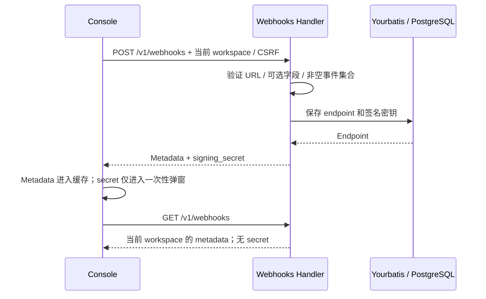

# Webhook 订阅管理

## 本次范围

2026-09-20 确认分步实施：本轮完成 workspace 内的订阅管理闭环，后续再补齐 Claude 的其他资源事件和投递策略差异。

保留现有 `internal/webhooks` resource、Yourbatis Mapper、endpoint/job 表、Enqueuer、Worker 和鉴权路径。前端继续使用现有 Console 路由、TanStack Query、shadcn Dialog/Sheet；只拆出事件目录、反馈、复用的事件选择和表单模块，不引入新的事件总线、服务或数据库表。

## Claude 合同与证据

截至 2026-09-20：

- [Claude Webhooks API Reference](https://platform.claude.com/docs/en/api/beta/webhooks)主要给出事件模型及 SDK 验签能力，没有找到完整的订阅管理请求/响应 schema。
- [Claude Platform on AWS 的 IAM 映射](https://platform.claude.com/docs/en/api/claude-platform-on-aws-iam-actions)明确列出下述管理路由，并明确 GET 不返回签名密钥。这是 AWS 平台的公开路由证据，不证明所有直连 API 账号的可用性或字段级合同。
- [官方订阅指南](https://platform.claude.com/docs/en/managed-agents/webhooks)是事件通知与投递合同来源；[前端调研](fe/webhook-subscription-reference-study.md)记录了已登录 Chrome 中观察到的 Console 行为及未验证项。

| 操作 | 官方 IAM 路由；本项目沿用相同路径 |
| --- | --- |
| 创建 / 列表 | `POST /v1/webhooks` / `GET /v1/webhooks` |
| 获取 / 更新 / 删除 | `GET` / `POST` / `DELETE /v1/webhooks/{id}` |
| 重置密钥 | `POST /v1/webhooks/{id}/regenerate_signing_secret` |

`enabled_events`、`status`、分页结构、错误文案和 `webhooks-2026-03-01` beta header 继续保留本项目现有合同；未找到完整官方 schema，不将这些细节标为已验证的 Claude 字段级兼容。更新仍用 POST。

## 订阅管理行为

- URL 必填。前端即时校验 HTTPS URL，后端继续权威校验 HTTPS、443、凭据和私有 IP 字面值等规则；本地 `allow_insecure` 是部署级开关，不由普通前端放宽。
- Name 和 Description 可省略或为空字符串，显式 `null` 和非字符串被拒绝；不再把空名称自动改为域名。沿用既有字节长度限制：名称 255，描述/URL 2048。
- 创建时零事件选择；至少选择一项才可提交。创建与编辑共用事件目录、全局全选、分组半选/计数和事件协议名复制。
- 目录补齐后端已接受的 Session record 事件，共 6 组 17 项。既有订阅中的额外事件在编辑时保持可见、可保留、可取消，不能因界面目录较少而静默删除。
- 本轮不把尚未接入的 Agent、Deployment、Environment、Memory Store 等事件添加为可订阅选项；现有白名单也不等于每个生产触发点均已验收。尤其 `vault_credential.refresh_failed` 的生产发出链路尚待补齐。
- 列表增加 ID 搜索、名称/状态/创建时间排序和空列表创建入口。搜索/排序作用于现有 API 返回集合，不增加未经官方确认的查询参数。
- 编辑复用现有更新 API，增加 URL 输入，支持清空可选字段；详情显示描述和禁用原因。
- 创建和重置后的 secret 仅放在一次性弹窗状态，不放入列表缓存或 mutation 返回数据。关闭/切换 workspace 后清除展示状态；复制失败时提示重试，不能显示虚假的复制成功。
- 编辑、启停、重置和删除失败时保留操作界面与服务端错误。切换 workspace 后，不延续前一 workspace 的详情、草稿或密钥弹窗。

## 保留的投递边界

沿用现有按事件发生时的 workspace 订阅选择、持久化 delivery jobs 和 Standard Webhooks 签名。此轮不改投递重试、自动禁用阈值或资源事务设计，不增加测试通知、投递日志 UI、手动/批量重放或多密钥宽限期。

现有配置加载逻辑只有在配置了全局 endpoint 与 key 时才自动开启 worker；仅使用数据库订阅的部署需要显式设置 `webhook.worker_enabled: true`。本轮保留这一配置行为，在验收中显式开启独立测试 worker。管理成功不等于已验证实际投递。

尚待后续解决的投递差异包括 DNS 解析后的公网地址约束、Claude 的重试节奏与基于时间的持续失败禁用，以及资源写入和 webhook 入队的事务可靠性；当前 URL 的字面值检查不能表述为完整 SSRF 防护。

## 验证

- 前端：空事件/非法 URL 禁止提交，分组/全局半选，搜索与排序，创建失败后保留表单，编辑 URL/清空名称，未知事件保留，一次性密钥不进入共享缓存，workspace 切换清理。
- HTTP + PostgreSQL：拒绝非法可选字段与 URL；省略/清空名称；完整 CRUD；列表/查询/更新不泄露 secret；其他 workspace 不能读取或修改 endpoint。
- 沿用真实本地接收器的投递测试，使用官方 Go SDK `Unwrap` 检验签名；与真实 Claude Console 管理 API 的对打验证分开报告。
- 按仓库要求执行格式、构建、测试、lint、重复代码、复杂度和 dead-code 检查；浏览器验证前重启前端。不得把定向通过等同于全部检查通过。

## 本轮验证记录（2026-09-20）

- 提交前已在 `ee05a25` 基线上重新运行以下检查；没有将原先 `f41de23` 基线的结果作为本次提交依据。
- `CONFIG_FILE=/tmp/oma-webhooks-test-config.yaml just test`：通过；配置连接独立 PostgreSQL、Redis、NATS 与对象存储，不使用开发数据库。
- `go test ./internal/webhooks ./tests -run TestWebhook -count=1`：通过，包含 HTTP 管理、跨 workspace 拒绝访问，以及本地接收器 + 官方 Go SDK 验签。测试显式启用 worker；不代表当前开发服务已开启投递。
- `bun test src/features/settings/WorkspaceWebhooksPage.test.tsx`：14 项通过，包含可选字段、URL、分组/全选、编辑、筛选/排序、失败保留、密钥复制失败/缓存隔离和 workspace 切换。
- `just lint`、`just dead-code`、`just complexity`、`just duplicates`、`just web-format-check`、`bun run lint:naming`、`bun run build`：通过。构建仍提示现有大 chunk 与 SDK Node 模块浏览器 externalization 警告。
- 前端全量 `bun test`：未通过验收。两次运行均在既有 `ConsoleLayout` 测试附近以退出码 133 中断；单独运行该未修改文件也能复现。未为绕过此问题修改或跳过共享测试。
- Chrome：隔离服务登录、真实空列表、ID 搜索框、排序表头与两个创建入口已可见。工具检测到用户正在切换 Chrome 页面，后续弹窗操作未完成浏览器验收；不将组件测试代替完整浏览器验收。

手动验收顺序：进入 workspace 的 Webhooks → 创建（URL、可选名称、零选到至少一项事件）→ 保存一次性密钥并关闭 → 列表按 ID 搜索 → 详情编辑 URL/清空名称 → 禁用/启用 → 重置密钥 → 删除。无权限、非法 URL 或提交失败时，检查错误提示与输入保留。真实投递另用自己控制的接收器、显式开启 worker，并使用 SDK 验签；不要把订阅 CRUD 成功视为事件全集或投递策略兼容完成。
