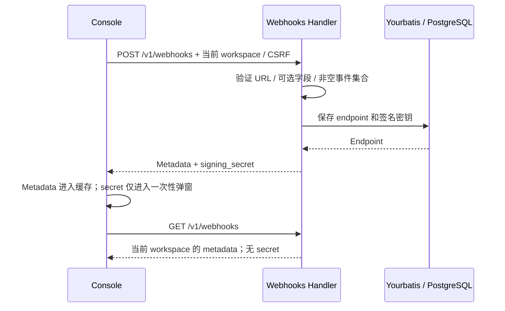
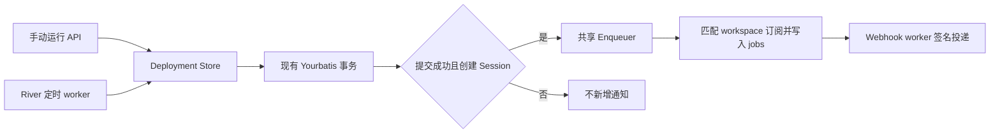
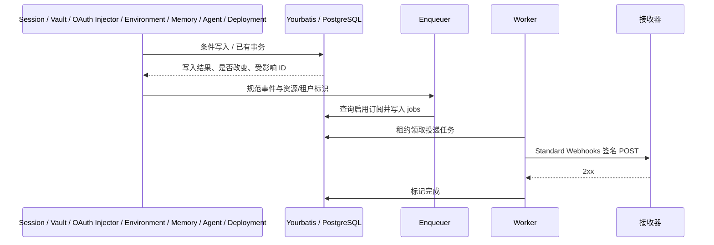
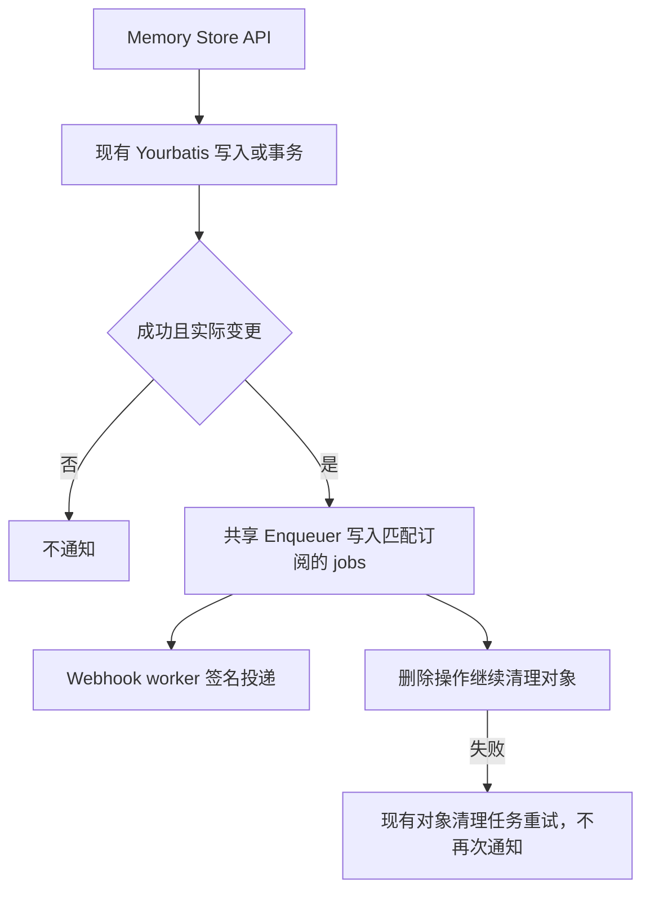
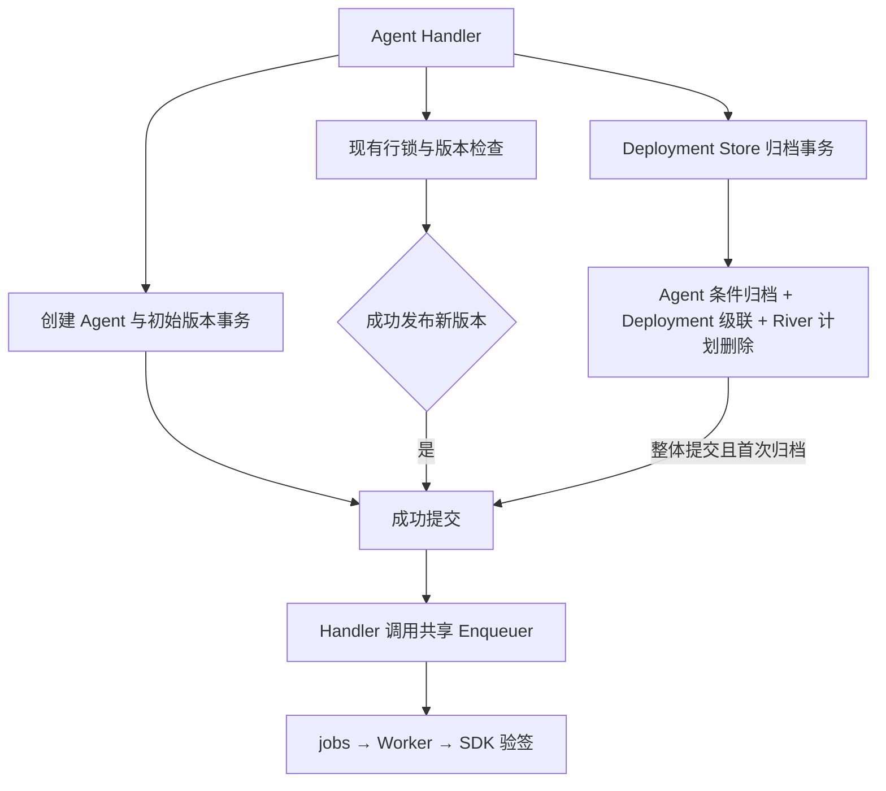
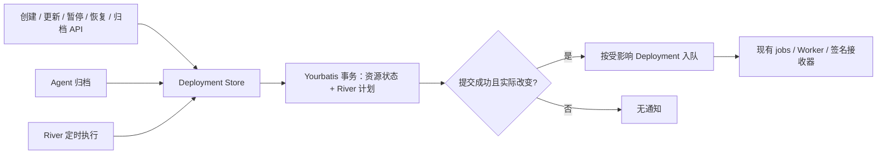
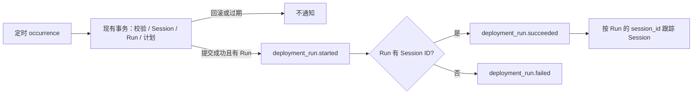

# Webhook 订阅管理与事件投递

## 本次范围

2026-09-21 分步实施：第一阶段订阅管理已提交为 `85ff33a`；第二阶段 17 项事件与 Deployment 创建 Session 通知已提交为 `18a7cef`；Environment 四项事件已提交为 `842a099`；Memory Store 三项事件已提交为 `0109df2`；Agent 三项事件已提交为 `63aa796`；Deployment 五项事件已提交为 `2fb9a78`；Deployment Run 三项已提交为 `53be80c`，共 35 项有实际触发入口的事件。2026-09-22 按确认范围，另开放 `agent.deleted` 和 `deployment.deleted` 作为预留订阅，共 37 个可选类型；预留项当前不会产生通知。2026-09-23 再预留 `session.budget_reached`，当前共 38 项（35 项已接入、3 项预留）。其他资源事件和投递策略差异留待后续。旧占位 Webhook 数据没有上线，不增加兼容迁移或旧事件别名支持。

保留现有 `internal/webhooks` resource、Yourbatis Mapper、endpoint/job 表、Enqueuer、Worker 和鉴权路径。前端继续使用现有 Console 路由、TanStack Query、shadcn Dialog/Sheet；只拆出事件目录、反馈、复用的事件选择和表单模块，不引入新的事件总线、服务或数据库表。

## Claude 合同与证据

截至 2026-09-20：

- [Claude Webhooks API Reference](https://platform.claude.com/docs/en/api/beta/webhooks)主要给出事件模型及 SDK 验签能力，没有找到完整的订阅管理请求/响应 schema。
- [Claude Platform on AWS 的 IAM 映射](https://platform.claude.com/docs/en/api/claude-platform-on-aws-iam-actions)明确列出下述管理路由，并明确 GET 不返回签名密钥。这是 AWS 平台的公开路由证据，不证明所有直连 API 账号的可用性或字段级合同。
- [官方订阅指南](https://platform.claude.com/docs/en/managed-agents/webhooks)是事件通知与投递合同来源；[前端调研](fe/webhook-subscription-reference-study.md)记录了已登录 Chrome 中观察到的 Console 行为及未验证项。

| 操作 | 官方 IAM 路由；本项目沿用相同路径 |
| --- | --- |
| 创建 / 列表 | `POST /v1/webhooks` / `GET /v1/webhooks` |
| 获取 / 更新 / 删除 | `GET` / `POST` / `DELETE /v1/webhooks/{id}` |
| 重置密钥 | `POST /v1/webhooks/{id}/regenerate_signing_secret` |

`enabled_events`、`status`、分页结构、错误文案和 `webhooks-2026-03-01` beta header 继续保留本项目现有合同；未找到完整官方 schema，不将这些细节标为已验证的 Claude 字段级兼容。更新仍用 POST。

## 订阅管理行为

- URL 必填。前端即时校验 HTTPS URL，后端继续权威校验 HTTPS、443、凭据和私有 IP 字面值等规则；本地 `allow_insecure` 是部署级开关，不由普通前端放宽。
- Name 和 Description 可省略或为空字符串，显式 `null` 和非字符串被拒绝；不再把空名称自动改为域名。沿用既有字节长度限制：名称 255，描述/URL 2048。
- 创建时零事件选择；至少选择一项才可提交。创建与编辑共用事件目录、全局全选、分组半选/计数和事件协议名复制。
- API 白名单和前端目录统一为 12 组 38 项规范事件（35 项已接入、3 项预留）。移除 `session.error`、`session.thread_status_*` 的对外订阅，以及前端未知事件和 `session.record_*` 兼容分支；内部会话流名称保持不变，在 Webhook 边界转换。
- `session.budget_reached`、`agent.deleted`、`deployment.deleted` 按确认范围仅预留订阅，不添加产生入口或模拟投递。当前 35 项覆盖真实 API 或现有 worker 事件入口到本地接收器的验签测试，不代表真实模型已自动产生全部事件。
- 列表增加 ID 搜索、名称/状态/创建时间排序和空列表创建入口。搜索/排序作用于现有 API 返回集合，不增加未经官方确认的查询参数。
- 编辑复用现有更新 API，增加 URL 输入，支持清空可选字段；详情显示描述和禁用原因。
- 创建和重置后的 secret 仅放在一次性弹窗状态，不放入列表缓存或 mutation 返回数据。关闭/切换 workspace 后清除展示状态；复制失败时提示重试，不能显示虚假的复制成功。
- 编辑、启停、重置和删除失败时保留操作界面与服务端错误。切换 workspace 后，不延续前一 workspace 的详情、草稿或密钥弹窗。

## Deployment 创建 Session 的通知

手动运行与定时运行共用 `Deployment Store` 中的创建通知。启动层构造共享 Enqueuer，在 River worker 启动前注入 Store，并经 `ServerDeps` 供 HTTP 资源复用。通知按已创建 Session 的 workspace 查询租户标识，不依赖 HTTP Principal。

- 数据库订阅创建阶段发送 `session.status_idled`。`session.created`、`session.pending` 仅保留在既有全局配置路径，不加入 Console 目录。
- 主线程创建不发送子线程通知；初始 `user.define_outcome` 不发送评估结束通知，后者由 `span.outcome_evaluation_end` 事件入口触发。
- 失败运行、事务回滚、过期任务、归档分支，以及同一定时执行时刻的重复处理不新增通知。两次独立手动运行各自创建 Session、分别通知。
- 通知准备和入队失败只记录错误，不将已提交的运行报告为失败；业务提交和入队尚未原子化。不增加 `deployment.*` 或 `deployment_run.*` 订阅。

## 保留的投递边界

沿用现有按事件发生时的 workspace 订阅选择、持久化 delivery jobs 和 Standard Webhooks 签名。此轮不改投递重试和自动禁用阈值，不引入事务 outbox，不增加测试通知、投递日志 UI、手动/批量重放或多密钥宽限期。

`webhook.worker_enabled` 默认 `true`，显式 `false` 仍关闭当前实例 worker；数据库订阅无需全局 endpoint/key。复用主进程中的后台协程和 PostgreSQL jobs，不按订阅数动态启动进程。没有匹配的启用订阅时不创建 endpoint 投递任务。既有全局配置投递路径保留，只有 workspace 没有订阅记录时才可能使用。

尚待后续解决的投递差异包括 DNS 解析后的公网地址约束、Claude 的重试节奏与基于时间的持续失败禁用，以及资源写入和 webhook 入队的事务可靠性；当前 URL 的字面值检查不能表述为完整 SSRF 防护。

## 验证

- 前端：空事件/非法 URL 禁止提交，分组/全局半选，搜索与排序，创建失败后保留表单，编辑 URL/清空名称，规范事件选择，一次性密钥不进入共享缓存，workspace 切换清理。
- HTTP + PostgreSQL：拒绝非法可选字段与 URL；省略/清空名称；完整 CRUD；列表/查询/更新不泄露 secret；其他 workspace 不能读取或修改 endpoint。
- 沿用真实本地接收器的投递测试，使用官方 Go SDK `Unwrap` 检验签名；与真实 Claude Console 管理 API 的对打验证分开报告。
- 按仓库要求执行格式、构建、测试、lint、重复代码、复杂度和 dead-code 检查；浏览器验证前重启前端。不得把定向通过等同于全部检查通过。

## 第一阶段验证记录（2026-09-20）

- 提交前已在 `ee05a25` 基线上重新运行 Go 全量测试、前端组件测试/构建和质量门禁。以下 Chrome 记录来自第一阶段交互检查，不属于这次命令复跑。
- `CONFIG_FILE=/tmp/oma-webhooks-test-config.yaml just test`：通过；配置连接独立 PostgreSQL、Redis、NATS 与对象存储，不使用开发数据库。
- `go test ./internal/webhooks ./tests -run TestWebhook -count=1`：通过，包含 HTTP 管理、跨 workspace 拒绝访问，以及本地接收器 + 官方 Go SDK 验签。测试显式启用 worker；不代表当前开发服务已开启投递。
- `bun test src/features/settings/WorkspaceWebhooksPage.test.tsx`：14 项通过，包含可选字段、URL、分组/全选、编辑、筛选/排序、失败保留、密钥复制失败/缓存隔离和 workspace 切换。
- `just lint`、`just dead-code`、`just complexity`、`just duplicates`、`just web-format-check`、`bun run lint:naming`、`bun run build`：通过。构建仍提示现有大 chunk 与 SDK Node 模块浏览器 externalization 警告。
- 前端全量 `bun test`：未通过验收。两次运行均在既有 `ConsoleLayout` 测试附近以退出码 133 中断；单独运行该未修改文件也能复现。未为绕过此问题修改或跳过共享测试。
- Chrome：隔离服务登录、真实空列表、ID 搜索框、排序表头与两个创建入口已可见。工具检测到用户正在切换 Chrome 页面，后续弹窗操作未完成浏览器验收；不将组件测试代替完整浏览器验收。

手动验收顺序：进入 workspace 的 Webhooks → 创建（URL、可选名称、零选到至少一项事件）→ 保存一次性密钥并关闭 → 列表按 ID 搜索 → 详情编辑 URL/清空名称 → 禁用/启用 → 重置密钥 → 删除。无权限、非法 URL 或提交失败时，检查错误提示与输入保留。真实投递另用自己控制的接收器、确认 worker 未被显式关闭，并使用 SDK 验签；不要把订阅 CRUD 成功视为事件全集或投递策略兼容完成。

## 当前 38 项事件验收矩阵（35 项已接入、3 项预留）

资源写入与 webhook 入队仍是两个步骤；崩溃或入队错误可能丢失通知，本轮不宣称事务级可靠投递。重试复用事件 ID，接收方需要去重。

| 事件 | 真实触发或已有入口 |
| --- | --- |
| `session.status_run_started` | worker `session.status_running` 等现有状态事件 |
| `session.status_rescheduled` | worker 重调度事件 |
| `session.status_idled` | 会话初始 idle / worker `session.status_idle` |
| `session.status_terminated` | worker 终止事件或首次成功归档会话 |
| `session.thread_created` | worker 创建子线程事件；不包括主线程 |
| `session.thread_idled` | worker 子线程 idle 事件；不包括主线程 |
| `session.thread_terminated` | worker 子线程终止或首次成功归档子线程 |
| `session.outcome_evaluation_ended` | worker `span.outcome_evaluation_end`；定义 outcome 不触发 |
| `session.updated` | Session API 实际改变 title、metadata 或 agent snapshot |
| `session.deleted` | Session API 删除成功 |
| `vault.created` | Vault API 创建成功 |
| `vault.archived` | Vault API 首次归档成功 |
| `vault.deleted` | Vault API 删除成功 |
| `vault_credential.created` | Credential API 创建成功 |
| `vault_credential.archived` | 首次直接归档或 Vault 级联实际归档 |
| `vault_credential.deleted` | 直接删除或 Vault 级联删除 |
| `vault_credential.refresh_failed` | OAuth Injector 确认不可恢复的刷新失败 |
| `environment.created` | Environment API 创建环境记录成功，不等待 sandbox 启动 |
| `environment.updated` | Environment API 实际改变持久化属性；JSONB 语义相同或仅时间戳变化不触发 |
| `environment.archived` | 首次归档成功；重复及并发归档只通知一次 |
| `environment.deleted` | 删除事务提交成功；删除已归档环境也通知，不补发 archived |
| `memory_store.created` | Memory Store API 创建记录成功 |
| `memory_store.archived` | 首次归档成功；重复及并发归档只通知一次 |
| `memory_store.deleted` | Store、Memory、Version 删除事务提交成功，在对象清理之前通知 |
| `agent.created` | Agent 与初始版本事务提交成功，只发 created |
| `agent.updated` | 更新事务成功发布新版本，无变化更新不通知 |
| `agent.archived` | 首次归档及 Deployment、River 计划级联事务整体提交成功 |
| `deployment.created` | Deployment 及其 River 计划创建事务成功，包含无计划 Deployment |
| `deployment.updated` | 实际属性或 schedule 改变，相关计划写入事务成功 |
| `deployment.paused` | 手动或定时不可恢复错误使 active 变为 paused，计划删除提交成功 |
| `deployment.unpaused` | paused 变为 active，计划恢复提交成功 |
| `deployment.archived` | 直接归档、Agent 级联或定时归档分支首次实际归档成功 |
| `deployment_run.started` | 定时 occurrence 的 Run 事务成功，表示该 Run 的开始 |
| `deployment_run.succeeded` | 同一 Run 事务成功创建 Session，不等待 Session 执行完成 |
| `deployment_run.failed` | 同一 Run 事务保存业务失败且没有创建 Session |
| `session.budget_reached` | 预留：可创建、编辑、查询订阅，当前没有预算控制或事件产生入口；idle 不触发 |
| `agent.deleted` | 预留：可创建、编辑、查询订阅，当前没有事件产生入口；归档不触发 |
| `deployment.deleted` | 预留：可创建、编辑、查询订阅，当前没有事件产生入口；直接/级联归档不触发 |

Session 条件更新在 SQL 写入处比较属性，JSON 使用 JSONB 语义比较并保留服务器内部 metadata。重复归档通过写入条件只认领一次改变；DB API 返回是否改变。Vault 级联更新/删除在原有 Yourbatis 事务内通过 `RETURNING external_id` 获取受影响凭据，无单页 1,000 条截断，也不读取凭据密文。归档仅返回此次由 active 变为 archived 的凭据。

刷新失败通知只覆盖需要刷新但缺失 refresh token，或 token endpoint 的不可恢复 4xx（排除 408、429）。原有凭据锁、一次 exchange 和 CAS 重试保持；失败后重读并成功复用其他刷新结果时不通知，重读/解密/持久化故障也不归类为 OAuth 拒绝。网络错误、408/429/5xx、取消不通知；每次实际失败的刷新流程最多产生一个事件，不新增持久化去重状态。通知仅包含 credential、vault 和租户标识。

## Environment 事件实现与验收

Environment Handler 通过 `WithWebhooks` 复用组装层共享 Enqueuer，只在真实资源写入成功后通知。事件仅携带类型、环境 external ID 与租户标识，不携带环境配置。work 元数据/心跳、sandbox 状态不产生资源事件；GET/list 也不通知。生产 SDK fixture 绕过已随 upstream 同步移除，所有身份都遵循普通持久化与通知规则。

`UpdateEnvironment`、`ArchiveEnvironment` 返回资源、`changed` 和 error。Update Mapper 对 name、description、config、metadata、nullable scope 和 resolved_template 使用 `IS DISTINCT FROM`，JSONB 按语义比较，排除 updated_at；未发生变化时保持时间戳。Archive 只更新 `archived_at IS NULL` 的记录；未命中时重新读取同 workspace 的资源，区分重复操作和 not found。保留 scope 的 NULL 存储/响应默认值、配置派生和已归档环境的既有更新行为。

Delete 保留行锁、活跃 work 检查和原有 Yourbatis 事务；失败或回滚不通知。入队失败不回滚已提交业务。全局兼容配置的默认事件目录与回退规则不变，新事件主要通过数据库订阅验收；本轮没有新表、migration 或投递策略变化。

- `tests/environment_webhooks_test.go` 覆盖非法/重名/不存在/跨 workspace、数据库写入故障注入、活跃 work 阻止删除、空更新/JSON 键顺序/NULL/派生模板、并发更新归档、原 SDK 身份的不存在资源/work/sandbox 边界、订阅过滤和四事件实际投递验签。
- 与 `tests/webhook_events_test.go` 的 17 项矩阵共同覆盖上表前 21 项，Memory Store 三项由 `tests/memory_webhooks_test.go` 补齐；`tests/deployment_webhooks_test.go` 回归手动和实际 River worker 入口。不会将这类测试表述为所有事件都由真实模型自动产生。
- `internal/webhooks/event_catalog_test.go` 比较后端白名单与前端事件目录，并校验 38 项；Mapper 测试检查 SQL、参数顺序与 sensitive 标记。
- 人工验收：创建订阅并只选择 Environment 四项 → 创建环境 → 修改属性 → 重复相同更新 → 归档及重复归档 → 删除 → 检查四类通知的数量、环境 ID、workspace 和 SDK 签名。首次操作正常通知，重复操作不新增；删除后可直接依事件确认结果，不依赖再次 GET。

### Environment 初次验证记录（2026-09-21，合并 upstream 前）

以下为基于 `18a7cef` 的历史验证，不作为合并 upstream 后的提交验收依据。使用独立 PostgreSQL、Redis、NATS、MinIO 和进程内 HTTP 接收器；Environment 测试不调用付费 sandbox。

- `just test` 全量通过（51 个有测试的 Go package）；覆盖上表 21 项事件、Deployment 两个入口、OAuth 分类、级联完整性，以及 worker 默认启用/显式关闭。Environment 的四项通知由真实 API 写入、持久化 jobs、现有 worker 投递，再经官方 Go SDK `Unwrap` 验签和资源/租户标识校验。
- Environment 定向测试覆盖真实 PostgreSQL JSONB、NULL、并发条件写入与事务失败；Mapper 参数/SQL 和前后端目录一致性测试通过。
- `WorkspaceWebhooksPage.test.tsx`：14 项测试、148 次断言通过，覆盖 Environment 分组、21 项计数、半选、创建保存与编辑回显。
- 源码生成（含 `go generate ./...`）、lint、dead-code、duplicates、complexity、large-files、`just hooks-run`、前端格式、命名和构建检查通过。前端构建仍有既有 bundle 体积提示。
- 前端全量 `bun test` 和单独运行 `ConsoleLayout.test.tsx` 均复现退出码 133，输出停在语言子菜单用例附近；不能把定向功能测试通过表述为前端全量通过。本次未跳过或降低门禁。
- 已复核通知调用位置、事务/幂等边界、workspace 隔离和查询成本。成功变更直接使用 `RETURNING`；仅条件写入未命中时增加一次同 workspace 查询，没有引入全表遍历或配置 payload。
- 本轮独立测试容器与 HTTP 接收器已清理；代码保留未暂存、未提交。自动化验收使用本地 HTTP 接收器，真实浏览器人工操作和公网接收器验收仍待执行。投递重试节奏、自动禁用、DNS 校验，以及业务写入和入队的事务原子性仍保留既有差异。

### Environment 提交前复核（2026-09-21，基于 `d2ba52f`）

`d2ba52f` 合并 upstream/main `ada53ff`，保留 transcript 归档和 Agent 工具校验。共享 Enqueuer、Deployment Store 注入和 River 启动顺序经复核保持正确；恢复后的 Environment tracked diff 与保存的补丁完全一致，三个新增文件也与 stash 逐字节一致。

- 使用独立测试依赖重新运行 `just test`，52 个有测试的 Go package 全部通过，包括 21 项事件、Deployment 手动/定时入口、OAuth 分类、级联和 worker 开关；不沿用合并前记录。
- 首次 Go 全量验证发现 upstream 已将未配置的 AskUserQuestion 改为默认拒绝，旧用户回答测试因此稳定失败。仅将该用例的 Agent 配置显式设为 `always_ask`，保留生产权限策略；修复后该用例连续 10 次通过，全量回归通过。
- Webhook 页面 14 项/148 次断言通过；upstream 影响的 Agent 纯逻辑测试 51 项/243 次断言通过；四项受影响页面用例定向验证通过（229 次断言）。页面测试适配 Bash 行级权限断言、区分 2 与 22 的计数，并使 Directory fixture 的 URL 与 Agent 配置匹配；未修改 Agent 生产代码。
- 源码生成（含 `go generate ./...`）、lint、dead-code、duplicates、complexity、large-files、`just hooks-run`、前端格式、命名和构建重新通过，构建保留既有 bundle 体积提示。
- 前端全量及单独 `ConsoleLayout` 均复现退出码 133；扩展验证时，Agent 大型页面套件在组合运行和单独运行中也触发 Bun 1.3.14 崩溃。定向测试通过不代表完整套件通过；没有跳过 hook 或降低门禁。
- Review 覆盖写入后通知、重复/并发操作、租户隔离、删除事务及通知 payload。生产变更仍限于 Environment 四事件；Memory Store 仅记录下述下一阶段计划。
- 本轮独立测试容器与 HTTP 接收器均已清理，未使用开发数据库或付费 sandbox；不推送分支。真实浏览器与公网接收器验收仍待人工执行。

## Memory Store 事件实现与验收

本阶段基于 `842a099`，数据库订阅与 Console 目录从 21 项扩至 24 项。继续使用现有 Handler、Yourbatis、Enqueuer、jobs 和 Worker；不增加 schema、事件总线或投递策略。

| 事件 | 通知时机 |
| --- | --- |
| `memory_store.created` | Store 记录创建成功 |
| `memory_store.archived` | 首次成功归档 |
| `memory_store.deleted` | Store、Memory、Version 的现有删除事务提交成功 |

### 实现约定

- Memory Handler 通过 `WithWebhooks` 接收 API 组装层共享 Enqueuer，只在成功的资源变更后通知。`data` 仅含 `type`、Store external ID、`organization_id`、`workspace_id`，不携带内容、metadata 或对象存储信息。
- `ArchiveMemoryStore` 返回 `(MemoryStore, changed, error)`；Mapper 增加 `archived_at IS NULL`，未命中时按同 workspace 重新读取，区分重复归档与 not found。重复及并发归档仅首次通知，不刷新时间戳。
- Create、Delete 的 DB 公共签名保持不变；删除保留行锁和整个 Yourbatis 级联事务，不为通知增加子资源读取。通知在事务成功后、对象存储清理循环前入队；对象删除失败仍走现有清理任务，不抑制或重复 Store 删除通知。事务失败或重复删除不通知。
- Store 属性更新、单条 Memory 创建/更新/删除、版本写入及对象清理重试不产生上述事件；删除不补发 archived。仓库没有 Store 克隆入口，本阶段不增加克隆能力或 `memory_store.updated`。
- 前后端同时增加 Memory Store 分组，复用现有全选、半选、计数、创建保存和编辑回显；目录一致性测试改为 24 项。同步中英文说明与验收矩阵，保留全局兼容配置及业务提交与入队的非原子边界。

### 验收与交付

`tests/memory_webhooks_test.go` 使用真实 PostgreSQL 的条件写入、行锁和故障触发器；对象存储用测试替身，接收器用本地 HTTP 服务。删除故障在 versions 删除之后注入，检查 Store、Memory、Version 全部回滚。对象清理探针检查每次清理前删除事件已入队，投递测试严格检查 data 只有四个标识字段。

- 先测非法输入、不存在、跨 workspace、数据库写入失败及删除中途回滚；确认无通知且 Store、Memory、Version 没有部分删除。
- 测试重复及并发归档/删除，active 与 archived Store 的删除，多条 Memory 与历史版本的级联。一次成功删除仅发一条 Store 事件，对象清理失败及重试不重复通知。
- 验证 Store 属性更新和 Memory/Version 操作不误报；禁用、未订阅及其他 workspace 不投递，后续启用不补发。
- 使用独立数据库、对象存储测试替身及本地 HTTP 接收器，经 API 创建订阅与资源，验证 jobs → Worker → 官方 Go SDK 验签，并核对类型、资源/租户标识与 payload 边界。
- 补充 Mapper SQL/绑定测试、真实 PostgreSQL 并发测试、前端分组和 24 项计数测试；回归原有 21 项、Deployment 两入口、OAuth、级联和 worker 开关。源码生成后执行全量 Go 测试、lint、dead-code、duplicates、complexity、large-files、hooks，以及前端格式、命名、受影响测试和构建；单独复核前端全量退出码 133。
- review 事务、幂等、租户隔离及查询成本，修复后复跑受影响检查，清理测试服务。实现代码保留待审核，不自动提交或推送。
- 人工顺序：创建订阅 → 创建 Store → 更新属性及写入 Memory，确认无额外通知 → 归档及重复归档 → 删除 → 核对三类事件与签名。

### Memory Store 当前验证记录（2026-09-21，基于 `842a099`）

- 在重建的专用测试依赖上执行 `CONFIG_FILE=/tmp/oma-webhooks-test-config.yaml just test` 全量通过（52 个有测试的 Go package），回归现有 21 项事件、Deployment 两入口、OAuth 分类、级联完整性和 worker 开关。首轮全量及随后单测曾在既有 `TestSandboxLifecycleDurableScheduleDispatchesReclaim` 的 15 秒等待处失败；干净数据库的完整复跑通过，保留该结果差异，不将其认定为已修复的调度问题。
- 源码生成及 Memory Store 定向测试通过：7 个 API/真实 PostgreSQL 场景覆盖失败、事务回滚、并发、订阅过滤、通知边界与清理失败重试；Mapper SQL/参数和前后端 24 项目录一致性检查通过。
- 三事件完整链路通过：API 创建订阅与 Store → jobs → Worker → 本地接收器 → 官方 Go SDK `Unwrap` 验签，同时检查类型、Store ID、租户标识及四字段 payload；删除后的验签不重新读取 Store。
- 前端 `WorkspaceWebhooksPage.test.tsx` 16 项测试、171 次断言通过，同时覆盖 Environment 与 Memory Store 分组的创建、编辑回显、全选和半选。前端格式、命名和构建通过；构建保留既有 chunk 大小及 Node 模块 externalization 警告。
- 前端完整 `bun test`、单独 `ConsoleLayout.test.tsx`、单独大型 `ManagedAgentsPage.test.tsx` 均以退出码 133 中断；定向测试通过不代表全量前端验收通过，没有跳过失败门禁。
- `just lint`、`just dead-code`、`just duplicates`、`just complexity`、`just large-files`、`just hooks-run` 全部通过。
- Review 检查了通知与事务/清理的顺序、条件归档幂等、workspace 隔离、标识 payload、查询成本和目录一致性；未增加子资源通知查询、表或投递策略。完整浏览器人工流程仍按上面的人工顺序验收。
- 验收后已清理 `oma-webhooks-test` 全部专用容器和网络，`docker compose ps --all` 为空；API/接收器由测试关闭，未启动常驻开发服务。该轮实现验收时变更保持未暂存、未提交、未推送；后续提交以 Git 历史为准。

## Agent 三项事件实现与验收

2026-09-21 复核 [Claude Webhooks API Reference](https://platform.claude.com/docs/en/api/beta/webhooks) 与 [Anthropic 官方 Webhook 说明](https://github.com/anthropics/skills/blob/main/skills/claude-api/shared/managed-agents-webhooks.md)：官方 Agent 有 created / updated / archived / deleted 四项，updated 指新版本发布。2026-09-18 的已登录 Console 调研也记录这四项；本次未重新登录 Console 查看。

当前仓库和官方公开 Agent API/SDK 均没有删除入口；[官方 AWS IAM 文档](https://platform.claude.com/docs/en/api/claude-platform-on-aws-iam-actions#agents)明确只支持归档、不支持硬删除。`agent.deleted` 是已定义但公开触发入口未确认的事件，当前接受并保存预留订阅，但没有事件产生入口；不映射为归档，也不将新增删除能力列为必补项。本阶段基于 `0109df2` 接入已有真实操作对应的三项，目录从 24 扩至 27 项；未增加 Deployment / Deployment Run 事件。

| 事件 | 本项目触发条件 |
| --- | --- |
| `agent.created` | Agent 与初始版本创建事务提交成功，仅发 created |
| `agent.updated` | UpdateAgent 成功提交新版本；无新版本不发 |
| `agent.archived` | Agent 首次归档且现有 Deployment 级联、River schedule 删除事务整体提交成功 |

### 实现边界

- Agent Handler 通过 `WithWebhooks` 接收 API 组装层共享 Enqueuer；沿用资源通知模式，data 只有 type、Agent external ID、organization_id、workspace_id。不得携带配置、system、工具或 metadata。
- Create 与 Update 的 DB 签名和事务保持不变。Update 复用现有 `sameAgentConfig`、行锁与 `expectedVersion` 检查；只有成功返回的 CurrentVersion 大于本次 expectedVersion 才通知。不得以 Handler 写前读取的版本判断，也不重写字段比较、JSON 语义或版本增长规则。
- `ArchiveAgentTx` 和 `Deployment Store.ArchiveAgent` 增加 changed 返回值。Archive Mapper 增加 `archived_at IS NULL`，未命中时在同一 Yourbatis transaction executor 中按 workspace 重读，区分已归档与不存在；无变化不刷新 Agent 时间戳。
- 保留整个 Agent / Deployment / River schedule 原子归档边界和既有级联行为，不因 Agent 已归档就擅自跳过下游处理。Handler 仅在 Store 返回整体成功且 Agent changed 时通知；任何后续步骤失败回滚都不通知。本阶段不增加 deployment.archived。
- GET/list/version 查询不通知；原 SDK 测试身份不再有模拟成功响应，遵循普通鉴权、资源查询和持久化规则；版本冲突、更新已归档 Agent、非法工具/模型配置、数据库故障不通知。保持 upstream 的 Agent 校验和现有错误、路由、响应不变。
- 前后端新增 Agent 分组（3 项），目录一致性测试改为 27。同步中英文说明、设计和验收矩阵。保留全局兼容配置、现有重试，以及业务提交与通知入队的非原子边界，不增加表或 migration。

Store 仅在整体事务成功后返回有效 changed；归档未命中时使用同一个 transaction Mapper 重读，不从事务外数据库连接读取。通知失败不改变已提交的业务结果，业务提交与通知入队仍非原子化。

### 验证与交付

1. 先覆盖非法输入、不存在、跨 workspace、版本冲突、已归档更新、原 SDK 身份访问不存在资源；均无新增通知。Create/Update 在版本插入处注入失败，断言 Agent 和版本整体回滚；Archive 在 Deployment 级联或 River schedule 删除处注入失败，断言 Agent、Deployment 和计划均保持。
2. 覆盖空更新、相同值、JSON 键顺序、现有可更新字段的真实变化；同一版本的两个并发有效更新仅一个成功发布并通知，失败请求不得重试为额外事件。重复/并发归档仅首次通知，并保留时间戳与级联合同。
3. 覆盖无 Deployment、有计划及无计划 Deployment 的归档；禁用、未订阅、其他 workspace 过滤及启用不补发。无效事务和原 SDK 身份路径不仅检查响应，还检查版本数、jobs 数与资源状态。
4. 使用独立 PostgreSQL 与本地接收器，经 API 创建订阅 → Agent 创建/发布版本/归档 → jobs → Worker → 官方 Go SDK 验签；核对三种类型、资源/租户标识与四字段 payload。补 Mapper SQL/参数绑定测试及前端 27 项全选、半选、保存和编辑回显测试。
5. 回归原 24 项事件、Deployment 两入口、OAuth、级联、worker 开关；执行源码生成、just test / lint / dead-code / duplicates / complexity / large-files / hooks-run、前端格式/命名/定向测试/构建。单独报告前端全量与大型页面的 Bun 133，记录调度测试在干净数据库与复用数据库上的差异，不降门禁。
6. Review 版本发布、归档事务与并发、租户范围及查询成本；修复后复跑受影响检查，清理测试依赖。本阶段实现后保留待审核，不自动提交或推送。

人工验收：创建三事件订阅 → 创建 Agent → 发布新版本 → 重复同值更新（不通知）→ 重复旧版本请求（冲突且不通知）→ 归档及重复归档 → 核对通知、签名与关联 Deployment 计划状态。

### Agent 当前验证记录（2026-09-21，基于 `0109df2`）

- `CONFIG_FILE=/tmp/oma-webhooks-test-config.yaml just test` 全量通过：52 个有测试的 Go package。覆盖原 24 项与 Agent 三项事件、Deployment 手动/定时入口、OAuth 分类、级联完整性、worker 默认启用/显式关闭；本轮调度测试没有超时，未因失败重建数据库或跳过测试。
- Agent 的 8 项定向测试通过；包括版本写入故障、Deployment 与 River 两处归档回滚、同版本并发更新、并发归档、已归档 Agent 仍执行既有级联、所有既有可更新字段、租户/订阅过滤和 SDK fixture 不误报。最后一项级联边界测试在 review 后补充，并复跑全部 Agent 定向测试通过。
- 创建/发布版本/归档通过实际 API 写入、持久化 jobs、Worker、本地接收器与官方 Go SDK `Unwrap` 验签，检查类型、Agent ID、租户标识及仅四字段 payload。有计划和无计划 Deployment 归档均有覆盖；这不是 Cron 到点触发验收。
- Mapper SQL/绑定与前后端 27 项目录一致性通过；Memory Store 原有 7 项测试回归通过。仅抽取原有故障注入与 payload 校验辅助函数供 Agent/Memory 共用，没有改动 Memory 生产行为。
- Webhook 页面 18 项测试、194 次断言通过；Environment、Memory Store、Agent 分组均覆盖。前端格式、命名、构建通过，仍保留既有大 chunk 与 Node 模块 externalization 构建警告。
- 全量 `bun test`、单独 `ConsoleLayout.test.tsx`、单独 `ManagedAgentsPage.test.tsx` 均复现退出码 133，不能表述为全量前端测试通过。完整浏览器人工流程仍待按上述顺序执行。
- Review 核查了版本判断、归档事务 executor、重复操作与级联、租户范围、最小 payload 和查询成本。Create/Update 事务和比较规则、公开 API、全局兼容配置均未改变；业务提交与通知入队仍非原子化。
- `just lint`、`just dead-code`、`just duplicates`、`just complexity`、`just large-files` 均通过。首次 hooks-run 的 dead-code 分析为 0 issues，但执行期间补充验证文档被 pre-commit 检测为文件变化，停止编辑后 `just hooks-run` 完整复跑通过，三个新增 Go 文件另行执行匹配 hooks 也通过；没有跳过检查。
- 独立测试容器及网络已清理，`docker compose ps --all` 为空。API/接收器由测试关闭，未使用开发数据库或付费 sandbox。代码未暂存、未提交、未推送。

## 第二阶段验证与人工 review

- `tests/webhook_events_test.go` 的矩阵通过真实资源操作/worker 入口覆盖全部 17 项，再由接收器接收并使用官方 Go SDK `Unwrap` 验签；OAuth 场景走现有 Injector + 独立 token endpoint，不依赖外部供应商。
- 反例覆盖非法更新、无变化更新、重复 ingress、重复归档、主线程不发子线程事件、定义 outcome 不报完成、禁用/未订阅/其他 workspace、不补发历史事件。真实 PostgreSQL 验证 1,001 条已归档凭据删除时生成完整通知。
- `internal/vaults/oauth_webhooks_test.go` 验证永久拒绝/无刷新令牌、408/429/5xx、数据库失败、并发成功复用和 CAS 耗尽。`internal/config/webhook_config_test.go` 与 worker 启动测试验证默认开启及显式关闭。
- `internal/db/webhook_mutation_mapper_test.go` 覆盖变更 SQL、UUID 范围和参数绑定；生成文件继续忽略，不提交 schema migration，因为没有表结构变化。

2026-09-20 第二阶段历史验证记录（合并 upstream 至 `dacfa20` 前，不作为下述提交验收依据）：

- `go generate ./...`、`CONFIG_FILE=/tmp/oma-webhooks-test-config.yaml just test` 通过，最终全量 Go 测试包含上述事件矩阵及并发归档场景。
- `just lint`、`just dead-code`、`just duplicates`、`just complexity`、`just web-format-check`、`bun run lint:naming`、`bun run build` 通过；相关前端测试 14 项通过、143 条断言。构建仍有既有大 chunk 和 Node 模块 externalization 警告。
- 前端全量 `bun test` 再次在未修改的 `ConsoleLayout` 测试附近以退出码 133 中断；不将相关组件测试通过表述为前端全量通过。
- Chrome 使用另一个独立数据库 `webhook_browser_test`，重启前端后完成登录、Webhooks 空列表、搜索框、排序表头与创建入口检查。进入弹窗时工具检测到用户切换 Chrome 页面，后续操作停止；完整弹窗流程仍待人工验收。
- 代码 review 核查了写入成功后通知、重复操作、主线程过滤、级联完整性、租户范围和 OAuth 错误分类。未引入新的表、事件总线或投递重试策略。
- 验收结束后已停止 18080 后端、4173 前端及 `oma-webhooks-test` 专用依赖容器；测试未使用开发数据库。

## 阶段性提交前复核（基于 `dacfa20`）

本次重新验证覆盖当前全部 Webhook 变更，不沿用上述合并 upstream 前的记录：

- 全量 `CONFIG_FILE=/tmp/oma-webhooks-test-config.yaml just test` 通过，包含 17 项事件验签矩阵、1,001 条凭据级联、OAuth 分类与并发复用、worker 默认开启/显式关闭。
- `tests/deployment_webhooks_test.go` 验证手动运行、实际 River worker 创建与重复 occurrence、主线程/初始 outcome 不误报、真实评估结束入口、跨 workspace 请求拒绝和订阅过滤；投递使用本地接收器与官方 Go SDK 验签。
- 手动运行的数据库触发器故障注入证明 Session 写入后 run 插入失败会整体回滚、不通知；重复 River occurrence 也证明未留下额外 Session。依赖失败与过期任务通过实际 River worker 验证，归档分支通过 Store occurrence 入口验证；不把直接调用 Store 表述为调度器端到端验收，也不把手动插入 River job 表述为 Cron 到点触发验收。
- `just lint`、`just dead-code`、`just duplicates`、`just complexity`、`just large-files`、`just web-format-check`、`bun run lint:naming`、`bun run build` 通过。Webhook 前端 14 项测试、143 条断言通过。
- 全量前端 `bun test` 再次因 SIGTRAP 中断；单独运行未修改的 `src/app/layout/ConsoleLayout.test.tsx` 复现退出码 133，最后完成项仍为语言子菜单测试。此问题未修复，前端全量测试不算通过；未降低门禁或跳过 hook。完整浏览器弹窗人工验收仍待完成。
- Review 覆盖写入结果、重复操作、启动注入顺序、scope、级联与 OAuth 分支；本轮不增加 Environment、Deployment 或 Deployment Run 订阅类型。
- `go generate ./...` 与 `just hooks-run` 全部通过，没有跳过检查。独立测试接收器与 River client 已关闭，`oma-webhooks-test` 的容器和网络已清理；本轮未启动常驻后端或前端服务。

独立测试环境中可单独复跑事件验收：先运行 `./scripts/generate-go.sh`，再运行 `CONFIG_FILE=/path/to/test-config.yaml go test ./internal/config ./internal/db ./internal/vaults ./tests -run 'Test(Webhook|OAuth.*Notification|OAuthSuccessful)' -count=1 -v`。接收器由测试启动并清理，无需真实供应商账号。配置必须指向专用测试数据库；测试会清理 Webhook 订阅和任务。

人工 review 建议顺序：

1. `internal/config/yaml_types.go`：默认启动与显式 false 的优先级；`internal/webhooks/handler.go`：38 项白名单。
2. `internal/sessions/service.go` 和 `webhook_bridge.go`：真实变更后发出、主/子线程过滤、outcome 完成映射；再看 Session Mapper 的条件更新。
3. `internal/db/vaults.go` 和两个 Vault Mapper：重复归档、并发写入与级联返回标识；`internal/vaults/handler.go` 仅在成功后通知。
4. `internal/vaults/oauth_refresh.go`：永久错误分类和并发兜底顺序；从 API 组装追踪到 Injector，确认仍使用原有 Enqueuer。
5. `internal/deployments/store.go` 与 `webhooks.go`：两条入口提交后通知，启动前依赖注入；`tests/deployment_webhooks_test.go` 覆盖实际 River worker 投递与事务回滚。
6. 运行事件矩阵，再按第一阶段顺序验收控制台。启动隔离后端使用 `CONFIG_FILE=/path/to/test-config.yaml go run .`（`127.0.0.1:18080`），前端使用 `PORT=4173 API_PORT=18080 just restart-web`；测试后停止这些进程。不要在常用数据库执行测试清理。

## Deployment 五项资源事件（2026-09-21）

所有资源通知集中在共享 `Deployment Store`，覆盖 HTTP、Agent 级联和 River worker，不依赖 HTTP Principal。每次提交成功后按受影响资源的 workspace 取得租户标识，payload 只有 `type`、Deployment external `id`、`organization_id`、`workspace_id`。

- Update 沿用原行锁，在锁内比较实际写入的执行配置、名称、nullable description 和 schedule；JSON 按已有 `sameJSON` 语义比较，时间戳、运行状态和 last_run_at 不计入属性变更。schedule 未提交时保持原有忽略规则。无变化不写行、不改时间戳、不入队。
- Pause 在行锁内识别状态转换；相同原因的重复暂停不写行。沿用已有从自动暂停改为手动暂停原因的能力，但仍处于 paused 时不再次发送 paused。Unpause 使用已有 resumed 标记，仅实际恢复通知；两者不额外发送 updated。
- Archive 使用 `archived_at IS NULL` 条件，未命中在同一事务按 workspace 重读；重复归档不刷新时间戳，但仍执行既有计划清理。Agent 级联通过事务原有 RETURNING 收集实际改变的 Deployment 标识，包含有计划与无计划资源，无分页截断；只在整体提交后逐个通知。
- 定时自动暂停/归档沿用 occurrence 的锁、状态/快照检查及唯一索引。过期/重复 occurrence、创建失败、计划写入/删除失败、任一步骤回滚均不通知。手动运行及普通定时运行仅更新 last_run_at，不发 deployment.updated。
- 官方 Webhook 类型包括 `deployment.deleted`，但[公开 Deployment API](https://platform.claude.com/docs/en/api/beta/deployments)和本仓库都没有删除入口；本阶段不新增删除 API，不把归档映射成删除，2026-09-22 按确认范围，与 `agent.deleted` 一起开放为可保存的预留订阅；两项均没有产生入口，当前不入队、不投递。

业务提交与通知入队仍非原子化；入队或租户查询失败仅记录日志，不把已提交操作改报失败。本阶段不改变 schema、公开路由、全局兼容默认事件及重试策略。

人工验收：创建五事件订阅 → 创建带/不带计划 Deployment → 修改名称与计划 → 重复同值更新 → 暂停及重复暂停 → 恢复及重复恢复 → 直接归档或归档根 Agent → 核对每个 Deployment 的事件、签名与计划状态。额外验证不可恢复的定时引用失败只产生一次 paused；同一 occurrence 重放不重复通知。

### Deployment 阶段验证记录

- 基于 `63aa796` 的本阶段变更，在独立测试服务执行 `CONFIG_FILE=/tmp/oma-webhooks-test-config.yaml just test`，52 个有测试的 Go package 通过；包含原 27 项、Deployment 五项、OAuth、Session 创建两入口、级联和 worker 开关。本轮没有调度超时，无需因失败重建数据库。
- Deployment 生命周期 8 项定向测试通过。覆盖资源/计划写入失败、Agent 级联失败、定时自动暂停计划删除回滚、JSON 同值和 nullable description、并发同值更新及暂停/恢复/归档、租户和订阅过滤；review 后补强真实其他 workspace 操作与禁用后启用不补发，并复跑通过。
- 五事件经 API / Store 操作 → jobs → Worker → 本地接收器 → 官方 Go SDK Unwrap 验签，核对 ID、租户与四字段 data。自动暂停通过实际 River worker 执行；定时归档/过期分支直接调用 occurrence 入口，不表述为完整 Cron 到点验收。
- Mapper 条件归档 SQL/参数和前后端 32 项目录一致性通过；前端定向 20 项、217 个断言通过，覆盖 Deployment 五项分组、半选、创建保存和编辑回显。
- 源码生成、lint、dead-code、duplicates、complexity、large-files、前端格式、命名、构建通过。构建仍有既有大 chunk 提示。
- Bun 全量与单独的 `src/app/layout/ConsoleLayout.test.tsx`、`src/features/managed-agents/ManagedAgentsPage.test.tsx` 均 SIGTRAP（shell 退出码 133，Python subprocess 返回 -5）；定向测试通过不代表完整前端通过。本阶段没有改动这两个页面，也没有跳过其测试。
- 仍有资源提交与入队的非原子窗口，以及目标重试/自动禁用/DNS 策略差异；不宣称投递策略完全对齐。
- `just hooks-run` 全部通过；没有跳过 hook。隔离测试容器和网络已清理，compose ps --all 为空；本阶段未启动常驻开发服务。

## Deployment Run 三项事件（2026-09-21）

仅定时运行通知，手动成功/失败运行不发送 `deployment_run.*`。共享 Store 使用 `ApplyScheduledOccurrenceTx` 返回的真实持久化 Run，事务整体成功后发送 started 与 succeeded/failed；两个事件的 data.id 均为该 Run external ID，data 只包含 type、id、organization_id、workspace_id。

现有模型用一个短事务同时保存 Run 与 Session 创建结果，没有独立的 running 行状态。因此 started 与最终结果在提交后连续入队，不能作为创建 Session 过程中的实时进度；不为通知拆分事务或增加 Run 状态/schema。started 表示成功落库的逻辑运行开始，succeeded 仅表示 Session 创建完成。接收端不能依赖到达顺序，也不能把 succeeded 当作 Session 中的模型任务完成。

- 数据库故障/提交失败、Run 插入或计划删除回滚均不通知，也不把基础设施错误误发为 failed。仅已落库的业务失败 Run 发 failed；没有对应 Session。
- occurrence 行锁、状态/快照校验和 `(deployment_uuid, scheduled_at)` 唯一索引继续防止并发或重放重复创建。重复任务不产生新的 Run 事件；归档、过期分支没有 Run，因此也没有 started。
- 不可恢复业务失败继续自动暂停，产生独立 deployment.paused；可恢复失败不暂停。手动与定时成功创建 Session 的原有 session.status_idled 保持。
- 订阅在发出时过滤；禁用/未订阅及其他 workspace 不接收，启用不补发。资源写入与通知入队的非原子窗口、重试和全局兼容配置保持原样。

人工验收：订阅 Run 三项 → 设置定时 Deployment → 等待一次运行，核对 started/succeeded 的相同 Run ID 与 Session ID → 制造失效环境引用 → 下一次运行核对 started/failed 和自动暂停 → 重复投递同一 occurrence（不新增通知）→ 手动运行（不产生 Run 事件）。测试中的实际 River worker 执行与直接 occurrence 调用分别记录，不把直接入口测试称为 Cron 到点验收。

### Deployment Run 阶段验证记录

- 基于 `2fb9a78`，重建专用测试依赖后执行 `CONFIG_FILE=/tmp/oma-webhooks-test-config.yaml just test`：52 个有测试的 Go package 全部通过，覆盖已有 32 项与 Run 三项。本轮未出现调度超时。
- Run 的 5 项定向测试通过：Run 插入/last_run_at/计划删除三处故障、回滚后换 Run ID 重试、手动成功/失败不通知、过期/归档无 Run、真实 River worker 成功/不可恢复失败、同一 occurrence 并发和重放、可恢复失败不暂停、禁用/未订阅/启用不补发。
- 定时 worker 的成功与失败均经订阅 API、实际资源、jobs、Worker、本地接收器和官方 Go SDK Unwrap 验签；核对开始与结果事件 Run ID 一致、成功时 Session 可查询且尚处于 idle、失败时有错误且无 Session，以及四字段 payload。可恢复失败和故障重试使用直接 occurrence 入口；不将它们表述为完整 Cron 调度验收。
- 前端新增 Run 分组后定向 22 项、240 个断言通过；格式、命名和构建通过。源码生成、lint、dead-code、duplicates、complexity、large-files 通过。
- Bun 全量、ConsoleLayout 和 ManagedAgentsPage 单独运行均仍以 SIGTRAP（shell 133 / subprocess -5）退出。没有修改或跳过这些页面测试，前端完整套件仍未通过。
- Review 发现两份公开 OpenAPI 遗留旧占位事件目录及 name 必填声明，已同步中英文 Webhook/Create/Update 三个 enum 为 35 项，并移除创建请求的 name 必填。新增跨端目录与 OpenAPI 合同测试，复跑 Run 与两份 schema 检查通过；未改变其他 OpenAPI 合同。
- `just hooks-run` 全部通过，正常执行所有检查。已清理独立测试容器/网络，compose ps --all 为空；未启动常驻开发服务。

## 删除事件预留（2026-09-22）

API 白名单、Console 和两份 OpenAPI 同步增加 `agent.deleted`、`deployment.deleted`，目录共 37 项。预留项沿用普通订阅的创建、编辑、查询、全选和摘要；不新增删除 API、模拟事件、归档映射或后台产生入口。只订阅这两项时，现有 Agent/Deployment 操作不会创建投递 jobs，也不会发送请求。现有全局兼容配置保持不变。

验收：创建仅包含两项预留类型的订阅 → 查询与编辑确认原样保存 → 创建、更新及归档 Agent/Deployment（包括 Agent 级联和重复归档）→ jobs 为零，Worker 无投递。前端覆盖 37 项全选、分组半选和两项预留事件编辑回显。此处“支持”仅指订阅合同预留，不代表实现了资源删除能力。该阶段 `session.budget_reached` 未接入，不计入当时的 37 项；后续预留见下节。

验证记录：

- 使用 `/tmp/oma-webhooks-test-config.yaml` 的独立依赖完成 `just test`，52 个有测试的 Go package 通过；预留事件、Agent/Deployment 拒绝操作和 Console/OpenAPI 目录定向测试通过。首轮全量命令漏传 CONFIG_FILE，发现后中止；该轮结果不作为证据。默认库只读抽查未发现近 20 分钟的 Agent、Session、Deployment、Webhook 新增记录或 LLM Provider 写入；此抽查不是完整写入审计。
- 前端 Webhooks 定向测试 24 项、256 次断言通过；格式、命名和构建通过。前端全量、ConsoleLayout、ManagedAgentsPage 仍分别以 SIGTRAP（shell 133 / subprocess -5）退出，完整前端套件未通过，没有跳过门禁。
- lint、dead-code、duplicates、complexity、large-files、hooks-run 均通过。Review 确认仅放宽两项订阅白名单、未增加产生入口，修正中英文指南误写的密钥长度（35 → 32 字节）。

## 预算事件预留（2026-09-23）

按确认范围，仅在 API 白名单、Console 的 Budget 分组及中英文 OpenAPI 增加 `session.budget_reached`。目录共 12 组 38 项，与已有 Claude Console 调研目录一致；35 项有实际触发入口，3 项为预留，不能将目录一致表述为完整预算能力或全部投递语义一致。

预算事件可创建、编辑、查询订阅，参与全选、计数及摘要，但当前没有产生入口，不入队、不投递。订阅本身不启用预算限制，不新增预算字段、计量、暂停恢复、表或 migration；不把普通 idle、worker 的 budget stop reason 或 CLI 预算错误转换成通知。全局兼容配置、签名及投递策略保持不变。

验收：创建仅订阅 budget_reached 的 endpoint → 查询并编辑回该类型 → 创建/修改 Session，接收带 budget_reached stop reason 的 idle → jobs 为零，Worker 无投递。前端覆盖 Budget 单项组的选中/取消、38 项全选创建保存和编辑回显。完整预算能力留待独立阶段，不属于本次范围。

验证记录：显式使用 `/tmp/oma-webhooks-test-config.yaml`，预留事件与目录定向测试通过，`just test` 的 52 个有测试 Go package 通过；前端 Webhooks 25 项、265 次断言通过。格式、命名、构建及 lint、dead-code、duplicates、complexity、large-files、hooks-run 全部通过。前端全量和两项大型页面仍分别 SIGTRAP（shell 133 / subprocess -5），不作为全量通过。独立测试容器及网络已清理。Review 复核 38 项集合与 2026-09-18 保存的 Console 调研目录一致，且两份 OpenAPI 的其他合同未变。

## 2026-09-23 同步 upstream/main

本次合并 `e7845c7`，保留 upstream 的 Memory 挂载/文件写回及生产 SDK fixture 绕过移除；不新增 Webhook 类型或产生入口。Agent 构造函数采用上游新签名并继续注入共享 Enqueuer，Agent/Environment 归档继续使用实际变更标记。共享 Enqueuer 仍在 River 启动前注入 Deployment Store，HTTP 与定时运行共用通知路径。

原先依赖 SDK 模拟成功响应的两处 Webhook 测试改为显式注册原测试身份，再验证不存在资源返回 404 且不产生 jobs。上文各阶段的 fixture 测试记录属于当时基线，不代表当前仍保留生产模拟接口。Memory 挂载与单条 Memory 写回不产生 Store 生命周期事件；38 项目录（35 项已接入、3 项预留）和业务提交后独立入队的边界保持不变。

合并适配还包括上游新增 Memory 批量读取测试的三返回值归档调用。完整测试暴露既有 transcript 恢复测试对零保留窗口的时钟依赖：数据库设置软删除时间，服务用宿主机时间判断到期，独立容器存在几十毫秒偏差时会保留全部记录。仅在该测试自己的 schema 中将已软删除记录设为明确过期；不改生产归档/清理策略。该失败场景修正前重复失败，修正后连续五次通过。

本次同步的验证记录（合并后代码）：

- 显式使用独立配置 `/tmp/oma-webhooks-test-config.yaml`。复用测试库时 `TestSandboxLifecycleDurableScheduleDispatchesReclaim` 出现一次 15 秒超时；重建专用测试容器和临时数据库后，`just test` 的 53 个有测试 Go package 全部通过，包括 Webhook 投递/验签、上游 Memory 挂载与写回、SDK 绕过移除、Deployment 和 sandbox 调度回归。未修改调度超时或生产策略。
- Webhook 页面、受影响 Agent API 与 Memory attach 纯逻辑测试合计 50 项、327 次断言通过；前端格式、命名、构建通过。完整前端套件及独立 ConsoleLayout、ManagedAgentsPage 仍分别 SIGTRAP（subprocess -5 / shell 133），不能记为全量通过。
- lint、dead-code 修复新增测试的归档签名后复跑通过；duplicates、complexity、large-files 和全量 hooks-run 通过。最终合并提交继续运行正常 pre-commit。
- Review 复核冲突处归档变更标记、上游 Memory 事务/挂载合同、共享 Enqueuer 启动顺序与租户标识；未引入新产生入口或恢复 SDK 绕过。验证日志保存在 `/tmp/oma-upstream-sync-*.log`。
