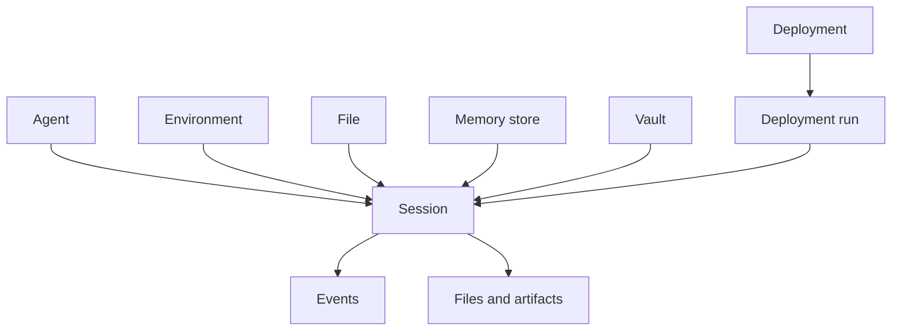

OMA separates agent execution into stable definitions, execution environments, and stateful tasks. Each resource can be versioned, reused, and audited independently.

## Agent

An agent is a reusable, versioned behavior definition. It can contain:

- A model and system prompt
- Tools and MCP servers
- Skills
- Multi-agent configuration
- Custom metadata

Updating an agent creates a new version. Existing sessions keep the agent snapshot captured at creation time, so a later edit cannot silently change a running task.

## Environment

An environment describes the isolated runtime for a task. It determines the sandbox template, dependencies, network policy, and runtime capabilities. Multiple sessions can reuse the same environment.

## Session

A session is one stateful agent task. It combines an agent, environment, resources, and credentials, and persists:

- Current status and events
- Threads
- Input and output resources
- Token usage and statistics
- Task artifacts

Disconnecting a client does not delete a session. You can retrieve it later, resume an event stream, or send more events.

## Resource

A session resource mounts external context into a task. Common resource types include:

- File: an object uploaded to OMA storage
- GitHub repository: repository and checkout information
- Memory store: durable memory shared across sessions

The resource type and `access` configuration determine how the task can use it.

## Vault

A vault stores sensitive credentials required at runtime. A session references vault IDs instead of repeatedly carrying secrets in request bodies.

<Warning>
  Vaults provide application-level encrypted storage and authorized references. Production operators must still protect, back up, and rotate the master KEK.
</Warning>

## Deployment

A deployment turns a validated agent workflow into repeatable configuration. It can be triggered manually, paused, resumed, and represented by deployment runs. Webhooks forward session and deployment state changes to external systems.

## Resource relationships

<Card title="Create your first agent" href="/docs/en/api/agents/create-agent">
  Review the agent request fields and response shape.
</Card>
